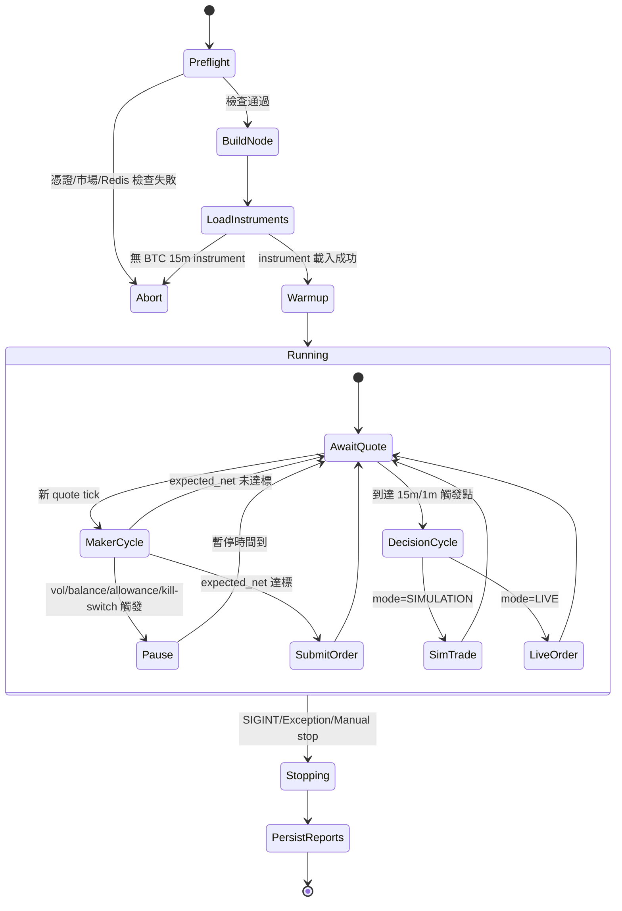

# Bot Principle & Engineering Baseline

本文件整理 `/Users/cheng-kaihuang/Polymarket-BTC-15-Minute-Trading-Bot-main/run_bot.py` 的核心運作邏輯，作為後續更新計劃的基準文件。

## 1) 系統目標
- 交易標的：Polymarket BTC 15 分鐘 Up/Down 市場。
- 主流程：啟動前安全檢查 -> 載入當前可交易 market/instrument -> quote 驅動策略循環 -> 風控/下單/追蹤。
- 執行模式：`SIMULATION` 與 `LIVE`，並有 `--test-mode`（高頻觸發）用於流程驗證。

## 2) 核心運作原理

### 2.1 啟動與市場選擇
1. 建立候選 slug：根據當下 UTC 時間，組 `btc-updown-15m-{epoch}` 前後區間。
2. Gamma 查證：逐一檢查 slug 是否存在。
3. 選擇主市場：優先「當前/最近未過期」slug。
4. 解析 instrument IDs：從 Gamma payload 抽取 token ids，組成 `InstrumentId`。
5. 僅載入目標 instruments：使用 `load_ids`，避免全市場掃描造成噪音與風險。

### 2.2 Quote 驅動循環（Maker 主路徑）
1. 收到 quote tick 後更新市場 bid/ask 與真實價格歷史。
2. 經過 refresh 節流 + TTL 檢查 + inventory 限制 + 波動閘門。
3. 計算 fair probability（含外部現貨 drift）+ inventory skew。
4. 產生被動報價（避免 crossing）。
5. 計算 expected net：
   - `expected_net = spread_capture + expected_rebate - adverse_selection_buffer`
6. 未達門檻則不掛單；達標才送單並維護 active maker orders。

### 2.3 15 分鐘決策循環（Signal/Fusion 路徑）
1. 每 15 分鐘（或 test mode 每分鐘）觸發一次決策。
2. 使用三種訊號處理器：
   - Spike Detection
   - Sentiment
   - Price Divergence
3. Signal Fusion 產生最終方向/分數/信心。
4. Risk Engine 計算可下單倉位並做風控校驗。
5. `SIMULATION` 記錄 paper trade；`LIVE` 才送真單。

## 3) 資料過濾規則
- 市場層：
  - `active=true`
  - `closed=false`
  - `archived=false`
  - 僅 `btc-updown-15m-*`
- 時間層：
  - 以 `end_date_min / end_date_max` 限制接近當前窗口。
- instrument 層：
  - 僅載入 `load_ids`（指定 condition/token 對）。

## 4) 下單決策規則（重點）
- 模式守門：
  - `--test-mode` 強制 simulation（不送真單）。
  - maker 路徑有 simulation guard，會直接 skip submit。
- fee-rate 對齊：
  - 優先 CLOB `/fee-rate`
  - 若回 0/空，fallback 到「成交觀測 fee bps」
  - 再 fallback `MAKER_FEE_RATE_BPS_DEFAULT`（預設 1000 bps）
- 風控：
  - 波動暫停（EWMA/rolling std + clipping + warmup）
  - balance/allowance 拒單後暫停掛單
  - 連續拒單 kill switch
  - inventory 上限與 skew 控制

## 5) 實際狀態機（State Machine）



## 6) 新增交易資料庫（可分析改進）

### 6.1 DB 位置與開關
- 預設路徑：`/Users/cheng-kaihuang/Polymarket-BTC-15-Minute-Trading-Bot-main/logs/trade_journal.db`
- 環境參數：
  - `TRADE_DB_ENABLED=1`
  - `TRADE_DB_PATH=./logs/trade_journal.db`

### 6.2 資料表
- `strategy_runs`
  - 每次 bot 啟停一筆 run，記 mode/test/maker/selected_slug/instrument。
- `order_events`
  - 記錄下單意圖、送單、成交、拒單、跳過（含 reason、fee、commission、expected_net）。
- `strategy_events`
  - 記錄策略級事件（start/stop/decision tick 等）。

### 6.3 目前已接入的事件
- `STRATEGY_START`, `STRATEGY_STOP`, `DECISION_TICK`
- `ORDER_SKIP_SIMULATION`, `ORDER_SUBMIT`, `ORDER_FILLED`, `ORDER_REJECTED`/`ORDER_DENIED`

### 6.4 快速報表腳本
- 檔案：`/Users/cheng-kaihuang/Polymarket-BTC-15-Minute-Trading-Bot-main/scripts/trade_db_report.py`
- 用法：
```bash
venv/bin/python scripts/trade_db_report.py
venv/bin/python scripts/trade_db_report.py --run-id <RUN_ID> --limit 100
```

## 7) 更新計劃制定準則（以本文件為基準）
- 原則 A：先保安全，再優化收益。
  - 任何改動不得繞過 simulation/live guard。
- 原則 B：先可觀測，再調參。
  - 新策略想法需先補對應 DB 欄位或事件，才進行參數調整。
- 原則 C：先限制範圍，再擴張市場。
  - 維持 slug + load_ids 精準載入，避免全市場噪音。
- 原則 D：以回放/統計驗證改動。
  - 每次版本更新應對比：
    - reject rate
    - fill quality
    - expected net vs realized cost/commission
    - inventory 暴露時間

## 8) 後續建議的分析題目
- 成交品質：
  - `ORDER_SUBMIT` 到 `ORDER_FILLED` 延遲分佈
  - 成交價相對 quote 價偏移
- 風控有效性：
  - 波動閘門觸發頻率與錯失成交的關聯
  - balance/allowance 拒單前兆（可預警）
- 經濟模型對齊：
  - 預估費率與實際 commission 偏差
  - expected_net 與實際損益（realized）偏差
