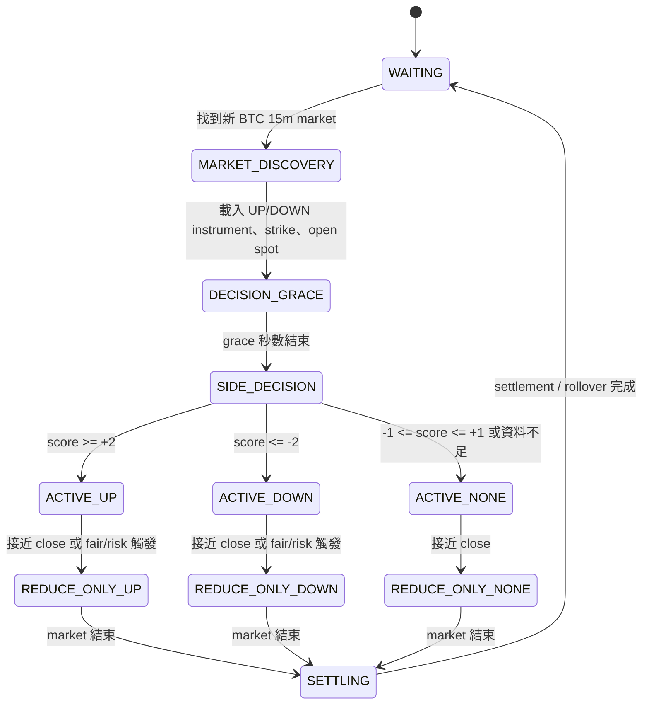

# Bi-Side Design

> Historical design record. The current operational rules are in
> [STRATEGY_RULES.md](STRATEGY_RULES.md); do not use this proposal as a live
> configuration reference.

## 目的

這份文件定義 BTC 15 分鐘市場的 `bi-side` 單一 bot 設計稿。

目標不是同時跑兩個互相獨立的 `UP` / `DOWN` bot，而是：

- 單一 bot
- 單一錢包
- 單一 inventory / risk budget
- 每個 market 只選 `UP`、`DOWN`、或 `NONE` 其中一種模式

這樣做的核心目的：

- 避免雙 bot 重複付手續費
- 避免雙邊同時累積倉位
- 讓 regime 判斷、inventory、cooldown、reduce-only 共用同一套風控

---

## 設計原則

- 只在 `market boundary` 做方向切換，不在同一個 15m market 中頻繁翻邊
- `mixed` market 寧可少做，不預設硬做 `UP`
- 所有方向判斷都要可記錄、可回測、可在 DB / log 中重建
- `UP` 和 `DOWN` 使用相同的 fair model，只是 outcome token 不同
- `NONE` 是正常狀態之一，不是異常

---

## 核心概念

每個新 market 開始後，bot 對當前 market 做一次方向判斷：

- `UP`
- `DOWN`
- `NONE`

一旦當前 market 選定 side：

- `UP`：只交易 `UP` token
- `DOWN`：只交易 `DOWN` token
- `NONE`：不開新倉，只允許減倉 / 完成 rollover

第一版不做 intramarket flip。

也就是說：

- 不在同一個 market 內從 `UP` 改成 `DOWN`
- 不在同一個 market 內從 `DOWN` 改成 `UP`
- 真正切換只發生在下一個 market 開始時

---

## 參數表

以下是第一版建議參數，不是最終優化值。

| 參數 | 建議值 | 說明 |
|---|---:|---|
| `BI_SIDE_ENABLED` | `0` | 主開關，預設關閉 |
| `BI_SIDE_DECISION_MODE` | `boundary_only` | 只在新 market 開始時決策 |
| `BI_SIDE_DEFAULT_MODE` | `NONE` | 訊號不足時不預設 `UP` |
| `BI_SIDE_DECISION_GRACE_SEC` | `30` | 新 market 開始後先觀察 30 秒再定 side |
| `BI_SIDE_LOCK_UNTIL_REDUCE_ONLY` | `1` | 一旦選 side，該 market 內鎖定到 reduce-only |
| `BI_SIDE_ALLOW_INTRAMARKET_FLIP` | `0` | 第一版禁止 intramarket flip |
| `BI_SIDE_MIN_SCORE_UP` | `1` | `score >= 1` 才做 `UP` |
| `BI_SIDE_MAX_SCORE_DOWN` | `-1` | `score <= -1` 才做 `DOWN` |
| `BI_SIDE_MIXED_LOW` | `-1` | `-1 ~ +1` 視為 mixed |
| `BI_SIDE_MIXED_HIGH` | `1` | `-1 ~ +1` 視為 mixed |
| `BI_SIDE_STRIKE_GAP_PCT` | `0.0015` | `0.15%`，spot 相對 strike 的方向門檻 |
| `BI_SIDE_MOM_WINDOW_TICKS` | `20` | 方向動能視窗，沿用約 100 秒 |
| `BI_SIDE_MOM_PCT` | `0.0025` | `0.25%`，短期動能門檻 |
| `BI_SIDE_OPEN_DRIFT_PCT` | `0.0020` | `0.20%`，相對本 market 開盤 drift 門檻 |
| `BI_SIDE_REGIME_N_MARKETS` | `4` | 近幾個 market 的績效回授視窗 |
| `BI_SIDE_REGIME_SUM_PNL_USDC` | `-2.0` | 最近 N 市場合計 PnL 低於此值視為逆風 regime |
| `BI_SIDE_REGIME_MIN_NEG` | `3` | 最近 N 市場至少幾個為負，才算逆風 regime |
| `BI_SIDE_MIXED_POLICY` | `none` | `mixed` 時採 `NONE`，不是 `UP` |
| `BI_SIDE_MIXED_SMALL_SIZE_MULT` | `0.0` | 若未來要做 mixed 小倉，第一版先設 0 |
| `BI_SIDE_DOWN_SIZE_MULT` | `1.0` | `DOWN` 模式的 size 倍數，第一版先與 `UP` 相同 |
| `BI_SIDE_MIN_TIME_LEFT_SEC` | `180` | 剩餘時間過短時，不做新 side 決策 |

---

## 訊號定義

### 1. Strike Signal

定義：

```text
gap_pct = (spot_now - strike) / strike
```

規則：

- `gap_pct >= +0.15%` -> `strike_signal = +1`
- `gap_pct <= -0.15%` -> `strike_signal = -1`
- 其他 -> `strike_signal = 0`

解讀：

- 現貨明顯在 strike 上方，偏 `UP`
- 現貨明顯在 strike 下方，偏 `DOWN`
- 太靠近 strike，不給方向分

### 2. Short Momentum Signal

定義：

```text
mom_pct = (spot_now - spot_t_minus_window) / spot_t_minus_window
```

其中 `window = 20 ticks`，若 quote loop 仍是 `5s`，則約 `100s`。

規則：

- `mom_pct >= +0.25%` -> `momentum_signal = +1`
- `mom_pct <= -0.25%` -> `momentum_signal = -1`
- 其他 -> `momentum_signal = 0`

說明：

- 目前單邊方向很明顯時才加分
- 這個門檻明顯比現行 `6%` 更可用

### 3. Market-Open Drift Signal

定義：

```text
open_drift_pct = (spot_now - market_open_spot) / market_open_spot
```

規則：

- `open_drift_pct >= +0.20%` -> `open_drift_signal = +1`
- `open_drift_pct <= -0.20%` -> `open_drift_signal = -1`
- 其他 -> `open_drift_signal = 0`

解讀：

- 反映這一輪 15m market 自己的方向
- 用來過濾只是短暫 spike 的情況

### 4. Recent-Cycle Regime Signal

輸入：

- 最近 `4` 個 market 的 `cycle_combined_pnl_usdc`

規則：

- 若最近 `4` 個 market 中至少 `3` 個為負
- 且合計 `<= -2.0 USDC`
- 則：
  - 若 `strike_signal <= 0` 或 `momentum_signal <= 0`，`regime_signal = -1`
  - 若 `strike_signal >= 0` 或 `momentum_signal >= 0`，`regime_signal = 0`

第一版不要直接做對稱反向加分。

也就是說：

- regime signal 第一版只負責把 bot 從 `UP` 推向保守或 `DOWN`
- 不負責在牛市強推 `UP`

---

## 分數公式

```text
regime_score =
    1.0 * strike_signal
  + 1.0 * momentum_signal
  + 1.0 * open_drift_signal
  + 0.5 * regime_signal
```

### 決策門檻

- `regime_score >= +2.0` -> `active_side = UP`
- `regime_score <= -2.0` -> `active_side = DOWN`
- `-1.0 <= regime_score <= +1.0` -> `active_side = NONE`

對於 `+1.5` 或 `-1.5` 這種灰區，第一版也歸到 `NONE`。

原因：

- 初版寧可保守
- 不要為了提高交易次數而硬做邊緣案例

---

## Mixed Policy

第一版 `mixed` 一律採：

- `NO_TRADE`

具體行為：

- 不掛新的 `BUY`
- 若本來沒有庫存，則該 market 全程不交易
- 若有舊庫存，只允許 `SELL` / reduce-only / settlement

不採用以下策略：

- mixed 預設 `UP`
- mixed 同時試 `UP` 與 `DOWN`
- mixed 做小雙邊倉

原因：

- 過去 12 小時樣本中，接近 strike 的混雜市場反而貢獻了很大一部分虧損
- 預設 `UP` 會把最難做的一群 market 硬做掉

---

## 狀態機



---

## 各狀態行為

### `WAITING`

- 搜尋下一個有效 BTC 15m market
- 重置上一輪 market 的 transient state

### `MARKET_DISCOVERY`

- 取得當前 market slug
- 載入 `UP` / `DOWN` instrument
- 鎖定 opening strike
- 記錄 market open timestamp
- 記錄 market open spot

### `DECISION_GRACE`

- 新 market 開始後先觀察 `30s`
- 累積早期 spot / momentum 資料
- 不急著下第一筆單

### `SIDE_DECISION`

- 同時計算：
  - `fair_up`
  - `fair_down = 1 - fair_up`
  - `strike_signal`
  - `momentum_signal`
  - `open_drift_signal`
  - `regime_signal`
  - `regime_score`
- 輸出：
  - `active_side`
  - `decision_reason`
  - `decision_inputs`

### `ACTIVE_UP`

- 只對 `UP` token 掛 `BUY` / `SELL`
- `DOWN` token 不掛單
- inventory、cooldown、taker exit、hold-to-redeem 都沿用現有框架

### `ACTIVE_DOWN`

- 只對 `DOWN` token 掛 `BUY` / `SELL`
- `UP` token 不掛單
- 邏輯與 `ACTIVE_UP` 對稱
- settlement 時改為：
  - 若 outcome = `DOWN`，redeem per share = `1`
  - 若 outcome = `UP`，redeem per share = `0`

### `ACTIVE_NONE`

- 不開新倉
- 若有遺留庫存，只允許出清
- 若無庫存，該 market 不交易

### `REDUCE_ONLY_*`

- 不再開新 `BUY`
- 優先減倉
- 不做 side 切換

### `SETTLING`

- 取消掛單
- 計算當前 side 的 settlement PnL
- 寫入 market-level cycle PnL
- 更新 recent-cycle regime window

---

## 實作上的資料結構需求

### Market Scope State

每個 market 需要新增或明確持有：

- `current_market_slug`
- `current_market_start_ts`
- `current_market_end_ts`
- `current_market_open_spot`
- `current_market_strike`
- `current_up_instrument_id`
- `current_down_instrument_id`
- `active_side`
- `active_side_locked`
- `side_decision_ts`
- `side_decision_score`
- `side_decision_reason`

### Logs / DB Events

至少要新增以下事件類型：

- `SIDE_DECISION`
- `SIDE_DECISION_SKIPPED`
- `SIDE_MODE_CHANGED`
- `BI_SIDE_GUARD_BLOCKED`

`SIDE_DECISION` payload 建議包含：

- `slug`
- `active_side`
- `score`
- `strike_signal`
- `momentum_signal`
- `open_drift_signal`
- `regime_signal`
- `gap_pct`
- `mom_pct`
- `open_drift_pct`
- `recent_window_combined_pnls`
- `fair_up`
- `fair_down`

---

## 報價行為調整

### Quote Context

現行報價流程預設只拿單一 primary instrument。

bi-side 化之後要改成：

- market 發現時先同時保存 `UP` / `DOWN` 兩個 instrument
- 進入 `ACTIVE_*` 後，只把 `active_side` 的 instrument 丟給 maker quote loop

### Fair Price

維持現有 digital pricer 邏輯，但要能明確輸出：

- `fair_up`
- `fair_down`
- `fair_for_active_side`

建議 log 風格：

```text
Digital pricer: spot=... strike=... fair_up=... fair_down=... active_side=...
```

### Settlement

目前 settlement 以 `UP` 為中心。

bi-side 後要依 `active_side` 改 payoff：

- 若 `active_side = UP`
  - `outcome == UP` -> payoff `1`
  - `outcome == DOWN` -> payoff `0`
- 若 `active_side = DOWN`
  - `outcome == DOWN` -> payoff `1`
  - `outcome == UP` -> payoff `0`

---

## Guard 與風控整合

以下機制保留：

- post-fill buy cooldown
- loss pause
- taker exit
- reduce-only
- balance forced sell-only
- quote health
- projected inventory guard

但方向切換後要注意：

- `inventory_delta_shares` 要改成 active-side inventory，而不是預設 `UP` inventory
- `hold_to_redeem` 要能適用 `DOWN`
- `recent_fill_pnl_results` 要可按 active-side 或 market 重建
- `regime guard` 不再只用來提高 `UP BUY` edge gate，而是成為 side decision 的一部分

---

## 上線順序

### Phase 0: Instrumentation Only

目標：

- 不改交易行為
- 只新增方向判斷所需資料與事件

內容：

- 同時保存 `UP` / `DOWN` instrument metadata
- 於每個 market 記錄 `open_spot`
- 產生 `SIDE_DECISION` dry-run log，但實際仍只做 `UP`
- 報表能重建：
  - 若當時選 `DOWN` 會怎樣
  - 若當時選 `NONE` 會怎樣

驗收：

- 不影響現行 live 行為
- 報表可覆盤每個 market 的 hypothetical side decision

### Phase 1: Shadow Decision

目標：

- 線上持續產生 `UP / DOWN / NONE` 判斷
- 真實交易仍維持 `UP only`

內容：

- 寫入 side score / signals / decision payload
- 對照真實 PnL 與 hypothetical PnL

驗收：

- 至少蒐集 2 至 3 天樣本
- 檢查：
  - `DOWN` 是否只在明顯空頭 regime 出現
  - `NONE` 比率是否過高
  - mixed policy 是否過度保守

### Phase 2: NONE Gate Live

目標：

- 先讓 `NONE` 真正生效
- 但仍不實盤交易 `DOWN`

內容：

- 若 side decision = `NONE`，該 market 不開新倉
- 其餘情況仍只做 `UP`

驗收：

- 觀察交易次數下降多少
- 觀察被跳過 market 的 PnL 是否真的較差

### Phase 3: DOWN Dry-Run Execution

目標：

- 報價引擎已能生成 `DOWN` quote plan
- 但仍不送真單

內容：

- 在 simulation / shadow 模式跑 `DOWN`
- 驗證：
  - inventory accounting
  - settlement accounting
  - quote guards
  - taker exit

驗收：

- `DOWN` dry-run 的 inventory、PnL、settlement 都正確
- 沒有把 `UP` 的成本基礎誤套到 `DOWN`

### Phase 4: Small-Size DOWN Live

目標：

- 開啟 `DOWN` 實盤，但 size 縮小

內容：

- `DOWN_SIZE_MULT` 先設為 `0.25` 或 `0.5`
- 只在 `score <= -2.5` 這種更嚴格條件下才做 `DOWN`

驗收：

- 檢查 `DOWN` 的手續費、taker exit、settlement 是否合理
- 檢查是否出現頻繁錯邊切換

### Phase 5: Full Bi-Side

目標：

- `UP / DOWN / NONE` 全部上線

內容：

- 依正式門檻切 side
- 視結果再決定是否開放 mixed 小倉

---

## 第一版明確不做的事

- 不做雙 bot 雙錢包對沖
- 不做同 market 內多次翻邊
- 不做 `UP` / `DOWN` 同時持倉
- 不做 mixed 預設 `UP`
- 不做 mixed 雙向小倉
- 不在第一版加入複雜 ML classifier

---

## 驗收指標

上線後至少要追：

- 每個 market 的 `active_side`
- `UP / DOWN / NONE` 比例
- mixed 被跳過的 market 數量
- `UP` 模式 PnL
- `DOWN` 模式 PnL
- `NONE` 模式下被跳過的 hypothetical PnL
- taker exit 次數與損失按 side 分開統計
- settlement PnL 按 side 分開統計

最重要的成功條件不是交易次數增加，而是：

- 單位風險的 realized PnL 改善
- `TAKER_EXIT` 漏損下降
- 在單邊下跌 regime 時，不再持續用 `UP` 逆勢接刀
