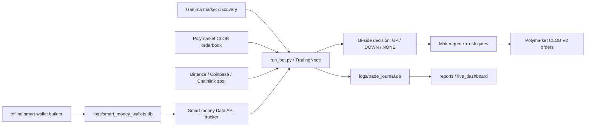

# Polymarket BTC 15 分鐘交易 Bot V2 操作手冊

這份文件描述目前 repo 內的 **V2 版 BTC 15m Polymarket bot**。它不是早期 README 裡的 7-phase demo，也不是只做 UP 的舊版策略。現行主路徑是：

- `run_bot.py` 啟動 Nautilus live node
- `bot/` 負責市場生命週期、bi-side 方向決策、maker quote、風控與資料庫事件
- `execution/` 負責 Polymarket CLOB/V2 order path、fee/risk helper
- `monitoring/trade_journal_db.py` 寫入 SQLite journal
- `scripts/` 提供 preflight、allowance、dashboard、報表、probe、smart money builder

預設建議先 simulation / shadow-only 觀察，再逐步切 live。

---

## 目錄

- [目前架構](#目前架構)
- [安裝與環境](#安裝與環境)
- [啟動流程](#啟動流程)
- [核心環境變數](#核心環境變數)
- [策略行為](#策略行為)
- [Smart Money Tracking](#smart-money-tracking)
- [資料庫與報表](#資料庫與報表)
- [監控方式](#監控方式)
- [維運指令](#維運指令)
- [測試與檢查](#測試與檢查)
- [專案結構](#專案結構)
- [風險提醒](#風險提醒)

---

## 目前架構



現行 bot 的主要特徵：

- 自動探索當前與下一個 BTC 15m market
- 方向決策支援 `UP / DOWN / NONE`
- 以 maker-first 為主，只有在特定 exit path 才考慮 taker
- 下單前會經過 edge、inventory、balance、orderbook、momentum、entry confirmation 等 gate
- 所有關鍵事件寫入 SQLite，方便回測和歸因
- Smart money 預設 shadow-only，可同時跑離線 wallet 名單與 live tracker

---

## 安裝與環境

建議使用 repo 內的 `.venv`。若尚未建立：

```bash
cd /Users/cheng-kaihuang/Polymarket-BTC-15-Minute-Trading-Bot-main
python -m venv .venv
./.venv/bin/pip install -r requirements.txt
cp .env.example .env
```

Redis 建議本機啟動：

```bash
redis-server
```

V2 live 需要：

- `POLYMARKET_PK`
- Polymarket CLOB L2 API creds，或允許程式用 private key derive/create
- Polygon chain id `137`
- 正確的 funder / wallet
- pUSD / allowance 狀態可用
- 少量 MATIC 作 gas

---

## 啟動流程

### 1. Preflight

```bash
./.venv/bin/python run_bot.py --preflight-only
```

preflight 會檢查：

- Polymarket auth
- BTC 15m market discovery
- instrument ids
- Redis 是否可用
- simulation/live mode 目標

### 2. Simulation

```bash
./.venv/bin/python run_bot.py
```

沒有 `--live` 時預設是 simulation。

### 3. Live

```bash
./.venv/bin/python run_bot.py --live
```

live mode 會要求輸入 `yes` 才繼續。這會使用真實資金。

### 4. Test mode

```bash
./.venv/bin/python run_bot.py --test-mode
```

用於加速測試，不建議直接當正式 live 參數。

### 5. 內嵌 terminal dashboard

```bash
./.venv/bin/python run_bot.py --live --terminal-dashboard
```

此模式會把背景 log 導到：

```text
logs/bot/terminal_bot.log
```

通常更建議用獨立 dashboard viewer，見 [監控方式](#監控方式)。

---

## 核心環境變數

完整設定以 [.env.example](/Users/cheng-kaihuang/Polymarket-BTC-15-Minute-Trading-Bot-main/.env.example) 為準。

### Polymarket / V2

```env
POLYMARKET_PK=
POLYMARKET_WALLET_ADDRESS=
POLYMARKET_FUNDER=
POLYMARKET_SIGNATURE_TYPE=0
POLYMARKET_CHAIN_ID=137
POLYMARKET_CLOB_BASE_URL=https://clob.polymarket.com
POLYMARKET_GAMMA_API=https://gamma-api.polymarket.com
POLYMARKET_CTF_COLLATERAL_TOKEN=PUSD
POLY_BUILDER_CODE=
```

若 `POLYMARKET_API_KEY / POLYMARKET_API_SECRET / POLYMARKET_PASSPHRASE` 沒有設定，程式會嘗試由 `POLYMARKET_PK` derive/create L2 creds。

### DB / runtime

```env
TRADE_DB_ENABLED=1
TRADE_DB_PATH=./logs/trade_journal.db
NAUTILUS_COMPAT_PATCH_MODE=runtime
AUTO_APPLY_NAUTILUS_PATCH=1
AUTO_NODE_ROLLOVER_ENABLED=1
AUTO_NODE_ROLLOVER_SEC=3600
```

`TRADE_DB_ENABLED=1` 建議保持開啟，報表、dashboard、settlement attribution 都依賴它。

### Maker sizing

```env
MAKER_MODE=1
MAKER_QUOTE_REFRESH_SEC=3
MAKER_QUOTE_SIZE_USDC=1.0
MAKER_FIXED_SHARES=10.8
MAKER_MAX_ORDER_USDC=12.0
MAKER_MAX_INVENTORY_SHARES=12
MAX_LOCKED_SIDE_POSITION=12
INVENTORY_FULL_BEHAVIOR=STOP_BUY
MAKER_MIN_EXPECTED_NET_USDC=0.002
```

### Bi-side direction

```env
BI_SIDE_ENABLED=1
BI_SIDE_DEFAULT_MODE=NONE
BI_SIDE_DECISION_MODE=boundary_only
BI_SIDE_DECISION_GRACE_SEC=60
BI_SIDE_LOCK_UNTIL_REDUCE_ONLY=1
BI_SIDE_ALLOW_INTRAMARKET_FLIP=1
BI_SIDE_FLIP_CONFIRMATIONS=2
BI_SIDE_MIN_TIME_LEFT_SEC=180
```

### Entry / edge gates

```env
DIRECTIONAL_ENTRY_MIN_SCORE_ABS_NEW=0.20
ENTRY_FAIR_EDGE_MIN_PS=0.00
MAKER_DIRECTIONAL_EDGE_GATE_ENABLED=1
MAKER_MIN_DIRECTIONAL_EDGE_PS=0.01
MAKER_MIN_DIRECTIONAL_EDGE_PS_DOWN=0.01
MAKER_MIN_MINUTES_TO_CLOSE=3.0
MAKER_MIN_FAIR_PRICE=0.20
MAKER_MAX_FAIR_PRICE=0.90
```

### Hold-to-redeem / tail protection

```env
HOLD_TO_REDEEM=1
TAIL_PROTECT_TP_ENABLED=1
TAIL_PROTECT_TP_PRICE=0.97
TAIL_PROTECT_TP_FRACTION=1.00
TAIL_PROTECT_TP_MIN_ENTRY_PRICE=0.55
```

---

## 策略行為

### 市場生命週期

- `WAITING`：等待可交易 BTC 15m market
- `ACTIVE`：正常評估方向與 maker quote
- `REDUCE_ONLY`：接近結算，不再開新 BUY，優先處理庫存
- `SETTLING`：取消掛單、紀錄 settlement、等待 rollover

### 方向決策

現行 bot 不是固定只做 UP。bi-side 開啟後會根據 spot、strike、orderbook、fair price、momentum 等資訊決定：

- `UP`
- `DOWN`
- `NONE`

`NONE` 代表訊號不足，buy path 會被擋住。

### 入場

入場不是單一 if 判斷，而是一串 gate：

- side 是否已鎖定
- market phase 是否允許 buy
- fair price / directional edge 是否合理
- robust net 是否足夠
- orderbook 是否可用
- inventory cap 是否會超過
- momentum / shadow signal / entry confirmation 是否衝突
- smart money shadow/live signal 是否衝突

### 出場

出場優先順序大致是：

1. maker sell 正常減倉
2. forced exit / adverse exit
3. tail protect TP
4. hold-to-redeem
5. last-resort / true-last-resort

---

## Smart Money Tracking

目前 smart money 分成兩層：

1. **Live tracker**
   - 隨 bot 一起跑
   - 追蹤當前 market 的即時大額 flow
   - 寫 `SMART_MONEY_OBSERVATION`
   - 預設 shadow-only，不改下單

2. **Offline wallet builder**
   - 手動或定期執行
   - 掃 BTC 15m market 的 `/trades` 與 `/v1/market-positions`
   - 建立 `logs/smart_money_wallets.db`
   - live tracker 讀這份 DB 來加權 wallet label

### Live tracker 設定

建議先 shadow-only：

```env
SMART_MONEY_ENABLED=0
SMART_MONEY_SHADOW_ENABLED=1
SMART_MONEY_MIN_CASH_FILTER=10
SMART_MONEY_POLL_INTERVAL_SEC=3
SMART_MONEY_RECENT_WINDOW_SEC=180
SMART_MONEY_STALE_AFTER_SEC=12
SMART_MONEY_FOMO_CUTOFF_SEC=120
SMART_MONEY_ENTRY_THRESHOLD=0.62
SMART_MONEY_MIN_DIRECTIONAL_WALLETS=2
SMART_MONEY_CONFLICT_SIZE_MULTIPLIER=0.5
SMART_MONEY_SKIP_STRONG_CONFLICT=0
SMART_MONEY_WALLET_DB_PATH=./logs/smart_money_wallets.db
SMART_MONEY_WALLET_LABEL_CACHE_TTL_SEC=60
SMART_MONEY_WEIGHT_SMART=2.0
SMART_MONEY_WEIGHT_DIRECTIONAL=1.0
SMART_MONEY_WEIGHT_UNKNOWN=0.25
```

shadow-only 狀態下，bot 只會寫觀察事件，不會改 `should_quote` 或 size。

啟用 live 影響下單：

```env
SMART_MONEY_ENABLED=1
SMART_MONEY_SKIP_STRONG_CONFLICT=0
```

建議第一階段只允許 conflict 時 `reduce_size`，不要直接 skip。等報表證明 conflict 有預測力後，再考慮：

```env
SMART_MONEY_SKIP_STRONG_CONFLICT=1
```

### Live tracker 如何運作

背景 thread 每約 3 秒抓：

```text
GET https://data-api.polymarket.com/trades
  ?market=<condition_id>
  &side=BUY
  &takerOnly=false
  &filterType=CASH
  &filterAmount=<SMART_MONEY_MIN_CASH_FILTER>
```

每約 30 秒抓：

```text
GET https://data-api.polymarket.com/v1/market-positions
  ?market=<condition_id>
  &status=OPEN
  &sortBy=TOTAL_PNL
```

它不會在 quote loop 裡逐 wallet 查歷史。下單路徑只讀記憶體 cache 和 `smart_money_wallets.db` label cache，因此對 bot 延遲影響很小。

### 查看 live observation

```bash
sqlite3 logs/trade_journal.db "
select ts,
       json_extract(payload_json,'$.slug') as slug,
       json_extract(payload_json,'$.state') as state,
       json_extract(payload_json,'$.direction') as direction,
       json_extract(payload_json,'$.score') as score,
       json_extract(payload_json,'$.weighted_cash_up') as up_cash,
       json_extract(payload_json,'$.weighted_cash_down') as down_cash,
       json_extract(payload_json,'$.label_counts') as labels
from strategy_events
where event_type='SMART_MONEY_OBSERVATION'
order by id desc
limit 20;
"
```

### Offline builder 用法

建立或更新 wallet 名單：

```bash
./.venv/bin/python scripts/build_smart_money_wallets.py \
  --lookback-intervals 96 \
  --print-top 20
```

常用參數：

```bash
./.venv/bin/python scripts/build_smart_money_wallets.py --help
```

重點參數：

- `--db`：輸出 DB，預設 `./logs/smart_money_wallets.db`
- `--lookback-intervals`：往回掃幾個 15m interval，`96` 約一天
- `--min-cash`：只看大於此 USDC notional 的 trades
- `--min-markets`：標成 `SMART` 至少需要跨幾個 markets
- `--min-total-cash`：wallet 累計 buy cash 門檻
- `--hedge-ratio`：雙邊 exposure 比例達標就標為 `HEDGER`
- `--dry-run`：只印結果，不寫 DB

先 dry-run：

```bash
./.venv/bin/python scripts/build_smart_money_wallets.py \
  --dry-run \
  --lookback-intervals 12 \
  --print-top 10
```

實際寫入：

```bash
./.venv/bin/python scripts/build_smart_money_wallets.py \
  --lookback-intervals 96 \
  --print-top 20
```

### smart_money_wallets.db schema

DB 檔案：

```text
logs/smart_money_wallets.db
```

主要表：

```text
smart_money_wallets
```

重要欄位：

- `proxy_wallet`
- `label`
- `confidence`
- `total_trades`
- `buy_trades`
- `sell_trades`
- `markets_seen`
- `directional_hits`
- `mixed_hits`
- `hedger_hits`
- `total_buy_cash`
- `up_buy_cash`
- `down_buy_cash`
- `avg_trade_cash`
- `size_cv`
- `position_total_pnl`
- `last_seen_ts`
- `updated_at`
- `payload_json`

目前 label 定義：

- `SMART`：跨多個 markets、有足夠 buy cash、方向一致性高
- `DIRECTIONAL`：單 market 或樣本較少，但方向性明顯
- `HEDGER`：同 market 雙邊 exposure 明顯
- `BOT_LIKE`：交易 size 過度固定
- `UNKNOWN`：樣本不足或分類不明

查看 label 分佈：

```bash
sqlite3 logs/smart_money_wallets.db "
select label, count(*)
from smart_money_wallets
group by label
order by count(*) desc;
"
```

查看 top wallets：

```bash
sqlite3 logs/smart_money_wallets.db "
select label,
       printf('%.3f', confidence) as confidence,
       proxy_wallet,
       printf('%.2f', total_buy_cash) as total_buy_cash,
       markets_seen
from smart_money_wallets
order by label='SMART' desc, confidence desc, total_buy_cash desc
limit 20;
"
```

### 建議測試方式

1. 先跑 offline builder 建 DB
2. `.env` 保持 `SMART_MONEY_ENABLED=0`
3. 啟動 bot，讓它寫 `SMART_MONEY_OBSERVATION`
4. 跑 1-3 天後，用 observation 對照實際 PnL
5. 若 conflict 對虧損有預測力，再開 `SMART_MONEY_ENABLED=1`

---

## 資料庫與報表

主交易 journal：

```text
logs/trade_journal.db
```

主要表：

- `strategy_runs`
- `strategy_events`
- `order_events`

查看摘要：

```bash
./.venv/bin/python scripts/trade_db_report.py
```

PnL 對帳：

```bash
./.venv/bin/python scripts/pnl_reconcile_report.py --hours 6
./.venv/bin/python scripts/pnl_reconcile_report.py --hours 24
./.venv/bin/python scripts/pnl_reconcile_report.py --hours 0
```

Edge attribution：

```bash
./.venv/bin/python scripts/realized_edge_report.py --hours 24
./.venv/bin/python scripts/hourly_attribution_report.py --hours 24
./.venv/bin/python scripts/recent_buy_fill_report.py --hours 24
```

Shadow / probe report：

```bash
./.venv/bin/python scripts/shadow_probe_report.py --hours 24
./.venv/bin/python scripts/shadow_veto_report.py --hours 24
./.venv/bin/python scripts/pure_probe_report.py \
  --probe-db ./logs/pure_probe.db \
  --trade-db ./logs/trade_journal.db \
  --hours 24
```

---

## 監控方式

### 獨立 live dashboard

建議在另一個 terminal 開：

```bash
./.venv/bin/python scripts/live_dashboard.py
```

指定 DB：

```bash
./.venv/bin/python scripts/live_dashboard.py --db-path logs/trade_journal.db --refresh-sec 2
```

這個 viewer 只讀 SQLite，不會啟動第二個 bot。

### 原始 log

若使用 `--terminal-dashboard`：

```bash
tail -f logs/bot/terminal_bot.log
```

一般模式下，Nautilus / bot log 依照現有 runtime log 設定輸出。

---

## 維運指令

### Redis mode

```bash
./.venv/bin/python redis_control.py status
./.venv/bin/python redis_control.py sim
./.venv/bin/python redis_control.py live
```

實際是否 live 仍取決於啟動參數與 runtime guard。不要只看 Redis 就假設已經切到真實交易。

### Allowance / balance

```bash
./.venv/bin/python scripts/check_allowance.py --check-only
./.venv/bin/python scripts/check_allowance.py --apply
./.venv/bin/python scripts/check_allowance.py --apply --onchain
```

### Positions / redeem

```bash
./.venv/bin/python scripts/check_positions_and_redeem.py --slug btc-updown-15m
./.venv/bin/python scripts/check_positions_and_redeem.py --slug btc-updown-15m --apply
```

### Pure signal probe

只觀察，不下單：

```bash
./.venv/bin/python scripts/pure_signal_probe.py \
  --db ./logs/pure_probe.db \
  --duration-sec 1800 \
  --interval-sec 2 \
  --verbose --verbose-every-sec 30
```

Paper trade 模式：

```bash
./.venv/bin/python scripts/pure_signal_probe.py \
  --db ./logs/pure_probe.db \
  --duration-sec 21600 \
  --interval-sec 2 \
  --paper-trade \
  --paper-persistence-sec 10 \
  --verbose --verbose-every-sec 60
```

---

## 測試與檢查

語法檢查：

```bash
./.venv/bin/python -m py_compile run_bot.py bot/smart_money.py scripts/build_smart_money_wallets.py
```

Smart money 單元測試：

```bash
./.venv/bin/python -m pytest tests/test_smart_money.py
```

常用回歸測試：

```bash
PYTHONPATH=. ./.venv/bin/python -m pytest tests/test_f4_last_resort_guard.py
PYTHONPATH=. ./.venv/bin/python -m pytest tests/test_absolute_max_loss_breaker.py
PYTHONPATH=. ./.venv/bin/python -m pytest tests/test_f2_trailing_profit_release.py
```

注意：部分測試需要本地安裝 `py_clob_client_v2` 或完整 runtime dependency。

---

## 專案結構

```text
Polymarket-BTC-15-Minute-Trading-Bot-main/
├── run_bot.py                         # 主策略 class 與 Nautilus strategy callbacks
├── bot/
│   ├── launcher.py                    # CLI / node 啟動
│   ├── app_config.py                  # .env -> typed config
│   ├── market_runtime.py              # market selection / lifecycle helper
│   ├── side_decision.py               # UP / DOWN / NONE 決策
│   ├── quote_service.py               # desired quote / risk gates
│   ├── smart_money.py                 # live smart money tracker
│   └── ...
├── execution/
│   ├── polymarket_client.py           # V2 CLOB client wrapper
│   ├── maker_engine.py
│   ├── risk_engine.py
│   └── ...
├── monitoring/
│   └── trade_journal_db.py            # SQLite journal writer
├── scripts/
│   ├── build_smart_money_wallets.py   # offline wallet label builder
│   ├── live_dashboard.py
│   ├── check_allowance.py
│   ├── check_positions_and_redeem.py
│   └── *report.py
├── tests/
├── logs/
│   ├── trade_journal.db
│   └── smart_money_wallets.db
├── docs/
└── .env.example
```

`core/` 仍保留不少早期實驗與 legacy abstraction，不是目前 live path 的主要入口。現行交易行為以 `run_bot.py`、`bot/`、`execution/`、`monitoring/` 為準。

---

## 風險提醒

- `--live` 是真實資金。
- Smart money 初期請保持 shadow-only。離線 label 不是保證勝率，只是 flow 分類與候選名單。
- `SMART` label 需要跨多市場樣本才有意義；單一 market 的 `DIRECTIONAL` 不應被當成高手。
- 不要同時跑兩個 live bot 寫同一個錢包，除非你明確知道 inventory / order collision 風險。
- 每次調整 size、inventory cap、skip gate 前，先看 `trade_journal.db` 報表，而不是只看單筆 PnL。
