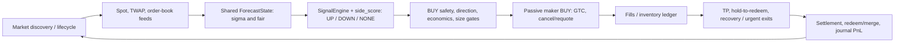
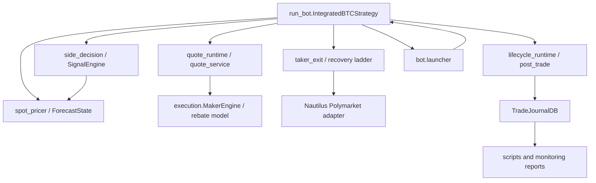

# Polymarket BTC 15-Minute Trading Bot — Current Authority

> Audit baseline: repository HEAD `da128d9` (2026-08-21).  This document is
> the authority for the current implementation, its known debts, and the only
> approved implementation sequence.  It replaces phase/group checklists as a
> decision authority; historical documents remain evidence until the document
> cleanup stage is approved and completed.

## Audit scope and safety status

- This is a read-only code audit except for creating this document.  No live
  trading code, profile, existing document, or test was changed.
- The production path is `run_bot.py` → `bot.launcher` → `IntegratedBTCStrategy`
  plus `bot/`, the Nautilus Polymarket adapter, `execution/` helpers, and
  `monitoring/trade_journal_db.py`.  `--live` is the only path that sends
  wallet orders; dry run exercises the same decision/order lifecycle locally.
- The worktree was clean at audit start.  GitHub CI executes only
  `python -m pytest -q` (`.github/workflows/tests.yml`).  It does **not** run
  reports, preflight, replay, or any `scripts/` command.
- Findings tagged **unknown—ask first** are deliberately not removal
  recommendations.  Their reachability or operational use cannot be proven
  from static source/CI inspection alone.

## 1. End-to-end trading lifecycle

### Control flow

### 1. Market selection, data and quotes

| Stage | Runtime implementation and I/O | Governing keys |
|---|---|---|
| Market discovery / phase | `bot.lifecycle.{collect_btc_market_candidates,resolve_bi_side_market_selection,evaluate_market_phase}` and `bot.lifecycle_runtime` select an alive BTC Up/Down market, set `WAITING/ACTIVE/REDUCE_ONLY/SETTLING`, and invoke settlement on rollover. Input: Gamma/cache instruments and clock. Output: slug, paired instruments, strike/end time, phase. | `BTC_MARKET_*`, fixed lifecycle policy (some defaults are intentionally no longer profile keys). |
| Spot and TWAP | `bot.price_streams.extract_*_tick`, `bot.market_runtime.handle_quote_tick`, `bot.spot_pricer._fetch_external_spot_price`, and `bot.market_data.record_external_spot_observation`. BTC 15-minute reference is Polymarket RTDS relayed Chainlink BTC/USD **60-second TWAP**. The direct RTDS client sends its required text `PING` every five seconds. Trading freshness uses Chainlink `payload.timestamp` / observation time; local receipt time is retained only as transport-lag telemetry. A missing, future, or stale source observation degrades rather than being accepted because it was received recently. | `POLYMARKET_CHAINLINK_TWAP_*`, `REQUIRE_TWAP_REFERENCE_SPOT`, `TWAP_DEGRADED_BLOCK_NEW_ENTRIES`, `EXTERNAL_SPOT_*`, `QUOTE_STALE_SEC`, `QUOTE_RESUBSCRIBE_GRACE_SEC`, `QUOTE_EVENT_CLOCK_SKEW_TOLERANCE_SEC`. |
| Order book | `bot.market_runtime.handle_quote_tick` caches per-instrument bid/ask and freshness; `run_bot._append_real_mid_price` maintains outcome-specific history. Inputs: Nautilus quote ticks; outputs: top of book/mid and timestamps used by quote drift and entry confirmation. | `ORDERBOOK_FETCH_INTERVAL_SEC`, `ORDERBOOK_LEVELS_LIMIT`, `MAKER_BUY_PLANNED_QUOTE_MAX_AGE_SEC`, `STALE_QUOTE_SYNTH_MAX_AGE_SEC`. |

### 2. Fair probability and direction

| Stage | Runtime implementation and I/O | Governing keys |
|---|---|---|
| Shared fair model | `bot.spot_pricer._build_forecast_state` calls `bot.forecast_state.build_forecast_state`. Input: spot, a verified frontend Price To Beat, time left, UP market mid, reference-source/TWAP observation. Output: `ForecastState` with raw/default sigma, scale, bounds, time-decay, implied-vol floor, standard and native-TWAP probabilities. `bot.spot_pricer._compute_fair_probability` converts it to the token outcome fair. Gamma verifies market identity and supplies its `cryptoMarketConfig`; the matching frontend `crypto-price` request supplies the canonical strike. Missing/invalid identity, config, or opening price is fail-closed for new digital entries. | `MAKER_FAIR_PRICER_MODE`, `MAKER_DIGITAL_VOL_*`, `MAKER_DIGITAL_SIGMA_*`, `MAKER_DIGITAL_IMPLIED_SIGMA_ENABLED`, `POLYMARKET_CHAINLINK_TWAP_WINDOW_SEC`. |
| Side decision and score | `bot.side_decision._compute_side_decision_new` obtains that same builder through `_build_forecast_state`, then calls `bot.signal_engine.SignalEngine.compute`. Input: spot, strike, `forecast.sigma_final`, remaining time, UP mid. Output: `ActiveSide`, signed `side_decision_score`, reason, audit payload; UP score is positive and DOWN negative. | `BI_SIDE_*`, `SIDE_SIGNAL_*`, `SIDE_THESIS_WEAK_*`, `REGIME_GUARD_*`. |

**Sigma conclusion (verified):** quote fair and integrated side selection now use the
same `ForecastState` policy, including scale, bounds, time decay, implied-vol
guardrail, and native-TWAP probability.  The independent calculation remains
only in the explicit compatibility fallback in
`bot.side_decision._compute_side_decision_new` when a test/legacy host does not
provide `_build_forecast_state`; `IntegratedBTCStrategy` provides it.  This is
not a live two-sigma path.  `MakerEngine.calculate_fair_price` is still used
for drift mode or strike-unavailable fallback; digital-with-strike output is
overwritten by `ForecastState.probability_for_outcome`.

### 3. Entry gates, sizing, and maker BUY lifecycle

| Stage | Runtime implementation and I/O | Governing keys |
|---|---|---|
| Quote cycle | `bot.quote_runtime._prepare_quote_cycle` blocks bad phases, checks balance/inventory, invokes protective exits, cancels expired exit-owned orders, then schedules `_evaluate_quote_targets`. | `MAKER_QUOTE_REFRESH_SEC`, `MARKET_MAX_POSITION_SHARES`, `MAKER_MAX_CONSECUTIVE_*`, `MAKER_GATE_BLOCK_GRACE_SEC`, balance-sync keys. |
| Candidate/entry gates | `run_bot._evaluate_quote_targets` combines fair/book into `MakerEngine.generate_quote_plan`, then `bot.quote_service.evaluate_buy_entry_controls`, external confirmation, shadow veto, and `bot.quoting.apply_quote_plan_guards`. Inputs: fair, book, side/score, inventory and phase. Output: permitted BUY/SELL plan with reason and economics diagnostics. | `ENTRY_SCORE_MIN` → legacy score reader; `FIRST_ENTRY_SCORE_MIN`, `FIRST_ENTRY_MAX_TIME_LEFT_SEC`, `ENTRY_MIN_TIME_LEFT_SEC`, `ENTRY_MAX_FAIR_PRICE`, `MAKER_MIN_FAIR_PRICE`, external/smart-money keys, momentum keys, `MAKER_*EXPECTED_NET*`, fee/markout keys. |
| Economics | `MakerEngine.generate_quote_plan` computes fair edge, fee and empirical execution penalty; `evaluate_buy_entry_controls` permits a new BUY only if the final scaled `robust_net` meets the common threshold. Directional edge values are telemetry, not an additional BUY veto (`bot.quoting.apply_quote_plan_guards`). | `ENTRY_MIN_ROBUST_NET_USDC` → `MAKER_MIN_EXPECTED_NET_USDC`; `EXECUTION_COST_*` → empirical-markout readers; `MAKER_ECON_FEE_RATE_DECIMAL`, fee-cache/default keys. |
| Size | `bot.quote_service.apply_weak_pfair_size_adjustment`, `apply_high_entry_price_size_adjustment`, `apply_fractional_kelly_sizing`, `bot.depth_risk.cap_buy_quantity`, and final `synchronize_desired_buy_economics_to_quantity`. For every new BUY with a valid L2 book, quantity is `min(risk-notional cap, full-loss cap, conservative cumulative ask-depth cap, inventory headroom)`. Missing/empty L2 fails closed; SELL sizing and exit routing are unchanged. Existing high-price/weak-signal/Kelly multipliers only reduce the risk caps. | `DEPTH_RISK_SIZING_ENABLED`, `DEPTH_RISK_MAX_ENTRY_NOTIONAL_USDC`, `DEPTH_RISK_MAX_LOSS_USDC`, `DEPTH_RISK_DEPTH_FRACTION`, `DEPTH_RISK_PRICE_BOUNDARY_TICKS`, `MARKET_MAX_POSITION_SHARES`; `MARKET_TARGET_SHARES` remains legacy compatibility and is no longer a scale-up authority. |
| Submission / repricing | `bot.quote_runtime._submit_quote_cycle` → `run_bot._submit_maker_quote` → `bot.order_submission.submit_maker_quote`. A maker entry is `LimitOrder` / **GTC**; `ORDER_POST_ONLY` requests post-only where adapter supports it. Existing entries are preserved if target version/hysteresis is unchanged; cancellation is handled by `bot.order_runtime`. The documented normal `ORDER_TTL_SEC` is no longer a TTL for unchanged BUYs. | `ORDER_POST_ONLY`, `MAKER_POST_ONLY_STRICT`, `ORDER_REQUOTE_MIN_AGE_SEC`, `ORDER_REQUOTE_HYSTERESIS_TICKS`, `MAX_REQUOTE_PER_SEC`, `MAKER_BUY_PLANNED_QUOTE_MAX_AGE_SEC`; `ORDER_TTL_SEC` applies to exit-owned orders. |

### 4. Fills, exits, settlement and cash accounting

| Stage | Runtime implementation and I/O | Governing keys |
|---|---|---|
| Fill and inventory | `bot.order_events.handle_*`, `bot.post_trade.apply_fill_followup`, and `bot.fill_ledger` update active orders, cost basis, sellable state and journal rows. Input: order event / venue balance; output: inventory and realized fill accounting. | `SELL_DELAY_AFTER_BUY_SEC`, `SELLABLE_AFTER_BUY_BUFFER_SHARES`, conditional-balance keys, `TRADE_DB_*`. |
| Normal TP / hold | `run_bot._evaluate_quote_targets` calls `bot.exit_engine.ExitPolicyEngine.evaluate` and `bot.position_manager`; quote construction uses `bot.quote_service.should_preserve_static_tail_protect_tp_order`. A qualifying tail-protect TP is passive **GTC** at `TAIL_PROTECT_TP_PRICE` (0.97), deliberately kept until filled or an exit owns it. `HOLD_TO_REDEEM` blocks normal profitable exits unless a confirmed reversal applies. | `HOLD_TO_REDEEM`, `TAIL_PROTECT_TP_*`, `MAKER_EARLY_PROFIT_HOLD_*`, `MAKER_PROFIT_RUN_*`, exit hold/conviction keys. |
| Recovery ladder | `bot.taker_exit._submit_invalidation_recovery_ladder` uses `bot.recovery_exit_ladder.select_recovery_exit_action`. Confirmed invalidation first reserves/cancels the TP, then submits a passive recovery SELL (**GTC**, `RECOVERY_EXIT_PASSIVE_TTL_SEC`) when time allows; after passive TTL or in tail it escalates to price-bound market-like **IOC** request. Adapter capability verification reports that the venue’s market path is actually **FOK**. | `RECOVERY_EXIT_LADDER_ENABLED`, `RECOVERY_EXIT_PASSIVE_*`; eligibility remains `TAKER_EXIT_*`, `RECOVERY_EXIT_*` canonical aliases, plus score/stop-loss guards. |
| Urgent exit | `bot.taker_exit._maybe_maker_urgent_exit` produces a reduce-only/marketable limit **GTC** sell marked `is_urgent_exit`; `lifecycle_ttl_for_order` cancels/requotes it after `MAKER_URGENT_EXIT_TTL_SEC`. It is not FOK/IOC. | `MAKER_URGENT_EXIT_*`, absolute-loss and invalidation keys. |
| Settlement/redeem/PnL | `bot.lifecycle_runtime._record_market_settlement` → `bot.post_trade.compute_settlement_summary` records outcome, inventory cost, redeem value and market-cycle PnL. `bot.ops.run_auto_redeem_script` invokes `scripts/check_positions_and_redeem.py`; `bot.db_runtime._reconcile_redeem_cycle_pnl` upgrades estimated settlement PnL with confirmed cash activity. | `AUTO_REDEEM_*`, `POLYMARKET_CTF_COLLATERAL_TOKEN`, `TRADE_DB_*`, regime-guard PnL keys. |

## 2. Dependency and configuration audit

### Module map and dependencies

- The only static Python import cycle found is `bot.launcher ↔ run_bot`.  It
  is a real architectural cycle (launcher imports strategy; strategy imports
  launch helpers), not an import-time crash because the relevant import is
  deferred. **Risk: medium operational/refactor risk; do not break it as
  cleanup without startup/dry-run tests.**
- `bot.quote_service` and `bot.exit_engine` both encode exit intent.  The
  former owns quote/order mechanics and the latter policy classification.
  **Risk: high** if merged; their overlap needs contract tests first.
- The former Grafana exporter/sidecar dependency chain was removed in Phase B
  after approval. The maker strategy does not use its position/order APIs.

### Duplicated, stale, or deliberately compatible concepts

| Finding | Status / risk / P1–P7 relation | Required disposition |
|---|---|---|
| Quote fair vs side sigma | **Resolved in current live path** by `ForecastState`; only non-live compatibility fallback remains. Risk low if isolated after tests. This is P2.2, so do not reopen it as a model behavior change. | Keep fallback until test-host protocol is redesigned; archive old claim that live paths diverge. |
| Canonical local keys → legacy names | **Phase C complete:** `AppConfig` reads canonical keys directly and runtime no longer mutates canonical values into legacy environment names. `bot.runtime_env.CANONICAL_TO_LEGACY` is migration-only. | D.5 must prove every remaining mapping has no live reader and then either retain it solely in the migration tool or remove it with migration fixtures. |
| `MAKER_MIN_DIRECTIONAL_EDGE_*` | Removed in Phase B. Its only receiving guard explicitly ignored it as a BUY veto; P1's common `robust_net` rule remains the only economics gate. |
| `ORDER_TTL_SEC` | Name/documentation imply all orders; runtime now uses it only for loss/urgent exits. Unchanged maker BUY has no time TTL by design (queue priority). Risk medium if renamed/reworked. | Correct documentation; retain behavior and key until an explicit exit-policy naming change. |
| `MAKER_FEE_RATE_BPS_DEFAULT` | Explicit `legacy_bps_default` fallback when live fee lookup is absent. Risk high: can affect robust_net/live entry. | Retain pending fee-failure evidence; not a safe legacy deletion. |
| Reload-entry policy | **Removed in implemented D.2.** First fill consumes the market entry budget; no reload threshold, multiplier, helper, reader, or profile key remains. | Keep the D.1/D.2 regression coverage; do not recreate a replacement BUY path. |
| Grafana / execution sidecar | **Removed in Phase B** after confirming the maker path does not use it. | No remaining disposition. |

### Profile inventory (exact)

The original audit snapshot counted **228** profile keys. After approved
Phase B/C/D.2 removals, `btc15_twap_v3.env` currently has **218** assignment
lines. This number is **not** a claim that 218 independent operator knobs are
required: its former direct-reader classification predates the completed
canonical-key work and must be regenerated in D.5 rather than copied forward.

| Profile keys with no runtime reader | Evidence and risk | Proposed action |
|---|---|---|
| `AUTO_REDEEM_MIN_CONDITION_SIZE`, `AUTO_REDEEM_MIN_TOTAL_SIZE` | Not live strategy readers, but `scripts/check_positions_and_redeem.py` uses them as manual redeem defaults. | Retained; they are operational script settings, not dead keys. |
| `TELEGRAM_CONTROLLER_ENABLED` | `telegram_bot.py` reads it directly, outside `AppConfig`; it is not a profile reader in the app-config inventory but *is* a live launcher control. **Do not classify as dead.** | Move to supported operator/operations contract or retain; requires user decision. |

`AUTO_REDEEM_MIN_CONDITION_SIZE` and `AUTO_REDEEM_MIN_TOTAL_SIZE` remain
manual redemption-script defaults, not strategy readers. Telegram remains a
direct launcher reader. Neither is evidence that the strategy needs another
policy path. The live execution-cost canonical keys
`EXECUTION_COST_LOOKBACK_HOURS` and `EXECUTION_COST_MIN_SAMPLES` are absent
from this profile, so `AppConfig` currently defaults to 168 hours and five
samples unless the operator `.env` overrides them. D.4 resolves that policy;
D.5 then produces the final reader inventory, a minimal operator overlay
(target: about 55 documented local overrides), and reviewed advanced defaults.
It must not delete active controls merely because they appear numerous.

## 3. Unused code, tests, scripts and comments

### Confirmed and candidate code debt

| Item | Evidence | Risk / disposition |
|---|---|---|
| `execution/test_execution.py` | Explicitly ignored by `pytest.ini`; it is a standalone async/manual harness and its own usage text points at a non-existent `scripts/test_execution.py`. | Low live risk; **candidate archive/delete** after replacing stale invocation with a documented supported manual command or deciding it has no value. |
| `test_telegram_bot.py` | Root-level, not collected by `pytest.ini`’s `testpaths=tests`; not in CI/manual docs. | Low; move into `tests/` if supported, otherwise archive. |
| `scripts/outcome_analysis.py`, `scripts/penalty_simulation.py` | Historical hard-coded analysis comments reference V1 commit `560adcd` / pre-hold-to-redeem behavior; no CI/docs caller. | Low; archive as historical research, not delete until reproducibility need is decided. |
| Grafana exporter and its `core/` / legacy execution sidecar | Removed in Phase B after user approval; no maker runtime reference remained. | Complete. |

No long commented-out executable Python block was found by the static scan.
The misleading comments that need correction rather than code removal are:

- `bot.spot_pricer._compute_fair_probability` still describes the old
  “digital option probability using parsed strike + estimated sigma” path; it
  should name shared `ForecastState` and TWAP settlement selection.
- `docs/PHASE_2_VOLATILITY_FAIR_MODEL_AUDIT.md` lines 49 and 93–104 describe
  the pre-P2.2 side sigma divergence, while its later status section says it
  is complete.  This is an internally contradictory historical document.
- `docs/pure_strategy.md` says sigma ceiling 1.20 and old raw formula/key
  names; profile ceiling is 1.60 and shared forecast has extra transforms.
- `execution/rebate_reporter.py` labels realized fields “placeholder” although
  it is used for current telemetry. **Unknown—ask first:** clarify whether
  this is a known limitation or stale comment before altering wording.

### Scripts: execution classification

| Class | Scripts |
|---|---|
| Supported operational/manual | `inspect_env_contract.py`, `migrate_env_to_profile.py`, `check_allowance.py`, `check_positions_and_redeem.py`, `replay_journal_signals.py`, `pnl_attribution_report.py`, `invalidation_counterfactual_report.py`, `verify_exit_order_semantics.py`, `execution_penalty_report.py`, `twap_fair_calibration_report.py`, `fair_edge_bucket_shadow_report.py`, `executable_fair_edge_report.py`, `backfill_redeem_activity.py`. Evidence: README/current docs or current audit docs refer to them. |
| Research, no CI/manual invocation | `calibration_shadow_report.py`, `pure_signal_probe.py`, `shadow_*_report.py`, `pure_probe_report.py`, `score_momentum_report.py`, `recent_buy_fill_report.py`, `realized_edge_report.py`, `pnl_reconcile_report.py`, `mirrored_down_report.py`, `hourly_attribution_report.py`, `edge_attribution_report.py`, `econ_gate_report.py`, `compare_polymarket_chainlink_vs_binance.py`, `build_smart_money_wallets.py`, `trade_db_report.py`, `live_dashboard.py`. | 
| Historical / likely obsolete research | `outcome_analysis.py`, `penalty_simulation.py`. |

“Research, no CI/manual invocation” is **not** proof of deletability.  These
scripts may be run by operators against the local journal.  Ask before
archiving any individual one; classify/retain them under a `scripts/research/`
directory only after confirming the desired retention policy.

## 4. Documentation disposition

### Consolidation completed by explicit approval (2026-08-22)

The documentation audit originally used **merge** rather than immediate
deletion because static review alone cannot establish whether an operator uses
a historical report, and several files contained operational facts that needed
current-code verification. The owner subsequently approved deletion of all
`docs/` Markdown files except the Traditional Chinese README, provided current
facts were retained here or in the English README.

The retained documentation surface is deliberately small:

- `project_overview.md` — the only decision authority and implementation plan.
- `README.md` — English operator quick start.
- `docs/readme_ZH.md` — complete Traditional Chinese translation of README.
- `core/README.md` — narrow retained explanation of the non-live `core`
  dependency.

Deleted `docs/` files and the reason they were not retained:

| Former material | Disposition evidence |
|---|---|
| `BOT_RUNTIME_SPEC*`, `STRATEGY_RULES`, `configuration`, `INDEX` | Duplicated the lifecycle/configuration contract; several assertions were stale, including later-entry and normal-BUY TTL descriptions. README and Sections 1–2 above now carry the current operator/authority contract. |
| `JOURNAL_REPLAY` | Its command and crucial limit are retained: replay/shadow results are diagnostic, and only real maker-BUY fills count toward D.4 live execution-cost selection. It contained no separate decision policy. |
| `LEGACY_PATCH_STATUS` | Its only current operational fact is retained below under compatibility overrides. Grafana/sidecars were already removed. |
| `bi-side_design`, `directional-market-maker-refactor-plan`, `pure_strategy` | Historical proposals with superseded thresholds, formulas, intramarket-flip assumptions, and phased roadmaps. P4/P5 regression boundaries are already recorded in the P1–P7 relationship below. |
| `polymarket_v2_cutover_runbook_2026-04-28`, `polymarket_v2_remaining_work` | Dated worktree/cutover instructions and V1-era assumptions. The only still-relevant fee fallback risk is already recorded in Section 2 as `MAKER_FEE_RATE_BPS_DEFAULT`; no cutover instruction remains live. |

### Retained operational facts from the removed documents

- `bot.compat_patches.apply_compatibility_patches()` installs only process-local
  runtime overrides from `bot.adapter_overrides`; it never rewrites
  `site-packages`. `NAUTILUS_COMPAT_PATCH_MODE` supports `runtime`, `verify`,
  and `off`. Dependency upgrades require a preflight/dry-run plus the focused
  compatibility and full regression tests before live use.
- Redis is not a runtime dependency: the strategy has no Redis control or
  monitoring path, so startup neither connects to nor warns about a local Redis
  server. Preflight-derived Polymarket L2 credentials are passed to node build
  directly rather than derived a second time. Per-patch startup logs are silent
  unless `COMPATIBILITY_PATCH_VERBOSE=1`; failures remain visible.
- `scripts/replay_journal_signals.py` compares recorded historical events; it
  cannot establish future live-fill probability, future fees, or live-exit
  outcomes. Use the same mode/window when comparing a change. D.4 selection is
  based on `scripts/market_regime_report.py` and current-version **real**
  maker-BUY 10/30-second markouts, not simulated fills.

This approved documentation consolidation is a non-behavioral cleanup only.
It does **not** mark D.5 complete: D.5 still owns the unresolved configuration,
code-reader, Telegram contract, and P1–P7 evidence work after D.4 completes.

## 5. Implementation plan — four completed gates, no parallel fragments

### Phase A — establish the authority and non-behavioral documentation cleanup — COMPLETE (2026-08-21)

- Completed scope: updated `INDEX`, README and concise references to identify
  this file as the authority; deleted the approved old phase/audit ledgers.
  Stale source-comment cleanup is intentionally deferred to its owning code
  cleanup phase, where it can be verified beside the implementation.
- Definition of done: exactly one current decision authority (`project_overview.md`);
  retained operational docs link to it; no retained document claims separate
  live sigma paths or obsolete numerical strategy parameters; `pytest -q` and
  `git diff --check` pass.
- Live behavior: **No.** Documentation-only.  Full regression verification
  and `git diff --check` are recorded in the Phase A handoff.

### Phase B — confirmed inert/dead compatibility cleanup — COMPLETE (2026-08-21)

- Completed scope: removed Grafana exporter/config/CLI flag and its unreachable
  legacy execution/core chain; removed directional-edge no-op config plumbing
  and the ignored standalone execution harness. The redeem threshold keys were
  retained after confirming their manual-script reader.
- Definition of done: every removed key has no reader, migration behavior is
  explicitly tested, `tests/test_env_contract.py` and relevant quote tests
  pass, full `pytest -q`, `scripts/inspect_env_contract.py --env .env --strict`
  (on an operator-provided safe `.env`), and `git diff --check` pass.
- Live behavior: **No strategy decision change.** Grafana metrics endpoint and
  `--no-grafana` are intentionally removed. Full regression verification and
  `git diff --check` passed before Phase B handoff.

### Phase C — configuration ownership convergence — COMPLETE (2026-08-21)

- Completed scope: `AppConfig` directly reads canonical entry, economics,
  size, confirmation, recovery, and derived operator keys. Runtime no longer
  mutates canonical values into legacy process-environment names. The legacy
  map remains migration-only for converting old local files safely.
- Definition of done: every key is classified as credential/host, local
  operator override, advanced active policy, or rejected legacy; no
  canonical-to-legacy environment mutation remains for migrated fields;
  before/after representative profiles produce identical `AppConfig` and
  quote/exit plans; full test, 168-hour replay comparison, preflight, and
  `git diff --check` pass.
- Verification: full `pytest -q`, `git diff --check`, and
  `run_bot.py --preflight-only` passed. The required 168-hour replay executed,
  but the local journal contained no selected/settled candidates, so it cannot
  establish a historical output-equivalence sample; this limitation is
  explicitly recorded rather than inferred away.
- Live behavior: **No intended strategy decision change.** Derived values
  retain their prior conversions; D.1 was separately approved and verified.

### Phase D — one canonical, data-driven live decision system

Phase D is the only remaining behavior-sensitive phase. Its strict order is
**D.3 → D.4 → D.5**. Do not start the next workstream until the preceding one
is complete and verified. The governing rule is one shared provenance/fair/
cost/regime state per market: no second sigma, weekend profile, legacy alias,
or parallel gate may independently alter BUY eligibility. P1–P7 are retained
only as regression evidence; they are not a second roadmap.

- Global definition of done: each workstream records its hypothesis, input
  data lineage, affected decisions, counterfactual and out-of-sample result;
  focused tests, full `pytest -q`, preflight/dry run, applicable replay/shadow
  reports, and `git diff --check` pass; this document is updated with the
  observed outcome rather than a prediction.
- Live behavior: **Yes** for D.3/D.4 and for any D.5 removal that changes a
  default. Approval is required before each live-logic implementation. Do not
  tune sigma (former P2.4), recovery/exit ladder (former P5), score threshold,
  or fair-price ceiling concurrently with D.3/D.4.

#### D.3 — correct and fail-safe market strike provenance (COMPLETE; active-process verified 2026-08-22)

- **Observed evidence (2026-08-21):** For
  `btc-updown-15m-1787322600`, the strategy journal's
  `MARKET_STRIKE_LOCKED` event records
  `source=polymarket_crypto_price_open` and
  `strike=77037.02017311055`. At 22:31:32 local time, the live pricer used
  that same value (`strike=77037.02`). The Polymarket market page for the
  same 10:30–10:45 ET interval displayed **Price To Beat $77,071.22**. The
  $34.20 discrepancy is far beyond display rounding and changes digital fair
  probability, side score, and entry economics.
- **Cause established (2026-08-22):** Gamma's active market response has no
  `eventMetadata.priceToBeat`; it exposes identity and
  `cryptoMarketConfig={twapEnabled: true, twapLookbackSeconds: 60}` only.
  Consequently the 2026-08-21 Gamma-only implementation fail-closed every
  active market. Separately, the bot's former `/api/crypto/crypto-price`
  call omitted `twapEnabled=true` and `twapLookbackSeconds=60`. For
  `btc-updown-15m-1787329800`, it returned `77351.91173503861`, while the
  frontend and its SSR query using those two parameters returned
  `77320.58372519328` (the displayed $77,320.58). This is a request-contract
  bug, not a tolerance, sigma, or precision issue.
- **Canonical source and policy:** Gamma is the market identity/configuration
  source, not the strike source. For a matching slug with a BTC 15-minute
  `twapEnabled=true`, `twapLookbackSeconds=60` configuration, request
  `/api/crypto/crypto-price` with the market's start/end timestamps, variant,
  and those exact TWAP parameters. Its positive `openPrice` is the only
  entry-authoritative Price To Beat. It is requested immediately, retried at
  a fixed 3-second cadence for the first 30 seconds, then fails closed for the
  market. Raw Chainlink, RTDS, Binance, question parsing, and malformed/wrong
  Gamma data remain diagnostic-only and can never become a BUY strike. This
  adds no new `.env` knob; all request semantics come from the market itself.
  RTDS 60-second TWAP remains the real-time fair-model reference, but is not
  used to reconstruct the opening strike because the official documentation
  does not specify the feed's sampling boundaries.
- **Implementation evidence (2026-08-22):** `fetch_crypto_price_to_beat` now
  sends the config-derived parameters; `SpotPricerMixin` records them,
  identity, attempt age, and result in `MARKET_STRIKE_PROVENANCE`, and locks
  `polymarket_crypto_price_twap_open` only after a positive response. A
  no-order historical dry run for the cited market returned the exact frontend
  value `77320.58372519328` in **1.391 seconds**. Focused regression tests
  cover parameter propagation, wrong-slug rejection, Gamma metadata being
  non-authoritative, and the 3-second retry cadence. A second no-order
  current-market preflight for `btc-updown-15m-1787355900` verified Gamma's
  matching slug/config and returned `78334.48556044082` in **1.094 seconds**;
  the market page SSR carried the identical decimal value. This is below the
  30-second acceptance window, but is endpoint-level preflight only—not a
  strategy-process shadow run. The subsequent live strategy run
  `run_1787358911_4c84a7ba` completed that final check for
  `btc-updown-15m-1787359500`: it journaled pending provenance at 0.000,
  3.760, 7.318, and 11.215 seconds, then journaled both verified provenance
  and `MARKET_STRIKE_LOCKED` at **14.658 seconds** with
  `source=polymarket_crypto_price_twap_open`, `twapEnabled=true`,
  `twapLookbackSeconds=60`, and `strike=77819.4820719676`. The current
  frontend page SSR contains that identical decimal value.
- **Definition of done:** full `pytest -q`, `git diff --check`, and a healthy
  active-market dry run pass. The active dry run must record
  `MARKET_STRIKE_PROVENANCE` and `MARKET_STRIKE_LOCKED` within 30 seconds,
  with a value equal to the frontend's Price To Beat (decimal value preferred;
  display-rounded value is an acceptable operator cross-check). **Satisfied
  on 2026-08-22; D.3 is COMPLETE.** D.4 remains a separate, unstarted phase.
- **Live behavior:** **Yes, safety-critical.** It restores entry eligibility
  for valid active 60-second-TWAP markets, while correctly blocking a market
  whose identity/configuration/opening value cannot be proven.

#### Planned D.4 — unified short-horizon execution-cost and market-regime policy

**Current status (2026-08-29): data collection and the first reproducible
walk-forward report are deployed. The 48h-versus-168h model selection remains
pending, but the operator has explicitly approved a separate exposure-control
policy: do not open new BUY positions outside Taipei weekday night sessions.**
`scripts/market_regime_report.py` admits only current
`markout_context_schema_version=2` real maker-BUY observations and takes one
first fill per market/horizon. It now evaluates each candidate penalty using
only already-settled prior markets with a 15-minute embargo, so a market's own
outcome or an adjacent open market cannot enter its calibration history. The
report requires 30 independent settled training markets and 30 independent
out-of-sample evaluations before a candidate can be reviewed; it never changes
live policy.

- **Observed snapshot (latest markout 2026-08-26T13:50:50Z):** The 10-second
  and 30-second horizons each contain 55 independent v2 markets, 50 of which
  are settled. The 48-hour 10-second candidate has 35 observations / 31
  settled markets and is the only 12–48-hour candidate to pass the training
  threshold. Its winsorized-p90 penalty is 0.03729 per share (raw mean
  0.04300; cap 0.135), compared with 0.03564 per share across the available
  v2 168-hour data. This is not a selected live value.
- **Observed OOS result:** 12h, 24h, and 36h have no embargoed evaluation with
  30 prior settled markets. 48h has only three OOS targets: realized adverse
  markout averaged 0.04667 per share versus a 0.03743 estimate. The v2 168h
  comparator has 20 OOS targets, with realized 0.05575 versus estimated
  0.03445 per share, 0.02130 mean underestimation, and a 45% underestimation
  rate. These are warning observations, not sufficient evidence to select a
  48h policy. The report correctly returns
  `insufficient_out_of_sample_evaluations`.
- **Weekday/weekend result:** Weekday has 37 observations / 33 settled,
  penalty 0.03581 per share; weekend has 18 / 17, penalty 0.03861. The
  difference is only 0.00280 per share and its bootstrap interval crosses
  zero. All weekend observations come from a single Saturday and there are no
  weekend OOS targets. Do not introduce a weekday/weekend multiplier or a
  weekend profile.
- **Other regime observations:** The 300–450-second entry-time bucket has a
  0.0659 per-share penalty (16 markets), compared with 0.0255 at 450–600
  seconds (38 markets). Wider BBO spread and higher realized quote volatility
  also show higher adverse markout directionally. Every subgroup remains too
  small for a live branch; retain them as journaled shadow features only.
- **Approved exposure-control policy (2026-08-29):** `apply_quote_plan_guards`
  now blocks **new BUY quotes only** outside the Taipei sessions that start
  Monday--Friday at 19:00 and end at 07:00 the following day (thus Friday's
  session may run to Saturday 07:00; Saturday/Sunday nights do not open).
  The process, SELL/reduce-only exits, cancellation, reconciliation and
  redemption continue normally. This is not an inference that a regime model
  is proven; it is an operator-approved safety boundary based on realized
  operation and avoids trapping existing inventory by shutting the bot down.
- **Approved live calibration (2026-08-29):** retain the conservative 168h
  window, but measure it only from the same eligible population: observations
  on/after 2026-08-22, `markout_context_schema_version=2`, real maker BUYs,
  Taipei weekday-night entry session, and first 10-second fill per market.
  At deployment the journal has 62 independent samples: winsorized-P90
  penalty **$0.03218/share** (raw mean $0.03685; cap $0.125). This single
  penalty remains the input to `robust_net`/`econ_gate`; no weekday/weekend
  multiplier or shorter-window profile is installed.
- **Model-selection decision:** 48h remains unselected. Reconsider only after
  the 48h candidate has at least 30 independent OOS targets and the fixed
  comparison demonstrates improved or preserved realized robust outcome
  without weakening risk limits. The weekend stratum still lacks sufficient
  independent OOS data; it is now intentionally outside the entry policy.
- **D.4 fixed fallback after journal reconstruction (2026-09-07):** The
  execution journal can be rebuilt or unavailable before it has the minimum
  number of current 10-second maker-BUY markouts. This must not silently turn
  off the economics gate. Until the same eligible current-journal population
  reaches its configured sample floor, runtime uses the frozen weekday
  **168-hour adverse-markout penalty of $0.02515/share**
  (`d4_fixed_168h_fallback`). It is derived from the last valid D.4 evidence:
  97 independent markets / 84 settled samples; raw adverse mean
  $0.02454/share. The 48h candidate had only 29 OOS targets and underestimated
  adverse markout by 37.9%, versus 30.2% for 168h (53 OOS targets); it remains
  prohibited as a fallback or live selection. Each startup records either
  `EXECUTION_PENALTY_CALIBRATED` from current samples or
  `EXECUTION_PENALTY_FALLBACK_APPLIED`, including the source and frozen D.4
  evidence. Replacing this fixed fallback requires a new documented D.4 OOS
  decision, not an environment-only change. Runtime selects exactly 168 hours
  and enforces at least 30 independent samples even if a local environment
  value attempts to request a shorter window or lower sample floor.
- **Verified strike recovery (2026-09-07):** A restart now preserves
  `verified` only when the latest same-slug `MARKET_STRIKE_LOCKED` event
  explicitly recorded both an authoritative source and `strike_status=verified`.
  Legacy records lacking that status remain `recovered_unverified` and still
  require fresh verification. This prevents a restart from incorrectly
  disabling entries after a valid Chainlink-TWAP opening strike while retaining
  the provenance guard for older/incomplete journal records.
- **Portable bootstrap calibration and RTDS liveness (2026-09-08):** A new
  host, journal migration, or accidental loss of raw local fill history must
  not make the execution-cost model either zero or unknowable. The repository
  now carries the versioned, read-only
  `config/execution_penalty_snapshot.json` artifact. It freezes the approved
  D.4 weekday maker-BUY 10-second / 168-hour evidence, `$0.02515/share`
  adverse penalty, 84 settled samples, 53 168h OOS targets, and its explicit
  expiry. At startup, a valid snapshot produces
  `EXECUTION_PENALTY_FALLBACK_APPLIED`; after the local journal reaches at
  least 30 independent eligible samples, the local 168h calibration takes
  precedence and produces `EXECUTION_PENALTY_CALIBRATED`. A missing, malformed,
  scope-mismatched, or expired snapshot fails closed: it never substitutes zero
  execution cost or relaxes `robust_net`. This bootstrap policy therefore can
  trade a genuine post-cost opportunity on a new machine, but does not promise
  an entry when the available book edge is smaller than the approved penalty.

  The direct Polymarket Chainlink RTDS connection additionally has a liveness
  watchdog. `POLYMARKET_CHAINLINK_TWAP_SILENCE_RECONNECT_SEC=15` measures time
  since the last **valid TWAP** tick, not arbitrary socket traffic. On expiry it
  writes `POLYMARKET_TWAP_SILENT_STALL` with tick age and reconnect counters,
  closes and resubscribes the socket, and remains entry-blocked until a fresh
  Chainlink TWAP observation arrives. Binance and Outcome remain diagnostic /
  research sources; neither can replace the settlement reference to bypass this
  guard.

New fills journal schema v2 with immutable 10s/30s spot continuation, BBO
bid/ask/spread, bid/ask depth, realized quote volatility, time-left, and UTC
weekday/weekend features. This remains observability-only: it does not alter
`robust_net`, `econ_gate`, score thresholds, or execution cost.

- **Problem and evidence:** The current empirical execution-cost calibration
  loads a single global 10-second maker-BUY markout estimate at startup. Its
  canonical default is `EXECUTION_COST_LOOKBACK_HOURS=168`; the profile does
  not override it, and the local journal contains 153 calibration events with
  `lookback_hours=168.0`. This allows stale high-volatility fills to dominate
  the current `robust_net`/`econ_gate` decision for up to a week. The supplied
  Friday/Saturday/Sunday analysis consistently reports low-continuation,
  high-penalty weekend observations and no data-feed outage, but it spans
  different bot revisions and has not yet been independently reproduced as an
  A/B result. Treat its exact win rates, penalty cap, and multiplier as
  hypotheses—not deployable constants.
- **Required single standard:** Replace the global historical penalty plus
  separate ad-hoc regime effects with one versioned `MarketRegimeState` built
  from journaled, market-scoped data: recent realized volatility, 10s/30s
  continuation, BBO spread/depth, observed maker-fill markout, time-to-close,
  and an optional UTC weekday/weekend feature. It must produce one canonical
  cost estimate consumed by `robust_net`/`econ_gate` and recorded with every
  entry decision. Weekday/weekend may be a measured feature, never a separate
  `.env` profile or unconditional multiplier. Direction-score minimum remains
  unchanged unless separate evidence validates a change.
- **Implementation scope and order:** After D.3, build the non-live dataset
  and report first, using one first eligible observation and one settlement
  per 15-minute market to prevent tick-count bias. Compare rolling windows in
  the **12–48 hour** range (with explicit minimum sample and conservative
  fallback) against the 168-hour baseline, stratified by current regime and
  weekday/weekend. Select window/weighting from an out-of-sample period; do
  not install a fixed $0.15/$0.20 cap, lower `FIRST_ENTRY_SCORE_MIN`, or add a
  weekend profile merely to increase trade count. If a regime-aware model is
  not demonstrably safer, retain the conservative path and record that result.
- **Definition of done:** a reproducible journal report exposes candidate →
  eligible → submit → fill → 10-second markout → settlement by market and
  regime; the feature data, sample counts, and fallback behavior are in every
  decision payload; the selected 12–48h policy improves or preserves
  out-of-sample realized robust outcome without degrading risk limits; focused
  unit/integration/replay tests prove one cost value reaches all BUY gates;
  full verification passes. The same report must separately show why any
  weekday/weekend effect is retained or rejected.
- **Live behavior:** **Yes.** It may permit or reject entries that the current
  168-hour global penalty would decide differently. It is intentionally
  blocked until D.3 has established a correct strike, so the calibration is
  not trained on a corrupted fair/side input.

**Approved D.4 observability extension — HIP-4 Outcome cross-market
observation (2026-09-01):** a new read-only
Hyperliquid Outcome observer is **mainnet WebSocket-only**, using the explicit
active BTC daily outcome id (`HYPERLIQUID_OUTCOME_DAILY_MARKET_ID`, initially
`1313`) and generic HIP-4 **side 0/side 1** coins—no unverified YES/NO or
UP/DOWN semantic label. It subscribes to `allMids` and both `l2Book` streams
with reconnect/resubscribe handling; REST and testnet are not price sources or
fallbacks. It separately journals mid/book receive ages, per-side exchange
timestamps, BBO prices, spread/depth and connection state. A disconnected or
stale stream is never analysis-available. For daily rollover it reads only a
recent (`<=180s`) atomically replaced local
`outcome_market_authority.json`, published by the Outcome bot with the market
id, period, side coins, strike and expiry. It validates the side coin ids
against the Outcome-id encoding before resubscribing; it never scans or blocks
on the multi-GB Outcome journal. Without fresh local authority it retains the
explicit configured id rather than guessing. The Polymarket bot stores raw
five-second cross-market snapshots in its own `logs/hyperliquid_lead_lag.db`
through a bounded background batch writer; it does not synchronously write
high-frequency research rows or derived horizons into `trade_journal.db`.
`scripts/hyperliquid_outcome_lead_lag_report.py` has one primary research
question: whether the **Outcome `allMids["BTC"]` reference mark** moves before
Polymarket's frontend Chainlink TWAP/reference price. It evaluates future
5/10/15/30/60-second TWAP changes after a fixed ≥$5 Outcome move, and
reports Binance → that same TWAP as the benchmark. Outcome contract side-0/1
BBO and the Polymarket UP mid remain raw diagnostic fields only; they are not
the lead/lag outcome and their incompatible strikes/horizons must never be
treated as comparable probabilities. It groups by strategy run, Polymarket
slug and Outcome id, preserving zero/non-following observations and excluding
stale or gapped price pairs. This is collection and research only: it has no
wallet, order, stop-loss, confidence, `robust_net`, or entry-gate connection.

**Proposed D.4.1 — event-driven Outcome-mark protective-exit research
(2026-09-03; not live authority):** The initial 10.95-hour collection supports
a narrower hypothesis: a fresh Outcome `allMids["BTC"]` move has more
5/10-second explanatory power for Polymarket's Chainlink TWAP than the current
Binance benchmark, while Binance is as good or better at 30/60 seconds. This
does **not** mean Outcome is a superior long-horizon spot source. The working
model is a short-lived *reference-price propagation* feature: Outcome can
identify that Polymarket's settlement reference has not caught up yet, whereas
Binance better captures the later continuation. The current five-second
collector cannot establish a sub-five-second lead, and the first `$5` move
threshold was selected during exploratory work; its definition is frozen now
and must be evaluated on subsequent, independent data before it may influence
an order.

- **Research feature and data plane:** replace quote-callback sampling with
  event-driven, mainnet-WS observations. Each Outcome BTC mark, Polymarket raw
  Chainlink spot/TWAP tick, Binance aggTrade tick, and Polymarket CLOB BBO
  must carry `received_monotonic_ns`, wall-clock receipt time, source event
  timestamp when supplied, source freshness, market/slug and connection epoch.
  A bounded in-memory queue feeds one serial strategy-owned evaluator; SQLite,
  JSON serialization, reporting, and ordinary logging remain background work.
  No foreign WebSocket thread may submit or cancel an order directly.
- **Canonical state machine:** introduce a pure, deterministic
  `OutcomeLeadLagState` that consumes ticks and exposes only
  `unavailable`, `observe`, `supports_position`, `adverse_candidate`, or
  `adverse_confirmed`. It must calculate fixed 250ms/1s/5s/10s Outcome,
  Polymarket-TWAP, and Binance returns; Outcome-minus-TWAP residual; source
  agreement; tick freshness; and a debounce/persistence count. Any missing,
  stale, out-of-order, cross-epoch, or large-clock-skew input is
  `unavailable`, never directional evidence. The 250ms and 1s fields are new
  measurements, not assumed evidence from the existing five-second report.
- **Complete decision matrix:** direction is always relative to the *held*
  UP/DOWN token, never Outcome side 0/1 semantics. `supports_position` means
  a fresh Outcome shock agrees with the held direction; it is a **hold-only**
  feature, not permission to add size. An opposite shock with no persistence,
  no untranslated Outcome-vs-TWAP residual, Binance disagreement, stale data,
  too-wide CLOB spread, inadequate bid depth, unsellable inventory, or a
  pending sell is `observe`/`hold`. A confirmed opposite shock with executable
  economics becomes an exit *candidate*: if the position is net profitable it
  is a `protect_profit` candidate; if net losing it is a stricter `cut_loss`
  candidate requiring the fixed adverse threshold and independent
  confirmation. For each candidate, shadow all three actions—hold, bounded
  passive protection, and bounded aggressive exit—at full and configured
  partial quantity. This matrix deliberately keeps the documented historical
  winner/reversal control: an adverse tick alone must not liquidate a position
  that later recovers.
- **One exit owner and executable mechanics:** any future live candidate must
  enter the existing recovery/urgent-exit ownership state machine, first
  reserve and cancel a conflicting TP, wait for cancellation/account truth,
  re-check sellable quantity, fresh BBO, depth, fees, price bound and
  time-to-close, then submit at most one price-bounded FAK/marketable-limit
  attempt. The adapter's generic market path is venue-effective **FOK**, so a
  naked "market" order, assumed partial fill, direct WebSocket-thread submit,
  or duplicate TP/recovery sell is prohibited. Record all rejection, remaining
  quantity, cancel-ack, submission and fill evidence. A stale/failed source
  can only remove this feature; it must never force an exit.
- **Latency instrumentation and acceptance gates:** measure, with monotonic
  clocks, `Outcome receive → state update → decision → handoff → cancel start
  / cancel ack → sign start/end → submit start/end → venue response`. First
  establish p50/p95/p99 under live load. The local state update/handoff target
  is p99 ≤50ms after an accepted tick; all external network and venue timings
  are measurements, not promises. Before live authority, accumulate separate
  shadow outcomes at 1/5/10/30/60 seconds, executable CLOB depth/slippage and
  counterfactual net PnL for hold/passive/FAK. Require a frozen, subsequent
  OOS sample across multiple days, weekday/weekend and volatility regimes that
  improves realized robust outcome without increasing false exits or violating
  the existing recovery controls.
- **Storage, retention and markouts:** seconds-level processing does not imply
  permanent per-tick JSON journaling. Keep a bounded in-memory tick ring and a
  short-retention high-resolution research store (initially seven days); write
  durable compact one-second OHLC/last/reference rows, every candidate's
  bounded pre/post-event tick window, feature version, decision, CLOB depth,
  latency and execution evidence. Retain those candidate records and their
  1/5/10/30/60-second *micro-markouts* for OOS analysis, then archive compact
  daily aggregates/read-only partitions rather than silently deleting them.
  The separate D.4 24/48-hour trade/penalty markouts remain mandatory: no raw
  data may be removed before all due 48-hour observations are finalized and
  their durable outcome/settlement records are written. `trade_journal.db` is
  execution/audit authority, not the high-rate tick sink; do not purge or
  vacuum its existing data in-place. Any later archival/retention job must be
  atomic, verify row counts and horizons, preserve order/settlement/audit rows,
  and be separately approved.
- **Language and deployment decision:** Python is sufficient for the current
  5–10-second opportunity if the hot path is event-driven and contains only
  bounded in-memory arithmetic/state transitions. The present bottlenecks are
  the five-second callback, synchronous/network-bound CLOB operations,
  cancellation acknowledgement, order signing/submission, and any hot-path
  database/log/fair/fee work—not Python arithmetic or the GIL. First build and
  benchmark the Python serial evaluator and background persistence. Consider a
  Rust (or other native) market-data/feature sidecar only if measured queue
  lag or evaluator p99 exceeds 50ms, or the validated opportunity is below
  roughly 100ms. Do not split the order lifecycle across languages until the
  single-owner cancel/inventory/FAK protocol has passed shadow and replay;
  extra IPC and duplicate state can cost more than Python. Rust is therefore
  an evidence-triggered optimization, not a prerequisite for this phase.
- **Implementation order:** (1) add immutable tick envelopes and monotonic
  latency journals; (2) implement the pure state machine plus exhaustive unit
  and replay matrix; (3) run event-driven shadow mode with no order authority;
  (4) produce OOS counterfactual reports stratified by position direction,
  PnL state, agreement, residual, liquidity and regime; (5) integrate only a
  disabled-by-default exit-candidate handoff with the existing single exit
  owner; (6) enable any live bounded FAK behavior only through a separately
  approved policy change. Entry sizing, new entries, stop-loss settings and
  current D.4/D.5 gates remain unchanged throughout D.4.1.

**D.4.1 concrete code-update plan (approved planning scope; all runtime
behavior stays shadow-only):**

1. **Configuration and types — add, disabled by default.** Add an
   `OutcomeLeadLagConfig` section in `bot/app_config.py` and bind it in
   `bot/settings.py`. Its initial mode is exactly `off` or `shadow`; no `live`
   value may be accepted in this work item. Freeze the feature version,
   250ms/1s/5s/10s windows, source max ages, residual/shock/debounce settings,
   raw retention days, compact retention days and micro-markout horizons in
   the configuration snapshot. Add `bot/outcome_lead_lag_types.py` with
   immutable `ReferenceTick`, `LeadLagDecision`, `LeadLagCandidate`, and
   `LatencySpan` dataclasses. Prices use fixed-point integer units in durable
   records; monotonic time is only for in-process latency ordering.
2. **Ingress — do no work on foreign WebSocket threads.** Extend
   `bot/hyperliquid_outcome_observer.py` with an optional lightweight tick
   listener that emits only a validated `allMids["BTC"]` update after its
   receive timestamp is captured. Extend `bot/spot_pricer.py` to emit the raw
   Chainlink spot, Chainlink TWAP and Binance ticks at their existing receive
   sites. Extend `bot/market_runtime.py::handle_quote_tick` to emit the
   Polymarket UP/DOWN BBO/depth tick. Each producer performs bounded
   `put_nowait` only; it must not call SQLite, JSON encode, calculate fair
   probability, request fees, cancel, or submit an order. Keep
   `bot/lead_lag_observation.py` temporarily as the five-second compatibility
   sampler until the event-driven shadow report matches it on overlapping
   windows.
3. **Serial evaluator — new pure feature module and runtime owner.** Add
   `bot/outcome_lead_lag_state.py` for `OutcomeLeadLagState.apply(tick)`, with
   no strategy, network, database or clock dependency beyond supplied values.
   Add `bot/outcome_lead_lag_runtime.py`, owned and started/stopped by the
   strategy, to drain the bounded queue serially, call the pure state, stamp
   `decision_ns`, and hand only a `LeadLagCandidate` to a strategy-owned
   shadow callback. It must retain a bounded ring for candidate windows and
   fail closed on overflow; any future coalescing must preserve inter-source
   event ordering and is separately regression-tested.
   It must never start a maker worker or touch `submit_order`.
4. **Dedicated persistence and retention — evolve, do not overload the
   journal.** Extend `monitoring/lead_lag_db.py` (or split its raw writer into
   `monitoring/lead_lag_event_db.py`) with background batch tables for
   `reference_1s`, `candidate_windows`, `lead_lag_decisions`,
   `lead_lag_markouts`, and `latency_spans`. Add
   `scripts/archive_lead_lag_research.py`: it finalizes due micro-markouts,
   verifies counts/horizons, atomically moves closed raw partitions to a
   compressed archive, and prunes only eligible raw partitions. It must not
   mutate `logs/trade_journal.db`; no deletion, `VACUUM`, or archive job runs
   automatically in the first deployment.
5. **Shadow policy and counterfactuals — no execution handoff.** Add
   `bot/outcome_lead_lag_shadow.py` to translate a state decision plus current
   position/BBO/depth snapshot into hold, protect-profit candidate, or
   cut-loss candidate. It records the full decision matrix and schedules
   markouts at 250ms/1s/5s/10s/30s/60s plus an executable hold/passive/bounded-
   FAK counterfactual. It does not cancel TP or create an order. Extend
   `scripts/hyperliquid_outcome_lead_lag_report.py` with OOS, regime,
   direction, PnL-state, source-agreement, liquidity, false-exit, and Binance-
   benchmark breakdowns; retain the existing five-second report for continuity
   until the new report is validated.
6. **Latency audit — instrument before optimizing.** Add a small
   `monitoring/lead_lag_latency.py` helper and call it at source receive,
   queue enqueue/dequeue, state decision, candidate handoff, future
   cancel-request/cancel-ack, sign, submit, venue response and fill points.
   Extend `bot/order_runtime.py`, `bot/order_submission.py`,
   `bot/taker_exit.py`, and `bot/order_events.py` only to record timestamps;
   do not alter their execution semantics. Add a read-only
   `scripts/lead_lag_latency_report.py` that outputs p50/p95/p99 and missing
   span counts by run/venue/exit path.
7. **Only after OOS approval — isolated disabled live handoff.** Add a
   feature-flagged `bot/outcome_lead_lag_exit_handoff.py` that maps a confirmed
   candidate into the existing recovery-exit ownership protocol. It is shipped
   disabled, rejects all calls unless an explicit future policy approval
   changes the config, and has no direct order client dependency. It must
   enforce TP cancellation acknowledgement, account truth, sellable quantity,
   BBO depth, maximum executable price, FAK semantics, one outstanding exit,
   and complete audit payload before delegating to the existing exit owner.
8. **Tests and rollout gates.** Add focused tests for every state transition,
   duplicate/out-of-order ticks, staleness, overflow/coalescing, source
   disagreement, UP/DOWN mapping, profitable/loss candidate matrices,
   insufficient depth, TP cancellation races, FAK rejection/partial-fill
   evidence, retention horizon protection and latency-span completeness. Add
   deterministic replay fixtures from the dedicated DB. Require full suite,
   shadow-only soak, p99 local decision/handoff ≤50ms, and frozen subsequent
   OOS robust-outcome improvement before a separate request may enable the
   live handoff.

**D.4.1 implementation record (2026-09-03):** The shadow-only foundation is
implemented: `OutcomeLeadLagConfig` accepts only `off`/`shadow`;
`outcome_lead_lag_types`, `outcome_lead_lag_state`, `outcome_lead_lag_runtime`,
`outcome_lead_lag_ingress`, and `outcome_lead_lag_shadow` provide immutable
tick envelopes, bounded serial evaluation, compact references, candidates and
250ms–60s TWAP micro-markouts. Mainnet Outcome, Chainlink spot/TWAP, Binance,
and CLOB BBO now feed the runtime through non-blocking ingress. The dedicated
DB owns compact references, decisions, markouts and latency spans; manual
retention preview and latency report scripts are available. Order handoff and
cancel-request→ack latency are recorded without changing execution behavior.
`outcome_lead_lag_exit_handoff` is an explicit disabled guard that always
rejects. No state may create, cancel, alter, or submit an order. Full suite:
**308 passed**. The remaining work is operational evidence—shadow soak,
latency distribution and frozen subsequent OOS validation—not implementation
authority for a live exit.

**Outcome WS heartbeat repair (2026-09-03):** The Hyperliquid mainnet observer
now sends the documented application-level `{ "method": "ping" }` every 20
seconds, records `pong`, and proactively reconnects after 45 seconds without
a pong. WebSocket control ping remains transport keepalive only; a pong never
counts as fresh market data. Reconnect backoff now includes bounded jitter.
This fixes the observed approximately 60-second direct-close pattern without
using REST/testnet or changing any trading behavior.

**D.4.1 event-data quality correction (2026-09-04):** The first shadow soak
showed that event ingress and local decision latency were healthy, but it also
exposed three research-data defects: `NULL` cross-market IDs defeated SQLite
one-second uniqueness, a continuously confirmed shock created a new candidate
on every tick, and a nominal micro-markout could be written only when a later
TWAP update arrived. The shadow runtime now persists cross-market references
with a stable `-1` market-id sentinel, so each `(run, slug, source, second)`
has a real upsert key; persists state transitions rather than every unchanged
decision; and hands a candidate to shadow only on confirmed-signal entry or
confirmed direction reversal. It does not alter a live order path.

Outcome and Polymarket reference levels are now compared against a frozen
rolling median Outcome-minus-TWAP basis after an explicit warm-up. `residual`
therefore means deviation from venue basis, while raw residual and baseline
remain in the durable decision for audit. Every new markout carries its target
horizon, actual elapsed time, observation delay, and a `timely` quality flag.
The default feature version is `outcome_lead_lag_v2`; a new run must retain
that version rather than mixing v1 observations with calibrated v2 evidence.
`scripts/outcome_lead_lag_event_report.py` accepts only timely records and
deduplicates historical candidates to one direction per second. Pre-correction
event markouts intentionally fail this gate; they remain raw operational
evidence only and cannot validate sub-second alpha. At that historical v1/v2
milestone the system remained exactly `off`/`shadow`—no candidate could cancel,
modify, or submit an order. The later entry-only approval is recorded below.

**D.4.2 Outcome→Chainlink entry-only experiment and 2026-09-08 live
incident:** The approved production profile is explicitly `live_entry_only`
under feature version `outcome_lead_lag_v4_entry_only`. It grants bounded BUY
entry authority only; it has no exit, cancel, TP, amendment, or reversal
authority. Outcome remains the leading trigger and the market's authoritative Chainlink
60-second TWAP remains the required follower/settlement reference: a one-second
Outcome move of at least **$5**, an Outcome-minus-TWAP residual of at least
**$3**, and two consecutive qualifying Outcome ticks arm a signal. A live
candidate exists only if a subsequently received fresh Chainlink TWAP tick
moves in the same direction by at least **$1** within **5 seconds**. A prior
TWAP move cannot confirm a later Outcome event; the follower price is frozen
when the Outcome signal arms. The one-second cross-source freshness check is
applied when an Outcome tick is scored or arms the signal. Because Outcome
normally arrives at roughly five-second cadence while Chainlink can update much
more often, intervening TWAP ticks are fail-closed observations and must not
clear the verified Outcome debounce or armed state. During the five-second
armed window, only a newly received post-arm TWAP tick can confirm against the
frozen baseline; expiry, disconnect/cross-epoch, out-of-order data, or a stale
Outcome-time pairing clears the state. A confirmed signal expires after six
seconds.

Binance, Polymarket BBO and non-TWAP spot references remain journaled for
research, liquidity checks and counterfactual markouts, but they have **no
state-transition authority** in the entry-only gate. Only
`outcome_btc_mark` can build/arm the signal and only the settlement-authority
`polymarket_twap` can confirm it. This separation prevents high-frequency
auxiliary ticks from resetting a valid Outcome→TWAP confirmation window.

The mapping is mechanical: positive Outcome then positive TWAP buys the
Polymarket **UP** token; negative Outcome then negative TWAP buys **DOWN**.
The handoff is strategy-owned: the WebSocket/runtime thread may only queue a
candidate, while the next native CLOB quote callback performs all final checks
and owns the BUY order. It retains verified strike, fresh feed, approved Taipei
weekday 19:00–07:00 session, minimum-time-to-close, balance, current inventory,
one-BUY-per-market, locked-opposite-side, and non-empty ask checks. It rejects
an entry above **0.90**. The normal maker-value path is excluded while an
entry-only candidate or attempted order owns that market, so two BUY owners
cannot race. Conversely, if a normal order already owns that instrument, the
Outcome candidate is discarded: it must not cancel or modify that order.

The entry-only BUY deliberately does **not** use the D.4 maker adverse-markout
penalty as an admission gate. This is an isolated taker/momentum policy, not a
claim that the maker penalty has fallen. The frozen 168-hour
`$0.02515/share` D.4 calibration remains authoritative for ordinary maker-value
orders, and every real entry-only fill still enters trade telemetry for
1/3/5/10/30/60-second post-fill analysis. Entry-only fills must not be relabelled
as maker fills or silently enter the maker-only D.4 training set.

Sizing is unchanged from the approved live policy: the base request is exactly
**10 shares**; when the executable entry price is strictly greater than
**0.70**, it is exactly **5.5 shares** (`10 × 0.55`). The 5.5-share floor is
intentional because a position below the five-share exchange SELL minimum
cannot be exited normally. Entry is a tick-bounded **limit FOK** at no more
than current ask plus one tick and never above 0.90; therefore it either fills
the complete 10/5.5 shares inside the price boundary or leaves no partial
sub-minimum position. Cached collateral must cover the complete bounded
notional. Any existing order owner blocks this handoff; it is never cancelled
or modified by Outcome.

**Incident record — this is mandatory evidence for every future Outcome
discussion.** On 2026-09-08, live fast-follow submitted 10 Up shares at a 0.67
limit and filled near 0.66. Its venue fill acknowledgement was missing, so
ghost inventory reconciliation found the on-chain shares but restored an
incorrect 0.00 cost basis. The recovery query recognized only `ORDER_SUBMIT`,
not `ORDER_FAST_FOLLOW_SUBMIT`. A later Down confirmation submitted a 0.74 FOK
SELL that was rejected, then a second confirmation submitted and filled a 0.64
FOK SELL. This bypassed `HOLD_TO_REDEEM` and the configured 0.97 tail TP. The
ledger falsely reported about +$6.38 because of the zero basis; the actual
10-share trade was approximately 0.66 → 0.64 before fees. Its exit markouts
were adverse: 0.765 after 1 second, 0.785 after 3 seconds, and 0.815 after 5
seconds. This is direct evidence that the initial live reversal rule was not
validated and must not be treated as a protective exit.

The code records an entry-only submission in the same recent-buy recovery path
as maker submits and the journal recovery query accepts it. The former Outcome
reversal implementation and its configuration switch have been removed: no
environment override can restore a SELL, FOK reversal, cancellation, or
TP-bypass path. Normal hold-to-redeem, tail TP, hard-stop and settlement
policies remain the sole exit authorities.

**2026-09-09 verified-overfill protection repair:** An entry-only DOWN FOK
requested 10 shares at 0.62, but the Polymarket adapter reported 10.508475
shares. Nautilus rejected that fill under its default `allow_overfills=False`,
while the wallet already held the conditional tokens. Ghost reconciliation then
correctly restored the 10.508475 inventory and submitted a 10.497967-share
tail TP at **0.97**. The old generic inventory guard immediately treated the
0.508475 excess above the 10-share BUY cap as a maker kill-switch condition,
cancelled that TP, and prevented its recreation. This is a protection failure,
not a pricing signal or a reason to liquidate.

`LiveExecEngineConfig(allow_overfills=True)` now accepts and journals that
venue-reported fill so local inventory and cost basis update normally. Every
entry-only excess is durable as `FAST_FOLLOW_OVERFILL_ACCEPTED`. If verified
inventory exceeds the BUY cap, the bot now enters
`inventory_overage_sell_only`: it cancels pending **BUY** orders only, blocks
further entries, and preserves or recreates the normal 0.97 TP / other SELL
protection. It does not activate the generic kill switch. Status reports this
state explicitly, and it clears only when inventory is again at or below the
cap. This rule must remain independent of Outcome direction; it is custody and
exit-protection handling, not Outcome exit authority.

The approval rationale is deliberately narrow. The rebuilt ordinary maker
journal has **zero** new 10-second maker-BUY fill markouts, so it cannot
justify replacing the frozen D.4 168-hour penalty of **$0.02515/share**. A
typical currently blocked maker observation has only $0.05 expected net per
10 shares; mechanically lowering its penalty enough to pass the $0.001 robust
minimum would require at most **$0.0049/share**, an unsupported ~80% reduction
rather than a calibration. By contrast, the post-incident shadow run produced
102 `follower_confirmed` Outcome→fresh-Chainlink events across 15 markets in
about 3.5 hours. This verifies the intended two-source trigger frequency, not
its profitability; live entry remains capped at 10/5.5 shares, one BUY per
market, ten **filled** entries and $5 realised-loss cap per Taipei trading
night until entry-specific OOS evidence is reviewed.

**2026-09-10 fast-follow quota accounting repair:** The nightly limit is now
ten completed Outcome→fresh-Chainlink FOK BUY fills, rather than ten submitted
orders. A live FOK submission reserves one temporary slot to prevent concurrent
duplicate entries; a venue rejection, cancellation, or other terminal failure
releases it immediately. Only a received BUY fill consumes the permanent quota.
Each blocked confirmed signal records one durable `FAST_FOLLOW_ENTRY_BLOCKED`
reason, making quota, session, TWAP, strike, price, inventory, and order-owner
blocks auditable without quote-path log spam. Old risk-state records only
contained `attempted_entries`; on the one night in which such a record is
recovered, it is conservatively treated as filled occupancy. New records store
`filled_entries` and `pending_entries` explicitly.

**2026-09-10 cancel lifecycle repair:** A verified new-market strike lock is
not an order failure. The repeated `Cancelled maker order [sell]` messages seen
immediately after a rollover were caused by phase/quote loops reissuing cancel
requests for an order already marked `pending_cancel`. Once a cancel is sent,
only the ACK-timeout reconciliation path may retry it after checking whether
the order remains open; all ordinary callers now return without another venue
request. This prevents cancel storms and preserves a single auditable path for
SELL protection until its cancellation is acknowledged or reconciled.

**v1 research-DB retirement (2026-09-04, user-approved):** Before deleting
`logs/hyperliquid_lead_lag.db`, its final inventory was 10,039 stored five-
second snapshots (9,092 quality-gated report rows), 874,215 compact-reference
rows, 983,623 decisions, 653,231 markouts, and 874,296 latency spans. The
five-second report retained the exploratory short-horizon result—Outcome
follow-through 65.2% at 5s and 66.7% at 10s, versus Binance 61.1% and 65.0%—
but the v1 event markouts had no valid timing/de-duplication semantics. The
dedicated DB and SQLite sidecars were therefore intentionally removed; this
does not touch `trade_journal.db` or either bot's live/outcome authority data.

#### Planned D.5 — close configuration, code, document, and P1–P7 ownership

- **Problem:** The original 228-key inventory is stale (the current profile
  has 218 assignments), while most settings still expose implementation
  details instead of measured policy. Historical P1–P7 material was absorbed
  into A–D, but this document previously listed explicit evidence only for
  P1–P6; P7 must be reconstructed from git/journal/test evidence rather than
  silently declared complete. Remaining stale comments and research/document
  retention decisions also make the current contract harder to maintain.
  **Balance-admission audit is mandatory:** the active pre-check compares the
  cached collateral balance with `MAKER_QUOTE_SIZE_USDC * 1.1`; it is not an
  exact per-order/reserved-collateral check, and an unknown balance currently
  does not block a BUY. `MAKER_BALANCE_PAUSE_SEC` is parsed and assigned but
  has no identified runtime consumer. This may leave the venue as the first
  component to reject an insufficient-pUSD order, or may keep an obsolete
  operator key alive. These are evidence-backed audit findings, not authority
  to remove or change the guard before its live dependencies are verified.
  **Historical probe-data retention is resolved:** on 2026-08-23 the user
  explicitly approved deletion of the unused June `trade_journal.db.gz`
  archive and the March/April `pure_probe`, `pure_probe_smoke`, and
  `shadow_probe` databases (including SQLite sidecars). They are not live,
  D.4, or canonical-journal inputs. Their manual report scripts remain code
  candidates for D.5; they must either be removed or be changed to require an
  operator-supplied recreated research DB, rather than silently assuming the
  deleted default files exist. `smart_money_wallets.db` remains live-shadow
input and is retained.

**L2 risk sizing and large-order shadow (2026-09-07):** New BUY size is no
longer controlled solely by `MARKET_TARGET_SHARES`. After all existing
quality reductions, `bot.depth_risk.cap_buy_quantity` applies the explicit
minimum of: (1) the configured entry-notional risk budget converted at the
limit price, (2) the configured full-loss budget converted at the limit
price, (3) `DEPTH_RISK_DEPTH_FRACTION` of cumulative **ask** L2 liquidity no
worse than the configured tick boundary, and (4) same-outcome inventory
headroom. An absent or empty L2 book returns zero and blocks the BUY below the
venue minimum; it never silently falls back to a fixed share count. Existing
high-price, weak-pfair, confirmation, and Kelly policies only shrink the
risk budget. No SELL quantity, TP cancellation, recovery, or taker-exit
authority was changed. If a later quote reduces the approved BUY size,
an older larger resting BUY is cancelled only after the normal requote-minimum
age and is recreated on the following cycle; increased depth never causes an
existing resting BUY to be enlarged.

`bot.depth_risk_shadow.DepthRiskShadowMixin` is observational in both dry-run
and live operation: once per instrument per `DEPTH_RISK_SHADOW_INTERVAL_SEC`,
it simulates immediate, boundary-limited L2 BUYs of **10, 25, 50, 100, and 200
shares**, records requested/fill quantity, fill rate, VWAP and slippage, then
uses the visible bid book for estimated executable exit depth and immediate
round-trip markout. At 5/10/30/60 seconds it records a separate conservative
BBO markout against the hypothetical entry VWAP. It never creates, changes,
or cancels an order. `scripts/depth_risk_shadow_report.py --db
logs/trade_journal.db` summarizes candidate fill/slippage/exit depth and each
markout horizon by size. These data are a capacity/market-impact study, not
evidence to raise risk budgets. Any increase above the current ten-share risk
budget requires sufficient fresh samples for all five tiers, stable fill and
exit rates, non-adverse markouts after fees, and a separate approved policy
change.
  **P5 exit-lifecycle regression fixed (2026-08-24):** a confirmed but
  transient side invalidation could queue cancellation of a normal 0.97 TP to
  free the conditional tokens for recovery, then clear before the cancel ack.
  The old reservation state suppressed both the recovery replacement and the
  ordinary TP re-creation. The fix releases only the pre-submission
  `awaiting_existing_sell_cancel` reservation on `SIDE_INVALIDATION_CLEARED`;
  after the venue cancel acknowledgement, the normal quote loop can restore
  the TP. It deliberately does not interrupt an already-submitted passive or
  aggressive recovery exit. Regression coverage is in
  `tests/test_recovery_exit_ladder.py` and the focused live-path suite.
  **Operational rollover exit-safety fix (2026-08-24):** an hourly automatic
  node refresh could stop in the middle of a held position. Strategy shutdown
  cancels all tracked maker orders, including a successfully submitted 0.97
  TP; this was observed after a BUY at 23:06:49, TP submission at 23:07:04,
  and rollover stop at 23:07:33. The launcher now defers only the automatic
  rollover while any strategy reports at least its **configured exchange
  minimum SELL quantity** (5 shares by default) or a non-terminal SELL,
  polling every five seconds and logging the safety hold at most once per
  minute. A residual below that venue minimum cannot form a SELL and must not
  wedge stale-market recovery; this includes the observed 0.0055-share
  residual on 2026-08-25 and the 0.01-share residual corrected on 2026-08-31.
  It resumes the normal operational refresh once exit protection is gone. This
  is a fixed safety invariant rather than another `.env` knob;
  regression coverage is in `tests/test_live_path_regressions.py`.
  **Gamma publication-gap recovery (2026-08-28):** during an automatic node
  refresh, Gamma can temporarily return deterministic BTC 15-minute slug
  candidates without serving the corresponding event/token IDs. Previously
  this safe refusal to build a node was counted as an unexpected crash, so a
  deployment with crash-restart disabled stopped entirely. It is now a named
  market-availability condition: no node and no order are created, and the
  launcher retries Gamma discovery after 15 seconds without consuming the
  crash-failure budget. This is operational availability only; it does not
  relax Gamma/instrument validation or alter any live decision.
  **Unexpected-node restart ownership (2026-08-28):**
  `AUTO_NODE_RESTART_ON_UNEXPECTED_EXIT` is retired. An unexpected node exit
  now always attempts the existing bounded automatic rebuild path; the
  launcher still aborts after its fixed consecutive-failure limit. This
  removes a host-local switch that could make identical code stop on one
  deployment and recover on another. It changes operational availability, not
  entry, pricing, or exit policy.
  **P5 loss-path audit (2026-08-22 through 2026-08-26):** the canonical
  journal contains 15 settled negative cycles (aggregate **-$67.97**, before
  treating fee dust as a meaningful position). Six exited at $0.001–$0.08 and
  realized **-$29.11**; nine had no effective exit fill and settled worthless
  for **-$38.86**. Six of those nine did submit the near-close emergency path,
  but it requested IOC and the venue recorded it as FOK, so lack of a single
  full-size match left the entire position to settlement. The remaining three
  had no emergency-fill record; their journaled policy state was
  `hold_to_redeem_enabled` until the end or an invalidation only appeared too
  late. Ten of the 15 markets did record recovery decisions blocked by the
  50% floor; their best blocked recovery ratios ranged from 31.9% to 49.3%.
  The other five have no such block record, so their losses cannot be used as
  evidence for lowering that floor. This is evidence that the current loss
  outcome is not explainable by one threshold alone.
  The reviewed 2026-08-26 UP loss (`btc-updown-15m-1787779800`, bought 10 at
  $0.67, settled -$6.70) shows all three linked mechanisms: at $0.30 the
  invalidation recovery ratio was 44.8%, below the active 50% floor; a
  transient qualifying window at $0.34 cleared before the TP-cancel handoff
  could submit; and the later $0.41 window (61.2%) began the TP replacement
  but had deteriorated to $0.13 by the emergency submission, which the venue
  rejected as non-fillable FOK. A later $0.01 attempt also did not produce a
  fill. BBO alone cannot prove that all 9.99 shares were executable at $0.34
  or $0.41, because the journal does not yet retain an L2 executable-depth
  snapshot at the decision point.
  **Contemporaneous winner control (same 2026-08-22 onward journal):** among
  40 settled profitable cycles, 14 had a recorded best bid below 70% of entry
  at some point and nine fell below 50% of entry before later winning. More
  importantly, six of those winners had an actual
  `recovery_ratio_below_min` decision while a side invalidation was confirmed;
  their blocked recovery ratios ranged from 21.3% to 46.7%, and all later
  recovered to a profit. Thus this is not merely ordinary intramarket
  volatility before an intact thesis: lowering the recovery floor could have
  exited real winners after the same confirmed-invalidation gate. The control
  set must therefore include winner and loser price paths, confirmation state,
  time-to-close, and executable liquidity—not just the loss sample or a
  scalar volatility measure.
  **D.5/P5 required exit-policy work (not D.4):** keep one recovery/urgent
  exit owner and add the missing decision-time execution evidence (L2 depth,
  available size, requested versus venue-effective TIF, cancel-ack latency,
  fill/reject/remaining quantity). Use the 15-cycle loss set plus subsequent
  independent data to replay candidate policies: the current 50% recovery
  floor, bounded lower-recovery exits, and a venue-compatible partial-fill
  / sliced IOC-or-FAK route. Select none merely because it reduces an
  individual loss; it must improve or preserve out-of-sample realized outcome
  under explicit loss and liquidity limits. Any change to the recovery floor,
  TP-cancel/replacement sequence, quantity, or FOK/partial-fill behavior is a
  separately approved **live-behavior change** after D.4, with full replay and
  focused exit-ladder tests. Do not claim that an exit was available from a
  top-of-book price without enough depth to execute the requested quantity.
- **Required single standard:** after D.4 fixes the canonical data-driven
  regime inputs, regenerate the reader inventory mechanically. Classify every
  key as credential/host, supported local operator override, data-calibrated
  policy, fixed safe default, manual-tool setting, migration-only alias, or
  dead. Publish one minimal operator overlay (target approximately 55 keys)
  and keep advanced values internal or data-calibrated only when their default
  and fallback are tested. There must be one owner for each calculation and
  no duplicate commentary or obsolete audit document claiming live authority.
  The balance path must have one explicit owner: fresh pUSD collateral,
  outstanding BUY reservations, intended price × quantity, and the configured
  inventory cap must be reconciled before admission. Its unknown/stale-data
  behavior must be fail-safe by an explicitly tested policy, rather than an
  accidental cache fallback or venue rejection.
- **Definition of done:** a checked inventory covers the current profile,
  operator example, `AppConfig`, direct environment readers, migration tool,
  and manual scripts; all confirmed dead readers/keys/comments/files are
  removed in one cleanup change; Telegram's supported contract is decided;
  balance-admission tests cover fresh sufficient/insufficient balance, stale
  or unavailable balance, reserved collateral, exact order cost, and the
  sell-only transition; `MAKER_BALANCE_PAUSE_SEC` is either wired to the
  documented policy or removed only after its lack of dependencies is proven;
  P5 exit coverage includes a reproducible loss-path report that separates
  low-price fills, FOK/non-fillable emergency attempts, and hold-to-redeem
  settlements, and records executable depth/latency for future cases; P1–P7
  each has a concise current-code/test/journal evidence row (including
  the former P7); one documentation authority remains; full tests, strict env
  contract/migration fixtures, preflight, and `git diff --check` pass.
- **Live behavior:** Removing dead code/comments/docs is **No**. Any
  consolidation that changes an active default or operator override is
  **Yes** and must be split from safe cleanup, explicitly approved, and
  replay-verified. No uncertain reader, research script, or setting may be
  deleted by assumption.

#### Implemented D.1 — one entry per market (2026-08-21)

- First BUY fill, including a partial fill, consumes the market's single entry
  budget and immediately cancels the remaining BUY order with reason
  `first_buy_fill_no_reentry`.
- A later fill event for that same client order does not increment the budget
  or issue a second cancellation. The existing market-wide count gate blocks
  every subsequent BUY for the slug, regardless of thesis epoch.
- Verification: focused live-path regression suite and full `pytest -q` both
  pass; `git diff --check` passes. This intentionally changes live execution:
  a partially filled passive entry will never be replenished.

#### Implemented D.2 — retire reload-entry policy (2026-08-21)

- Removed reload-entry thresholds, economics multiplier, edge telemetry helper,
  runtime propagation, profile keys, and obsolete tests. `market_buy_count`
  remains solely as the market-wide one-entry guard and journal-recovery state.
- This completes the implementation side of the one-entry rule: after the
  first BUY fill, no reload or replacement BUY policy remains.
- Verification: full `pytest -q` passed with 279 tests and `git diff --check`
  passed.

## 6. Decisions required before any deletion/modification

1. Should `TELEGRAM_CONTROLLER_ENABLED` be an operator-supported control, or
   should Telegram always be enabled/disabled by launcher policy?
2. Which research scripts must remain reproducible/available to operators?
   Static inspection cannot determine this.

The D.3 Price To Beat contract is no longer open: the verified
frontend-compatible `crypto-price` request is the canonical input, as recorded
in D.3. The historical-document retention decision was resolved by the
2026-08-22 explicit deletion approval in Section 4.

## Relationship to prior P1–P7 work

This audit does not reopen completed convergence work: P1 common `robust_net`
economics; P2.1–P2.3 forecast telemetry/shared builder; P3 venue-balance and
watchdog convergence; P4 canonical entry mode; P5 recovery audit and ladder
regression boundary; and P6 operational-default reductions are reflected in
current code. Their old reports are evidence, not current instructions.

The prior ledger's P7 is not represented by a distinct current-code evidence
row in the surviving audit material. It must therefore be reconstructed and
recorded in D.5—not assumed complete and not revived as a new parallel phase.
P1–P7 regression boundaries now belong to Phase D as follows: D.3 protects
the strike input to P1/P2/P4; D.4 revalidates P1 economics without creating a
second fair/sigma path; D.5 proves configuration ownership and records all
seven boundaries. There is no new P-number or unbounded “group” backlog.
