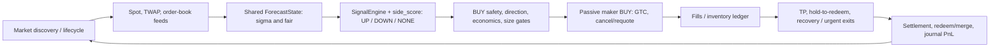
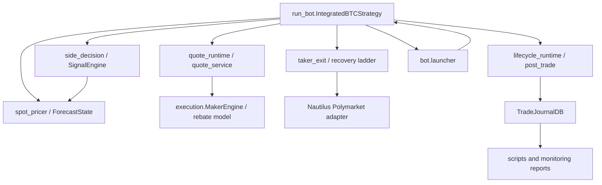

# Polymarket BTC 15-Minute Trading Bot — Current Authority

> Audit baseline: repository HEAD `da128d9` (2026-08-21).  This document is
> the authority for the current implementation, its known debts, and the only
> approved implementation sequence.  It replaces phase/group checklists as a
> decision authority; historical documents remain evidence until the document
> cleanup stage is approved and completed.

## Audit scope and safety status

- This is a read-only code audit except for creating this document.  No live
  trading code, profile, existing document, or test was changed.
- The production path is `run_bot.py` → `bot.launcher` → `IntegratedBTCStrategy`
  plus `bot/`, the Nautilus Polymarket adapter, `execution/` helpers, and
  `monitoring/trade_journal_db.py`.  `--live` is the only path that sends
  wallet orders; dry run exercises the same decision/order lifecycle locally.
- The worktree was clean at audit start.  GitHub CI executes only
  `python -m pytest -q` (`.github/workflows/tests.yml`).  It does **not** run
  reports, preflight, replay, or any `scripts/` command.
- Findings tagged **unknown—ask first** are deliberately not removal
  recommendations.  Their reachability or operational use cannot be proven
  from static source/CI inspection alone.

## 1. End-to-end trading lifecycle

### Control flow

### 1. Market selection, data and quotes

| Stage | Runtime implementation and I/O | Governing keys |
|---|---|---|
| Market discovery / phase | `bot.lifecycle.{collect_btc_market_candidates,resolve_bi_side_market_selection,evaluate_market_phase}` and `bot.lifecycle_runtime` select an alive BTC Up/Down market, set `WAITING/ACTIVE/REDUCE_ONLY/SETTLING`, and invoke settlement on rollover. Input: Gamma/cache instruments and clock. Output: slug, paired instruments, strike/end time, phase. | `BTC_MARKET_*`, fixed lifecycle policy (some defaults are intentionally no longer profile keys). |
| Spot and TWAP | `bot.price_streams.extract_*_tick`, `bot.market_runtime.handle_quote_tick`, `bot.spot_pricer._fetch_external_spot_price`, and `bot.market_data.record_external_spot_observation`. Chainlink/TWAP is preferred; fresh external spot is degraded fallback. Inputs: websocket/HTTP ticks; outputs: reference spot, source, history, freshness. | `POLYMARKET_CHAINLINK_TWAP_*`, `REQUIRE_TWAP_REFERENCE_SPOT`, `TWAP_DEGRADED_BLOCK_NEW_ENTRIES`, `EXTERNAL_SPOT_*`, `QUOTE_STALE_SEC`, `QUOTE_RESUBSCRIBE_GRACE_SEC`, `QUOTE_EVENT_CLOCK_SKEW_TOLERANCE_SEC`. |
| Order book | `bot.market_runtime.handle_quote_tick` caches per-instrument bid/ask and freshness; `run_bot._append_real_mid_price` maintains outcome-specific history. Inputs: Nautilus quote ticks; outputs: top of book/mid and timestamps used by quote drift and entry confirmation. | `ORDERBOOK_FETCH_INTERVAL_SEC`, `ORDERBOOK_LEVELS_LIMIT`, `MAKER_BUY_PLANNED_QUOTE_MAX_AGE_SEC`, `STALE_QUOTE_SYNTH_MAX_AGE_SEC`. |

### 2. Fair probability and direction

| Stage | Runtime implementation and I/O | Governing keys |
|---|---|---|
| Shared fair model | `bot.spot_pricer._build_forecast_state` calls `bot.forecast_state.build_forecast_state`. Input: spot, a verified Gamma market-scoped strike, time left, UP market mid, reference-source/TWAP observation. Output: `ForecastState` with raw/default sigma, scale, bounds, time-decay, implied-vol floor, standard and native-TWAP probabilities. `bot.spot_pricer._compute_fair_probability` converts it to the token outcome fair. A missing/invalid Gamma market identity is fail-closed for new digital entries; the time-window crypto response is journal-only provenance. | `MAKER_FAIR_PRICER_MODE`, `MAKER_DIGITAL_VOL_*`, `MAKER_DIGITAL_SIGMA_*`, `MAKER_DIGITAL_IMPLIED_SIGMA_ENABLED`, `POLYMARKET_CHAINLINK_TWAP_WINDOW_SEC`. |
| Side decision and score | `bot.side_decision._compute_side_decision_new` obtains that same builder through `_build_forecast_state`, then calls `bot.signal_engine.SignalEngine.compute`. Input: spot, strike, `forecast.sigma_final`, remaining time, UP mid. Output: `ActiveSide`, signed `side_decision_score`, reason, audit payload; UP score is positive and DOWN negative. | `BI_SIDE_*`, `SIDE_SIGNAL_*`, `SIDE_THESIS_WEAK_*`, `REGIME_GUARD_*`. |

**Sigma conclusion (verified):** quote fair and integrated side selection now use the
same `ForecastState` policy, including scale, bounds, time decay, implied-vol
guardrail, and native-TWAP probability.  The independent calculation remains
only in the explicit compatibility fallback in
`bot.side_decision._compute_side_decision_new` when a test/legacy host does not
provide `_build_forecast_state`; `IntegratedBTCStrategy` provides it.  This is
not a live two-sigma path.  `MakerEngine.calculate_fair_price` is still used
for drift mode or strike-unavailable fallback; digital-with-strike output is
overwritten by `ForecastState.probability_for_outcome`.

### 3. Entry gates, sizing, and maker BUY lifecycle

| Stage | Runtime implementation and I/O | Governing keys |
|---|---|---|
| Quote cycle | `bot.quote_runtime._prepare_quote_cycle` blocks bad phases, checks balance/inventory, invokes protective exits, cancels expired exit-owned orders, then schedules `_evaluate_quote_targets`. | `MAKER_QUOTE_REFRESH_SEC`, `MARKET_MAX_POSITION_SHARES`, `MAKER_MAX_CONSECUTIVE_*`, `MAKER_GATE_BLOCK_GRACE_SEC`, balance-sync keys. |
| Candidate/entry gates | `run_bot._evaluate_quote_targets` combines fair/book into `MakerEngine.generate_quote_plan`, then `bot.quote_service.evaluate_buy_entry_controls`, external confirmation, shadow veto, and `bot.quoting.apply_quote_plan_guards`. Inputs: fair, book, side/score, inventory and phase. Output: permitted BUY/SELL plan with reason and economics diagnostics. | `ENTRY_SCORE_MIN` → legacy score reader; `FIRST_ENTRY_SCORE_MIN`, `FIRST_ENTRY_MAX_TIME_LEFT_SEC`, `ENTRY_MIN_TIME_LEFT_SEC`, `ENTRY_MAX_FAIR_PRICE`, `MAKER_MIN_FAIR_PRICE`, external/smart-money keys, momentum keys, `MAKER_*EXPECTED_NET*`, fee/markout keys. |
| Economics | `MakerEngine.generate_quote_plan` computes fair edge, fee and empirical execution penalty; `evaluate_buy_entry_controls` permits a new BUY only if the final scaled `robust_net` meets the common threshold. Directional edge values are telemetry, not an additional BUY veto (`bot.quoting.apply_quote_plan_guards`). | `ENTRY_MIN_ROBUST_NET_USDC` → `MAKER_MIN_EXPECTED_NET_USDC`; `EXECUTION_COST_*` → empirical-markout readers; `MAKER_ECON_FEE_RATE_DECIMAL`, fee-cache/default keys. |
| Size | `bot.quote_service.apply_weak_pfair_size_adjustment`, `apply_high_entry_price_size_adjustment`, `apply_fractional_kelly_sizing`, and final `synchronize_desired_buy_economics_to_quantity`. Output: size that preserves economics after every cap. High-price tier is derived from canonical absolute targets. | `MARKET_TARGET_SHARES` → `MAKER_FIXED_SHARES`; `HIGH_PRICE_THRESHOLD` and `HIGH_PRICE_TARGET_SHARES` → high-price multiplier; `MARKET_MAX_POSITION_SHARES`; weak-pfair and Kelly keys. |
| Submission / repricing | `bot.quote_runtime._submit_quote_cycle` → `run_bot._submit_maker_quote` → `bot.order_submission.submit_maker_quote`. A maker entry is `LimitOrder` / **GTC**; `ORDER_POST_ONLY` requests post-only where adapter supports it. Existing entries are preserved if target version/hysteresis is unchanged; cancellation is handled by `bot.order_runtime`. The documented normal `ORDER_TTL_SEC` is no longer a TTL for unchanged BUYs. | `ORDER_POST_ONLY`, `MAKER_POST_ONLY_STRICT`, `ORDER_REQUOTE_MIN_AGE_SEC`, `ORDER_REQUOTE_HYSTERESIS_TICKS`, `MAX_REQUOTE_PER_SEC`, `MAKER_BUY_PLANNED_QUOTE_MAX_AGE_SEC`; `ORDER_TTL_SEC` applies to exit-owned orders. |

### 4. Fills, exits, settlement and cash accounting

| Stage | Runtime implementation and I/O | Governing keys |
|---|---|---|
| Fill and inventory | `bot.order_events.handle_*`, `bot.post_trade.apply_fill_followup`, and `bot.fill_ledger` update active orders, cost basis, sellable state and journal rows. Input: order event / venue balance; output: inventory and realized fill accounting. | `SELL_DELAY_AFTER_BUY_SEC`, `SELLABLE_AFTER_BUY_BUFFER_SHARES`, conditional-balance keys, `TRADE_DB_*`. |
| Normal TP / hold | `run_bot._evaluate_quote_targets` calls `bot.exit_engine.ExitPolicyEngine.evaluate` and `bot.position_manager`; quote construction uses `bot.quote_service.should_preserve_static_tail_protect_tp_order`. A qualifying tail-protect TP is passive **GTC** at `TAIL_PROTECT_TP_PRICE` (0.97), deliberately kept until filled or an exit owns it. `HOLD_TO_REDEEM` blocks normal profitable exits unless a confirmed reversal applies. | `HOLD_TO_REDEEM`, `TAIL_PROTECT_TP_*`, `MAKER_EARLY_PROFIT_HOLD_*`, `MAKER_PROFIT_RUN_*`, exit hold/conviction keys. |
| Recovery ladder | `bot.taker_exit._submit_invalidation_recovery_ladder` uses `bot.recovery_exit_ladder.select_recovery_exit_action`. Confirmed invalidation first reserves/cancels the TP, then submits a passive recovery SELL (**GTC**, `RECOVERY_EXIT_PASSIVE_TTL_SEC`) when time allows; after passive TTL or in tail it escalates to price-bound market-like **IOC** request. Adapter capability verification reports that the venue’s market path is actually **FOK**. | `RECOVERY_EXIT_LADDER_ENABLED`, `RECOVERY_EXIT_PASSIVE_*`; eligibility remains `TAKER_EXIT_*`, `RECOVERY_EXIT_*` canonical aliases, plus score/stop-loss guards. |
| Urgent exit | `bot.taker_exit._maybe_maker_urgent_exit` produces a reduce-only/marketable limit **GTC** sell marked `is_urgent_exit`; `lifecycle_ttl_for_order` cancels/requotes it after `MAKER_URGENT_EXIT_TTL_SEC`. It is not FOK/IOC. | `MAKER_URGENT_EXIT_*`, absolute-loss and invalidation keys. |
| Settlement/redeem/PnL | `bot.lifecycle_runtime._record_market_settlement` → `bot.post_trade.compute_settlement_summary` records outcome, inventory cost, redeem value and market-cycle PnL. `bot.ops.run_auto_redeem_script` invokes `scripts/check_positions_and_redeem.py`; `bot.db_runtime._reconcile_redeem_cycle_pnl` upgrades estimated settlement PnL with confirmed cash activity. | `AUTO_REDEEM_*`, `POLYMARKET_CTF_COLLATERAL_TOKEN`, `TRADE_DB_*`, regime-guard PnL keys. |

## 2. Dependency and configuration audit

### Module map and dependencies

- The only static Python import cycle found is `bot.launcher ↔ run_bot`.  It
  is a real architectural cycle (launcher imports strategy; strategy imports
  launch helpers), not an import-time crash because the relevant import is
  deferred. **Risk: medium operational/refactor risk; do not break it as
  cleanup without startup/dry-run tests.**
- `bot.quote_service` and `bot.exit_engine` both encode exit intent.  The
  former owns quote/order mechanics and the latter policy classification.
  **Risk: high** if merged; their overlap needs contract tests first.
- The former Grafana exporter/sidecar dependency chain was removed in Phase B
  after approval. The maker strategy does not use its position/order APIs.

### Duplicated, stale, or deliberately compatible concepts

| Finding | Status / risk / P1–P7 relation | Required disposition |
|---|---|---|
| Quote fair vs side sigma | **Resolved in current live path** by `ForecastState`; only non-live compatibility fallback remains. Risk low if isolated after tests. This is P2.2, so do not reopen it as a model behavior change. | Keep fallback until test-host protocol is redesigned; archive old claim that live paths diverge. |
| Canonical local keys → legacy names | **Phase C complete:** `AppConfig` reads canonical keys directly and runtime no longer mutates canonical values into legacy environment names. `bot.runtime_env.CANONICAL_TO_LEGACY` is migration-only. | D.5 must prove every remaining mapping has no live reader and then either retain it solely in the migration tool or remove it with migration fixtures. |
| `MAKER_MIN_DIRECTIONAL_EDGE_*` | Removed in Phase B. Its only receiving guard explicitly ignored it as a BUY veto; P1's common `robust_net` rule remains the only economics gate. |
| `ORDER_TTL_SEC` | Name/documentation imply all orders; runtime now uses it only for loss/urgent exits. Unchanged maker BUY has no time TTL by design (queue priority). Risk medium if renamed/reworked. | Correct documentation; retain behavior and key until an explicit exit-policy naming change. |
| `MAKER_FEE_RATE_BPS_DEFAULT` | Explicit `legacy_bps_default` fallback when live fee lookup is absent. Risk high: can affect robust_net/live entry. | Retain pending fee-failure evidence; not a safe legacy deletion. |
| Reload-entry policy | **Removed in implemented D.2.** First fill consumes the market entry budget; no reload threshold, multiplier, helper, reader, or profile key remains. | Keep the D.1/D.2 regression coverage; do not recreate a replacement BUY path. |
| Grafana / execution sidecar | **Removed in Phase B** after confirming the maker path does not use it. | No remaining disposition. |

### Profile inventory (exact)

The original audit snapshot counted **228** profile keys. After approved
Phase B/C/D.2 removals, `btc15_twap_v3.env` currently has **218** assignment
lines. This number is **not** a claim that 218 independent operator knobs are
required: its former direct-reader classification predates the completed
canonical-key work and must be regenerated in D.5 rather than copied forward.

| Profile keys with no runtime reader | Evidence and risk | Proposed action |
|---|---|---|
| `AUTO_REDEEM_MIN_CONDITION_SIZE`, `AUTO_REDEEM_MIN_TOTAL_SIZE` | Not live strategy readers, but `scripts/check_positions_and_redeem.py` uses them as manual redeem defaults. | Retained; they are operational script settings, not dead keys. |
| `TELEGRAM_CONTROLLER_ENABLED` | `telegram_bot.py` reads it directly, outside `AppConfig`; it is not a profile reader in the app-config inventory but *is* a live launcher control. **Do not classify as dead.** | Move to supported operator/operations contract or retain; requires user decision. |

`AUTO_REDEEM_MIN_CONDITION_SIZE` and `AUTO_REDEEM_MIN_TOTAL_SIZE` remain
manual redemption-script defaults, not strategy readers. Telegram remains a
direct launcher reader. Neither is evidence that the strategy needs another
policy path. The live execution-cost canonical keys
`EXECUTION_COST_LOOKBACK_HOURS` and `EXECUTION_COST_MIN_SAMPLES` are absent
from this profile, so `AppConfig` currently defaults to 168 hours and five
samples unless the operator `.env` overrides them. D.4 resolves that policy;
D.5 then produces the final reader inventory, a minimal operator overlay
(target: about 55 documented local overrides), and reviewed advanced defaults.
It must not delete active controls merely because they appear numerous.

## 3. Unused code, tests, scripts and comments

### Confirmed and candidate code debt

| Item | Evidence | Risk / disposition |
|---|---|---|
| `execution/test_execution.py` | Explicitly ignored by `pytest.ini`; it is a standalone async/manual harness and its own usage text points at a non-existent `scripts/test_execution.py`. | Low live risk; **candidate archive/delete** after replacing stale invocation with a documented supported manual command or deciding it has no value. |
| `test_telegram_bot.py` | Root-level, not collected by `pytest.ini`’s `testpaths=tests`; not in CI/manual docs. | Low; move into `tests/` if supported, otherwise archive. |
| `scripts/outcome_analysis.py`, `scripts/penalty_simulation.py` | Historical hard-coded analysis comments reference V1 commit `560adcd` / pre-hold-to-redeem behavior; no CI/docs caller. | Low; archive as historical research, not delete until reproducibility need is decided. |
| Grafana exporter and its `core/` / legacy execution sidecar | Removed in Phase B after user approval; no maker runtime reference remained. | Complete. |

No long commented-out executable Python block was found by the static scan.
The misleading comments that need correction rather than code removal are:

- `bot.spot_pricer._compute_fair_probability` still describes the old
  “digital option probability using parsed strike + estimated sigma” path; it
  should name shared `ForecastState` and TWAP settlement selection.
- `docs/PHASE_2_VOLATILITY_FAIR_MODEL_AUDIT.md` lines 49 and 93–104 describe
  the pre-P2.2 side sigma divergence, while its later status section says it
  is complete.  This is an internally contradictory historical document.
- `docs/pure_strategy.md` says sigma ceiling 1.20 and old raw formula/key
  names; profile ceiling is 1.60 and shared forecast has extra transforms.
- `execution/rebate_reporter.py` labels realized fields “placeholder” although
  it is used for current telemetry. **Unknown—ask first:** clarify whether
  this is a known limitation or stale comment before altering wording.

### Scripts: execution classification

| Class | Scripts |
|---|---|
| Supported operational/manual | `inspect_env_contract.py`, `migrate_env_to_profile.py`, `check_allowance.py`, `check_positions_and_redeem.py`, `replay_journal_signals.py`, `pnl_attribution_report.py`, `invalidation_counterfactual_report.py`, `verify_exit_order_semantics.py`, `execution_penalty_report.py`, `twap_fair_calibration_report.py`, `fair_edge_bucket_shadow_report.py`, `executable_fair_edge_report.py`, `backfill_redeem_activity.py`. Evidence: README/current docs or current audit docs refer to them. |
| Research, no CI/manual invocation | `calibration_shadow_report.py`, `pure_signal_probe.py`, `shadow_*_report.py`, `pure_probe_report.py`, `score_momentum_report.py`, `recent_buy_fill_report.py`, `realized_edge_report.py`, `pnl_reconcile_report.py`, `mirrored_down_report.py`, `hourly_attribution_report.py`, `edge_attribution_report.py`, `econ_gate_report.py`, `compare_polymarket_chainlink_vs_binance.py`, `build_smart_money_wallets.py`, `trade_db_report.py`, `live_dashboard.py`. | 
| Historical / likely obsolete research | `outcome_analysis.py`, `penalty_simulation.py`. |

“Research, no CI/manual invocation” is **not** proof of deletability.  These
scripts may be run by operators against the local journal.  Ask before
archiving any individual one; classify/retain them under a `scripts/research/`
directory only after confirming the desired retention policy.

## 4. Documentation audit

Judgment was made from current claims, code paths, commands, and numerical
values—not filenames.  “Merge” means its current material belongs in this
authority/operational guide; it must not remain a second decision authority.

| Document | Classification | Evidence / cleanup action |
|---|---|---|
| `README.md` | Retain | Current launch, preflight, live/dry-run and verification commands agree with code. Link this authority. |
| `docs/readme_ZH.md` | Merge | Accurate translated operator runbook, but duplicates README/runtime spec. Retain translation content only; remove independent strategy authority. |
| `docs/configuration.md` | Merge | Correctly documents 55 local keys and aliases, but configuration inventory now belongs here; turn into a short operational reference. |
| `docs/BOT_RUNTIME_SPEC.md`, `docs/BOT_RUNTIME_SPEC_ZH.md`, `docs/STRATEGY_RULES.md` | Merge | Broadly accurate current contracts but duplicate lifecycle/gates/exits in three places. Consolidate current rules here, retaining only language-specific operator instructions. |
| `docs/JOURNAL_REPLAY.md` | Retain | Current supported report commands and explicit limitations; no decision-policy contradiction found. |
| `docs/LEGACY_PATCH_STATUS.md` | Retain, update link | Static code confirms its sidecar/Grafana statement; its safe-cleanup order is useful. Link to this inventory. |
| `docs/EXIT_EXECUTION_AUDIT.md`, `docs/P5-behavior-audit.md` | Archive/merge | Evidence for recovery ladder, but phase-scoped and duplicates current exit contract. Preserve as historical evidence, move outcome/contract here. |
| `docs/PHASE_2_VOLATILITY_FAIR_MODEL_AUDIT.md` | Archive/merge | Contains useful provenance, but contradicts itself about resolved sigma paths and acts as an accumulating P1–P7 ledger. Historical only after its conclusions are captured here. |
| `docs/decision-chain-phases-4-5.md`, `docs/baselines/a0541b7-phase-0.md` | Archive | Point-in-time validation/metrics (including 216-test and 168-hour counts), not current policy. |
| `docs/bi-side_design.md`, `docs/directional-market-maker-refactor-plan.md`, `docs/pure_strategy.md` | Archive as superseded | Old parameters/formulas/design plans conflict with current `SignalEngine`, profile values, and shared forecast. |
| `docs/polymarket_v2_cutover_runbook_2026-04-28.md`, `docs/polymarket_v2_remaining_work.md` | Archive, then review for operator facts | Dated V2 transition/remaining work; it should not direct current live changes. Some fee/collateral observations may be retained only after current adapter verification. |
| `docs/repo_audit_prompt.md`, `docs/skills.md` | Archive/delete after user approval | Generic audit prompts/tooling, not repo operating documentation. |
| `docs/INDEX.md` | Modify | It must name this file as authority and label all above historical files consistently. |
| `core/README.md` | Retain | Accurate narrow explanation of retained `core` indirect dependency. |

## 5. Implementation plan — four completed gates, no parallel fragments

### Phase A — establish the authority and non-behavioral documentation cleanup — COMPLETE (2026-08-21)

- Completed scope: updated `INDEX`, README and concise references to identify
  this file as the authority; deleted the approved old phase/audit ledgers.
  Stale source-comment cleanup is intentionally deferred to its owning code
  cleanup phase, where it can be verified beside the implementation.
- Definition of done: exactly one current decision authority (`project_overview.md`);
  retained operational docs link to it; no retained document claims separate
  live sigma paths or obsolete numerical strategy parameters; `pytest -q` and
  `git diff --check` pass.
- Live behavior: **No.** Documentation-only.  Full regression verification
  and `git diff --check` are recorded in the Phase A handoff.

### Phase B — confirmed inert/dead compatibility cleanup — COMPLETE (2026-08-21)

- Completed scope: removed Grafana exporter/config/CLI flag and its unreachable
  legacy execution/core chain; removed directional-edge no-op config plumbing
  and the ignored standalone execution harness. The redeem threshold keys were
  retained after confirming their manual-script reader.
- Definition of done: every removed key has no reader, migration behavior is
  explicitly tested, `tests/test_env_contract.py` and relevant quote tests
  pass, full `pytest -q`, `scripts/inspect_env_contract.py --env .env --strict`
  (on an operator-provided safe `.env`), and `git diff --check` pass.
- Live behavior: **No strategy decision change.** Grafana metrics endpoint and
  `--no-grafana` are intentionally removed. Full regression verification and
  `git diff --check` passed before Phase B handoff.

### Phase C — configuration ownership convergence — COMPLETE (2026-08-21)

- Completed scope: `AppConfig` directly reads canonical entry, economics,
  size, confirmation, recovery, and derived operator keys. Runtime no longer
  mutates canonical values into legacy process-environment names. The legacy
  map remains migration-only for converting old local files safely.
- Definition of done: every key is classified as credential/host, local
  operator override, advanced active policy, or rejected legacy; no
  canonical-to-legacy environment mutation remains for migrated fields;
  before/after representative profiles produce identical `AppConfig` and
  quote/exit plans; full test, 168-hour replay comparison, preflight, and
  `git diff --check` pass.
- Verification: full `pytest -q`, `git diff --check`, and
  `run_bot.py --preflight-only` passed. The required 168-hour replay executed,
  but the local journal contained no selected/settled candidates, so it cannot
  establish a historical output-equivalence sample; this limitation is
  explicitly recorded rather than inferred away.
- Live behavior: **No intended strategy decision change.** Derived values
  retain their prior conversions; D.1 was separately approved and verified.

### Phase D — one canonical, data-driven live decision system

Phase D is the only remaining behavior-sensitive phase. Its strict order is
**D.3 → D.4 → D.5**. Do not start the next workstream until the preceding one
is complete and verified. The governing rule is one shared provenance/fair/
cost/regime state per market: no second sigma, weekend profile, legacy alias,
or parallel gate may independently alter BUY eligibility. P1–P7 are retained
only as regression evidence; they are not a second roadmap.

- Global definition of done: each workstream records its hypothesis, input
  data lineage, affected decisions, counterfactual and out-of-sample result;
  focused tests, full `pytest -q`, preflight/dry run, applicable replay/shadow
  reports, and `git diff --check` pass; this document is updated with the
  observed outcome rather than a prediction.
- Live behavior: **Yes** for D.3/D.4 and for any D.5 removal that changes a
  default. Approval is required before each live-logic implementation. Do not
  tune sigma (former P2.4), recovery/exit ladder (former P5), score threshold,
  or fair-price ceiling concurrently with D.3/D.4.

#### D.3 — correct and fail-safe market strike provenance (critical; implementation verified, live shadow pending)

- **Observed evidence (2026-08-21):** For
  `btc-updown-15m-1787322600`, the strategy journal's
  `MARKET_STRIKE_LOCKED` event records
  `source=polymarket_crypto_price_open` and
  `strike=77037.02017311055`. At 22:31:32 local time, the live pricer used
  that same value (`strike=77037.02`). The Polymarket market page for the
  same 10:30–10:45 ET interval displayed **Price To Beat $77,071.22**. The
  $34.20 discrepancy is far beyond display rounding and changes digital fair
  probability, side score, and entry economics.
- **Cause established:** `bot.market_data.fetch_crypto_price_to_beat` calls
  `/api/crypto/crypto-price` by start/end time and labels its `openPrice` as
  authoritative. `bot.spot_pricer._get_market_strike_for_instrument` locks
  that response immediately. The later Gamma comparison in
  `_maybe_validate_strike_with_gamma` only emits
  `MARKET_STRIKE_VALIDATION_MISMATCH` and explicitly keeps the local value;
  it cannot protect live entries. This is a source-contract/provenance bug,
  not a sigma, TWAP, or precision issue. The historic Gamma endpoint no
  longer returned this expired event during this audit, so the supplied
  contemporaneous UI capture is retained as the direct frontend evidence.
- **Implementation scope and order:** do this before any remaining sigma or
  exit tuning. First capture the exact slug, market/token identifiers, URL
  parameters, raw response values, and both candidate strikes in the journal.
  Then verify which market-scoped Polymarket field is the frontend's actual
  settlement Price To Beat. Promote only that verified field to the canonical
  strike. The time-window `/api/crypto/crypto-price` result is telemetry-only:
  record it, but never let it alter fair, side, or BUY eligibility. Block new
  digital entries only when Gamma's strike is absent, invalid, or not tied to
  the requested slug; no manual mismatch tolerance controls a live decision.
  Do not replace a locked strike mid-market without a verified market-scoped
  identity and an explicit policy.
- **Definition of done:** fixtures cover the exact mismatch shape and both
  response schemas; regression tests prove a crypto candidate mismatch keeps
  using the matching-slug Gamma strike, while missing/wrong-slug Gamma cannot
  reach fair/side/BUY entry evaluation; journal payloads contain source
  provenance; a shadow/preflight capture confirms the active market's bot
  strike equals the UI Price To Beat; full `pytest -q`, a
  representative replay/shadow comparison, and `git diff --check` pass.
- **Live behavior:** **Yes, safety-critical.** It can suppress entries for a
  market whose strike cannot be proven, and it will change fair probabilities
  where the current endpoint is semantically wrong. **Implemented on
  2026-08-21:** Gamma's market-scoped `priceToBeat` is now the only
  entry-authoritative source; the time-window crypto endpoint is journaled as
  a candidate; its disagreement does not block or alter Gamma-based digital
  fair/side/BUY decisions. Missing, invalid, or wrong-slug Gamma data blocks
  new digital entries. The prior warning-only validator and all mismatch
  tolerance/interval keys are removed.
  Focused regression coverage, full `pytest -q` (282 passed), preflight, and
  `git diff --check` passed. A default dry-run was started and stopped without
  submitting orders, but its order-book subscription supplied no valid quote,
  so it did not reach strike resolution. **Do not mark D.3 COMPLETE** until a
  healthy active-market shadow capture records `MARKET_STRIKE_PROVENANCE` and
  confirms the bot's Gamma strike against the frontend Price To Beat.

#### Planned D.4 — unified short-horizon execution-cost and market-regime policy

- **Problem and evidence:** The current empirical execution-cost calibration
  loads a single global 10-second maker-BUY markout estimate at startup. Its
  canonical default is `EXECUTION_COST_LOOKBACK_HOURS=168`; the profile does
  not override it, and the local journal contains 153 calibration events with
  `lookback_hours=168.0`. This allows stale high-volatility fills to dominate
  the current `robust_net`/`econ_gate` decision for up to a week. The supplied
  Friday/Saturday/Sunday analysis consistently reports low-continuation,
  high-penalty weekend observations and no data-feed outage, but it spans
  different bot revisions and has not yet been independently reproduced as an
  A/B result. Treat its exact win rates, penalty cap, and multiplier as
  hypotheses—not deployable constants.
- **Required single standard:** Replace the global historical penalty plus
  separate ad-hoc regime effects with one versioned `MarketRegimeState` built
  from journaled, market-scoped data: recent realized volatility, 10s/30s
  continuation, BBO spread/depth, observed maker-fill markout, time-to-close,
  and an optional UTC weekday/weekend feature. It must produce one canonical
  cost estimate consumed by `robust_net`/`econ_gate` and recorded with every
  entry decision. Weekday/weekend may be a measured feature, never a separate
  `.env` profile or unconditional multiplier. Direction-score minimum remains
  unchanged unless separate evidence validates a change.
- **Implementation scope and order:** After D.3, build the non-live dataset
  and report first, using one first eligible observation and one settlement
  per 15-minute market to prevent tick-count bias. Compare rolling windows in
  the **12–48 hour** range (with explicit minimum sample and conservative
  fallback) against the 168-hour baseline, stratified by current regime and
  weekday/weekend. Select window/weighting from an out-of-sample period; do
  not install a fixed $0.15/$0.20 cap, lower `FIRST_ENTRY_SCORE_MIN`, or add a
  weekend profile merely to increase trade count. If a regime-aware model is
  not demonstrably safer, retain the conservative path and record that result.
- **Definition of done:** a reproducible journal report exposes candidate →
  eligible → submit → fill → 10-second markout → settlement by market and
  regime; the feature data, sample counts, and fallback behavior are in every
  decision payload; the selected 12–48h policy improves or preserves
  out-of-sample realized robust outcome without degrading risk limits; focused
  unit/integration/replay tests prove one cost value reaches all BUY gates;
  full verification passes. The same report must separately show why any
  weekday/weekend effect is retained or rejected.
- **Live behavior:** **Yes.** It may permit or reject entries that the current
  168-hour global penalty would decide differently. It is intentionally
  blocked until D.3 has established a correct strike, so the calibration is
  not trained on a corrupted fair/side input.

#### Planned D.5 — close configuration, code, document, and P1–P7 ownership

- **Problem:** The original 228-key inventory is stale (the current profile
  has 218 assignments), while most settings still expose implementation
  details instead of measured policy. Historical P1–P7 material was absorbed
  into A–D, but this document previously listed explicit evidence only for
  P1–P6; P7 must be reconstructed from git/journal/test evidence rather than
  silently declared complete. Remaining stale comments and research/document
  retention decisions also make the current contract harder to maintain.
- **Required single standard:** after D.4 fixes the canonical data-driven
  regime inputs, regenerate the reader inventory mechanically. Classify every
  key as credential/host, supported local operator override, data-calibrated
  policy, fixed safe default, manual-tool setting, migration-only alias, or
  dead. Publish one minimal operator overlay (target approximately 55 keys)
  and keep advanced values internal or data-calibrated only when their default
  and fallback are tested. There must be one owner for each calculation and
  no duplicate commentary or obsolete audit document claiming live authority.
- **Definition of done:** a checked inventory covers the current profile,
  operator example, `AppConfig`, direct environment readers, migration tool,
  and manual scripts; all confirmed dead readers/keys/comments/files are
  removed in one cleanup change; Telegram's supported contract is decided;
  P1–P7 each has a concise current-code/test/journal evidence row (including
  the former P7); one documentation authority remains; full tests, strict env
  contract/migration fixtures, preflight, and `git diff --check` pass.
- **Live behavior:** Removing dead code/comments/docs is **No**. Any
  consolidation that changes an active default or operator override is
  **Yes** and must be split from safe cleanup, explicitly approved, and
  replay-verified. No uncertain reader, research script, or setting may be
  deleted by assumption.

#### Implemented D.1 — one entry per market (2026-08-21)

- First BUY fill, including a partial fill, consumes the market's single entry
  budget and immediately cancels the remaining BUY order with reason
  `first_buy_fill_no_reentry`.
- A later fill event for that same client order does not increment the budget
  or issue a second cancellation. The existing market-wide count gate blocks
  every subsequent BUY for the slug, regardless of thesis epoch.
- Verification: focused live-path regression suite and full `pytest -q` both
  pass; `git diff --check` passes. This intentionally changes live execution:
  a partially filled passive entry will never be replenished.

#### Implemented D.2 — retire reload-entry policy (2026-08-21)

- Removed reload-entry thresholds, economics multiplier, edge telemetry helper,
  runtime propagation, profile keys, and obsolete tests. `market_buy_count`
  remains solely as the market-wide one-entry guard and journal-recovery state.
- This completes the implementation side of the one-entry rule: after the
  first BUY fill, no reload or replacement BUY policy remains.
- Verification: full `pytest -q` passed with 279 tests and `git diff --check`
  passed.

## 6. Decisions required before any deletion/modification

1. Should `TELEGRAM_CONTROLLER_ENABLED` be an operator-supported control, or
   should Telegram always be enabled/disabled by launcher policy?
2. Which verified, market-scoped Polymarket field/API is the authoritative
   frontend **Price To Beat** contract for D.3? Until a shadow capture proves
   the contract, the implementation must use the D.3 fail-closed path rather
   than guessing an endpoint equivalence.
3. Which research scripts must remain reproducible/available to operators?
   Static inspection cannot determine this.
4. For remaining historical design documents, approve whether they are moved
   to an archive directory, deleted from git, or retained with an explicit
   historical header. This is a repository-history policy choice.

## Relationship to prior P1–P7 work

This audit does not reopen completed convergence work: P1 common `robust_net`
economics; P2.1–P2.3 forecast telemetry/shared builder; P3 venue-balance and
watchdog convergence; P4 canonical entry mode; P5 recovery audit and ladder
regression boundary; and P6 operational-default reductions are reflected in
current code. Their old reports are evidence, not current instructions.

The prior ledger's P7 is not represented by a distinct current-code evidence
row in the surviving audit material. It must therefore be reconstructed and
recorded in D.5—not assumed complete and not revived as a new parallel phase.
P1–P7 regression boundaries now belong to Phase D as follows: D.3 protects
the strike input to P1/P2/P4; D.4 revalidates P1 economics without creating a
second fair/sigma path; D.5 proves configuration ownership and records all
seven boundaries. There is no new P-number or unbounded “group” backlog.
