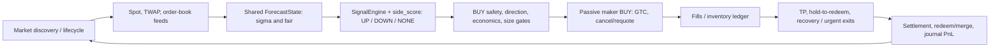
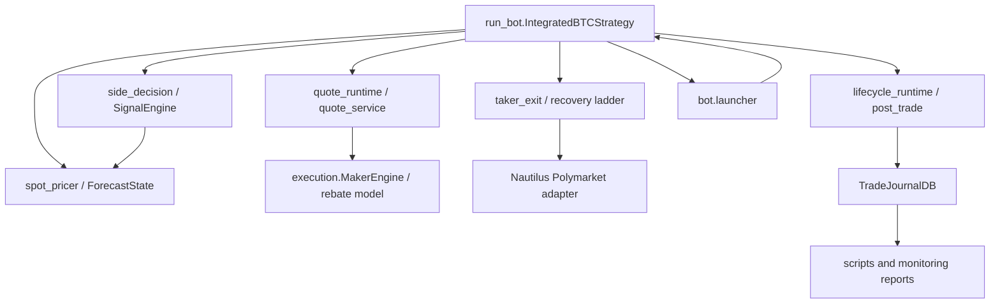

# Polymarket BTC 15-Minute Trading Bot — Current Authority

## Phase B runtime authority (2026-10-07)

Outcome/Hyperliquid network ingestion and Fast Follow runtime have been retired.
Current maker, flip/invalidation, session risk, settlement and prediction authorities
remain unchanged. Required trend-entry, forward-shadow, smart-money trajectory and
order-latency evidence now share `data/research/twap_forward_shadow.db` with
prediction/TWAP evidence. `data/research/hyperliquid_lead_lag.db` is historical-only;
this patch neither mutates nor archives it. BTC1s Parquet remains unchanged. The current periodic journal backup default is
10800 seconds; forced lifecycle backups remain enabled. See [Phase B ownership](docs/outcome_decommission_phase_b.md).
Historical entries below describe their recorded checkpoints, not current Outcome
execution authority. Deployment and a new dry-run validation remain separate.

## Entry sizing share_v1 — RESEARCH COHORT BOUNDARY (2026-10-09)

`SIZING_RULE_VERSION = "share_v1_2026-10-09"` (`bot/entry_sizing.py`) is the single
production entry-sizing authority for LIVE and DRY-RUN (no mode branch). It took
effect with the commit `fix(execution): size entries by sellable shares`.

| Tick-normalized BUY price | Base target | Final quantity |
|---|---|---|
| `<= 0.70` (strict boundary, as in `8de45cb`) | 10.0 shares | `min(10, existing L2/risk/inventory cap)`, rounded down to 0.01 |
| `> 0.70` | 5.5 shares | `min(5.5, existing L2/risk/inventory cap)`, rounded down to 0.01 |

- The price is normalized to the 0.01 tick before the comparison, so float noise
  (`0.7000000000000001`, `0.6999999999999999`) lands in the `<= 0.70` bucket.
- `MIN_ENTRY_SHARES = 5.5` is the bot's minimum requested entry, not the venue's
  5-share SELL minimum. The 0.5-share difference absorbs the existing 0.1 % balance
  haircut, the 0.05-share post-BUY buffer and the 2-decimal round-down. Any final
  quantity below 5.5 is skipped (never rounded up). A skip consumes no BUY count,
  starts no cooldown, does not mark the market as traded, and logs once per market
  per reason.
- **Multiplier semantics (seam audit S2, `fix(risk): classify kill switch and
  unify sizing multipliers`):** base share target → × strategy `size_multiplier`
  (entry quality, confirmation, smart-money, weak pfair; combined with `min`,
  never compounded, never above 1) → `min(strategy quantity, L2/risk/inventory
  caps)` → round down to 0.01 → skip below 5.5. The caps are pure caps: the
  depth/risk cap is built with `size_multiplier=1`
  (`run_bot.depth_risk_cap_kwargs`), so the multiplier has the same effect with
  `DEPTH_RISK_SIZING_ENABLED` on or off. Before this commit the multiplier only
  scaled the $10 L2/risk budget, so with depth-risk on a 0.5 multiplier was a
  no-op at 0.50 and 0.75–0.90 and a partial cut in 0.50–0.70; with depth-risk
  off it skipped every entry.
- Consequence (deliberate, accepted 2026-10-09): any multiplier < 1 in the 5.5
  bucket, and < 0.55 in the 10 bucket, is a SKIP. The profile's
  `MAKER_WEAK_PFAIR_SIZE_ADJUST_MULTIPLIER=0.5` therefore skips weak-pfair
  entries at every price. Multiplier values were not changed.
  `apply_high_entry_price_size_adjustment` only sets the share target; the old
  ×0.55 high-price multiplier is retired.
- **Second cohort boundary:** entries before and after the multiplier-semantics
  commit cannot be pooled for entry-rate, per-trade PnL or size-dependent
  statistics without adjustment (weak-pfair/quality-reduced entries were taken
  before, are skipped after).
- Rationale: 5.5 shares above 0.70 keeps every full fill sellable (≥ 5 after the
  haircut). It was documented in `df1594d` as a buffer above the 5-share exchange
  SELL minimum.
- Before this commit, the high bucket was NOT 5.5 shares. Since the L2 caps
  (`b80f80d`, 2026-09-07), the depth/risk cap replaced the base quantity, giving
  ≈ $5.50 notional (5.5/price shares, e.g. 6.875 at 0.80). Older text that says
  "exactly 5.5 shares" describes intent, not the 2026-09-07 → 2026-10-09 runtime.
- **Cohort boundary:** per-trade PnL, notional and size-dependent statistics from
  before and after `share_v1` must not be pooled without adjustment. Above 0.70,
  pre-fix entries carried ≈ $5.50 notional; post-fix entries carry 5.5 × price
  ($3.91–$5.45). Journal rows after the change carry `sizing_version` in
  `entry_sizing` / skip payloads.
- Config safety: code defaults and `config/profiles/btc15_twap_v3.env` both hold
  `MARKET_TARGET_SHARES=10.0`, `HIGH_PRICE_THRESHOLD=0.70`,
  `HIGH_PRICE_TARGET_SHARES=5.5` and `MARKET_MAX_POSITION_SHARES=10.0` (code
  default changed 25 → 10; the effective value was already 10 via `.env`).
  - A missing `.env` key can no longer fall back to $10 notional / 25 shares.
  - Validation runs on the final resolved values (code → profile → `.env` → shell).
    Targets must lie in [5.5, 10], the high target may not exceed 5.5, and the
    threshold must be 0.70. Otherwise LIVE refuses to start
    (`bot.launcher.enforce_entry_sizing_startup_policy`, again in strategy settings)
    and DRY-RUN warns and runs the canonical rule.
  - An in-bounds, non-canonical (smaller) override is logged as a WARNING.
  - Both modes log the effective rule and version at startup.
- `MAKER_QUOTE_SIZE_USDC` is no longer a sizing driver. It is read only by the
  unreachable MakerEngine fixed-share fallback and the run-start journal note.
- Collateral check: per LIVE BUY at the submit boundary,
  `final quantity × tick-aligned limit price × 1.1` (worst normal case
  10 × 0.70 × 1.1 = $7.70). Insufficient or unknown balance skips the entry and
  never shrinks it. The former cycle-level `MAKER_QUOTE_SIZE_USDC × 1.1` gate is
  removed. SELLs and protective exits never consult the balance (regression-tested).
- Accepted residual risk (behavior unchanged): a partial maker fill below 5 shares
  cannot be sold by any TP, stop or hard breaker. It is held to settlement and
  redeemed, and its loss is bounded by its own notional.
- Historical skip impact (read-only journal reconstruction):
  - 2 of 241 LIVE BUY submits (2026-09-22 → 09-30; 1 of 83 filled) and 4 of 982
    DRY-RUN submits (2026-10-01 → 10-09) would now be skipped. All were below
    5.5 because of the L2 depth cap (inferred).
  - Above 0.70, 151 LIVE and 773 DRY-RUN submits would have been smaller (5.5
    instead of 5.5/price shares).
- Open items, not changed by share_v1:
  - P1 (partly fixed — see Protective-exit availability during pauses):
    Telegram pause and error pause now keep protective exits; the kill switch
    and a stale order book remain DEGRADED, and their policy is UNRESOLVED.
  - P1: the "$2 hard" breaker needs a confirmed adverse trend. It is not a
    guaranteed $2 cap; the audit estimated up to ≈ $5 additional loss per entry.
  - Client order ids are not idempotent (an equivalent duplicate-entry guard exists).
  - Startup orphan-order cancellation has code but is UNVERIFIED in LIVE.
  - DRY-RUN skips exits and breakers; it proves nothing about protective exits.
  - Storage is at WARNING (≈ 12.8 GiB free; critical guard 10 GiB). Avoid
    back-to-back DRY-RUNs for ≈ 24 h without re-checking free space.
  - HEAD has not been runtime-validated since the settlement fix `bbbdc09`.

## Protective-exit availability during pauses (2026-10-09)

Commit `fix(risk): keep protective exits active during pauses`. Before it, a
Telegram pause or an error pause returned before the hard breakers were ever
evaluated, and a held instrument could be stopped on a stale cached quote. Both
were reproduced red-first.

**Architecture.** Every QuoteTick drives `_quote_maker_orders` →
`_prepare_quote_cycle` (`bot/quote_runtime.py`):

1. Kill switch → `_run_protective_exit_cycle` (class policy below) → return.
2. Phase / side refresh.
3. Entry-authority gate (`_entry_authority_block_reason`: Telegram pause,
   error pause) → cancel resting BUYs only → `_run_protective_exit_cycle` → return.
4. Otherwise the normal path, which reaches the same `_run_protective_exit_cycle`.

`bot/protective_exit.py::ProtectiveExitMixin._run_protective_exit_cycle` is the
one canonical entry into the unchanged exit engine
(`TakerExitMixin._maybe_taker_exit_positions`, `_maybe_maker_urgent_exit`).
Every real SELL still passes `ExecutionSafetyMixin.submit_order`, and DRY-RUN
still never evaluates exits. The quote-watchdog thread calls
`_report_protective_exit_availability` (observability only, no orders), so a
full quote outage is visible even without QuoteTicks.

| State | New BUY | Resting BUY | Protective SELL | Resting protective SELL | Breaker evaluation |
|---|---|---|---|---|---|
| Normal | allowed | kept | allowed | kept | yes |
| Telegram pause (manual, or AlertWatcher after 3 consecutive losses) | blocked | **cancelled** | allowed | kept | yes |
| Error pause, class (i) | blocked | cancelled | allowed | kept | yes |
| Error pause, class (ii): SELL in unknown venue state on that instrument | blocked | cancelled | **not sent** | — | instrument skipped; `PROTECTIVE_EXIT_DEGRADED inventory_unreliable_sell_order_state_unknown` |
| Kill switch A: `operational_entry` | blocked | cancelled | **hard breakers only** (`absolute_max_loss_breaker`, `catastrophic_stop_loss_*`; STOP_LOSS=0 semantics, no urgent/endgame/recovery exits) | **kept** | yes, hard reasons only |
| Kill switch B: `execution_integrity` | blocked | cancelled (existing: all maker orders) | **not sent** | cancelled (existing) | no; `PROTECTIVE_EXIT_DEGRADED kill_switch_execution_integrity_reconcile_first`; watchdog reconciliation continues |
| Kill switch `unresolved` | blocked | cancelled (existing) | **not sent** | cancelled (existing) | no; `PROTECTIVE_EXIT_DEGRADED kill_switch_active_exit_policy_unresolved` |
| Polymarket order book stale (no fresh quote within `QUOTE_STALE_SEC`) | blocked by the existing watchdog/quote gates | watchdog cancels BUYs | not sent | kept | instrument skipped; `PROTECTIVE_EXIT_DEGRADED orderbook_stale` |
| BTC / Chainlink reference stale (> 5 s) | blocked by the existing TWAP-degraded gate | per existing gates | allowed when other inputs are fresh | kept | yes. Stale TWAP votes count as unavailable (never adverse); `PROTECTIVE_EXIT_DEGRADED reference_feed_stale_partial_trend_inputs` (non-blocking) |

Error-pause triggers and classes:

| Trigger | Class |
|---|---|
| Loss pause after consecutive realized losses (`post_trade` via `fill_ledger.py`) | (i) |
| Reference-spot fetch failures (`spot_pricer.py`) | (i); inputs gated by freshness |
| Orderbook-missing reject (`order_events.py`; existing cancel-all kept, the book no longer exists) | (i) |
| BUY balance/allowance reject (`order_events.py`) | (i); now cancels BUYs only, an unknown-side reject keeps cancel-all |
| Cancel-reconcile unknown (`order_runtime.py`) | unknown BUY → (i); unknown SELL on a held instrument → (ii), fail closed |

Duplicate-sell protection:
- One in-flight protective SELL per instrument (`pending_taker_exit_by_inst`,
  set before the chokepoint and cleared on fill, cancel or reject).
- An 8 s minimum interval and a 20 s reject cooldown give rate-limited, never
  storming retries, bounded to ≤ 1 per 20 s within a 15-minute market.
- Quantity is `min(position, effective sellable)` and never exceeds verified inventory.
- Pause → resume uses the same path, so there is no double submit.
- A position below the 5-share venue minimum is logged once as
  `PROTECTIVE_EXIT_UNSELLABLE`, is never retried, and is held to settlement.
- `PROTECTIVE_EXIT_DEGRADED` is rate-limited to one line per
  (instrument, reason) per `TAKER_EXIT_SKIP_LOG_INTERVAL_SEC`. No new Telegram
  message type and no new config key were added.

**Conditional absolute-loss breaker** (`conditional_absolute_loss_breaker`; the
`reason` string `absolute_max_loss_breaker` is unchanged). It is **not a
guaranteed $2 maximum loss.** It fires only when all of these hold:
- `ABSOLUTE_MAX_LOSS_ENABLED=1`;
- net-if-exit ≤ −$2.00 (bid minus 0.2 % slippage, minus the taker-fee estimate);
- hold ≥ 60 s and bid below entry;
- a confirmed adverse trend: confirmed locked-side invalidation, or a locked
  opposite signal with |score| ≥ 0.05;
- ≤ 120 s left, **or** 15 s persistence with ≥ 2 of ≥ 2 available thesis votes
  (signal, fresh TWAP ≤ 5 s, fair −0.05).

It bypasses the stop-loss spread guard, the hold band, the wait-for-sell-quote
gate and the recovery-ratio gate. For 10 shares bought at 0.70, the loss before
it fires ranges from ≈ $2.0 (trend already confirmed, liquid book) to the full
$7.00 notional (trend never confirmed, a gap inside the 60 s / 15 s windows, an
FOK on a thin book, or a degraded state).

The catastrophic breaker (`CATASTROPHIC_STOP_LOSS_ENABLED=1`, $0.40) needs
thesis weakening or a strong opposite signal plus 2 confirmations. It is
evaluated after the hold-band return, is off in the last 45 s, and is subject
to the 3 % stop-loss spread guard. With `STOP_LOSS_ENABLED=0`, the adaptive
stop, urgent exit, endgame TWAP exit, invalidation-recovery ladder and
force-offside exit stay off; the absolute and catastrophic breakers stay on.

**Kill-switch classes** (`bot/kill_switch.py`, decided 2026-10-09). Each
`_activate_maker_kill_switch` call site passes a trigger code; classification
is by execution semantics, never by free text, and anything not decided is
`unresolved` (treated like B):

| Trigger (call site) | Class | Why |
|---|---|---|
| Cancel reconcile unknown after max retries (`order_runtime.py`) | B `execution_integrity` | order state unknown; a new SELL could duplicate exposure |
| Cancel reconcile failed, order still open (`order_runtime.py`) | B `execution_integrity` | a live order we cannot cancel |
| Region/compliance 403 (`order_events.py`) | `unresolved` | whether a protective SELL would be accepted is not established |
| Consecutive denied orders, streak entirely BUY (`order_events.py`) | A `operational_entry` | denied orders are terminal; nothing about held inventory or SELL authority is in doubt |
| Consecutive denied orders, any SELL or unknown-side denial | `unresolved` | not decided |

- Classes only escalate while active (A → B/unresolved, never back).
- Defence in depth: `ExecutionSafetyMixin.submit_order` blocks every BUY under
  any kill and every SELL unless the class is A (unknown order side = blocked).
- `MAKER_KILL_SWITCH_RESET_ON_ROLLOVER` resets A as before; B/unresolved reset
  on rollover only when no order is pending cancel or reconcile-unknown
  (reconcile first). `MAKER_KILL_SWITCH_ACTIVATED` journals trigger, prior and
  effective class.

**UNRESOLVED (operator decision required):**
- Region restriction and SELL/unknown-side denial streaks under the kill switch
  (currently the most restrictive behaviour).
- A stale-feed liquidation policy (for example, flatten after N seconds without
  a fresh book). Not implemented; no threshold was invented.

**Still requires tiny-LIVE validation:**
- the real venue fill, reject and expire lifecycle of the FOK/IOC protective SELL;
- in-flight clearing on real events;
- the kill-switch and orphan-order paths.

Deterministic harnesses: `tests/test_protective_exit_availability.py`,
`tests/test_kill_switch_classification.py`.

## Journal location, writer lock and maintenance guards (2026-10-09)

Same commit as the kill-switch classes (seam audit S3–S5).

- **One resolver:** `bot/journal_path.resolve_trade_db_path` — explicit path >
  shell > `.env` > profile > `DEFAULT_TRADE_DB_PATH`
  (`./data/trading/trade_journal.db`), relative paths anchored at the repo root.
  Used by the bot (`bot/settings.py`, `bot/launcher.py`), `dashboard.py`,
  `build_outcome_provenance`, `fetch_official_resolutions`,
  `research_daily_export`, `backfill_redeem_activity` and
  `reset_session_pnl_guard`. Previously the scripts and dashboard fell back to
  `logs/trade_journal.db` while the bot fell back to `data/trading/`, so a
  missing key made the bot migrate (copy) the journal while readers kept the
  stale copy. The `.env` on this host pins `TRADE_DB_PATH=./logs/trade_journal.db`,
  so the effective path is unchanged.
- **Writer lock:** `run_integrated_bot` holds `<journal>.writer.lock` (flock)
  for the whole run in LIVE **and** DRY-RUN and returns
  `journal_writer_lock_held` without starting a node when another process holds
  it. A DRY-RUN can no longer run beside LIVE on the same journal. It is
  released before the caller's exit-retention steps.
- **Destructive maintenance** (`reset_session_pnl_guard --apply`,
  `research_partition retention --apply`, `compact_research_db --vacuum`,
  `archive_lead_lag_research --apply`, `backfill_redeem_activity` without
  `--dry-run`) runs inside `require_bot_stopped()`: it refuses (exit 4 /
  `REFUSED`) when the LIVE process lock or the journal writer lock is held, and
  holds both for its whole run so the bot cannot start mid-maintenance.
  Read-only/plan modes need no lock. Launcher-invoked exit retention and
  `storage_maintenance.py` (own `maintenance_lock` + in-use checks) are
  unchanged.

Pre-existing, unrelated failure kept as-is:
`tests/test_live_path_regressions.py::test_app_config_reads_extended_env`
expects `TAKER_EXIT_MAX_TIME_LEFT_SEC`, renamed to
`RECOVERY_EXIT_MAX_TIME_LEFT_SEC` in `f493c68` (2026-08-22).

## Offline empirical probability study (2026-10-01)

- `scripts/empirical_probability_research.py` is an offline-only comparison of
  the existing analytic `p_up_ex_market`, a rolling historical BTC forward-
  return empirical CDF, a volatility-conditioned empirical CDF, and Polymarket
  mid probability. It reads `data/research/twap_forward_shadow.db` read-only
  and reuses cached Binance BTCUSDT one-minute OHLCV in `data/btc_history/`;
  it does not fetch data or write to a runtime database.
- The cache covers 2026-07-27 through 2026-09-20. Each estimate uses only
  historical samples strictly earlier than its evaluation timestamp, within a
  rolling 56-day window. Resampling for paired confidence intervals is by
  `market_slug`, not checkpoint row.
- One-minute closes support only coarse 60s and 120s forward-return horizons.
  5/10/15/30s estimates are unavailable. A return endpoint is only a proxy for
  final settlement direction; it does not reconstruct the official final
  60-second Chainlink TWAP path. In particular, `EXACT_FINAL_WINDOW_BOUNDARY`
  rows are kept separate and excluded from empirical CDF scoring because the
  available OHLCV cannot reconstruct the remaining average path.
- `PRE_FINAL_STRIKE_PROXY` rows are scored separately. The current local DB
  has only eight canonical, fresh-sigma, 120-second proxy observations with an
  empirical estimate: two settled UP and six DOWN. Apparent direction accuracy
  is not meaningful evidence at this sample size; paired intervals are
  correspondingly unstable.
  See generated `reports/empirical_probability/summary.md` and CSV outputs.
- Market mid is a non-executable reference, not an executable edge or PnL
  estimate. No standalone alpha is established. `ML_JUSTIFIED` remains
  `INSUFFICIENT_DATA`; collect more prospective canonical checkpoints and
  obtain sub-minute BTC history before reconsidering finer horizons or ML.
- This research script/report grants no live authority and changes no live
  entry, exit, stop, sizing, order-routing, session-guard, or TWAP runtime
  behavior.

## BTC 1-second historical research data

- The observer-only `BTC1sHistoryCollector` passively reuses the existing
  Binance Spot `btcusdt@aggTrade` connection. It does not create another
  WebSocket and has no entry, exit, risk, pricing, or order authority. Its
  enable/disable and storage settings are `BTC_1S_HISTORY_ENABLED`,
  `BTC_1S_HISTORY_DIR`, and `BTC_1S_HISTORY_MIN_FREE_DISK_GB`.
- Data is written as Zstandard-compressed Parquet parts under
  `data/btc_history_1s/`, named
  `BTCUSDT_1s_YYYY-MM-DD_part-NNNNN.parquet`. The date is UTC. `ts_sec` is an
  integer UTC epoch second; source/receive timestamp columns are epoch
  milliseconds. A row is assigned to the Binance trade-time (`T`) second,
  falling back to Binance event time (`E`) only if trade time is absent.
- Each bar stores OHLC, quantity volume, aggTrade-message count, and quantity-
  weighted VWAP when available. `trade_count` means aggTrade messages, not the
  individual executions combined inside an aggregate event. For sources that
  lack quantities, volume/VWAP remain null. Missing seconds are not filled.
- A bounded callback-side aggregator feeds a bounded nonblocking queue; a
  background worker batches and atomically publishes immutable Parquet part
  files. Restarts allocate new part numbers and never overwrite earlier
  parts. Offline loading sorts and deduplicates by `ts_sec`, choosing the row
  with the greatest `last_source_ts`, then the lexically later part on ties.
- Low disk or any collector/write error disables only this history writer and
  logs a warning; the live feed and trading continue. `data/` is already
  ignored by Git, so these market-data files are not committed. Maximum
  theoretical coverage is about 86,400 rows per UTC day; actual rows are lower
  when the feed has gaps. No daily compressed-size estimate is asserted until
  representative live data is measured.
- Validate a UTC day with `python scripts/validate_btc_1s_history.py --date
  YYYY-MM-DD`. Use `load_btc_1s_history(start_ts, end_ts)` from the offline
  collector module for downstream research. This storage layer does not
  change the empirical probability estimator or any live probability logic.


## Pre-commit blocker corrections (2026-10-04; prepared, not deployed)

This correction supersedes the earlier readiness claims below where they
conflict. The running collection process and its DB/Parquet data remain untouched.

- Monthly reporting reconstructs completed `MARKET_CYCLE_PNL` events in a
  journal-owned background worker, on initial request, finalized-cycle/redeem
  notification and a five-minute fallback refresh. Live realized-delta handling
  reads cached values only. Reporting failure yields unavailable monthly
  display and never changes journal/BUY health. The cache can lag a finalized
  event until the background refresh completes; it is not another PnL ledger.
- Durable session accounting (realized PnL and high-water) survives guard mode
  changes. Only policy flags are recomputed on a mode change; same-mode sticky
  locks remain durable. Missing-state reconstruction still has legacy limitations.
- Prometheus `trading_position_close_*` metrics have strategy-run and instance
  labels and explicitly measure position-close activity. They exclude canonical
  settlement/session/month accounting. Old `trading_live_realized_pnl` consumers
  must migrate their observability queries; no trading authority changes.
- ResearchStore owns JSON parsing, stable row-order dedupe and settlement access
  for the current canonical modes. Malformed/non-object payload exclusions are
  counted by integrity. Older standalone tools remain compatibility paths.
- MarketEvidence recursively freezes mappings/sequences, including direct
  construction; display preserves run identity and captured freshness/provenance.
- Entry anchors require fresh evidence at or before entry. Partial opening-order
  fills aggregate; scale-ins retain the original lifecycle and have separate
  aggregate fields. Legacy client-order grouping remains explicitly ambiguous.
  Identity joins and legacy slug/instrument fallbacks have different labels.
  Execution timestamp does not stand in for an unavailable stop-trigger timestamp.
- Fresh inventory after a full close receives a new lifecycle ID. Persisted
  identity is restored during existing inventory recovery without changing cost
  basis. Duplicate journal events with durable fill identity are excluded offline;
  this is not a new venue-fill deduplication authority.
- Writer success now requires terminal acceptance stop, terminated worker,
  empty queue/buffers and no known write failure or dropped accepted data.
  Research writers stop after background producers and final strategy events;
  the shared TWAP writer result is checked. Failure/timeout means incomplete
  shutdown, not success. SIGKILL remains non-draining.
- Git status failure is UNKNOWN (`null`), not clean. Profile is explicit when
  available and UNKNOWN otherwise. Config hash covers only the documented safe
  section allowlist, not every environment/instrumentation setting. Tracked diff
  hash still excludes untracked contents; old provenance is not backfilled.

Research results retain their cohort boundaries: the earlier preliminary
weekend `<0.5sigma` estimate of about 12.9% and the later entry/stop report's
12/46 (26.1%) are different cohorts/checkpoint selections. Neither is a live gate.
Generated cohort CSVs remain local and were not regenerated against active data.

Blocker regression validation: **59 regression cases** in
`tests/test_precommit_blockers.py`; complete suite **871 passed** with the
existing upstream websockets deprecation warning. `git diff --check` passes.
No commit/push or deployment was performed.

## Research engineering authorities (2026-10-04)

- **Live authority:** `IntegratedBTCStrategy` and its existing entry/exit/risk
  policies. Offline research modules consume persisted evidence only; they do
  not authorize orders. The blocker fixes preserve entry signals, stop, TP, sizing and prediction.
  V2 remains opt-in; mode changes preserve accounting while recomputing policy.
- **Run provenance:** the existing `strategy_runs.notes_json` is the canonical
  run-metadata container. New starts write one secret-filtered manifest with
  git/config/schema fingerprints; legacy runs remain explicitly
  `LEGACY_UNKNOWN`. It does not backfill or mutate old research data.
- **Prediction/research storage:** `LeadLagDB` is the asynchronous sparse-event
  writer; prediction snapshots carry a prediction schema version. BTC 1-second
  dense history remains in separate UTC Parquet parts. Research health and
  storage protections remain component-specific; the TWAP storage guard only
  covers optional TWAP events, not every writer sharing the research volume.
- **PnL/order authority:** `MARKET_CYCLE_PNL` is the durable completed-market
  source for session/month reconstruction; `SessionPnlGuard` is the BUY-only
  session authority. The terminal projects guard accounting; Prometheus position-close statistics
  are explicitly scoped by strategy run and instance, not session/month PnL. The venue
  cache/local inventory ledger control current execution state; journal events
  provide durable forensic/recovery evidence, not a second live order state
  machine.
- **Replay/deployment:** existing replay tools remain purpose-specific; there
  is not yet one canonical market/decision/accounting replay harness. The
  engineering-readiness report records that gap and other deferred integration
  work. This working-tree pass is not deployed; a future controlled restart is
  required before new run manifests/schema tags appear in runtime records.

### Settlement and outcome-label authority (verified 2026-10-09)

- **Retrospective payoff truth:** official Polymarket resolution, held in a
  versioned, hash-sidecar cache (`data/research_export/official_resolution/`),
  fetched once, read-only, for research. It never feeds runtime settlement.
- **Runtime settlement authority:** the canonical official 60-second Chainlink
  TWAP label (`bot/lifecycle_runtime.py::canonical_settlement_outcome`).
  Missing, stale (>10 s), wrong-window, degraded or near-tie labels from a tick
  not stamped at market end yield `UNKNOWN`; no latest-spot fallback exists.
  With inventory, `UNKNOWN` writes only a pending `MARKET_SETTLEMENT` (no cycle
  PnL or guard update); the bounded end-stamped-tick relabel or startup Gamma
  reconciliation finalizes it.
- **Research label priority:** official > canonical TWAP > journal. Journal
  `MARKET_SETTLEMENT.outcome` is diagnostic only whenever a higher-authority
  label exists. Realized LIVE cash PnL (fills, redemptions) is kept separate
  from label-based reconstructed or counterfactual PnL.
- **Bug and fix (verified in this pass from git and tests):** before `bbbdc09`
  the runtime computed the canonical TWAP label but still derived settlement
  outcome, cycle PnL, session/regime guard input and shadow settlement from
  `latest_external_spot >= strike`. `tests/test_settlement_authority.py`
  (13 cases) fails 13/13 behaviorally on the pre-fix tree (`git archive
  5f40b14`): wrong side, guard +1.0 instead of −3.0, `UP` instead of `UNKNOWN`,
  and an AST check finding spot-derived outcomes. The full suite at `86832a0`
  passes (1313). The settlement modules (`bot/lifecycle_runtime.py`,
  `bot/post_trade.py`) make no network calls. Follow-ups: `3ec077f` (near-tie
  guard), `ebb044e` (deferred end-tick relabel), `b0c383f` (ledger fix).
- **Known historical label defect** (re-derived in this pass from
  `market_outcomes_5356cf95f81e.csv`, sha256 `ea744003…`): journal outcome
  disagreed with official resolution in 68/895 markets (LIVE period 44/462,
  DRY-RUN period 24/433); canonical TWAP disagreed in 2/437, both near-ties
  labeled from ticks a few seconds before market end. Old journal rows are
  retained unmodified for audit; research applies provenance priority instead
  of rewriting history.
- **Known ledger defect** (fixed going forward by `b0c383f`, not retroactive):
  historical `MARKET_CYCLE_PNL` can double-count residual inventory after a SELL
  or omit inventory held across a mid-market restart. Historical journal cycle
  PnL is not truth.

## Audit scope and safety status

- The 2026-09-24 lifecycle hardening pass changes quote freshness handling,
  scheduled-rollover exposure inspection, startup calibration diagnostics,
  related tests, and this document. No live process was controlled by that
  pass; working-tree changes already present at its start were preserved.
- The production path is `run_bot.py` → `bot.launcher` → `IntegratedBTCStrategy`
  plus `bot/`, the Nautilus Polymarket adapter, `execution/` helpers, and
  `monitoring/trade_journal_db.py`.  `--live` is the only path that sends
  wallet orders; dry run exercises the same decision/order lifecycle locally.
- The worktree was not clean at audit start; pre-existing local changes were
  retained and must be reviewed separately from the branch HEAD. GitHub CI executes only
  `python -m pytest -q` (`.github/workflows/tests.yml`).  It does **not** run
  reports, preflight, replay, or any `scripts/` command.
- Findings tagged **unknown—ask first** are deliberately not removal
  recommendations.  Their reachability or operational use cannot be proven
  from static source/CI inspection alone.

## Current resilience controls (implemented 2026-09-19)

- `OUTCOME_LEAD_LAG_MODE=live_entry_only` is the active profile behavior. It is
  no longer documentation-only observability: an Outcome/TWAP confirmation can
  request a FOK BUY, subject to all guards below.
- `NORMAL_MAKER_BUY_ENABLED=true` is active in the BTC profile. Empirical
  maker-BUY markout remains shadow-only and does not veto normal maker BUY;
  expected-net and the other existing direction, price, freshness, L2/depth,
  journal-health, balance, inventory, sizing, and risk controls still apply.
  Maker and Outcome fast-follow share market-level entry ownership: pending
  fast-follow reservations block normal maker BUY, existing maker BUY orders
  block a conflicting fast-follow entry, and a filled BUY consumes the shared
  one-entry-per-market allowance. The two modes therefore cannot intentionally
  establish independent entries in the same market.
- Entry-risk follow-up: the first-entry warm-up is 300 seconds
  (`FIRST_ENTRY_MAX_TIME_LEFT_SEC=600`). The earlier 120-second setting was
  reverted on 2026-09-29 after live results showed weaker early-window
  direction accuracy and unfavorable realized PnL; directional and all hard-safety gates
  remain active. `ENTRY_QUALITY_SIZE_DOWN_ENABLED=1` applies the already logged
  chase-risk suggested size reduction instead of ignoring it. The absolute
  loss breaker is set to `$2.00` when loss stops are enabled. The operator
  switch `STOP_LOSS_ENABLED` gates loss-triggered exits as a group; the local
  `.env` currently sets it to `0` as a temporary pause after repeated
  stop-outs. With the switch on, the `$2.00` breaker requires a locked, strong
  opposite-side signal or confirmed side invalidation in addition to the loss
  threshold, so a transient price/BBO dip while the locked thesis still
  matches will not trigger it. Disabling stops can leave a losing position
  exposed to its full stake loss at settlement; profitable take-profit orders,
  hold-to-redeem, and redemption remain available. `ENTRY_DECISION_TRACE` now records
  market age and binary resolution reward/full-loss ratio as observation-only
  fields. These payout ratios do not represent stop-loss risk and are not a
  new live veto; collect more closed maker/Outcome samples before adding a
  new minimum reward/risk gate or changing the first-entry warm-up again.
- `scripts/trade_path_pnl_report.py --db logs/trade_journal.db --hours 24`
  separates realized PnL and entry timing for `normal_maker` and
  `outcome_fast_follow`, including allow-to-intent, signal-to-intent,
  intent-to-submit, submit-to-fill, and elapsed market time. Treat open
  positions and partial exits separately from closed-market performance.
- The canonical trade journal path is `data/trading/trade_journal.db`; research
  lead/lag and wallet-label databases use `data/research/` and `data/reference/`.
  Successful strategy/order event writes mark a coalesced background snapshot
  dirty; it atomically publishes `data/backups/trade_journal.db` without
  placing a full SQLite backup on the trading callback path.
- Startup health validates schema/version and readability. When the configured
  `data/trading/trade_journal.db` is absent, a healthy historical
  `logs/trade_journal.db` is copied through SQLite's backup API and atomically
  published before startup continues. A genuinely fresh, empty journal is
  BUY-ready; independent venue inventory recovery still starts SELL-only when
  it finds real exposure without a cost basis. Unreadable, incompatible, or
  failed-migration journals remain fail-closed for BUY while exits remain
  available.
- `data/trading/journal_meta.json` is an atomically published installation
  marker, separate from SQLite. Its absence together with both journal paths
  means a genuine fresh install and is BUY-ready; if the marker exists but both
  journals disappear, startup reports `journal_unexpectedly_missing` and blocks
  BUY rather than resetting same-market fill history.
- Outcome returns are normalized by their actual elapsed interval. The current
  provisional limit is 6 seconds (`OUTCOME_LEAD_LAG_MAX_RETURN_INTERVAL_MS`),
  matching the observed approximately five-second Outcome `allMids` cadence;
  a longer interval is low-confidence and cannot arm fast-follow. The interval
  is persisted for future calibration. This is a provisional operational limit
  and should be revisited with the higher-frequency channel evidence.
- An Outcome reconnect carries a new connection epoch. Cross-epoch state is
  discarded and must warm up again before it can create a candidate.
- `OUTCOME_BYPASS_EXECUTION_PENALTY` defaults to `false`. Git history showed the
  earlier bypass was added without an enduring economic rationale, so default
  behavior requires a strategy execution-penalty check; an unavailable or
  failing check rejects the fast-follow BUY.
- A critical runtime journal write enters recoverable `DEGRADED` health. The
  BUY requiring that durable write is rejected, then later writes can resume
  after a successful SQLite probe; repeated or unrecoverable faults become
  `FAILED`. Diagnostic persistence never gates trading. Normal maker BUY uses
  a durable `ORDER_MAKER_INTENT` before venue submission; fast-follow does the
  equivalent with `ORDER_FAST_FOLLOW_INTENT`. Fast-follow builds a current
  shared forecast directly from the fresh in-memory Chainlink/TWAP cache rather
  than waiting on a prior maker cycle. Its execution penalty is calibrated only
  from 10-second markouts of completed Outcome FOK/taker BUYs: one observation
  per market, schema-v2 context, a 30-day lookback, and at least 30 independent
  markets. It uses a winsorized-P90 adverse-markout estimate. Maker-fill markout,
  the portable D.4 maker snapshot, and a missing calibration are never an Outcome
  fallback; unavailable evidence blocks new FOK BUYs rather than treating cost as
  zero. The former `OUTCOME_FAST_FOLLOW_EXECUTION_PENALTY_PER_SHARE` static
  profile value was removed because it encoded the unrelated maker snapshot.
  Economics rejections persist fair price, FOK limit,
  quantity, resolution EV, taker fee, markout penalty, and expected net for
  calibration. Repeated economics-rejection warnings are rate-limited to one
  terminal line per market/instrument/reason per 30 seconds, with the number
  suppressed reported on the next line; each candidate's full veto details
  remain in the trade journal. A terminal FOK failure or eligibility rejection releases
  fast-follow ownership; neither suppresses an independent normal maker BUY.
- Fast-follow forecast freshness is the underlying Chainlink/TWAP observation
  age, capped by the stricter of its configured maximum and the canonical
  10-second TWAP freshness limit. A freshly constructed Python forecast never
  refreshes stale source data. Diagnostics retain separate `created_ts`,
  `source_observed_ts`, and `source_age_sec`; `fast_follow_source_stale` cannot
  fall back to a recently-created cached forecast.
- Runtime journal health is checked again before every fast-follow entry,
  including reuse of an already-loaded Taipei session risk cache; a cached session
  can never bypass the BUY gate. The pending fast-follow reservation must be
  persisted successfully and leave the journal healthy before its FOK is sent.
  A persistence failure (explicit false result or exception, including an
  `_db_order_event` call-contract mismatch) aborts the FOK and rolls back the
  unsubmitted reservation and ownership, even if the journal health probe
  itself still reports ready. A healthy primary journal is not globally marked
  BUY-unready solely because an intent integration call failed.
- Normal shutdown records `STRATEGY_STOP` and run-stop state before stopping the
  trade journal worker, which synchronously flushes the final dirty journal
  snapshot. Runtime journal fail-closed applies only to new maker/fast-follow
  BUYs: SELL, stop-loss, and emergency-exit authority remains available.
- Startup markout calibration runs before `STRATEGY_START`; the journal keeps a
  partial `(ts, id)` index for BUY `FILL_MARKOUT` rows so maker and Outcome
  calibration do not repeatedly scan and sort the full `order_events` table.
  The first schema initialization on an older journal builds this index once;
  later node rebuilds reuse it.
- Scheduled node rollover continues to wait for confirmed current inventory
  and active current-market SELL orders. A SELL on an instrument outside the
  currently selected market pair is an orphaned prior-market order and cannot
  protect current-market inventory, so it no longer wedges node refresh. Any
  failure to enumerate strategies is now treated as unknown exposure and
  defers the scheduled rollover. Watchdog-triggered node rollover is an
  emergency quote-recovery path and still requests a rebuild when exposure
  exists; shutdown cancels tracked maker orders but does not synchronously wait
  for venue cancel acknowledgements. Reconnect/open-order reconciliation across
  this window remains an operational risk requiring live-adapter verification.
  Quote receipt and executable freshness are separate: a received stale tick
  updates transport telemetry but no longer resets `last_valid_quote_ts`, so
  repeated stale DataEngine deliveries cannot indefinitely suppress watchdog
  recovery. A later incident showed subscribed `OrderBookDeltas` could fill
  the 6,000-message DataEngine queue (quote delivery lag reached ~14 seconds),
  causing watchdog resubscribe to repeat against a saturated queue; rollover
  then timed out waiting for DataEngine disconnect. The adapter now continues
  applying every CLOB L2 change to its local book but publishes full snapshots
  to DataEngine at a bounded 4 Hz per instrument, retaining fresh depth for
  fast-follow checks while bounding queue fan-out. A percentage-only queue
  threshold still allowed a large stale backlog with the configured 6,000
  slots, so optional L2 admission now starts suppressing at two queued events
  (or 25% of queue capacity, whichever is smaller); quote coalescing retains
  a separate four-event cap. The latest quote is kept by instrument and one
  coalesced quote is released whenever the consumer frees capacity. Waiting
  for the queue to fall below a separate release mark had starved current
  quotes during sustained four-outcome updates. Node stop now fences optional
  market-data production on the owning loop before strategy shutdown begins.
  DataEngine disposal also fences
  late producer callbacks before sentinel draining and detaches telemetry only
  after the original disposal path finishes. This limits stale quote delay and
  prevents shutdown queue refill; it does not by itself explain or eliminate
  every underlying DataEngine consumer pause, so queue/latency telemetry and
  watchdog remain necessary after deployment. Startup
  execution-penalty calibration emits a start marker and
  elapsed duration before `STRATEGY_START`, making a slow journal scan visible.
  For scheduled rollover, any confirmed current inventory still blocks the
  stop. An empty instrument cache
  during node startup is an expected provider warm-up
  state and is logged at debug level; startup/reload callers retain their
  bounded retry and report failure if the cache never becomes ready.
  **Partial-outcome quote recovery:** a watchdog resubscribe still requires a
  fresh executable quote for each token before that token's pricing/depth can
  be used. However, when there is no inventory or tracked order, a fresh quote
  from one current-market outcome proves that the market stream is still
  delivering; a quiet sibling token alone no longer triggers whole-node
  rollover. The unresolved token remains pending and is not treated as
  executable, while the watchdog keeps the node alive as long as at least one
  current-market leg continues delivering fresh quotes. With exposure/orders,
  or when no current-market leg recovers, the existing recovery escalation
  remains in force. This avoids
  restarting the full data client merely because one binary outcome's book did
  not emit a changed quote; it does not bypass the missing leg's quote/depth
  gates. Fresh quotes captured for the prewarmed pair are promoted into current
  quote state on handoff without replaying trading callbacks; stale/missing legs
  remain pending. Market selection is serialized across lifecycle, fallback
  reload, and watchdog callers, and subscription API failures are reported as
  an unsuccessful selection so callers retry instead of treating it as ready.
  Managed subscriptions retain their original `InstrumentId` objects, so a
  replaced future prewarm can be unsubscribed without leaving an orphaned
  WebSocket reference. API scheduling success is not treated as evidence that
  the remote stream is live; per-outcome fresh quote arrival remains the
  handoff confirmation.
  The future pair prewarms quote ticks only; full L2 starts when that pair
  becomes current. During a same-market quote stall, the watchdog keeps the
  selected market and resubscribes only the stale outcome, retaining fresh
  sibling quotes and depth. These limits address the observed four-outcome L2
  queue pressure and avoid a redundant multi-second market re-selection during
  ordinary quote recovery. A truly stalled feed can still require node
  recovery; a DataEngine that does not disconnect remains a fail-closed stop.
  **Transport liveness is not quote freshness:** the adapter emits a cached
  quote heartbeat only while its Polymarket market WebSocket reports connected.
  The heartbeat preserves the original exchange timestamp and is rejected as
  pricing input, so it cannot refresh BBO freshness or authorize an order. A
  stale quote may trigger one targeted subscription refresh; if transport
  heartbeats continue after that refresh but no new executable book arrives,
  the watchdog records `QUOTE_WATCHDOG_TRANSPORT_ALIVE_DATA_STALE`, leaves the
  node running, and keeps the affected quote leg unavailable instead of
  repeatedly rebuilding the whole node. If transport activity itself stops,
  the existing recovery escalation remains enabled. This separates a quiet or
  unchanged book from a dead transport; it does not claim that stale prices are
  safe to trade or that the remote market feed is producing new prices.
  The 2026-10-02 dry-run showed the queue was not saturated (observed queue
  peak 5, despite a configured 6,000 slots), while quote-source age reached
  110 seconds and five watchdog node rollovers occurred across eight strategy
  runs. Thus queue capacity / accumulated research data alone did not explain
  the repeated restarts. Synchronous journal writes were measurable
  (worst sampled write 594 ms, up to 2.13 seconds aggregate in a telemetry
  window) and remain a secondary event-loop latency risk, but the observed
  watchdog escalation was primarily caused by treating quote silence as proof
  of transport failure. The soak covered more than five hours due to recovery
  cycles; it was not a continuous three-hour run.
  The dry-run shadow simulation previously repeated a full-journal JSON slug
  scan on every quote when no paper order existed. Measured quote callbacks
  then blocked the DataEngine for 4–12 seconds even with a four-event queue,
  producing stale books and spurious watchdog recovery. Missing simulation
  states are now cached for that market; restart recovery uses the indexed
  deterministic client-order ID instead of scanning JSON payloads, including
  for fair-edge shadow states. New paper orders replace the cached absence.
  In a no-order dry-run against the same large journal, native quote delivery
  telemetry changed from 49 of 55 sampled quotes delayed over two seconds
  (mean 5.05 s, maximum 12.52 s) to 0 of 37 (mean 2 ms, maximum 15.9 ms)
  after the cache/index fix. This is a short soak, not a guarantee that all
  future network stalls or market rollovers are eliminated.
  A clean `node.run()` return without an explicit rollover request now stops
  the launcher rather than silently starting a new cycle after an operator
  interrupt; only requested rollover or a separately bounded exception retry
  may rebuild the node.
  Regression coverage is in `tests/test_quote_watchdog_recovery_scope.py` and
  `tests/test_live_path_regressions.py`.
- Fast-follow records a durable `ORDER_FAST_FOLLOW_INTENT` after risk-state
  reservation and before the FOK reaches the venue. Intent is crash-recovery
  evidence, not venue acceptance or a fill: it cannot create inventory, quota,
  market-buy counts, or PnL. If external inventory is later confirmed while
  fill/submission records are absent, recovery may use its price as a
  conservative cost-basis fallback. Intent-write failure blocks the FOK and
  rolls its in-memory reservation back.
- Every new fast-follow intent and fill carries `entry_source=outcome_fast_follow`;
  new maker BUY fills carry `entry_source=normal_maker`. The journal PnL report
  (`scripts/outcome_fast_follow_pnl_report.py`) reports Outcome PnL only for
  source-pure markets with complete sell or settlement evidence. Open and
  mixed-source markets are disclosed and excluded rather than guessed. Historic
  FOK fills are classified only through the established fast-follow client-order
  ID prefix. This ledger is the calibration evidence for Outcome execution cost;
  it must not be used to lower or substitute maker-BUY markout penalties.
- Runtime health must be an explicit `{"ready": true}` result; malformed or
  unreadable values fail closed for new BUYs. Failed backup snapshots keep the
  journal dirty for retry and log the fault, but do not alone disable trading
  while primary journal writes remain healthy.
- `allMids` BTC observations are historically about five seconds apart and are
  accepted by the current provisional six-second fast-follow interval limit.
  A research-only Hyperliquid BTC BBO/L2Book cadence probe is available but
  disabled in the live profile until it completes a resource soak test. Its
  observations have no state-machine, candidate, or order authority. The
  six-second setting remains provisional pending measured higher-frequency-
  channel evidence.
- Fast-follow processes a fresh Polymarket L2 quote immediately after updating
  the executable BBO cache, before optional per-tick telemetry, shadow, and
  research work. Both outcome tokens are subscribed; a quote for the token
  opposite the confirmed Outcome direction is ignored for that candidate, not
  treated as a side mismatch or used to consume the candidate. The handoff is
  measured only when a fresh quote for the signal-side token arrives, and the
  event records that target token, candidate-to-quote latency, and maker's
  locked side. The maker side lock controls maker quoting but does not alone
  veto an independent fast-follow signal. A confirmed position or outstanding
  opposite-side BUY still blocks the FOK; all existing freshness, price, L2,
  economics, journal, inventory, and night-risk gates remain in force.
- Every confirmed fast-follow candidate with a mapped target token records a
  research-only `FAST_FOLLOW_COUNTERFACTUAL_ENTRY` at the first fresh
  target-token BBO, plus 1/5/10/30-second
  `FAST_FOLLOW_COUNTERFACTUAL_MARKOUT` observations using that entry ask and
  later executable top bid. Events include top-level ask/bid size and the
  matched top-of-book quantity where available. These are gross BBO markouts,
  without fees or a guarantee of full-order fill/depth; each event distinguishes
  blocked candidates from candidates that also submitted a live order. This
  data is for evaluating signal-to-quote delay and rejected opportunities,
  not a live admission input or a substitute for actual FOK execution PnL.
- `live_entry_only` also keeps the lead/lag shadow recorder active.  The same
  immutable candidate is sent to the FOK owner and asynchronously to shadow;
  shadow records post-signal 1/5/10/30/60-second markouts but cannot submit,
  cancel, or otherwise affect orders.  This prevents live FOK operation from
  creating a research-data blind spot.
- `scripts/outcome_lead_lag_threshold_replay.py` replays the already-persisted
  Outcome/TWAP references over a configurable shock/residual/debounce grid.
  It is offline, read-only directional-TWAP evidence—not executable FOK PnL or
  sufficient evidence by itself to change a live threshold.  In particular,
  lower-threshold results must still be reconciled with fresh L2, FOK price,
  fees, and Outcome-specific execution markout before any live-policy change.
- The active BTC profile uses one Outcome confirmation tick
  (`OUTCOME_LEAD_LAG_DEBOUNCE_TICKS=1`) rather than two.  Existing reference
  replay showed substantially more candidates with a lower directional hit
  rate; this is a deliberate frequency/quality trade-off.  It does **not**
  relax the shock/residual threshold, 6-second interval guard, signal TTL,
  FOK price cap, L2 depth, economics, or journal/risk gates.
- Runtime journal fail-closed applies to writes needed for exposure/risk
  recovery (including fills, submissions, fast-follow intent and night-risk
  state). A failed shadow or diagnostic write is logged but does not by itself
  disable new BUYs; critical failures retain the event type and SQLite error.
- `HOLD_TO_REDEEM=1` remains enabled in the local operator environment; the
  active profile also enables the 100% passive tail TP at `0.97` for eligible
  inventory. The hold policy blocks ordinary exits, not a trend-confirmed
  protective exit. The previous absolute breaker was evaluated before thesis
  checks and could cancel that TP on a temporary drawdown; it now requires a
  locked strong opposite signal or confirmed side invalidation, and uses a
  `$2.00` estimated-net-loss threshold. When confirmed, it still takes priority
  over spread guard and fresh-existing-SELL wait, cancels the conflicting TP,
  and submits the protective taker exit. A matching locked thesis leaves the
  matching locked signal with no independent confirmed invalidation leaves
  the position held and its passive TP available.
- Absolute-breaker audit metadata records the actual `$2.00` threshold and
  zero additional stop-loss confirmation cycles; it no longer falls back to
  the unrelated `$0.50` ordinary stop-loss threshold.

## Live entry economics and strike-risk evidence (research-only, 2026-09-27)

- Live entry candidate snapshots are embedded in `ENTRY_DECISION_TRACE` (normal maker) and `FAST_FOLLOW_QUOTE_HANDOFF` / blocked / durable intent records (Outcome fast-follow), keyed by `research_candidate_id`. Maker IDs now identify one decision episode by market, instrument, intended token side, and unique episode start; minor quote changes reuse that ID. Episodes terminate on submit, side invalidation, market rollover, or a 15-minute research TTL. Fast-follow retains its immutable signal-created ID. Normal-maker snapshots are deduplicated except for material changes (price tick, edge/distance/risk/leader/crossing/eligibility/size bucket) with a 0.5-second minimum interval and a 7-second heartbeat. Research counters are summarized at most once per minute; the instrumentation is bounded in memory and never decides whether a trade is allowed.
- Economics telemetry keeps gross probability edge separate from net directional edge. Net directional edge is only computed for fast-follow when probability, entry price, fee/share, and execution-penalty/share are all present; missing costs remain null and label the edge unavailable. Maker quote economics is intentionally reported through its own `maker_expected_net_usdc` / `maker_robust_net_usdc` semantics rather than forcing the Outcome taker fee/markout formula onto passive maker quotes. The report separates net-edge and gross-edge buckets, and reports candidate-to-submit/fill join rates, orphans, update counts, suppression, and estimated event rate.
- Shadow edge, strike proximity, crossing, time/weekend, composite-risk, reject, and size-multiplier values are descriptive counterfactual annotations only. They do not grant new order/cancel/side/size/exit authority. `scripts/live_entry_quality_report.py` writes candidate-level and bucket CSVs plus `candidate_join_quality.csv`, `telemetry_health.csv`, and `summary.md` under `reports/live_entry_quality/`. Shadow reject settlement PnL is explicitly a full-fill, gross payout proxy—not realizable PnL or evidence of executable liquidity.
- Operator audit command: `.venv/bin/python scripts/live_entry_quality_report.py --db data/trading/trade_journal.db --output reports/live_entry_quality`. Join rates are measured only where actual submit/fill rows and candidate evidence exist; pre-hardening historical rows without IDs remain orphaned rather than force-matched.
- Audit finding: ordinary maker expected-net admission currently uses the maker quote economics gate; empirical markout-adjusted `robust_net` is recorded but is not a universal veto. Qualified strong-directional-regime entries compare calibrated `resolution_ev` to the configured minimum; the additional markout-adjusted robust value remains telemetry. Outcome FOK is separate and its evaluator gates on `resolution_ev - taker_fee - adverse_markout_penalty >= configured minimum`. A future policy change should be based on the new joined evidence, not inferred from these telemetry changes.
- Authority distinction: `bot/quote_service.py::apply_shadow_entry_veto` is a pre-existing live BUY veto when its supplied shadow-side payload conflicts with intended side; its behavior is unchanged. This existing live signal veto is separate from the new research-only shadow reject/size labels, which have no order authority.
- High-price, weak-fair, entry-quality, and depth controls were audited as implemented sizing/quote controls; no thresholds or sizing behavior changed in this evidence pass. Existing `ENTRY_QUALITY_SIZE_DOWN_ENABLED=1` and profile weak-fair adjustment remain active as configured; local `.env` also set 10 base shares and 5.5 shares above the high-price threshold; superseded by share_v1 (see Entry sizing share_v1 above).
- Economics semantics: maker `fair` comes from the configured pricer (normally the digital model when canonical spot/strike inputs are valid) and is used for passive quote planning. The legacy trace field `calibrated_probability` copies `fair`; that name alone is not evidence of empirical calibration. Outcome FOK uses a fresh target-outcome forecast probability and executable ask-derived limit. For scale, at an assumed probability 0.78 versus an 0.82 FOK limit, resolution EV is negative before fees/penalty; at 0.72 versus 0.63 it is positive before costs but still requires subtracting taker fee and adverse markout. These are estimates, not guaranteed probabilities or fills.

## Entry + stop-loss research — authoritative status (2026-10-03)

This is the canonical research roadmap for entry quality, settlement-flip risk,
stop-loss improvement, and capital efficiency. It supersedes ad-hoc
interpretations from individual dry-runs and the 2026-09-27 candidate-exit
roadmap below. The older replay and forward-shadow paragraphs remain historical
implementation evidence only; they do not define current policy.

The goal is not merely to predict UP/DOWN more often. The connected research
problem is to enter only when the selected side is structurally and economically
attractive, distinguish temporary adverse BTC noise from a genuine settlement
reversal, reduce tail losses without whipsaw exits, and improve capital
efficiency without adding premature live authority.

### 1. Current observed strategy problem

The observed economic pattern is relatively frequent small/moderate winners
and a small number of much larger losers. In the preliminary weekend
capital-efficiency cohort, 10 settled shadow entries produced 8 winners worth
about **+$9.03** and 2 losers worth **-$11.00**, for total gross PnL about
**-$1.97**. Winner efficiency was about **+$0.02495 per dollar-minute**;
loser efficiency was about **-$0.11496 per dollar-minute**. The primary
problem is therefore **tail-loss magnitude**, not simply win rate.

Earlier examples also showed that an immediate price-loss stop can exit during
a short-lived reversal that later settles on the original side. The target is
therefore **stop more correctly**, not stop whenever BTC moves against a held
position.

### 2. Entry and stop share one research target: settlement-flip risk

At entry the question is how fragile the selected side is; while holding, it
is whether final settlement has become materially more likely to flip. Entry
quality and stop confirmation should eventually consume the same structural
evidence, but must remain separate decisions. This is research architecture,
not current live authority.

### 3. Current entry framework

#### 3.1 Direction

Direction asks which side to prefer. It is **LOW / EARLY** maturity, not
validated independent alpha. BTC 5/10-second movement remains a candidate;
current evidence does not justify a new directional indicator, ML model, or
live direction authority. In early synchronized work, `p_ex` did not
consistently lead Polymarket mid and residual effects did not reliably
replicate in the first weekend cohort.

#### 3.2 Structural entry quality

Structural quality asks how difficult an opposite settlement is. Primary
research fields are `settlement_state_side`,
`required_future_avg_to_flip`, `required_move_usd`, `required_move_bps`,
`required_move_sigma`, analytic and empirical flip probabilities when valid,
and market-implied flip probability. A market price alone is insufficient: two
0.80 UP contracts can have radically different required future BTC movement.
This is **PROMISING** for research filtering, not a proven live filter.

#### 3.3 Economic entry quality

Economic quality asks whether executable price, expected/observed holding time,
capital committed, capital-minutes, and independently supported probability
make entry worthwhile. The preliminary weekend bins are descriptive only:

| Entry time left | N | Wins / losses | Capital-minutes | Gross PnL | Gross PnL / dollar-minute |
|---|---:|---:|---:|---:|---:|
| 480–600s | 7 | 5 / 2 | 342.45 | -$5.65 | -$0.0165 |
| 360–480s | 3 | 3 / 0 | 114.91 | +$3.68 | +$0.0320 |

This is **PRELIMINARY_PATTERN_ONLY**, not a later-entry rule; the second group
has only three observations. Independent price edge is **NOT YET DEMONSTRATED
CONSISTENTLY**: a final winner, a market-favorite purchase, and an entry below
independently supported fair probability are distinct claims.

### 4. Future entry model — conceptual only

The eventual model, after validation only, is:

```text
SIDE + STRUCTURAL FLIP RISK + ECONOMIC QUALITY → ENTER / WAIT / SKIP
```

It must separately answer direction, structural safety, and price/capital
quality. It is not a current live rule.

### 5. Required-move sigma and flip probabilities

`required_move_sigma` is primarily a **terminal settlement-fragility** measure,
not a short-term 30-second repricing predictor. Preliminary weekend data was
monotonic—roughly 12.9% observed flips below 0.5σ in the earlier preliminary cohort
(distinct from the later entry/stop cohort's 12/46, or 26.1%), 3.0% at 0.5–1σ, and 0%
above 1σ—but had few flips. It is early evidence for ranking terminal
fragility, not a deployment filter.

At T-300/T-180/T-120/T-60/T-30, preliminary observed weekend flips were about
6.1%/3.0%/3.3%/0%/3.2%; market estimates were about
22.1%/11.8%/12.4%/5.8%/6.0%, and analytic estimates about
23.7%/18.0%/14.7%/6.4%/4.9%. Both estimates may overstate this small weekend
cohort. Do **not** recalibrate live probabilities: ranking and absolute
calibration need matched weekday evidence.

### 6. Stop-loss research goal and layers

The target distinction is:

- **False reversal:** fast BTC move opposes the held side while required sigma
  remains large, structural probability/TWAP state still support the position,
  and market repricing is absent or recovers.
- **True reversal:** adverse BTC movement accompanies collapsing required sigma,
  rising opposite flip probability, deteriorating `p_ex`, persistent market
  repricing, and ultimately a fragile or flipped settlement state.

The conceptual research stack is **FAST WARNING + STRUCTURAL DETERIORATION +
MARKET CONFIRMATION**. Fast inputs are BTC 5/10/30s; structural inputs are
required move/sigma, analytic/empirical flip probability and TWAP state; market
inputs are fresh bid/ask/mid, spread, and persistent repricing. Potential edge
exists only if fast and structural evidence change before full market repricing;
this is unproven. `p_ex` is currently a fair/probability reference and
calibration target, **not** a proven early-lead signal.

Current maturity: price-loss stop exists; fast reversal warning is a research
candidate; structural confirmation is promising; true-vs-false reversal is
under study; flip-risk stop authority is **not implemented**. Do not replace
the existing live stop with flip probability.

### 7. Required prospective analyses

Entry research must repeatedly measure, without pooling weekday/weekend:

1. flip risk at entry versus final settlement;
2. same-price entries stratified by required sigma / calibrated flip risk;
3. analytic/empirical probability versus the fresh executable ask;
4. fixed entry-time bins (`>600`, `480–600`, `360–480`, `240–360`,
   `120–240`, `<120` seconds), with PnL, holding time, capital-minutes and
   flip risk.

For every losing or stopped position, reconstruct:

```text
ENTRY → first adverse BTC shock → required-sigma change → flip-p change
→ market repricing → stop trigger/execution → final settlement
```

Classify material adverse episodes as `TRUE_REVERSAL` or `FALSE_REVERSAL` and
compare BTC shock, required sigma, flip probability, market repricing, time
left, and session regime. The question is whether an existing structural field
could identify true failure earlier without raising whipsaw frequency.

### 8. Capital efficiency: current status and gaps

The canonical offline `capital-efficiency` analysis verified 47 completed
weekend TEST_DRY_RUN markets, of which 10 had settled shadow trades. All 10
trades have non-imputed simulated fill notional, entry timestamp, settlement
timestamp, and PnL. Median stake is about $5.50, median holding about 8.60
minutes, total capital-minutes about 457.36, and total simulated gross PnL
about -$1.975 (about -$0.00432 per dollar-minute).

Per-trade capital efficiency is therefore **MEASURABLE**. Portfolio bankroll
utilization and stop capital-time released are **NOT_MEASURABLE** for this
cohort: a durable bankroll time series and a joined stopped-shadow lifecycle
are absent. Do not fabricate either. The current stored data also does not
prove multi-level executable capacity, partial fills, or full fee/slippage;
1c/2c/5c capacity remains `CAPACITY_NOT_MEASURABLE` without genuine depth.

### 9. Regime and collection policy

Weekday and weekend are never pooled by default. Legacy weekday summaries are
not admissible to primary flip calibration, lead/lag, residual, or
capital-efficiency comparisons unless they carry comparable synchronized data.
Continue the current synchronized weekend collection, then collect roughly two
matched weekday days using identical instrumentation. Required fields include
flip outcome, required sigma, analytic/market/empirical probability where
valid, BTC 5/10/30s, fresh market mid, TWAP state, entry and settlement facts,
capital, holding duration, and PnL.

### 10. Current authority and priority order

No new live authority is approved from this roadmap. In maturity order:

1. flip risk as a research annotation — most mature;
2. flip risk as entry-quality filter — promising, unvalidated;
3. flip risk as stop confirmation — promising and economically valuable;
4. capital-efficiency timing — early/descriptive;
5. fast BTC standalone direction — early;
6. early opposite-side reversal entry — very early.

Priority order is: collect matched regimes; validate required-sigma versus final
flips; calibrate market/analytic/empirical probabilities; analyse true versus
false reversals; combine flip risk with capital efficiency; only then assess a
shadow-to-live decision integration. This section is the current authority for
Entry + Stop-Loss research; it supersedes conflicting older roadmap wording.

### 11. Accepted research state after the official-label rebuild (2026-10-09)

This subsection supersedes conflicting numbers and wording in §§1–10 and in the
2026-09-26 historical study below. The decision rules were frozen before the
entry analyses ran: the market is the unit; mean PnL per trade is the primary
metric; day-blocked bootstrap (2000 resamples, seed 11) is used only with ≥3
days; `STRONG` needs the same direction on every day, in LIVE and DRY-RUN
separately, after controls; DRY-RUN alone never upgrades a label; the 0.30 /
0.75 / 480 thresholds are frozen and no threshold search is allowed.

Cohorts: **LIVE** 2026-09-10..09-30 (11 days, 125 positions, real fills) and
**DRY-RUN shadow** 2026-10-01..10-08 (8 days, 266 markets, optimistic simulated
fills). The outcome source is the official resolution throughout.

**Verified facts (regenerated in this pass):**
- Reconstructed LIVE PnL (fills plus official payoff on residual shares; not
  cash-reconciled with redemptions) is −$9.28, i.e. −$0.074 per position
  (day-blocked 95% CI [−0.59, +0.37]).
- DRY-RUN shadow PnL is −$9.60, i.e. −$0.036 per market ([−0.30, +0.40]).

**Exploratory entry candidates (none production-approved; no thresholds may be changed):**
- `score ≥ 0.30` — `WEAK_CANDIDATE`, the strongest current entry-quality
  candidate. Same direction in LIVE and DRY-RUN on most days; the CIs include 0.
- `entry price ≥ 0.75` — `UNRESOLVED`. In LIVE the effect survives
  score/TTE/distance controls (CI excludes 0). In DRY-RUN it largely vanishes
  after controlling for legacy sigma (price–sigma correlation ≈0.7), so it may
  be a proxy for market confidence.
- `TTE ≤ 480` — `PROXY_FOR_OTHER_FEATURES`. The raw LIVE effect is ≈0 and
  reverses after controls; the DRY-RUN effect cannot upgrade the label on its
  own. Treat it as a confounded timing candidate.
- Combined score/price/TTE — `IN_SAMPLE_ONLY`. In LIVE the combined filter did
  worse than the trades it excluded. Variants found after looking at the data
  (e.g. dropping TTE) are pre-registered hypotheses only.

**Rejected or invalidated prior conclusions:**
- The weekday/weekend significance treated markets as independent, ignored
  day clustering, and had weekend selection bias. Its status is now
  `UNRESOLVED`. Do not tune on it; confirming it needs multi-week, day-blocked
  validation.
- "DRY-RUN shadow is profitable" and "the 0.75–0.80 bin is profitable" were
  artifacts of journal labels.
- The journal LIVE cycle PnL total is unreliable (see the ledger defect above).
- The earlier −$19.79 LIVE figure used incomplete label coverage.

**Flip / reversal / sigma:**
- `required_move_sigma` is a legacy heuristic with TTE-dependent decay and a
  floor, not a diffusion z-score. Its association with fewer final flips is
  descriptive, not a calibrated probability. Distance ≥10 bps carries similar
  information.
- `required_move_z_diffusion`: the TWAP-average variance derivation was
  checked offline, but the formula, units and settlement-variance assumptions
  still need explicit validation. There is one day of data (8 markets), so it
  is descriptive only; flip model not ready.
- Keep these separate: strike crossing, projected side change, final
  settlement flip, crossing then reversion, and final adverse outcome.
  Projected side changes are far more frequent than TWAP crossings. Historical
  pre-v2 incomplete paths over-represent flips (selection bias); use complete
  native-v2 paths for rates.

**Stop / risk:**
- Effective runtime values (AppConfig profile plus `.env`, read 2026-10-09):
  adaptive strategy stop `stop_loss_enabled=False`; absolute max loss ON at
  $2.00 after a 60 s hold; catastrophic stop ON at $0.40, 2 confirmations,
  |score| ≥ 0.50.
- Stop alpha and stop risk control are separate questions.
  - `STOP_ALPHA = INSUFFICIENT`: replayed DRY-RUN stop rules show
    stop-minus-hold slightly positive, but every day-blocked CI includes 0.
    LIVE has only 8 stops.
  - `STOP_RISK_CONTROL = UNRESOLVED`: in replay, the hard-loss-equivalent rule
    roughly halved max drawdown (≈59 → ≈32), but this is DRY-RUN only, 7 days,
    and worst-case gap losses are unchanged.
- Touching or crossing the strike does not imply a final adverse settlement.
  Crosses with 300–480 s left reverted about half the time. Mid-range market
  prices (0.2–0.6) were roughly fair, so the market already prices part of the
  outcome. Stop-vs-hold must be evaluated in shadow (`STOP_SHADOW_*` events)
  before any adaptive live use.

**Four separate readiness judgments:**
1. Code correctness: the settlement, label and ledger fixes are verified by tests.
2. Runtime validation: the last 60-minute DRY-RUN validation (`14245c4`) predates
   `bbbdc09` and every later change, so the current HEAD is unvalidated at runtime.
3. Research validity: exploratory.
4. Live readiness: no.

**Data limitations:**
- Short history and few independent days (LIVE 11, DRY 8, native-v2 paths 3).
- DRY-RUN fills are optimistic.
- LIVE PnL still needs fill/redemption reconciliation (a few redeemed
  positions are not yet explained; not re-derived in this pass).
- Historical settlement labels and cycle PnL are defective.
- No claim of a 100% win rate is acceptable. Thresholds stay exploratory until
  forward validation.

**Approved next order:**
1. A new 60-minute DRY-RUN validation on the current HEAD.
2. Accumulate `CANDIDATE_POLICY_SHADOW` and `STOP_SHADOW_*` evidence over
   multiple weeks, including weekends.
3. Refresh the official cache and rerun the canonical pipeline.
4. Only then consider a shadow-to-live proposal.

No production entry, stop, maker, L2 or threshold change before that.

**Evidence index** (the source reports may be removed; regenerate instead):

| Claim | Reproduce with | Retained data |
|---|---|---|
| Label mismatch counts; official > TWAP > journal priority | `scripts/build_outcome_provenance.py --official <cache>` | official cache, tier A exports, trade journal |
| LIVE / DRY-RUN PnL; price, TTE, weekday bins | stage 2 of `scripts/reproduce_research_iteration.py` (`final_research_analysis.py`) | provenance CSV, trade journal, tier P paths |
| Score / price / TTE / combined labels | stage 3 (`research_entry_analysis.py`) | stage 2 tables, journal, tier P paths |
| Flip, crossing, sigma, z, weekday/weekend | stage 4 (`research_flip_analysis.py`) | tier A summaries, tier P paths, provenance CSV |
| Market calibration; stop-vs-hold replay; breaker values | stage 5 (`research_stop_analysis.py`) | tier P paths, journal, provenance CSV, AppConfig |
| Cross-at-TTE stop state breakdown (exploratory) | `reports/final_research_iteration/20261009T042008Z/stage5/stage5_state_breakdown.py <iteration dir>` (one-off, not canonical) | stage 2 shadow table, tier P paths, journal |
| Settlement bug and fix | `tests/test_settlement_authority.py` at HEAD and on `git archive 5f40b14` | git history |

**Reproducibility:**
- The canonical strategy-outcome entry point is
  `scripts/reproduce_research_iteration.py`. It runs offline, verifies the
  official cache against its sha256 sidecar, and writes
  `reproduction_manifest.json` (git HEAD, script hashes, input fingerprints,
  date ranges, content digests).
- Command:
  `.venv/bin/python scripts/reproduce_research_iteration.py --official
  data/research_export/official_resolution/official_resolutions_20261009T041657Z.json
  --out <dir> [--compare <previous run>]`
- Source data:
  - `data/research_export/{official_resolution,outcome_provenance,A_market_summary,B_decisions,P_paths,manifests}`
  - `logs/trade_journal.db`
  - tier C partitions in `data/research_partitions/` (seven-day retention)
  - an iCloud mirror of A/B/P and the cache
- Consolidated 2026-10-09 at HEAD `86832a0`. All five stage digests matched the
  2026-10-09 run. The 10-09 handoff and iteration report in
  `reports/work_handoff/` and `reports/final_research_iteration/` record the
  frozen rules and the changed conclusions.

## Historical strategy evidence — unified BTC 15m research (2026-09-26)

This is the canonical interpretation of the current historical strategy
evidence. The detailed reproducible report is
[`reports/unified_strategy_research/summary.md`](reports/unified_strategy_research/summary.md).
The CSVs in that directory are supporting evidence, not policy authority.
The research baseline is commit
`d8b6e29572a27807bfd87dfbf4e356dccafa08b8`.

### Dataset and evidence limits

- Study range: 2026-07-27 through 2026-09-20, using Eastern Time for market
  stratification. The public sample contains 200 BTC 15-minute markets (100
  weekdays and 100 weekends); Gamma resolved all 200. The BTC reference is
  80,640 Binance BTCUSDT one-minute OHLCV candles.
- Historical Polymarket entry is proxied by public trade prints / post-signal
  VWAP. Trade prints are not executable ask quotes. Historical BBO and L2 are
  unavailable, so actual fills, spread, depth, market impact, and executable
  slippage cannot be verified. Backtest PnL is research evidence, not verified
  executable live PnL.
- Binance one-minute candles do not reproduce Chainlink 60-second TWAP or
  second-level live indicators. Empty public API results are not treated as
  zero activity. The public sample is stratified, not a census of every market.
- The local journal has no weekend fills in this sample. Only one stop-loss
  trade has complete external winner and token-side mapping for a hold-to-
  settlement counterfactual; neither fact supports a broad policy conclusion.

### Simple trend-hold baseline

The canonical research baseline is a 180-second observation, 5 bps BTC move
threshold, five-second trade-print VWAP entry proxy, `$10` notional, hold to
settlement, and a 1% notional fee stress scenario:

| Partition | N | Win rate | Mean entry | Edge/share | Net PnL | ROI |
|---|---:|---:|---:|---:|---:|---:|
| All sample | 73 | 76.71% | 0.7485 | +0.0186 | +$6.78 | +0.93% |
| Development | 44 | 77.27% | 0.7584 | — | +$2.90 | +0.66% |
| Holdout | 29 | 75.86% | 0.7336 | — | +$3.88 | +1.34% |

The all-sample profit factor is approximately 1.04. Development and holdout
point estimates are positive, but the date-block bootstrap confidence interval
crosses zero. This is suggestive positive-edge evidence, **not a robustly
established edge**.

### Observation windows and trend confirmation economics

The primary five-bps comparison uses the same entry proxy and fee-stress
assumption:

| Observation | N | Win rate | Mean entry | Net PnL | ROI |
|---:|---:|---:|---:|---:|---:|
| 60 sec | 45 | 73.33% | 0.6880 | +$25.65 | +5.70% |
| 120 sec | 60 | 75.00% | 0.7250 | +$20.93 | +3.49% |
| 180 sec | 73 | 76.71% | 0.7485 | +$6.78 | +0.93% |
| 240 sec | 78 | 78.21% | 0.7644 | +$13.74 | +1.76% |
| 300 sec | 91 | 76.92% | 0.7917 | -$47.10 | -5.18% |

The cross-period evidence is unstable: 60 seconds was negative in holdout;
240 seconds was negative in development but strongly positive in holdout;
180 seconds was positive in both partitions but thin; 300 seconds was negative
overall. No observation window has sufficient cross-period evidence to justify
changing the live first-entry warm-up.

The key economic finding is **not “wait longer.”** More trend confirmation can
improve directional accuracy while the Polymarket contract price rises faster
than the probability of winning:

| 180-sec threshold | N | Win rate | Mean entry | Net PnL | ROI |
|---:|---:|---:|---:|---:|---:|
| 0 bps | 169 | 71.60% | 0.6569 | +$171.54 | +10.15% |
| 2 bps | 124 | 74.19% | 0.7038 | +$58.24 | +4.70% |
| 5 bps | 73 | 76.71% | 0.7485 | +$6.78 | +0.93% |
| 10 bps | 34 | 73.53% | 0.7811 | -$27.45 | -8.07% |
| 15 bps | 13 | 84.62% | 0.8271 | +$1.46 | +1.12% |
| 20 bps | 8 | 75.00% | 0.8312 | -$9.64 | -12.05% |

The 0-bps result is promising research evidence, **not authorization to use a
zero-bps live threshold**; its holdout uncertainty remains material. Future
research should optimize price-adjusted probability edge—estimated probability
of winning minus executable contract price and expected execution/fee cost—
out of sample, rather than raw direction accuracy.

### Entry-price, trend, and weekday/weekend evidence

Entry price can overwhelm direction accuracy. Descriptive buckets include
0.60–0.65 (N=8, 75% wins, +16.1% ROI), 0.70–0.75 (N=16, 81.25% wins,
+10.95% ROI), 0.75–0.80 (N=17, 70.59% wins, -9.97% ROI), 0.80–0.85
(N=12, 91.67% wins, +10.34% ROI), and 0.85–0.90 (N=4, 75% wins, -14.35%
ROI). These sparse buckets do not establish live price thresholds. High
accuracy may still be negative EV when the contract is expensive.

Trend-strength buckets also do not support “stronger BTC trend = better
trade”: 5–10 bps had N=39, 79.49% wins, mean entry about 0.7201 and +8.78%
ROI; 10–15 bps had N=21, 66.67% wins and -13.77% ROI; 15–20 bps had N=5
and +22.20% ROI; above 20 bps had N=8 and -12.05% ROI. Small samples and
late/crowded entries make these descriptive only.

For the 180-second / 5-bps research strategy, weekday results were N=46,
80.43% wins, mean entry 0.7560, edge/share +0.0484, +$23.46 net and +5.10%
ROI. Weekend results were N=27, 70.37% wins, mean entry 0.7358, edge/share
-0.0321, -$16.68 net and -6.18% ROI. This is a research hypothesis, not enough
evidence for a weekend live veto (2026-10-09: invalidated as confirmatory
evidence; weekday/weekend is `UNRESOLVED`, see §11 above). One possible explanation is less reliable
early trend continuation on weekends; larger weekend samples are required.

In the 200-market public sample, weekday mean trade count was about 928.8
versus 851.9 on weekends; share volume was about 27,185 versus 23,134. Overall
confidence intervals include zero. An exploratory ET 06–12 slice showed lower
weekend activity (trade count about 793.56 vs 1,000.16, p≈0.0265; volume about
20,038.73 vs 27,444.97 shares, p≈0.0065), but multiple time slices make this
hypothesis-generating, not a deployment rule.

Activity also appears lifecycle-dependent. In the first five minutes (T-15m
to T-10m), weekday trade count/volume were about 341.15 / 7,698.57 shares
versus weekend 248.92 / 5,506.94 (permutation p≈0.0005). Late activity did not
follow the same pattern: T-60s to T-30s trade count was about 25.63 weekday vs
39.64 weekend; T-30s to T-15s was 6.72 vs 12.63; last-15-second USDC volume
was about 45.83 vs 136.92 (p≈0.011). This suggests weekend activity may be
more back-loaded, but is not causal evidence.

### Controls, disagreement, and liquidity-regime caveat

The 180-second BTC direction control had 67.74% wins, mean entry 0.6523,
+$18.56 net and +2.99% ROI. The Polymarket leader control had 68.25% wins,
mean entry 0.6555, +$25.07 net and +3.98% ROI. Current evidence does not
establish stable incremental alpha from BTC trend over direction already
priced by Polymarket. Future research must compare BTC and Polymarket
agreement/disagreement instead of assuming BTC direction is the source of
edge.

Descriptive agreement/disagreement results were: agreement N=165, about
72.73% accuracy; disagreement N=25, BTC about 56% and market leader about
44%. The disagreement sample is very small and hypothesis-only. Its
asymmetry (BTC DOWN / market UP: N=15, BTC 40% vs leader 60%; BTC UP / market
DOWN: N=10, BTC 80% vs leader 20%) does not authorize an UP/DOWN-specific live
rule. Future analysis must separate direction, agreement state, weekday/weekend,
and ET hour.

The whole-market composite liquidity regime is descriptive only and is not
eligible as a predictive/live feature: it includes information from after a
candidate entry and can leak future market activity. The observed low-liquidity
bucket win rate (24/24) must **not** be interpreted as low liquidity being
favorable. Predictive liquidity features must use only pre-entry information.

The only complete stop-loss counterfactual is N=1: actual exit PnL about
-$3.4346, hypothetical hold gross PnL about -$3.5928, hold-minus-actual
-$0.1582. This is insufficient evidence and must not strengthen or weaken live
stop-loss behavior.

### Research-gated live parameters — no change authorized by research alone

Evidence in research baseline `d8b6e29572a27807bfd87dfbf4e356dccafa08b8`
does not authorize changing any of these live controls:

- `FIRST_ENTRY_MAX_TIME_LEFT_SEC=600` (approximately T+300 seconds).
- SignalEngine thresholds or entry trend thresholds.
- Weekend live-entry gate: following the explicit operator decision on
  2026-09-27, Taipei Saturday/Sunday are observation-only. This is an operator
  policy, not a conclusion inferred from the historical liquidity study.
- UP/DOWN asymmetric entry gates.
- Stop-loss removal or relaxation.
- `HOLD_TO_REDEEM`, `TAIL_PROTECT_TP`, protective invalidation/stop-loss
  behavior, fast-follow policy, or one-entry-per-market ownership.
- Existing economics gates.

The research commit itself changed none of these settings or behaviors. The
weekend-only observation policy is a separate operator-approved live change;
other future live changes require separate approval and executable-price/cost
evidence, not only resolved direction.

### Historical evidence-collection requirements

These are supporting requirements for the 2026-09-26 public-history study;
the current Entry + Stop-Loss collection priority and authority are defined in
the authoritative roadmap above.

1. **Scale public historical research:** target 1,000–3,000 BTC 15-minute
   markets over 3–6 months, preferably the full universe when API/cache limits
   permit, including multiple complete weekends.
2. **Collect forward executable data:** the capture framework is implemented;
   collecting and reviewing a sufficient live forward sample remains open.
   At each research candidate record
   timestamp, market age, BTC return/direction, signal side, UP/DOWN BBO,
   spread, top sizes, depth near executable price, quote age, pre-entry volume
   and trade activity, and eventual settlement.
3. **Build pre-entry-only liquidity features**, when available: activity and
   volume since open and over the last 30 seconds, maximum pre-entry trade
   gap, recent trade-size distribution, pre-entry price jumps, BBO/spread,
   top/executable depth, and quote age. Do not use whole-market/future data.
4. **Test incremental information:** BTC vs Polymarket agreement and
   disagreement, UP vs DOWN, weekday/weekend, and ET hour blocks, with
   chronological out-of-sample evaluation and uncertainty intervals.
5. **Accumulate naturally occurring local evidence:** use the per-config
   forward-shadow targets below and gather multiple complete weeks plus
   naturally occurring invalidation/stop-loss outcomes. Never create trades
   merely to meet a sample target.

### Historical exit-replay evidence (2026-09-27; not the current roadmap)

The former detailed candidate-exit ladder is superseded as roadmap by
**Entry + stop-loss research — authoritative status (2026-10-03)** above.
The retained material below is historical replay/forward-shadow evidence only.
In particular, its old fixed profit-lock, percentage-loss, no-progress, and
aggressive-SELL values are not current research targets or approved live
parameters.

#### 歷史價格回放：獲利側與虧損側已合併

`scripts/backtest_profit_lock.py` 現在把三個組合策略放進與既有策略相同的
timestamp-ordered replay：`COMBINED_LOCK_B_SL20`、
`COMBINED_TRAIL10_SL20`、以及明確標成敏感度而非 thesis 證據的
`COMBINED_LOCK_B_SL20_NOPROGRESS180_PRICE_PROXY`。結果輸出到
`reports/profit_lock_backtest/combined_exit_results.csv` 與
`combined_exit_replay.csv`。

在 pessimistic 同時間排序與 1% notional fee stress 下，機械式 −20% stop
雖降低部分平均虧損與 drawdown，卻使測試的 weekday holdout EV 轉負：

| Entry / exit | N | EV / trade | PF | Max DD | Avg loss |
|---|---:|---:|---:|---:|---:|
| 180/5 LOCK_B（無 −20% stop） | 19 | +0.0790 | 1.141 | 6.6200 | −1.7736 |
| 180/5 LOCK_B + −20% stop | 19 | −0.2481 | 0.568 | 5.6835 | −1.0915 |
| 120/5 LOCK_B（無 −20% stop） | 16 | +0.3018 | 1.854 | 5.5245 | −1.1315 |
| 120/5 LOCK_B + −20% stop | 16 | −0.1443 | 0.757 | 4.0812 | −1.0555 |
| 120/5 + −20% stop + 180s price-only proxy | 16 | −0.0387 | 0.921 | 3.9750 | −0.8679 |

因此歷史資料支持的結論是：**不能只因為停損縮小單筆虧損，就把機械式
−20% stop 上線**；它會洗掉後來恢復的贏家。public trade prints 沒有連續
live fair/signal/strike/BBO，所以 price-only no-progress 僅是敏感度分析，
不能冒充 thesis weakening 回測。上述數字也不是可成交 bid 證明。

#### Forward shadow：thesis weakening 驗證已開始，但樣本尚未完成

`bot/forward_shadow.py` 新增 `COMBINED180` 與 `COMBINED300`，保留完整
BBO/depth、相對報酬、MFE/MAE、三個獨立 thesis 成分、警戒事件、觸發時間、
top-level 與 depth-weighted aggressive exit 反事實。輸出新增
`thesis_weakening_marks.csv`、`loss_warnings.csv`、
`combined180_results.csv` 與 `combined300_results.csv`。這些事件均為
`research_only_no_order_or_ownership`，不會下單、取消訂單或改變 live 風控。
新政策只會作用於修改後新建立的候選；舊 journal 不會被合成補值。目前報表
有 27 個曾觀察市場、1,079 個 BBO snapshots 與 2 個 settlement，但沒有足夠的
新 combined-policy settled sample，故狀態仍是 **INSUFFICIENT FOR POLICY
DECISION**。

#### Aggressive SELL adapter 驗證：目前未通過，不得宣稱已安全

`scripts/verify_exit_order_semantics.py` 直接檢查目前安裝的 Nautilus
Polymarket adapter，證據寫入 `reports/exit_execution_capability/`。結果為：

- strategy 的 generic market request 雖標示 IOC，adapter market path 實際
  強制 `FOK`；可見／可成交深度不足時，整筆 SELL 可能被拒絕。
- limit IOC 的 converter 是 `FAK`，但靜態 mapping 不足以證明真實 venue 的
  partial fill、cancel acknowledgement、剩餘 inventory 與 bounded retry
  lifecycle 全部正確。
- 目前 verdict 是 `NOT_PROVEN_MARKET_PATH_IS_FOK`；
  `aggressive_partial_exit_proven=false`。所以完整候選架構**尚不可上線**。

要關閉這個最後 blocker，必須在真實 adapter integration／受控小額 shadow
execution 證明：使用 price-bounded limit IOC/FAK（不是 generic market FOK）、
部分成交會正確更新 inventory、殘量仍由同一 SELL owner 管理、取消與重試不會
重複賣出，而且深度不足只留下可追蹤殘量而不是讓整個保護退出靜默失敗。
在這些證據完成前，權威狀態是「歷史組合回放已完成、forward 驗證進行中、
adapter aggressive SELL 能力未證明」。

**Trend-entry shadow capture implementation (2026-09-26):** the six historical
T+60/120/180-second schedules at 0/2/5 bps are sampled from fresh Polymarket quotes by
`bot.trend_entry_shadow.TrendEntryShadow`. Candidate rows include the BTC
open-return signal and qualification flag, signal-side executable ask/BBO,
top sizes, depth within 1/2/5 cents, reference/quote ages, and time left.
Subsequent fresh same-token bids produce 1/5/10/30-second executable gross
markouts; missed observation windows and market settlement are explicitly
recorded. Data is queued to the asynchronous lead/lag research DB. This
recorder has no order, cancel, sizing, or ownership authority and does not
change live gates. Settlement labels only count as a hypothetical win when
the configured BTC-return threshold qualified; the current settlement label
comes from the strategy's settlement spot versus cached strike, not a separate
Polymarket resolution API lookup. Candidate sampling occurs on
the first eligible fresh quote at or after each scheduled market age, so the
recorded `schedule_lateness_sec` must be inspected when interpreting results.

**Forward early-entry shadow implementation (2026-09-27):** the separate
weekday-primary 120/0, 120/2, and 120/5-bps experiment is implemented in
`bot.forward_shadow`; it compares HOLD, TP20, TRAIL5, and TRAIL10 using
forward-observed quotes. `scripts/forward_shadow_report.py` summarizes the
collected evidence. Implementation is complete, while live sample collection
and review remain open; sample targets are not evidence that the targets have
already been met.

The future research objective is out-of-sample expected value:
estimated resolution probability minus executable contract price and expected
execution/fee cost. This statement defines a research objective only; it does
not define a new live formula.

## 1. End-to-end trading lifecycle

### Control flow


```mermaid
flowchart LR
  A["Market discovery / lifecycle"] --> B["Spot, TWAP, order-book feeds"]
  B --> C["Shared ForecastState: sigma and fair"]
  C --> D["SignalEngine + side_score: UP / DOWN / NONE"]
  D --> E["BUY safety, direction, economics, size gates"]
  E --> F["Passive maker BUY: GTC, cancel/requote"]
  F --> G["Fills / inventory ledger"]
  G --> H["TP, hold-to-redeem, recovery / urgent exits"]
  H --> I["Settlement, redeem/merge, journal PnL"]
  I --> A
```

### 1. Market selection, data and quotes

| Stage | Runtime implementation and I/O | Governing keys |
|---|---|---|
| Market discovery / phase | `bot.lifecycle.{collect_btc_market_candidates,resolve_bi_side_market_selection,evaluate_market_phase}` and `bot.lifecycle_runtime` select an alive BTC Up/Down market, set `WAITING/ACTIVE/REDUCE_ONLY/SETTLING`, and invoke settlement on rollover. Input: Gamma/cache instruments and clock. Output: slug, paired instruments, strike/end time, phase. | `BTC_MARKET_*`, fixed lifecycle policy (some defaults are intentionally no longer profile keys). |
| Spot and TWAP | `bot.price_streams.extract_*_tick`, `bot.market_runtime.handle_quote_tick`, `bot.spot_pricer._fetch_external_spot_price`, and `bot.market_data.record_external_spot_observation`. BTC 15-minute reference is Polymarket RTDS relayed Chainlink BTC/USD **60-second TWAP**. The direct RTDS client sends its required text `PING` every five seconds. Trading freshness uses Chainlink `payload.timestamp` / observation time; local receipt time is retained only as transport-lag telemetry. Native CLOB books additionally fail closed for execution if adapter-to-strategy delivery exceeds `QUOTE_MAX_DELIVERY_DELAY_SEC`; this is independent of the broader feed watchdog's `QUOTE_STALE_SEC`. A missing, future, or stale source observation degrades rather than being accepted because it was received recently. | `POLYMARKET_CHAINLINK_TWAP_*`, `REQUIRE_TWAP_REFERENCE_SPOT`, `TWAP_DEGRADED_BLOCK_NEW_ENTRIES`, `EXTERNAL_SPOT_*`, `QUOTE_STALE_SEC`, `QUOTE_MAX_DELIVERY_DELAY_SEC`, `QUOTE_RESUBSCRIBE_GRACE_SEC`, `QUOTE_EVENT_CLOCK_SKEW_TOLERANCE_SEC`. |
| Order book | `bot.market_runtime.handle_quote_tick` caches per-instrument bid/ask and freshness; `run_bot._append_real_mid_price` maintains outcome-specific history. Inputs: Nautilus quote ticks; outputs: top of book/mid and timestamps used by quote drift and entry confirmation. Native quote updates older than `QUOTE_MAX_DELIVERY_DELAY_SEC` between adapter emission and strategy handling are rejected for execution; this does not change the broader feed watchdog interval. Every CLOB L2 update is still applied in order to the complete adapter-local book. DataEngine consumers receive a replacing CLEAR + top-`ORDERBOOK_LEVELS_LIMIT` snapshot at no more than the configured `POLYMARKET_L2_PUBLISH_INTERVAL_SEC` cadence (default 0.25s); this keeps cache deletion/re-entry correct while bounding serialized depth. Under queue pressure optional L2 fan-out is suppressed once the smaller of 25% queue capacity or two events is reached; QuoteTicks retain a separate four-event coalescing cap, with a latest quote released as the consumer frees a slot. Existing strategy freshness/depth gates remain authoritative. Queue telemetry attributes suppression totals and open gaps to instrument IDs and only calls a gap recovered after a newer-than-dropped L2 snapshot is processed by the DataEngine. This separates temporary L2 fan-out suppression from an unresolved strategy-side depth gap. Queue telemetry includes observed start/end depth and depth delta separately from enqueue-minus-process throughput delta, plus peak/utilization and bounded quote-queue latency samples. | `ORDERBOOK_FETCH_INTERVAL_SEC`, `ORDERBOOK_LEVELS_LIMIT`, `POLYMARKET_L2_PUBLISH_INTERVAL_SEC`, `MAKER_BUY_PLANNED_QUOTE_MAX_AGE_SEC`, `STALE_QUOTE_SYNTH_MAX_AGE_SEC`, `QUOTE_MAX_DELIVERY_DELAY_SEC`. |
| Market subscription lifecycle | On market-pair change, `bot.market_runtime.replace_market_subscriptions` unsubscribes quote and L2 streams for the prior pair, keeps quote-only prewarm for the next pair, and adds L2 only when that pair becomes current. Quote and L2 subscription state are tracked independently so a partial API failure is visible and retried on a later market reload. Full/reconnect snapshots use the same per-instrument L2 governor as incremental updates. DataEngine market-data events use bounded same-loop queue admission rather than Nautilus' overflow `queue.put` task creation; at pressure L2 fan-out is dropped first and the latest quote is retained in a per-instrument side buffer until consumer capacity returns. The absolute pressure cap prevents the 6,000-slot queue configuration from turning a brief consumer pause into minutes of stale backlog. On node-stop request, the DataEngine rejects late market-data producer events before strategy shutdown and sentinel draining; after its bounded deadline it cancels and awaits stuck consumers. Watchdog, timer, and lifecycle stop requests share an idempotent node-stop callback; watchdog recovery does not resubscribe once shutdown begins. | `QUOTE_TRANSPORT_TELEMETRY` journal events split WebSocket receipt→adapter emission, adapter coalescing, DataEngine publish→strategy receipt, and total adapter→strategy delivery. They also carry queue depth sampled at actual admission and 10-second per-event counts/high-water, enqueue/process rates, explicit depth delta and throughput delta, window and lifetime suppression/coalescing counts, utilization and quote queue latency percentiles where samples exist. Strategy quote-callback time and synchronous journal-write duration/event counts are aggregated into 10-second windows without per-tick DB writes. |

For the first runtime soak after a market-data reliability change, operators can temporarily launch with `NORMAL_MAKER_BUY_ENABLED=false` to measure feed/queue stability without maker order traffic. This is an operator override only: do not persist it into the canonical strategy profile. Confirm both subscribed outcome tokens recover after resubscription, queue utilization remains comfortably below capacity, quote delivery latency stays below `QUOTE_MAX_DELIVERY_DELAY_SEC`, L2 suppression counters rise only under pressure, and shutdown/rollover completes without lingering workers before restoring the existing live profile.

### Polymarket Data API v2 read-plane contract (2026-09-18)

Polymarket's Data API consumers use the official v2 root
`https://data-api.polymarket.com/v2`.  v2 response pages are read only through
`bot.polymarket_data_api`: records must be in the `data` envelope and any
continuation uses the opaque `pagination.next_cursor` while preserving the
original filters.  Code must not reintroduce v1 bare-list parsing or numerical
`offset` pagination.

- `bot.smart_money.SmartMoneyTracker` uses `/trades` and `/positions` with the
  v2 `condition` filter and snake_case request/response fields.  It remains a
  smart-money confirmation/shadow input, never an order-transport dependency.
- `scripts/build_smart_money_wallets.py` uses cursor-paged `/trades` and the
  v2 flat `/positions` records.  `scripts/check_positions_and_redeem.py` uses
  cursor-paged v2 positions for operator reporting/redeem selection, and
  `scripts/backfill_redeem_activity.py` uses v2 `/activity` to reconcile
  recorded redemption cash.  The on-chain redeem transaction itself is
  unchanged.
- Gamma remains the market-discovery API and is allowed to retain its own
  documented field casing.  Legacy camelCase keys remain only when reading
  historical journal payloads written before this migration; no live Data API
  request may use them.
- This is strictly a **read-plane performance and schema migration**.  It
  does not replace CLOB market data, the order submission adapter, or the
  settlement authority: fresh Polymarket RTDS-relayed Chainlink BTC/USD
  60-second TWAP remains the required reference for live BTC 15-minute entry
  and endgame decisions.

### 2. Fair probability and direction

| Stage | Runtime implementation and I/O | Governing keys |
|---|---|---|
| Shared fair model | `bot.spot_pricer._build_forecast_state` calls `bot.forecast_state.build_forecast_state`. Input: spot, a verified frontend Price To Beat, time left, UP market mid, reference-source/TWAP observation. Output: `ForecastState` with raw/default sigma, scale, bounds, time-decay, implied-vol floor, standard and native-TWAP probabilities. `bot.spot_pricer._compute_fair_probability` converts it to the token outcome fair. Gamma verifies market identity and supplies its `cryptoMarketConfig`; the matching frontend `crypto-price` request supplies the canonical strike. Missing/invalid identity, config, or opening price is fail-closed for new digital entries. | `MAKER_FAIR_PRICER_MODE`, `MAKER_DIGITAL_VOL_*`, `MAKER_DIGITAL_SIGMA_*`, `MAKER_DIGITAL_IMPLIED_SIGMA_ENABLED`, `POLYMARKET_CHAINLINK_TWAP_WINDOW_SEC`. |
| Side decision and score | `bot.side_decision._compute_side_decision_new` obtains that same builder through `_build_forecast_state`, then calls `bot.signal_engine.SignalEngine.compute`. Input: spot, strike, `forecast.sigma_final`, remaining time, UP mid. Output: `ActiveSide`, signed `side_decision_score`, reason, audit payload; UP score is positive and DOWN negative. | `BI_SIDE_*`, `SIDE_SIGNAL_*`, `SIDE_THESIS_WEAK_*`, `REGIME_GUARD_*`. |

**Sigma conclusion (verified):** quote fair and integrated side selection now use the
same `ForecastState` policy, including scale, bounds, time decay, implied-vol
guardrail, and native-TWAP probability.  The independent calculation remains
only in the explicit compatibility fallback in
`bot.side_decision._compute_side_decision_new` when a test/legacy host does not
provide `_build_forecast_state`; `IntegratedBTCStrategy` provides it.  This is
not a live two-sigma path.  `MakerEngine.calculate_fair_price` is still used
for drift mode or strike-unavailable fallback; digital-with-strike output is
overwritten by `ForecastState.probability_for_outcome`.

### 3. Entry gates, sizing, and maker BUY lifecycle

| Stage | Runtime implementation and I/O | Governing keys |
|---|---|---|
| Quote cycle | `bot.quote_runtime._prepare_quote_cycle` blocks bad phases, checks balance/inventory, invokes protective exits, cancels expired exit-owned orders, then schedules `_evaluate_quote_targets`. | `MAKER_QUOTE_REFRESH_SEC`, `MARKET_MAX_POSITION_SHARES`, `MAKER_MAX_CONSECUTIVE_*`, `MAKER_GATE_BLOCK_GRACE_SEC`, balance-sync keys. |
| Candidate/entry gates | `run_bot._evaluate_quote_targets` combines fair/book into `MakerEngine.generate_quote_plan`, then `bot.quote_service.evaluate_buy_entry_controls`, external confirmation, shadow veto, and `bot.quoting.apply_quote_plan_guards`. Inputs: fair, book, side/score, inventory and phase. Output: permitted BUY/SELL plan with reason and economics diagnostics. | `ENTRY_SCORE_MIN` → legacy score reader; `FIRST_ENTRY_SCORE_MIN`, `FIRST_ENTRY_MAX_TIME_LEFT_SEC`, `ENTRY_MIN_TIME_LEFT_SEC`, `ENTRY_MAX_FAIR_PRICE`, `MAKER_MIN_FAIR_PRICE`, external/smart-money keys, momentum keys, `MAKER_*EXPECTED_NET*`, fee/markout keys. |
| Economics | `MakerEngine.generate_quote_plan` computes fair edge and modeled quote fees for maker BUY eligibility. Empirical adverse markout and `robust_net` remain shadow diagnostics and do not veto maker BUY. | `MAKER_MIN_EXPECTED_NET_USDC`, `MAKER_ECON_FEE_RATE_DECIMAL`, fee-cache/default keys; `EXECUTION_COST_*` remains relevant to calibration/telemetry, not the live maker veto. |

### Persistent session PnL BUY guard and stop-forensics shadow (2026-09-28; overnight window updated 2026-09-30)

`SESSION_PNL_GUARD_ENABLED=1` adds the only new live authority in this change:
it uses finalized/realized PnL by the **Asia/Taipei 19:30–07:30 overnight session**,
keyed by the date on which the session starts. It arms after
`+$8`, locks new BUYs after a `$4` drawdown from realized high-water, and locks
at `-$8` daily realized PnL. The optional `+$10` hard-profit lock is off by
default. State is stored in `session_pnl_state`, survives restart/rollover,
and is checked at maker and Outcome fast-follow final BUY boundaries. It never
blocks SELL, stop-loss, cancellation, reconciliation, redemption, or rollover
cleanup. Open-position executable-bid marks are telemetry only, never lock
authority. The session resets at 19:30 Taipei and ends at 07:30 the following
morning; if the bot is unexpectedly run from 07:30 to 19:30, that period is
tracked under a separate `-day` session key and is not mixed into the overnight
guard. This defines PnL accounting only; it does not itself schedule bot uptime.

#### Target-scaled session profit / loss guard V2 — prepared, not deployed (2026-10-03)

The legacy `$8 / $4 / -$8` overnight guard remains the active default through
`SESSION_PNL_GUARD_MODE=legacy`. It is deliberately unchanged for the current
process. V2 is a prepared, opt-in replacement for a future controlled restart:
`SESSION_PNL_GUARD_MODE=target_scaled_v2` plus a positive
`MONTHLY_NET_TARGET_USDC` (initial candidate `$500`).

V2 separates three authorities which must not be conflated: the monthly target
is reporting/profit-protection pace; existing `DEPTH_RISK_MAX_LOSS_USDC` is the
per-trade risk `R`; the session guard only decides whether **new BUYs** may
continue. It never changes sizing, entry thresholds, frequency, stop logic, or
fair value. SELL, stop, recovery, reconciliation, cancellation, rollover and
redeem remain permitted after every V2 lock.

With monthly target `M`, `D=M/30`, and current `R`, V2 derives using Decimal
arithmetic: profit arm and normal trailing drawdown `max(0.35D, R)`; target
zone `D`; target-zone drawdown `max(0.25D, 0.75R)`; hard profit lock `1.35D`;
and max-loss lock `min(2R, max(1.5R, 0.45D))`. For `M=$500, R=$10`, this is
approximately `$16.67`, `$10`, `$10`, `$7.50`, `$22.50`, and `-$15`.

States are `NORMAL`, `PROFIT_GUARD_ARMED`, `TARGET_PROTECTION`,
`PROFIT_LOCKED`, and `LOSS_LOCKED`. Arm/target state is reconstructed from the
sticky realized high-water after restart; a current drawdown cannot erase
previous target protection. `shadow_target_scaled_v2` computes and reports a
would-lock decision without vetoing BUYs.

The sole realized-PnL authority remains durable completed-cycle
`MARKET_CYCLE_PNL` for restart/month reconstruction, while the live path
persists fill/settlement deltas to `session_pnl_state`. This avoids counting a
partial SELL both individually and again at final settlement. Monthly values
use Asia/Taipei calendar months and are displayed as
`MONTHLY_PNL_NOT_RECONSTRUCTABLE` if that durable reconstruction cannot be
performed. Terminal output is the operational UI: startup summary, compact
`STATUS` fields, realized-PnL events and state transitions expose this same
authority. The existing dashboard is intentionally not redesigned.

Prometheus collector construction is idempotent across in-process node rebuilds.
Position-close metrics are renamed to `trading_position_close_*`, scoped by
strategy run and instance, and explicitly exclude session/month/settlement PnL.
Existing queries for `trading_live_realized_pnl` need observability migration;
trading accounting is unchanged. The current
storage does not introduce another accounting DB.

Deployment is deferred until synchronized weekend collection, roughly two
matched weekday days, graceful stop of the current process, review, commit, and
one controlled restart. The current Taipei 19:30–07:30 guard-session boundary
is unchanged; the monthly reporting boundary is separately Asia/Taipei calendar
month. Per-hour/per-market pace is not trading authority.

`bot.stop_forensics_shadow.StopForensicsShadow` records the production raw
invalidation condition from its first adverse observation, 5/10/15/20/30s
checkpoints, and P5/P10/P15/adaptive candidates. Candidate votes are limited to
an explicit signal reversal, fresh (<=5-second source age) adverse projected
TWAP trajectory, and fair-value deterioration; instantaneous spot/strike
leader is context only. A candidate
requires at least two adverse votes among at least two available components.
These records remain shadow evidence and have no exit authority.

The live `$2` absolute-loss breaker now requires the same adverse thesis to
persist continuously for at least 15 seconds, with at least two adverse votes
among two or more available components (including only fresh TWAP data), when more than 120 seconds remain in
the market. At 120 seconds or less, the existing fast protective path remains
available. This 15-second value is a provisional safety confirmation aligned
with an existing shadow horizon, not a statistically optimized threshold: the
2026-09-29 DOWN stop shadow reached P5 after 6.5 seconds; the actual stop order
was submitted about 10.5 seconds after the adverse episode began and filled
about 14 seconds after it began, then the market settled DOWN. A 10-second
gate could therefore have submitted the same stop. The 15-second gate delays
that decision, but the available post-stop sample is still too small to claim
that 15 seconds is optimal or prevents all washouts. Before post-stop tracking
was wired, the local research journal contained 17 stop candidates across five
adverse episodes in the preceding 24 hours; the stopped market could not
produce P10/P15 follow-through evidence. Treat these as a small, repeated-event
sample, not 17 independent markets.

Every qualifying actual stop fill now starts a research-only hypothetical
continuation for the sold shares. Subsequent quote callbacks record executable
bid/depth and hypothetical PnL at +5/+10/+15/+30/+60/+120 seconds; settlement
records actual stop PnL, hold-to-settlement PnL, and `stop_value_vs_hold`
(`actual_stop_pnl - hold_to_settlement_pnl`, positive means the stop helped).
Settlement source and canonical status are retained so proxy outcomes are not
mixed with canonical labels. These observations do not place orders or alter
live exits. `scripts/stop_forensics_report.py` exports adverse episodes,
candidates, actual stops, post-stop checkpoints, and settlement comparisons
under `reports/stop_forensics/`; settlement-only comparisons are descriptive,
not executable backtests. Smart-money snapshots remain auxiliary and
rate-limited to five seconds while holding inventory.

### 8. Entry + stop-loss measurement status and next evidence

The canonical research entry point is now `scripts/reproduce_research_iteration.py`
(2026-10-09; see Entry + Stop §11). The earlier offline reports below remain
supported tools: `scripts/research_analysis.py entry-stop-status` and
`scripts/research_analysis.py stop-lifecycle`.  The
first report keeps fixed price × `required_move_sigma` bins (0.55–0.90 price;
<0.5σ, 0.5–1σ, 1–2σ, >2σ) separate from live fills and does not optimize those
boundaries.  Its primary question is whether structural sigma adds information
beyond entry price.  The second report reconstructs sparse position lifecycles
by joining existing one-Hz prediction snapshots to immutable entry/stop events:

```text
ENTRY → adverse BTC return → sigma / opposite-p_ex crossing
      → persistent adverse market repricing → settlement-state flip
      → actual stop (if any) → canonical final settlement
```

New processes persist a research-only `position_lifecycle_id` once at a fresh
BUY fill: `market_slug | instrument_id | entry_client_order_id`.  It is then
attached to sparse adverse-episode and actual-stop continuation events in the
same TWAP research database as synchronized prediction snapshots.  It has no
entry, stop, sizing, recovery, or accounting authority.  The existing dense
snapshot cadence is unchanged; lifecycle analysis joins it offline and never
duplicates per-second state.  Historic stop records in the former separate
Outcome lead/lag database can be supplied explicitly as read-only legacy
evidence and are only associated when the market/instrument relationship is
unambiguous; otherwise the report emits `AMBIGUOUS`.

The research priority order is:

1. **P1 — synchronized weekday collection:** collect at least two Taipei
   weekday days with exactly the same prediction snapshot schema, cadence,
   timestamp semantics, and freshness rules as weekend.  Weekday/weekend is
   metadata from market-open time only; legacy unsynchronized weekday rows are
   excluded from precision comparisons.
2. **P2 — same-price × sigma:** assess raw settled shadow cohorts at fixed
   price/sigma buckets.  `required_move_sigma` is currently the strongest
   structural flip-risk candidate, but not a live gate.
3. **P3 — complete stop lifecycle:** use the sparse identity above to measure
   real ENTRY → STOP → settlement sequences.  Before a controlled restart
   carrying the new telemetry, old multiple-entry markets may remain
   non-reconstructable.
4. **P4 — weekend vs weekday sigma calibration:** compare only synchronized
   comparable rows at T−600 through T−5.  The current weekend sigma-to-flip
   relationship is a reproducibility baseline, not a weekday conclusion.

On the current synchronized weekend cohort, analytic `p_ex` calibrates worse
than market flip probability at the major checkpoints, most observed entries
remain market-following, and independent alpha remains unproven.  Tail-loss
measurement therefore takes priority over adding another directional model.
No sigma entry gate, sigma/p_ex/BTC stop, regime-specific trading rule, or
time-of-day gate is authorized by this research architecture.

### TWAP forward telemetry (research-only)

`bot.twap_forward_shadow.TwapForwardShadow` maintains a bounded per-market
ring buffer (180 observations in the live configuration) from the **official
Polymarket RTDS Chainlink 60-second TWAP** plus existing Binance WS fast spot.
It does not replace the official settlement reference, and it has no BUY, SELL,
stop-loss, TP, sizing, or adapter authority. The primary fields are
`twap_minus_strike_bps`, `spot_minus_twap_bps`, actual-span 5/10-second TWAP
slopes, bounded flat/trend projections, projected side, and a nullable crossing
ETA. Only material crossings, projected-side changes, T-minus checkpoints, and
market summaries are persisted to the research DB; raw per-second retention is
off by default. `scripts/twap_forward_report.py` exports the compact evidence
under `reports/twap_forward/`. Projection and any future smart-money lead/lag
comparison are observational, not causal or executable backtests.

Research tick attribution uses the wall-clock 15-minute market bucket rather
than a possibly stale runtime-selected slug, so TWAP ticks arriving while
market discovery/subscription is catching up are not assigned to the prior
market. Each `MARKET_TWAP_SUMMARY` records first-observation market age and
the count, first/last source age, receipt age, and covered source-time span of
observations in the opening 20 seconds. Compact `MARKET_OPENING_TWAP_SAMPLE`
events persist only those first-20-second source observations, and the report
exports them to `market_opening_twap_samples.csv`; this does not enable raw
per-second retention for the rest of a market. These fields measure capture; they do not synthesize missing ticks or
claim complete CLOB quote/depth coverage. If the process or RTDS feed itself
was unavailable at the boundary, that lost interval remains missing.
For quote joins during a market handoff, research resolves UP/DOWN instrument
IDs by the source-time market slug and reads the existing quote cache with the
normal freshness check; it never borrows the prior market's BBO. Fresh BBO can
be retained even while strike/path inputs are unavailable, but such rows do
not receive a model probability.

The research writer checks its DB size and free disk on a throttled cadence.
TWAP telemetry has its own bounded SQLite writer at
`data/research/twap_forward_shadow.db` (`TWAP_RESEARCH_DB_PATH` may override
it). It is deliberately separate from the high-volume Outcome/lead-lag
research DB, so old Outcome history cannot exhaust the TWAP evidence budget.
At `TWAP_RESEARCH_MAX_DB_MB` or below `TWAP_RESEARCH_MIN_FREE_DISK_GB`, it
sticks in storage-guard mode until restart: optional crossing/checkpoint writes
stop, while compact `MARKET_TWAP_SUMMARY` remains allowed. This never changes
trading authority. Stop-forensics stores fair-at-entry only at the first BUY
fill; unavailable entry fair remains unavailable rather than being replaced by
the current fair value.

### Synchronized prediction research snapshot (research-only)

`bot.prediction_research_snapshot.PredictionResearchSnapshotter` records one
best-effort snapshot per active market per second from the existing quote
cycle, plus forced snapshots at eligible entry decisions and new BUY submit
attempts. It joins the existing `p_up_ex_market` and required-path diagnostics,
current UP/DOWN BBO cache, Binance aggTrade in-memory history, and official TWAP
with each source timestamp and age. Residuals and edges are null unless their
model and corresponding quote are fresh under existing freshness rules.
Records use the existing asynchronous `twap_forward_shadow.db` queue; a full
queue drops research rows rather than blocking quote/order handling. Periodic
capture is capped at 1 Hz; forced entry observations are separately labeled.
This instrumentation has no signal, order, sizing, stop, or other live
authority.

Run `python scripts/prediction_snapshot_analysis.py` to create
`reports/prediction_snapshot/`. Track A measures fixed-bin `p_ex - fresh UP
mid` against 30-second UP-mid repricing (5/10/60 seconds are secondary), with
same-market episodes and market-cluster bootstrap intervals. Track B compares
30-second held-side repricing for BTC 10-second agreement versus disagreement.
Reports flag insufficient independent episode counts rather than overclaiming
an effect. Entry output reports synchronized `p_ex - ask` only when both are
fresh; settlement outcomes are secondary context.
| Size | `bot.quote_service.apply_weak_pfair_size_adjustment`, `apply_high_entry_price_size_adjustment`, `apply_fractional_kelly_sizing`, `bot.depth_risk.cap_buy_quantity`, and final `synchronize_desired_buy_economics_to_quantity`. For every new BUY with a valid L2 book, quantity is `min(risk-notional cap, full-loss cap, conservative cumulative ask-depth cap, inventory headroom)`. Missing/empty L2 fails closed; SELL sizing and exit routing are unchanged. Existing weak-signal/entry-quality/confirmation/Kelly multipliers only reduce the risk caps. Since share_v1 the final quantity is `min(share target 10 / 5.5, that cap)`, skipped below 5.5 (`bot.quote_service.apply_share_entry_sizing`). | `DEPTH_RISK_SIZING_ENABLED`, `DEPTH_RISK_MAX_ENTRY_NOTIONAL_USDC`, `DEPTH_RISK_MAX_LOSS_USDC`, `DEPTH_RISK_DEPTH_FRACTION`, `DEPTH_RISK_PRICE_BOUNDARY_TICKS`, `MARKET_MAX_POSITION_SHARES`, `MARKET_TARGET_SHARES`, `HIGH_PRICE_THRESHOLD`, `HIGH_PRICE_TARGET_SHARES` (share_v1 targets; validated bounds). |
| Submission / repricing | `bot.quote_runtime._submit_quote_cycle` → `run_bot._submit_maker_quote` → `bot.order_submission.submit_maker_quote`. A maker entry is `LimitOrder` / **GTC**; `ORDER_POST_ONLY` requests post-only where adapter supports it. Existing entries are preserved if target version/hysteresis is unchanged; cancellation is handled by `bot.order_runtime`. The documented normal `ORDER_TTL_SEC` is no longer a TTL for unchanged BUYs. | `ORDER_POST_ONLY`, `MAKER_POST_ONLY_STRICT`, `ORDER_REQUOTE_MIN_AGE_SEC`, `ORDER_REQUOTE_HYSTERESIS_TICKS`, `MAX_REQUOTE_PER_SEC`, `MAKER_BUY_PLANNED_QUOTE_MAX_AGE_SEC`; `ORDER_TTL_SEC` applies to exit-owned orders. |

### 4. Fills, exits, settlement and cash accounting

| Stage | Runtime implementation and I/O | Governing keys |
|---|---|---|
| Fill and inventory | `bot.order_events.handle_*`, `bot.post_trade.apply_fill_followup`, and `bot.fill_ledger` update active orders, cost basis, sellable state and journal rows. Input: order event / venue balance; output: inventory and realized fill accounting. | `SELL_DELAY_AFTER_BUY_SEC`, `SELLABLE_AFTER_BUY_BUFFER_SHARES`, conditional-balance keys, `TRADE_DB_*`. |
| Normal TP / hold | `run_bot._evaluate_quote_targets` calls `bot.exit_engine.ExitPolicyEngine.evaluate` and `bot.position_manager`; quote construction uses `bot.quote_service.should_preserve_static_tail_protect_tp_order`. A qualifying tail-protect TP is passive **GTC** at `TAIL_PROTECT_TP_PRICE` (0.97), deliberately kept until filled or an exit owns it. `HOLD_TO_REDEEM` blocks normal profitable exits unless a confirmed reversal applies. | `HOLD_TO_REDEEM`, `TAIL_PROTECT_TP_*`, `MAKER_EARLY_PROFIT_HOLD_*`, `MAKER_PROFIT_RUN_*`, exit hold/conviction keys. |
| Recovery ladder | `bot.taker_exit._submit_invalidation_recovery_ladder` uses `bot.recovery_exit_ladder.select_recovery_exit_action`. Confirmed invalidation first reserves/cancels the TP, then submits a passive recovery SELL (**GTC**, `RECOVERY_EXIT_PASSIVE_TTL_SEC`) when time allows; after passive TTL or in tail it escalates to price-bound market-like **IOC** request. Adapter capability verification reports that the venue’s market path is actually **FOK**. The minimum recovery-ratio gate controls only this ladder; it cannot suppress an independently triggered absolute-loss breaker, which falls through to the urgent protective-exit path. | `RECOVERY_EXIT_LADDER_ENABLED`, `RECOVERY_EXIT_PASSIVE_*`; eligibility remains `TAKER_EXIT_*`, `RECOVERY_EXIT_*` canonical aliases, plus score/stop-loss guards. |
| Urgent exit | `bot.taker_exit._maybe_maker_urgent_exit` produces a reduce-only/marketable limit **GTC** sell marked `is_urgent_exit`; `lifecycle_ttl_for_order` cancels/requotes it after `MAKER_URGENT_EXIT_TTL_SEC`. It is not FOK/IOC. | `MAKER_URGENT_EXIT_*`, absolute-loss and invalidation keys. |
| Settlement/redeem/PnL | `bot.lifecycle_runtime._record_market_settlement` → `bot.post_trade.compute_settlement_summary` records outcome, inventory cost, redeem value and market-cycle PnL. `bot.ops.run_auto_redeem_script` invokes `scripts/check_positions_and_redeem.py`; `bot.db_runtime._reconcile_redeem_cycle_pnl` upgrades estimated settlement PnL with confirmed cash activity. | `AUTO_REDEEM_*`, `POLYMARKET_CTF_COLLATERAL_TOKEN`, `TRADE_DB_*`, regime-guard PnL keys. |

## 2. Dependency and configuration audit

### Module map and dependencies


```mermaid
flowchart TD
  R["run_bot.IntegratedBTCStrategy"] --> QR["quote_runtime / quote_service"]
  R --> SD["side_decision / SignalEngine"]
  R --> SP["spot_pricer / ForecastState"]
  R --> TE["taker_exit / recovery ladder"]
  R --> LR["lifecycle_runtime / post_trade"]
  QR --> ME["execution.MakerEngine / rebate model"]
  SD --> SP
  TE --> PC["Nautilus Polymarket adapter"]
  LR --> DB["TradeJournalDB"]
  DB --> Reports["scripts and monitoring reports"]
  Launcher["bot.launcher"] --> R
  R --> Launcher
```

- The only static Python import cycle found is `bot.launcher ↔ run_bot`.  It
  is a real architectural cycle (launcher imports strategy; strategy imports
  launch helpers), not an import-time crash because the relevant import is
  deferred. **Risk: medium operational/refactor risk; do not break it as
  cleanup without startup/dry-run tests.**
- `bot.quote_service` and `bot.exit_engine` both encode exit intent.  The
  former owns quote/order mechanics and the latter policy classification.
  **Risk: high** if merged; their overlap needs contract tests first.
- The former Grafana exporter/sidecar dependency chain was removed in Phase B
  after approval. The maker strategy does not use its position/order APIs.

### Duplicated, stale, or deliberately compatible concepts

| Finding | Status / risk / P1–P7 relation | Required disposition |
|---|---|---|
| Quote fair vs side sigma | **Resolved in current live path** by `ForecastState`; only non-live compatibility fallback remains. Risk low if isolated after tests. This is P2.2, so do not reopen it as a model behavior change. | Keep fallback until test-host protocol is redesigned; archive old claim that live paths diverge. |
| Canonical local keys → legacy names | **Phase C complete:** `AppConfig` reads canonical keys directly and runtime no longer mutates canonical values into legacy environment names. `bot.runtime_env.CANONICAL_TO_LEGACY` is migration-only. | D.5 must prove every remaining mapping has no live reader and then either retain it solely in the migration tool or remove it with migration fixtures. |
| `MAKER_MIN_DIRECTIONAL_EDGE_*` | Removed in Phase B. Its only receiving guard explicitly ignored it as a BUY veto. Current ordinary maker admission uses the maker quote expected-net/fee policy; empirical markout-adjusted `robust_net` is diagnostic and is not a maker BUY veto. |
| `ORDER_TTL_SEC` | Name/documentation imply all orders; runtime now uses it only for loss/urgent exits. Unchanged maker BUY has no time TTL by design (queue priority). Risk medium if renamed/reworked. | Correct documentation; retain behavior and key until an explicit exit-policy naming change. |
| `MAKER_FEE_RATE_BPS_DEFAULT` | Explicit `legacy_bps_default` fallback when live fee lookup is absent. Risk high: can affect robust_net/live entry. | Retain pending fee-failure evidence; not a safe legacy deletion. |
| Reload-entry policy | **Removed in implemented D.2.** First fill consumes the market entry budget; no reload threshold, multiplier, helper, reader, or profile key remains. | Keep the D.1/D.2 regression coverage; do not recreate a replacement BUY path. |
| Grafana / execution sidecar | **Removed in Phase B** after confirming the maker path does not use it. | No remaining disposition. |

### Profile inventory (exact)

The original audit snapshot counted **228** profile keys. After approved
Phase B/C/D.2 removals, `btc15_twap_v3.env` currently has **218** assignment
lines. This number is **not** a claim that 218 independent operator knobs are
required: its former direct-reader classification predates the completed
canonical-key work and must be regenerated in D.5 rather than copied forward.

| Profile keys with no runtime reader | Evidence and risk | Proposed action |
|---|---|---|
| `AUTO_REDEEM_MIN_CONDITION_SIZE`, `AUTO_REDEEM_MIN_TOTAL_SIZE` | Not live strategy readers, but `scripts/check_positions_and_redeem.py` uses them as manual redeem defaults. | Retained; they are operational script settings, not dead keys. |
| `TELEGRAM_CONTROLLER_ENABLED` | `telegram_bot.py` reads it directly, outside `AppConfig`; it is not a profile reader in the app-config inventory but *is* a live launcher control. **Do not classify as dead.** | Move to supported operator/operations contract or retain; requires user decision. |

`AUTO_REDEEM_MIN_CONDITION_SIZE` and `AUTO_REDEEM_MIN_TOTAL_SIZE` remain
manual redemption-script defaults, not strategy readers. Telegram remains a
direct launcher reader. Neither is evidence that the strategy needs another
policy path. The live execution-cost canonical keys
`EXECUTION_COST_LOOKBACK_HOURS` and `EXECUTION_COST_MIN_SAMPLES` are absent
from this profile, so `AppConfig` currently defaults to 168 hours and five
samples unless the operator `.env` overrides them. D.4 resolves that policy;
D.5 then produces the final reader inventory, a minimal operator overlay
(target: about 55 documented local overrides), and reviewed advanced defaults.
It must not delete active controls merely because they appear numerous.

## 3. Unused code, tests, scripts and comments

### Confirmed and candidate code debt

| Item | Evidence | Risk / disposition |
|---|---|---|
| `execution/test_execution.py` | Explicitly ignored by `pytest.ini`; it is a standalone async/manual harness and its own usage text points at a non-existent `scripts/test_execution.py`. | Low live risk; **candidate archive/delete** after replacing stale invocation with a documented supported manual command or deciding it has no value. |
| `test_telegram_bot.py` | Root-level, not collected by `pytest.ini`’s `testpaths=tests`; not in CI/manual docs. | Low; move into `tests/` if supported, otherwise archive. |
| `scripts/outcome_analysis.py`, `scripts/penalty_simulation.py` | Historical hard-coded analysis comments reference V1 commit `560adcd` / pre-hold-to-redeem behavior; no CI/docs caller. | Low; archive as historical research, not delete until reproducibility need is decided. |
| Grafana exporter and its `core/` / legacy execution sidecar | Removed in Phase B after user approval; no maker runtime reference remained. | Complete. |

No long commented-out executable Python block was found by the static scan.
The remaining source-comment debt that needs correction rather than code
removal is:

- `bot.spot_pricer._compute_fair_probability` still describes the old
  “digital option probability using parsed strike + estimated sigma” path; it
  should name shared `ForecastState` and TWAP settlement selection.
- `execution/rebate_reporter.py` labels realized fields “placeholder” although
  it is used for current telemetry. **Unknown—ask first:** clarify whether
  this is a known limitation or stale comment before altering wording.

### Scripts: execution classification

| Class | Scripts |
|---|---|
| Supported operational/manual | `inspect_env_contract.py`, `migrate_env_to_profile.py`, `check_allowance.py`, `check_positions_and_redeem.py`, `replay_journal_signals.py`, `pnl_attribution_report.py`, `execution_path_penalty_report.py`, `fast_follow_execution_report.py`, `feed_health_report.py`, `archive_lead_lag_research.py`, `invalidation_counterfactual_report.py`, `verify_exit_order_semantics.py`, `execution_penalty_report.py`, `twap_fair_calibration_report.py`, `fair_edge_bucket_shadow_report.py`, `executable_fair_edge_report.py`, `backfill_redeem_activity.py`. Evidence: README/current docs or current audit docs refer to them. |
| Research, no CI/manual invocation | `calibration_shadow_report.py`, `pure_signal_probe.py`, `shadow_*_report.py`, `pure_probe_report.py`, `score_momentum_report.py`, `recent_buy_fill_report.py`, `realized_edge_report.py`, `pnl_reconcile_report.py`, `mirrored_down_report.py`, `hourly_attribution_report.py`, `edge_attribution_report.py`, `econ_gate_report.py`, `compare_polymarket_chainlink_vs_binance.py`, `build_smart_money_wallets.py`, `trade_db_report.py`, `live_dashboard.py`, `forward_shadow_report.py`. |
| Historical / likely obsolete research | `outcome_analysis.py`, `penalty_simulation.py`. |

“Research, no CI/manual invocation” is **not** proof of deletability.  These
scripts may be run by operators against the local journal.  Ask before
archiving any individual one; classify/retain them under a `scripts/research/`
directory only after confirming the desired retention policy.

## 4. Documentation disposition

### Consolidation completed by explicit approval (2026-08-22)

The documentation audit originally used **merge** rather than immediate
deletion because static review alone cannot establish whether an operator uses
a historical report, and several files contained operational facts that needed
current-code verification. The owner subsequently approved deletion of
duplicate `docs/` Markdown files, provided current facts were retained here or
in the single Traditional Chinese root README.

The retained documentation surface is deliberately small:

- `project_overview.md` — the only decision authority and implementation plan.
- `README.md` — Traditional Chinese operator quick start; the former duplicate
  `docs/readme_ZH.md` has been removed.
- `core/README.md` — narrow retained explanation of the non-live `core`
  dependency.

Deleted `docs/` files and the reason they were not retained:

| Former material | Disposition evidence |
|---|---|
| `BOT_RUNTIME_SPEC*`, `STRATEGY_RULES`, `configuration`, `INDEX` | Duplicated the lifecycle/configuration contract; several assertions were stale, including later-entry and normal-BUY TTL descriptions. README and Sections 1–2 above now carry the current operator/authority contract. |
| `JOURNAL_REPLAY` | Its command and crucial limit are retained: replay/shadow results are diagnostic, and only real maker-BUY fills count toward D.4 live execution-cost selection. It contained no separate decision policy. |
| `LEGACY_PATCH_STATUS` | Its only current operational fact is retained below under compatibility overrides. Grafana/sidecars were already removed. |
| `bi-side_design`, `directional-market-maker-refactor-plan`, `pure_strategy` | Historical proposals with superseded thresholds, formulas, intramarket-flip assumptions, and phased roadmaps. P4/P5 regression boundaries are already recorded in the P1–P7 relationship below. |
| `polymarket_v2_cutover_runbook_2026-04-28`, `polymarket_v2_remaining_work` | Dated worktree/cutover instructions and V1-era assumptions. The only still-relevant fee fallback risk is already recorded in Section 2 as `MAKER_FEE_RATE_BPS_DEFAULT`; no cutover instruction remains live. |

### Retained operational facts from the removed documents

- `bot.compat_patches.apply_compatibility_patches()` installs only process-local
  runtime overrides from `bot.adapter_overrides`; it never rewrites
  `site-packages`. `NAUTILUS_COMPAT_PATCH_MODE` supports `runtime`, `verify`,
  and `off`. Dependency upgrades require a preflight/dry-run plus the focused
  compatibility and full regression tests before live use.
- Redis is not a runtime dependency: the strategy has no Redis control or
  monitoring path, so startup neither connects to nor warns about a local Redis
  server. Preflight-derived Polymarket L2 credentials are passed to node build
  directly rather than derived a second time. Per-patch startup logs are silent
  unless `COMPATIBILITY_PATCH_VERBOSE=1`; failures remain visible.
- `scripts/replay_journal_signals.py` compares recorded historical events; it
  cannot establish future live-fill probability, future fees, or live-exit
  outcomes. Use the same mode/window when comparing a change. D.4 selection is
  based on `scripts/market_regime_report.py` and current-version **real**
  maker-BUY 10/30-second markouts, not simulated fills.

This approved documentation consolidation is a non-behavioral cleanup only.
It does **not** mark D.5 complete: D.5 still owns the unresolved configuration,
code-reader, Telegram contract, and P1–P7 evidence work after D.4 completes.

## 5. Implementation plan — four completed gates, no parallel fragments

### Phase A — establish the authority and non-behavioral documentation cleanup — COMPLETE (2026-08-21)

- Completed scope: updated `INDEX`, README and concise references to identify
  this file as the authority; deleted the approved old phase/audit ledgers.
  Stale source-comment cleanup is intentionally deferred to its owning code
  cleanup phase, where it can be verified beside the implementation.
- Definition of done: exactly one current decision authority (`project_overview.md`);
  retained operational docs link to it; no retained document claims separate
  live sigma paths or obsolete numerical strategy parameters; `pytest -q` and
  `git diff --check` pass.
- Live behavior: **No.** Documentation-only.  Full regression verification
  and `git diff --check` are recorded in the Phase A handoff.

### Phase B — confirmed inert/dead compatibility cleanup — COMPLETE (2026-08-21)

- Completed scope: removed Grafana exporter/config/CLI flag and its unreachable
  legacy execution/core chain; removed directional-edge no-op config plumbing
  and the ignored standalone execution harness. The redeem threshold keys were
  retained after confirming their manual-script reader.
- Definition of done: every removed key has no reader, migration behavior is
  explicitly tested, `tests/test_env_contract.py` and relevant quote tests
  pass, full `pytest -q`, `scripts/inspect_env_contract.py --env .env --strict`
  (on an operator-provided safe `.env`), and `git diff --check` pass.
- Live behavior: **No strategy decision change.** Grafana metrics endpoint and
  `--no-grafana` are intentionally removed. Full regression verification and
  `git diff --check` passed before Phase B handoff.

### Phase C — configuration ownership convergence — COMPLETE (2026-08-21)

- Completed scope: `AppConfig` directly reads canonical entry, economics,
  size, confirmation, recovery, and derived operator keys. Runtime no longer
  mutates canonical values into legacy process-environment names. The legacy
  map remains migration-only for converting old local files safely.
- Definition of done: every key is classified as credential/host, local
  operator override, advanced active policy, or rejected legacy; no
  canonical-to-legacy environment mutation remains for migrated fields;
  before/after representative profiles produce identical `AppConfig` and
  quote/exit plans; full test, 168-hour replay comparison, preflight, and
  `git diff --check` pass.
- Verification: full `pytest -q`, `git diff --check`, and
  `run_bot.py --preflight-only` passed. The required 168-hour replay executed,
  but the local journal contained no selected/settled candidates, so it cannot
  establish a historical output-equivalence sample; this limitation is
  explicitly recorded rather than inferred away.
- Live behavior: **No intended strategy decision change.** Derived values
  retain their prior conversions; D.1 was separately approved and verified.

### Phase D — one canonical, data-driven live decision system

Phase D is the only remaining behavior-sensitive phase. Its strict order is
**D.3 → D.4 → D.5**. Do not start the next workstream until the preceding one
is complete and verified. The governing rule is one shared provenance/fair/
cost/regime state per market: no second sigma, weekend profile, legacy alias,
or parallel gate may independently alter BUY eligibility. P1–P7 are retained
only as regression evidence; they are not a second roadmap.

- Global definition of done: each workstream records its hypothesis, input
  data lineage, affected decisions, counterfactual and out-of-sample result;
  focused tests, full `pytest -q`, preflight/dry run, applicable replay/shadow
  reports, and `git diff --check` pass; this document is updated with the
  observed outcome rather than a prediction.
- Live behavior: **Yes** for D.3/D.4 and for any D.5 removal that changes a
  default. Approval is required before each live-logic implementation. Do not
  tune sigma (former P2.4), recovery/exit ladder (former P5), score threshold,
  or fair-price ceiling concurrently with D.3/D.4.

#### D.3 — correct and fail-safe market strike provenance (COMPLETE; active-process verified 2026-08-22)

- **Observed evidence (2026-08-21):** For
  `btc-updown-15m-1787322600`, the strategy journal's
  `MARKET_STRIKE_LOCKED` event records
  `source=polymarket_crypto_price_open` and
  `strike=77037.02017311055`. At 22:31:32 local time, the live pricer used
  that same value (`strike=77037.02`). The Polymarket market page for the
  same 10:30–10:45 ET interval displayed **Price To Beat $77,071.22**. The
  $34.20 discrepancy is far beyond display rounding and changes digital fair
  probability, side score, and entry economics.
- **Cause established (2026-08-22):** Gamma's active market response has no
  `eventMetadata.priceToBeat`; it exposes identity and
  `cryptoMarketConfig={twapEnabled: true, twapLookbackSeconds: 60}` only.
  Consequently the 2026-08-21 Gamma-only implementation fail-closed every
  active market. Separately, the bot's former `/api/crypto/crypto-price`
  call omitted `twapEnabled=true` and `twapLookbackSeconds=60`. For
  `btc-updown-15m-1787329800`, it returned `77351.91173503861`, while the
  frontend and its SSR query using those two parameters returned
  `77320.58372519328` (the displayed $77,320.58). This is a request-contract
  bug, not a tolerance, sigma, or precision issue.
- **Canonical source and policy:** Gamma is the market identity/configuration
  source, not the strike source. For a matching slug with a BTC 15-minute
  `twapEnabled=true`, `twapLookbackSeconds=60` configuration, request
  `/api/crypto/crypto-price` with the market's start/end timestamps, variant,
  and those exact TWAP parameters. Its positive `openPrice` is the only
  entry-authoritative Price To Beat. It is requested immediately, retried at
  a fixed 3-second cadence for the first 30 seconds, then fails closed for the
  market. Raw Chainlink, RTDS, Binance, question parsing, and malformed/wrong
  Gamma data remain diagnostic-only and can never become a BUY strike. This
  adds no new `.env` knob; all request semantics come from the market itself.
  RTDS 60-second TWAP remains the real-time fair-model reference, but is not
  used to reconstruct the opening strike because the official documentation
  does not specify the feed's sampling boundaries.
- **Implementation evidence (2026-08-22):** `fetch_crypto_price_to_beat` now
  sends the config-derived parameters; `SpotPricerMixin` records them,
  identity, attempt age, and result in `MARKET_STRIKE_PROVENANCE`, and locks
  `polymarket_crypto_price_twap_open` only after a positive response. A
  no-order historical dry run for the cited market returned the exact frontend
  value `77320.58372519328` in **1.391 seconds**. Focused regression tests
  cover parameter propagation, wrong-slug rejection, Gamma metadata being
  non-authoritative, and the 3-second retry cadence. A second no-order
  current-market preflight for `btc-updown-15m-1787355900` verified Gamma's
  matching slug/config and returned `78334.48556044082` in **1.094 seconds**;
  the market page SSR carried the identical decimal value. This is below the
  30-second acceptance window, but is endpoint-level preflight only—not a
  strategy-process shadow run. The subsequent live strategy run
  `run_1787358911_4c84a7ba` completed that final check for
  `btc-updown-15m-1787359500`: it journaled pending provenance at 0.000,
  3.760, 7.318, and 11.215 seconds, then journaled both verified provenance
  and `MARKET_STRIKE_LOCKED` at **14.658 seconds** with
  `source=polymarket_crypto_price_twap_open`, `twapEnabled=true`,
  `twapLookbackSeconds=60`, and `strike=77819.4820719676`. The current
  frontend page SSR contains that identical decimal value.
- **Definition of done:** full `pytest -q`, `git diff --check`, and a healthy
  active-market dry run pass. The active dry run must record
  `MARKET_STRIKE_PROVENANCE` and `MARKET_STRIKE_LOCKED` within 30 seconds,
  with a value equal to the frontend's Price To Beat (decimal value preferred;
  display-rounded value is an acceptable operator cross-check). **Satisfied
  on 2026-08-22; D.3 is COMPLETE.** D.4 remains a separate, unstarted phase.
- **Live behavior:** **Yes, safety-critical.** It restores entry eligibility
  for valid active 60-second-TWAP markets, while correctly blocking a market
  whose identity/configuration/opening value cannot be proven.

#### Planned D.4 — unified short-horizon execution-cost and market-regime policy

**Historical status (2026-08-29):** data collection and the first reproducible
walk-forward report were deployed. The 48h-versus-168h model selection remains
pending. At that time the operator approved restricting entries to Taipei
weekday night sessions; this entry-session policy was superseded on 2026-09-25
by the weekday-all-hours policy, then superseded on 2026-09-26 by the
all-days policy documented below.
`scripts/market_regime_report.py` admits only current
`markout_context_schema_version=2` real maker-BUY observations and takes one
first fill per market/horizon. It now evaluates each candidate penalty using
only already-settled prior markets with a 15-minute embargo, so a market's own
outcome or an adjacent open market cannot enter its calibration history. The
report requires 30 independent settled training markets and 30 independent
out-of-sample evaluations before a candidate can be reviewed; it never changes
live policy.

- **Observed snapshot (latest markout 2026-08-26T13:50:50Z):** The 10-second
  and 30-second horizons each contain 55 independent v2 markets, 50 of which
  are settled. The 48-hour 10-second candidate has 35 observations / 31
  settled markets and is the only 12–48-hour candidate to pass the training
  threshold. Its winsorized-p90 penalty is 0.03729 per share (raw mean
  0.04300; cap 0.135), compared with 0.03564 per share across the available
  v2 168-hour data. This is not a selected live value.
- **Observed OOS result:** 12h, 24h, and 36h have no embargoed evaluation with
  30 prior settled markets. 48h has only three OOS targets: realized adverse
  markout averaged 0.04667 per share versus a 0.03743 estimate. The v2 168h
  comparator has 20 OOS targets, with realized 0.05575 versus estimated
  0.03445 per share, 0.02130 mean underestimation, and a 45% underestimation
  rate. These are warning observations, not sufficient evidence to select a
  48h policy. The report correctly returns
  `insufficient_out_of_sample_evaluations`.
- **Weekday/weekend result:** Weekday has 37 observations / 33 settled,
  penalty 0.03581 per share; weekend has 18 / 17, penalty 0.03861. The
  difference is only 0.00280 per share and its bootstrap interval crosses
  zero. All weekend observations come from a single Saturday and there are no
  weekend OOS targets. Do not introduce a weekday/weekend multiplier or a
  weekend profile.
- **Other regime observations:** The 300–450-second entry-time bucket has a
  0.0659 per-share penalty (16 markets), compared with 0.0255 at 450–600
  seconds (38 markets). Wider BBO spread and higher realized quote volatility
  also show higher adverse markout directionally. Every subgroup remains too
  small for a live branch; retain them as journaled shadow features only.
- **Historical exposure-control policy (2026-08-29; superseded 2026-09-25):** `apply_quote_plan_guards`
  blocked **new BUY quotes only** outside the Taipei sessions that started
  Monday--Friday at 19:00 and end at 07:00 the following day (thus Friday's
  session may run to Saturday 07:00; Saturday/Sunday nights do not open).
  The process, SELL/reduce-only exits, cancellation, reconciliation and
  redemption continue normally. This is not an inference that a regime model
  is proven; it is an operator-approved safety boundary based on realized
  operation and avoids trapping existing inventory by shutting the bot down.
- **Entry-session policy history:** on 2026-09-26 new BUYs were opened for all
  Taipei calendar days. This was superseded on 2026-09-27: new BUYs are now
  allowed Monday–Friday at all hours; Saturday/Sunday are observation-only.
  The gate applies to normal maker and Outcome fast-follow. SELL, stop-loss,
  inventory recovery, cancellation and redemption remain available.
  The fast-follow max-entry and max-loss settings retain their existing limits
  but are bucketed by Taipei calendar date, including weekends; legacy
  journal/dashboard field `night_key` is preserved for compatibility and
  `risk_day_key` labels status.
  Markout calibration continues using its historical weekday-night cohort; it
  is separate from the live entry-session permission.
- **Approved live calibration (2026-08-29):** retain the conservative 168h
  window, but measure it only from the same eligible population: observations
  on/after 2026-08-22, `markout_context_schema_version=2`, real maker BUYs,
  historical Taipei weekday-night cohort, and first 10-second fill per market.
  At deployment the journal has 62 independent samples: winsorized-P90
  penalty **$0.03218/share** (raw mean $0.03685; cap $0.125). This single
  penalty was used by the historical `robust_net`/`econ_gate` maker admission
  policy at that time. That veto was later removed from normal maker BUY
  eligibility; retain this dated value as historical calibration evidence.
- **Model-selection decision:** 48h remains unselected. Reconsider only after
  the 48h candidate has at least 30 independent OOS targets and the fixed
  comparison demonstrates improved or preserved realized robust outcome
  without weakening risk limits. The weekend stratum still lacks sufficient
  independent OOS data; it is now intentionally outside the entry policy.
- **D.4 fixed fallback after journal reconstruction (2026-09-07; historical
  live-veto policy, superseded for maker eligibility on 2026-09-25):** The
  execution journal could be rebuilt or unavailable before it had the minimum
  number of current 10-second maker-BUY markouts. At that time this was not
  allowed to silently turn off the economics gate. Until the same eligible current-journal population
  reaches its configured sample floor, runtime uses the frozen weekday
  **168-hour adverse-markout penalty of $0.02515/share**
  (`d4_fixed_168h_fallback`). It is derived from the last valid D.4 evidence:
  97 independent markets / 84 settled samples; raw adverse mean
  $0.02454/share. The 48h candidate had only 29 OOS targets and underestimated
  adverse markout by 37.9%, versus 30.2% for 168h (53 OOS targets); it remains
  prohibited as a fallback or live selection. Each startup records either
  `EXECUTION_PENALTY_CALIBRATED` from current samples or
  `EXECUTION_PENALTY_FALLBACK_APPLIED`, including the source and frozen D.4
  evidence. This was the live admission policy until 2026-09-25. It is now
  superseded for maker BUY eligibility: runtime may continue loading this
  snapshot/current calibration to populate shadow robust-net diagnostics, but
  neither a missing local calibration nor the penalty itself blocks a maker
  BUY. Runtime still selects exactly 168 hours and enforces at least 30
  independent samples for any local calibration result.
- **Verified strike recovery (2026-09-07):** A restart now preserves
  `verified` only when the latest same-slug `MARKET_STRIKE_LOCKED` event
  explicitly recorded both an authoritative source and `strike_status=verified`.
  Legacy records lacking that status remain `recovered_unverified` and still
  require fresh verification. This prevents a restart from incorrectly
  disabling entries after a valid Chainlink-TWAP opening strike while retaining
  the provenance guard for older/incomplete journal records.
- **Portable bootstrap calibration and RTDS liveness (2026-09-08):** A new
  host, journal migration, or accidental loss of raw local fill history must
  not make the execution-cost model either zero or unknowable. The repository
  now carries the versioned, read-only
  `config/execution_penalty_snapshot.json` artifact. It freezes the approved
  D.4 weekday maker-BUY 10-second / 168-hour evidence, `$0.02515/share`
  adverse penalty, 84 settled samples, 53 168h OOS targets, and its explicit
  expiry. At startup, a valid snapshot produces
  `EXECUTION_PENALTY_FALLBACK_APPLIED`; after the local journal reaches at
  least 30 independent eligible samples, the local 168h calibration takes
  precedence and produces `EXECUTION_PENALTY_CALIBRATED`. A missing, malformed,
  scope-mismatched, or expired snapshot is not treated as a measured zero. The
  snapshot/calibration remains useful for shadow `robust_net` analysis; the
  prior rule that it could veto maker BUYs was superseded on 2026-09-25 as
  documented below.

  The direct Polymarket Chainlink RTDS connection additionally has a liveness
  watchdog. `POLYMARKET_CHAINLINK_TWAP_SILENCE_RECONNECT_SEC=15` measures time
  since the last **valid TWAP** tick, not arbitrary socket traffic. On expiry it
  writes `POLYMARKET_TWAP_SILENT_STALL` with tick age and reconnect counters,
  closes and resubscribes the socket, and remains entry-blocked until a fresh
  Chainlink TWAP observation arrives. Binance and Outcome remain diagnostic /
  research sources; neither can replace the settlement reference to bypass this
  guard.

- **Maker markout deadlock removed (2026-09-25):** The rebuilt journal has zero
  maker BUY `FILL_MARKOUT` samples, while runtime repeatedly applied the
  portable `$0.02515/share` snapshot. Deducting that estimate from the
  approximately `$0.05` expected net on a 10-share quote produced `-$0.2015`
  and prevented the maker fills required to collect local observations. The
  empirical markout is therefore no longer a live maker BUY veto. Maker quote
  eligibility still requires the existing expected-net minimum (after modeled
  quote fees) and remains subject to all independent direction, price,
  freshness, L2/depth, journal-health, balance, inventory, position-size, and
  risk controls. The markout and shadow robust-net fields remain recorded; real
  fills continue to generate post-fill markouts. Reassess the penalty only
  after sufficient independent local maker BUY fills exist; reaching a sample
  count alone does not automatically restore it as a gate.

New fills journal schema v2 with immutable 10s/30s spot continuation, BBO
bid/ask/spread, bid/ask depth, realized quote volatility, time-left, and UTC
weekday/weekend features. This remains observability-only: it does not alter
`robust_net`, `econ_gate`, score thresholds, or execution cost.

- **Problem and evidence:** The current empirical execution-cost calibration
  loads a single global 10-second maker-BUY markout estimate at startup. Its
  canonical default is `EXECUTION_COST_LOOKBACK_HOURS=168`; the profile does
  not override it, and the local journal contains 153 calibration events with
  `lookback_hours=168.0`. This allows stale high-volatility fills to dominate
  the current `robust_net`/`econ_gate` decision for up to a week. The supplied
  Friday/Saturday/Sunday analysis consistently reports low-continuation,
  high-penalty weekend observations and no data-feed outage, but it spans
  different bot revisions and has not yet been independently reproduced as an
  A/B result. Treat its exact win rates, penalty cap, and multiplier as
  hypotheses—not deployable constants.
- **Historical proposal — not current maker admission policy:** Replace the global historical penalty plus
  separate ad-hoc regime effects with one versioned `MarketRegimeState` built
  from journaled, market-scoped data: recent realized volatility, 10s/30s
  continuation, BBO spread/depth, observed maker-fill markout, time-to-close,
  and an optional UTC weekday/weekend feature. It must produce one canonical
  cost estimate consumed by the then-proposed `robust_net`/`econ_gate` maker
  admission rule and recorded with every entry decision. This proposal is
  superseded for normal maker BUY eligibility: empirical markout-adjusted
  `robust_net` is telemetry, not a maker veto. Do not restore it as a live
  maker gate without a separately reviewed and approved policy change.
  Weekday/weekend may be a measured feature, never a separate
  `.env` profile or unconditional multiplier. Direction-score minimum remains
  unchanged unless separate evidence validates a change.
- **Implementation scope and order:** After D.3, build the non-live dataset
  and report first, using one first eligible observation and one settlement
  per 15-minute market to prevent tick-count bias. Compare rolling windows in
  the **12–48 hour** range (with explicit minimum sample and conservative
  fallback) against the 168-hour baseline, stratified by current regime and
  weekday/weekend. Select window/weighting from an out-of-sample period; do
  not install a fixed $0.15/$0.20 cap, lower `FIRST_ENTRY_SCORE_MIN`, or add a
  weekend profile merely to increase trade count. If a regime-aware model is
  not demonstrably safer, retain the conservative path and record that result.
- **Definition of done:** a reproducible journal report exposes candidate →
  eligible → submit → fill → 10-second markout → settlement by market and
  regime; the feature data, sample counts, and fallback behavior are in every
  decision payload; the selected 12–48h policy improves or preserves
  out-of-sample realized robust outcome without degrading risk limits; focused
  unit/integration/replay tests prove one cost value reaches all BUY gates;
  full verification passes. The same report must separately show why any
  weekday/weekend effect is retained or rejected.
- **Live behavior:** **Yes.** It may permit or reject entries that the current
  168-hour global penalty would decide differently. It is intentionally
  blocked until D.3 has established a correct strike, so the calibration is
  not trained on a corrupted fair/side input.

**Approved D.4 observability extension — HIP-4 Outcome cross-market
observation (2026-09-01):** a new read-only
Hyperliquid Outcome observer is **mainnet WebSocket-only**, using the explicit
active BTC daily outcome id (`HYPERLIQUID_OUTCOME_DAILY_MARKET_ID`, initially
`1313`) and generic HIP-4 **side 0/side 1** coins—no unverified YES/NO or
UP/DOWN semantic label. It subscribes to `allMids` and both `l2Book` streams
with reconnect/resubscribe handling; REST and testnet are not price sources or
fallbacks. It separately journals mid/book receive ages, per-side exchange
timestamps, BBO prices, spread/depth and connection state. A disconnected or
stale stream is never analysis-available. For daily rollover it reads only a
recent (`<=180s`) atomically replaced local
`outcome_market_authority.json`, published by the Outcome bot with the market
id, period, side coins, strike and expiry. It validates the side coin ids
against the Outcome-id encoding before resubscribing; it never scans or blocks
on the multi-GB Outcome journal. Without fresh local authority it retains the
explicit configured id rather than guessing. The Polymarket bot stores raw
five-second cross-market snapshots in its own `logs/hyperliquid_lead_lag.db`
through a bounded background batch writer; it does not synchronously write
high-frequency research rows or derived horizons into `trade_journal.db`.
`scripts/hyperliquid_outcome_lead_lag_report.py` has one primary research
question: whether the **Outcome `allMids["BTC"]` reference mark** moves before
Polymarket's frontend Chainlink TWAP/reference price. It evaluates future
5/10/15/30/60-second TWAP changes after a fixed ≥$5 Outcome move, and
reports Binance → that same TWAP as the benchmark. Outcome contract side-0/1
BBO and the Polymarket UP mid remain raw diagnostic fields only; they are not
the lead/lag outcome and their incompatible strikes/horizons must never be
treated as comparable probabilities. It groups by strategy run, Polymarket
slug and Outcome id, preserving zero/non-following observations and excluding
stale or gapped price pairs. This historical observability description is
superseded by **Current resilience controls (implemented 2026-09-19)** above:
the configured `live_entry_only` path may request an entry only after its
separate journal, timing, reconnect, L2 and economics guards pass.

**Outcome WebSocket reliability guard (2026-09-11):** Hyperliquid may close
mainnet WebSocket sessions and requires clients to reconnect gracefully. The
observer keeps the official JSON application heartbeat and native WebSocket
ping, but a TCP connection alone is not health: a reconnect is only considered
ready after a valid `allMids["BTC"]` message. Reconnect backoff is exponential
and bounded (1/2/4/8/16/30 seconds plus small jitter) and is reset only after
30 seconds of continuously connected, valid data—not merely after a handshake.
The observer writes low-frequency connect, subscribe, stable and disconnect
lifecycle events into the trade journal, while five-second research snapshots
also retain connection attempts, consecutive disconnects, last error, retry
delay and receive/data ages. `STATUS` exposes `outcome_ws=up|down`, readiness,
mid age and consecutive disconnect count. During a disconnect, silent stall,
or stale data interval Outcome remains unavailable and cannot create a
fast-follow entry; Chainlink/Polymarket trading continues under its independent
controls. There is no REST or testnet fallback.

**Approved live endgame Chainlink-TWAP protective exit (2026-09-11):** The
settled-market study uses 134 independent BTC 15-minute markets with a fresh
TWAP observation captured at or just before T-120 seconds. The then-current
TWAP side matched final settlement in 129/134 cases (96.3%); when its distance
from the verified opening strike was at least $10, it matched 121/124 (97.6%).
Accordingly, `ENDGAME_TWAP_EXIT_ENABLED=1` is a live, **exit-only** rule with
defaults `MAX_TIME_LEFT_SEC=120`, `MIN_DISTANCE_USD=10`, and
`MAX_AGE_SEC=5`. When a confirmed held UP/DOWN token is on the opposite side
of a fresh `polymarket_chainlink_twap_*` observation from the verified
market-scoped strike, it immediately submits the existing single-owner taker
SELL path. The rule bypasses normal stop-loss confirmation, hold-band,
spread, cooldown, and final-tail suppression gates so those generic controls
cannot delay a settlement-source-specific circuit breaker. It still requires
real tracked inventory at or above the venue minimum and never opens, flips,
or increases a position. It journals trigger/block/submit/fill/reject events
under `endgame_twap_stop_loss`, applies the usual per-market protective-exit
and re-entry safeguards after a fill, and remains fail-closed for stale TWAP
or unverified strike. The 3.7% observed exceptions mean this is a risk
control, not an assertion of certain settlement; all subsequent outcomes must
be reviewed as a frozen out-of-sample cohort.

**PnL attribution, endgame-event, and execution-path safeguards (2026-09-14):**
Three operational corrections make post-trade evidence auditable without
changing an entry threshold or the approved D.4 penalty.

1. `monitoring.pnl_attribution.load_market_pnl_attributions` reads the journal
   in bounded set-based passes and classifies every market as `complete`,
   `pre_journal_inventory`, or `no_tracked_entry`. A sale/redemption with no
   journaled BUY is retained as cash evidence but is never counted as
   attributable bot PnL. `scripts/pnl_attribution_report.py` prints
   independently derived fill/redemption PnL beside `MARKET_CYCLE_PNL` and its
   reconciliation delta. A material delta is an audit item, not permission to
   substitute whichever number looks better.
2. The endgame TWAP exit is idempotent per position epoch
   `(slug, instrument, opened_ts, average_entry)`. Once it has submitted a
   taker request, it does not emit another trigger for the same held position.
   A residual below the exchange minimum likewise produces one explicit
   `inventory_below_minimum` block rather than final-tail journal spam. This
   does not change the earlier fail-closed freshness/verified-strike checks.
3. `scripts/execution_path_penalty_report.py --horizon-sec 10` now separates
   observed markouts into `maker_buy`, `fast_follow_fok_buy`, `taker_exit_sell`
   and other paths, and into 5.5-share, 10-share, and other size buckets. It
   reports signed mean, raw adverse mean, winsorized adverse mean, p90 adverse
   value, and independent market count. These small, mixed-path samples are
   diagnostic only: no output may automatically replace the frozen weekday
   maker-BUY D.4 168-hour `$0.02515/share` penalty. Any future replacement
   needs path-matched, independent OOS evidence and an explicit documented
   selection decision.

**Fast-follow execution, feed-health, and research-retention safeguards
(2026-09-14):** Three follow-up changes address operational evidence gaps;
they do not lower any maker penalty or grant Outcome exit authority.

4. Fast-follow remains a FOK BUY-only path, but it now subscribes to each
   current Polymarket token's native L2 deltas and requires a locally fresh
   book. Before submission, visible asks at or below the actual FOK limit must
   cover `quantity × OUTCOME_FAST_FOLLOW_L2_DEPTH_BUFFER` (default **1.20**);
   the default maximum L2 age is **1 second**. Missing, stale, or insufficient
   L2 fails closed before an exchange request. The exchange FOK is still the
   final protection because depth can disappear after the local snapshot. The
   order payload retains the L2 estimate, requested/rounded quantity, limit,
   and submit timestamps. `scripts/fast_follow_execution_report.py` separates
   FOK-unfilled and amount-precision rejections from fills, including
   submit-to-outcome latency, fill price versus limit, and quantity. The
   pre-change journal baseline was 32 submissions: 16 fills, 8 FOK-unfilled
   rejects, and 4 amount-precision rejects; these cohorts must remain separate
   when evaluating the new precheck.
5. Chainlink TWAP is the settlement authority and therefore receives the
   primary feed-health instrumentation. Every silent stall records its observed
   duration; every socket disconnect records connected duration, last-valid
   tick age, error and planned retry; a reconnect is only marked recovered on
   its first valid TWAP tick, with both connection-to-first-tick and total
   feed-unavailable durations. `scripts/feed_health_report.py` summarizes
   these metrics alongside Outcome disconnect error/backoff distributions.
   Outcome remains an auxiliary research/limited-entry input and cannot
   compensate for stale or unavailable Chainlink TWAP.
6. `scripts/archive_lead_lag_research.py` now implements retention as a manual
   two-stage operation. Its default is preview-only. With explicit `--apply`,
   it exports each closed UTC-day raw partition (`snapshots`, `reference_1s`,
   decisions and latency spans) to verified gzip JSONL, records a checksum and
   manifest, then prunes only the verified source partition. It never accesses
   `logs/trade_journal.db`, never deletes lead/lag markouts, and never runs
   `VACUUM`; thus D.4 fills, settlement, 168-hour markouts, and aggregate
   evidence remain available. Default raw retention is seven days; archives
   remain reproducible evidence rather than discarded history.

**Proposed D.4.1 — event-driven Outcome-mark protective-exit research
(2026-09-03; not live authority):** The initial 10.95-hour collection supports
a narrower hypothesis: a fresh Outcome `allMids["BTC"]` move has more
5/10-second explanatory power for Polymarket's Chainlink TWAP than the current
Binance benchmark, while Binance is as good or better at 30/60 seconds. This
does **not** mean Outcome is a superior long-horizon spot source. The working
model is a short-lived *reference-price propagation* feature: Outcome can
identify that Polymarket's settlement reference has not caught up yet, whereas
Binance better captures the later continuation. The current five-second
collector cannot establish a sub-five-second lead, and the first `$5` move
threshold was selected during exploratory work; its definition is frozen now
and must be evaluated on subsequent, independent data before it may influence
an order.

- **Research feature and data plane:** replace quote-callback sampling with
  event-driven, mainnet-WS observations. Each Outcome BTC mark, Polymarket raw
  Chainlink spot/TWAP tick, Binance aggTrade tick, and Polymarket CLOB BBO
  must carry `received_monotonic_ns`, wall-clock receipt time, source event
  timestamp when supplied, source freshness, market/slug and connection epoch.
  A bounded in-memory queue feeds one serial strategy-owned evaluator; SQLite,
  JSON serialization, reporting, and ordinary logging remain background work.
  No foreign WebSocket thread may submit or cancel an order directly.
- **Canonical state machine:** introduce a pure, deterministic
  `OutcomeLeadLagState` that consumes ticks and exposes only
  `unavailable`, `observe`, `supports_position`, `adverse_candidate`, or
  `adverse_confirmed`. It must calculate fixed 250ms/1s/5s/10s Outcome,
  Polymarket-TWAP, and Binance returns; Outcome-minus-TWAP residual; source
  agreement; tick freshness; and a debounce/persistence count. Any missing,
  stale, out-of-order, cross-epoch, or large-clock-skew input is
  `unavailable`, never directional evidence. The 250ms and 1s fields are new
  measurements, not assumed evidence from the existing five-second report.
- **Complete decision matrix:** direction is always relative to the *held*
  UP/DOWN token, never Outcome side 0/1 semantics. `supports_position` means
  a fresh Outcome shock agrees with the held direction; it is a **hold-only**
  feature, not permission to add size. An opposite shock with no persistence,
  no untranslated Outcome-vs-TWAP residual, Binance disagreement, stale data,
  too-wide CLOB spread, inadequate bid depth, unsellable inventory, or a
  pending sell is `observe`/`hold`. A confirmed opposite shock with executable
  economics becomes an exit *candidate*: if the position is net profitable it
  is a `protect_profit` candidate; if net losing it is a stricter `cut_loss`
  candidate requiring the fixed adverse threshold and independent
  confirmation. For each candidate, shadow all three actions—hold, bounded
  passive protection, and bounded aggressive exit—at full and configured
  partial quantity. This matrix deliberately keeps the documented historical
  winner/reversal control: an adverse tick alone must not liquidate a position
  that later recovers.
- **One exit owner and executable mechanics:** any future live candidate must
  enter the existing recovery/urgent-exit ownership state machine, first
  reserve and cancel a conflicting TP, wait for cancellation/account truth,
  re-check sellable quantity, fresh BBO, depth, fees, price bound and
  time-to-close, then submit at most one price-bounded FAK/marketable-limit
  attempt. The adapter's generic market path is venue-effective **FOK**, so a
  naked "market" order, assumed partial fill, direct WebSocket-thread submit,
  or duplicate TP/recovery sell is prohibited. Record all rejection, remaining
  quantity, cancel-ack, submission and fill evidence. A stale/failed source
  can only remove this feature; it must never force an exit.
- **Latency instrumentation and acceptance gates:** measure, with monotonic
  clocks, `Outcome receive → state update → decision → handoff → cancel start
  / cancel ack → sign start/end → submit start/end → venue response`. First
  establish p50/p95/p99 under live load. The local state update/handoff target
  is p99 ≤50ms after an accepted tick; all external network and venue timings
  are measurements, not promises. Before live authority, accumulate separate
  shadow outcomes at 1/5/10/30/60 seconds, executable CLOB depth/slippage and
  counterfactual net PnL for hold/passive/FAK. Require a frozen, subsequent
  OOS sample across multiple days, weekday/weekend and volatility regimes that
  improves realized robust outcome without increasing false exits or violating
  the existing recovery controls.
- **Storage, retention and markouts:** seconds-level processing does not imply
  permanent per-tick JSON journaling. Keep a bounded in-memory tick ring and a
  short-retention high-resolution research store (initially seven days); write
  durable compact one-second OHLC/last/reference rows, every candidate's
  bounded pre/post-event tick window, feature version, decision, CLOB depth,
  latency and execution evidence. Retain those candidate records and their
  1/5/10/30/60-second *micro-markouts* for OOS analysis, then archive compact
  daily aggregates/read-only partitions rather than silently deleting them.
  The separate D.4 24/48-hour trade/penalty markouts remain mandatory: no raw
  data may be removed before all due 48-hour observations are finalized and
  their durable outcome/settlement records are written. `trade_journal.db` is
  execution/audit authority, not the high-rate tick sink; do not purge or
  vacuum its existing data in-place. Any later archival/retention job must be
  atomic, verify row counts and horizons, preserve order/settlement/audit rows,
  and be separately approved.
- **Language and deployment decision:** Python is sufficient for the current
  5–10-second opportunity if the hot path is event-driven and contains only
  bounded in-memory arithmetic/state transitions. The present bottlenecks are
  the five-second callback, synchronous/network-bound CLOB operations,
  cancellation acknowledgement, order signing/submission, and any hot-path
  database/log/fair/fee work—not Python arithmetic or the GIL. First build and
  benchmark the Python serial evaluator and background persistence. Consider a
  Rust (or other native) market-data/feature sidecar only if measured queue
  lag or evaluator p99 exceeds 50ms, or the validated opportunity is below
  roughly 100ms. Do not split the order lifecycle across languages until the
  single-owner cancel/inventory/FAK protocol has passed shadow and replay;
  extra IPC and duplicate state can cost more than Python. Rust is therefore
  an evidence-triggered optimization, not a prerequisite for this phase.
- **Implementation order:** (1) add immutable tick envelopes and monotonic
  latency journals; (2) implement the pure state machine plus exhaustive unit
  and replay matrix; (3) run event-driven shadow mode with no order authority;
  (4) produce OOS counterfactual reports stratified by position direction,
  PnL state, agreement, residual, liquidity and regime; (5) integrate only a
  disabled-by-default exit-candidate handoff with the existing single exit
  owner; (6) enable any live bounded FAK behavior only through a separately
  approved policy change. Entry sizing, new entries, stop-loss settings and
  current D.4/D.5 gates remain unchanged throughout D.4.1.

**D.4.1 concrete code-update plan (approved planning scope; all runtime
behavior stays shadow-only):**

1. **Configuration and types — add, disabled by default.** Add an
   `OutcomeLeadLagConfig` section in `bot/app_config.py` and bind it in
   `bot/settings.py`. Its initial mode is exactly `off` or `shadow`; no `live`
   value may be accepted in this work item. Freeze the feature version,
   250ms/1s/5s/10s windows, source max ages, residual/shock/debounce settings,
   raw retention days, compact retention days and micro-markout horizons in
   the configuration snapshot. Add `bot/outcome_lead_lag_types.py` with
   immutable `ReferenceTick`, `LeadLagDecision`, `LeadLagCandidate`, and
   `LatencySpan` dataclasses. Prices use fixed-point integer units in durable
   records; monotonic time is only for in-process latency ordering.
2. **Ingress — do no work on foreign WebSocket threads.** Extend
   `bot/hyperliquid_outcome_observer.py` with an optional lightweight tick
   listener that emits only a validated `allMids["BTC"]` update after its
   receive timestamp is captured. Extend `bot/spot_pricer.py` to emit the raw
   Chainlink spot, Chainlink TWAP and Binance ticks at their existing receive
   sites. Extend `bot/market_runtime.py::handle_quote_tick` to emit the
   Polymarket UP/DOWN BBO/depth tick. Each producer performs bounded
   `put_nowait` only; it must not call SQLite, JSON encode, calculate fair
   probability, request fees, cancel, or submit an order. Keep
   `bot/lead_lag_observation.py` temporarily as the five-second compatibility
   sampler until the event-driven shadow report matches it on overlapping
   windows.
3. **Serial evaluator — new pure feature module and runtime owner.** Add
   `bot/outcome_lead_lag_state.py` for `OutcomeLeadLagState.apply(tick)`, with
   no strategy, network, database or clock dependency beyond supplied values.
   Add `bot/outcome_lead_lag_runtime.py`, owned and started/stopped by the
   strategy, to drain the bounded queue serially, call the pure state, stamp
   `decision_ns`, and hand only a `LeadLagCandidate` to a strategy-owned
   shadow callback. It must retain a bounded ring for candidate windows and
   fail closed on overflow; any future coalescing must preserve inter-source
   event ordering and is separately regression-tested.
   It must never start a maker worker or touch `submit_order`.
4. **Dedicated persistence and retention — evolve, do not overload the
   journal.** Extend `monitoring/lead_lag_db.py` (or split its raw writer into
   `monitoring/lead_lag_event_db.py`) with background batch tables for
   `reference_1s`, `candidate_windows`, `lead_lag_decisions`,
   `lead_lag_markouts`, and `latency_spans`. Add
   `scripts/archive_lead_lag_research.py`: it finalizes due micro-markouts,
   verifies counts/horizons, atomically moves closed raw partitions to a
   compressed archive, and prunes only eligible raw partitions. It must not
   mutate `logs/trade_journal.db`; no deletion, `VACUUM`, or archive job runs
   automatically in the first deployment.
5. **Shadow policy and counterfactuals — no execution handoff.** Add
   `bot/outcome_lead_lag_shadow.py` to translate a state decision plus current
   position/BBO/depth snapshot into hold, protect-profit candidate, or
   cut-loss candidate. It records the full decision matrix and schedules
   markouts at 250ms/1s/5s/10s/30s/60s plus an executable hold/passive/bounded-
   FAK counterfactual. It does not cancel TP or create an order. Extend
   `scripts/hyperliquid_outcome_lead_lag_report.py` with OOS, regime,
   direction, PnL-state, source-agreement, liquidity, false-exit, and Binance-
   benchmark breakdowns; retain the existing five-second report for continuity
   until the new report is validated.
6. **Latency audit — instrument before optimizing.** Add a small
   `monitoring/lead_lag_latency.py` helper and call it at source receive,
   queue enqueue/dequeue, state decision, candidate handoff, future
   cancel-request/cancel-ack, sign, submit, venue response and fill points.
   Extend `bot/order_runtime.py`, `bot/order_submission.py`,
   `bot/taker_exit.py`, and `bot/order_events.py` only to record timestamps;
   do not alter their execution semantics. Add a read-only
   `scripts/lead_lag_latency_report.py` that outputs p50/p95/p99 and missing
   span counts by run/venue/exit path.
7. **Only after OOS approval — isolated disabled live handoff.** Add a
   feature-flagged `bot/outcome_lead_lag_exit_handoff.py` that maps a confirmed
   candidate into the existing recovery-exit ownership protocol. It is shipped
   disabled, rejects all calls unless an explicit future policy approval
   changes the config, and has no direct order client dependency. It must
   enforce TP cancellation acknowledgement, account truth, sellable quantity,
   BBO depth, maximum executable price, FAK semantics, one outstanding exit,
   and complete audit payload before delegating to the existing exit owner.
8. **Tests and rollout gates.** Add focused tests for every state transition,
   duplicate/out-of-order ticks, staleness, overflow/coalescing, source
   disagreement, UP/DOWN mapping, profitable/loss candidate matrices,
   insufficient depth, TP cancellation races, FAK rejection/partial-fill
   evidence, retention horizon protection and latency-span completeness. Add
   deterministic replay fixtures from the dedicated DB. Require full suite,
   shadow-only soak, p99 local decision/handoff ≤50ms, and frozen subsequent
   OOS robust-outcome improvement before a separate request may enable the
   live handoff.

**D.4.1 implementation record (2026-09-03):** The shadow-only foundation is
implemented: `OutcomeLeadLagConfig` accepts only `off`/`shadow`;
`outcome_lead_lag_types`, `outcome_lead_lag_state`, `outcome_lead_lag_runtime`,
`outcome_lead_lag_ingress`, and `outcome_lead_lag_shadow` provide immutable
tick envelopes, bounded serial evaluation, compact references, candidates and
250ms–60s TWAP micro-markouts. Mainnet Outcome, Chainlink spot/TWAP, Binance,
and CLOB BBO now feed the runtime through non-blocking ingress. The dedicated
DB owns compact references, decisions, markouts and latency spans; manual
retention preview and latency report scripts are available. Order handoff and
cancel-request→ack latency are recorded without changing execution behavior.
`outcome_lead_lag_exit_handoff` is an explicit disabled guard that always
rejects. No state may create, cancel, alter, or submit an order. Full suite:
**308 passed**. The remaining work is operational evidence—shadow soak,
latency distribution and frozen subsequent OOS validation—not implementation
authority for a live exit.

**Outcome WS heartbeat repair (2026-09-03):** The Hyperliquid mainnet observer
now sends the documented application-level `{ "method": "ping" }` every 20
seconds, records `pong`, and proactively reconnects after 45 seconds without
a pong. WebSocket control ping remains transport keepalive only; a pong never
counts as fresh market data. Reconnect backoff now includes bounded jitter.
This fixes the observed approximately 60-second direct-close pattern without
using REST/testnet or changing any trading behavior.

**D.4.1 event-data quality correction (2026-09-04):** The first shadow soak
showed that event ingress and local decision latency were healthy, but it also
exposed three research-data defects: `NULL` cross-market IDs defeated SQLite
one-second uniqueness, a continuously confirmed shock created a new candidate
on every tick, and a nominal micro-markout could be written only when a later
TWAP update arrived. The shadow runtime now persists cross-market references
with a stable `-1` market-id sentinel, so each `(run, slug, source, second)`
has a real upsert key; persists state transitions rather than every unchanged
decision; and hands a candidate to shadow only on confirmed-signal entry or
confirmed direction reversal. It does not alter a live order path.

Outcome and Polymarket reference levels are now compared against a frozen
rolling median Outcome-minus-TWAP basis after an explicit warm-up. `residual`
therefore means deviation from venue basis, while raw residual and baseline
remain in the durable decision for audit. Every new markout carries its target
horizon, actual elapsed time, observation delay, and a `timely` quality flag.
The default feature version is `outcome_lead_lag_v2`; a new run must retain
that version rather than mixing v1 observations with calibrated v2 evidence.
`scripts/outcome_lead_lag_event_report.py` accepts only timely records and
deduplicates historical candidates to one direction per second. Pre-correction
event markouts intentionally fail this gate; they remain raw operational
evidence only and cannot validate sub-second alpha. At that historical v1/v2
milestone the system remained exactly `off`/`shadow`—no candidate could cancel,
modify, or submit an order. The later entry-only approval is recorded below.

**D.4.2 Outcome→Chainlink entry-only experiment and 2026-09-08 live
incident:** The approved production profile is explicitly `live_entry_only`
under feature version `outcome_lead_lag_v4_entry_only`. It grants bounded BUY
entry authority only; it has no exit, cancel, TP, amendment, or reversal
authority. Outcome remains the leading trigger and the market's authoritative Chainlink
60-second TWAP remains the required follower/settlement reference: a one-second
Outcome move of at least **$5**, an Outcome-minus-TWAP residual of at least
**$3**, and two consecutive qualifying Outcome ticks arm a signal. A live
candidate exists only if a subsequently received fresh Chainlink TWAP tick
moves in the same direction by at least **$1** within **5 seconds**. A prior
TWAP move cannot confirm a later Outcome event; the follower price is frozen
when the Outcome signal arms. The one-second cross-source freshness check is
applied when an Outcome tick is scored or arms the signal. Because Outcome
normally arrives at roughly five-second cadence while Chainlink can update much
more often, intervening TWAP ticks are fail-closed observations and must not
clear the verified Outcome debounce or armed state. During the five-second
armed window, only a newly received post-arm TWAP tick can confirm against the
frozen baseline; expiry, disconnect/cross-epoch, out-of-order data, or a stale
Outcome-time pairing clears the state. A confirmed signal expires after six
seconds.

Binance, Polymarket BBO and non-TWAP spot references remain journaled for
research, liquidity checks and counterfactual markouts, but they have **no
state-transition authority** in the entry-only gate. Only
`outcome_btc_mark` can build/arm the signal and only the settlement-authority
`polymarket_twap` can confirm it. This separation prevents high-frequency
auxiliary ticks from resetting a valid Outcome→TWAP confirmation window.

The mapping is mechanical: positive Outcome then positive TWAP buys the
Polymarket **UP** token; negative Outcome then negative TWAP buys **DOWN**.
The handoff is strategy-owned: the WebSocket/runtime thread may only queue a
candidate, while the next native CLOB quote callback performs all final checks
and owns the BUY order. It retains verified strike, fresh feed, weekday-only
Taipei entry session, minimum-time-to-close, balance, current inventory,
one-BUY-per-market, locked-opposite-side, and non-empty ask checks. It rejects
an entry above **0.90**. The normal maker-value path is excluded while an
entry-only candidate or attempted order owns that market, so two BUY owners
cannot race. Conversely, if a normal order already owns that instrument, the
Outcome candidate is discarded: it must not cancel or modify that order.

The entry-only BUY deliberately does **not** use the D.4 maker adverse-markout
penalty as an admission gate. This is an isolated taker/momentum policy, not a
claim that the maker penalty has fallen. Since 2026-09-25, ordinary maker-value
orders also retain the frozen 168-hour `$0.02515/share` D.4 calibration only as
shadow analysis, not as an admission gate. Every real entry-only fill still enters trade telemetry for
1/3/5/10/30/60-second post-fill analysis. Entry-only fills must not be relabelled
as maker fills or silently enter the maker-only D.4 training set.

(Historical, 2026-09-08 fast-follow record; for the current rule see Entry sizing share_v1 — maker entries between 2026-09-07 and 2026-10-09 were ≈ $5.50 notional above 0.70, not 5.5 shares.) Sizing is unchanged from the approved live policy: the base request is exactly
**10 shares**; when the executable entry price is strictly greater than
**0.70**, it is exactly **5.5 shares** (`10 × 0.55`). The 5.5-share floor is
intentional because a position below the five-share exchange SELL minimum
cannot be exited normally. Entry is a tick-bounded **limit FOK** at no more
than current ask plus one tick and never above 0.90; therefore it either fills
the complete 10/5.5 shares inside the price boundary or leaves no partial
sub-minimum position. Cached collateral must cover the complete bounded
notional. Any existing order owner blocks this handoff; it is never cancelled
or modified by Outcome.

**Incident record — this is mandatory evidence for every future Outcome
discussion.** On 2026-09-08, live fast-follow submitted 10 Up shares at a 0.67
limit and filled near 0.66. Its venue fill acknowledgement was missing, so
ghost inventory reconciliation found the on-chain shares but restored an
incorrect 0.00 cost basis. The recovery query recognized only `ORDER_SUBMIT`,
not `ORDER_FAST_FOLLOW_SUBMIT`. A later Down confirmation submitted a 0.74 FOK
SELL that was rejected, then a second confirmation submitted and filled a 0.64
FOK SELL. This bypassed `HOLD_TO_REDEEM` and the configured 0.97 tail TP. The
ledger falsely reported about +$6.38 because of the zero basis; the actual
10-share trade was approximately 0.66 → 0.64 before fees. Its exit markouts
were adverse: 0.765 after 1 second, 0.785 after 3 seconds, and 0.815 after 5
seconds. This is direct evidence that the initial live reversal rule was not
validated and must not be treated as a protective exit.

The code records an entry-only submission in the same recent-buy recovery path
as maker submits and the journal recovery query accepts it. The former Outcome
reversal implementation and its configuration switch have been removed: no
environment override can restore a SELL, FOK reversal, cancellation, or
TP-bypass path. Normal hold-to-redeem, tail TP, hard-stop and settlement
policies remain the sole exit authorities.

**2026-09-09 verified-overfill protection repair:** An entry-only DOWN FOK
requested 10 shares at 0.62, but the Polymarket adapter reported 10.508475
shares. Nautilus rejected that fill under its default `allow_overfills=False`,
while the wallet already held the conditional tokens. Ghost reconciliation then
correctly restored the 10.508475 inventory and submitted a 10.497967-share
tail TP at **0.97**. The old generic inventory guard immediately treated the
0.508475 excess above the 10-share BUY cap as a maker kill-switch condition,
cancelled that TP, and prevented its recreation. This is a protection failure,
not a pricing signal or a reason to liquidate.

`LiveExecEngineConfig(allow_overfills=True)` now accepts and journals that
venue-reported fill so local inventory and cost basis update normally. Every
entry-only excess is durable as `FAST_FOLLOW_OVERFILL_ACCEPTED`. If verified
inventory exceeds the BUY cap, the bot now enters
`inventory_overage_sell_only`: it cancels pending **BUY** orders only, blocks
further entries, and preserves or recreates the normal 0.97 TP / other SELL
protection. It does not activate the generic kill switch. Status reports this
state explicitly, and it clears only when inventory is again at or below the
cap. This rule must remain independent of Outcome direction; it is custody and
exit-protection handling, not Outcome exit authority.

**Historical approval rationale (superseded 2026-09-25):** The rebuilt ordinary
maker journal had **zero** new 10-second maker-BUY fill markouts, so it could
not justify replacing the frozen D.4 168-hour penalty of **$0.02515/share**. A
typical blocked maker observation had only $0.05 expected net per 10 shares;
mechanically lowering its penalty enough to pass the $0.001 robust minimum
would have required at most **$0.0049/share**, an unsupported ~80% reduction
rather than a calibration. The decision is now to keep this penalty as shadow
evidence and remove it from live maker admission until a representative local
maker sample can be evaluated. By contrast, the post-incident shadow run produced
102 `follower_confirmed` Outcome→fresh-Chainlink events across 15 markets in
about 3.5 hours. This verifies the intended two-source trigger frequency, not
its profitability; live entry remains capped at 10/5.5 shares, one BUY per
market, ten **filled** entries and $5 realised-loss cap per Taipei trading
night until entry-specific OOS evidence is reviewed.

**2026-09-10 fast-follow quota accounting repair:** The nightly limit is now
ten completed Outcome→fresh-Chainlink FOK BUY fills, rather than ten submitted
orders. A live FOK submission reserves one temporary slot to prevent concurrent
duplicate entries; a venue rejection, cancellation, or other terminal failure
releases it immediately. Only a received BUY fill consumes the permanent quota.
Each blocked confirmed signal records one durable `FAST_FOLLOW_ENTRY_BLOCKED`
reason, making quota, session, TWAP, strike, price, inventory, and order-owner
blocks auditable without quote-path log spam. Old risk-state records only
contained `attempted_entries`; on the one night in which such a record is
recovered, it is conservatively treated as filled occupancy. New records store
`filled_entries` and `pending_entries` explicitly.

**2026-09-10 stale-cancel containment repair:** An old-market SELL whose
cancel ACK cannot be observed must not stop the new market. After the explicit
ACK timeout, a `pending_cancel` order is compared with the newly selected UP /
DOWN token pair. If it belongs to neither token, it is retired locally as
`ORDER_CANCEL_PRIOR_MARKET_RETIRED` with an audit record instead of escalating
to the global maker kill switch. Current-market cancel uncertainty remains
fail-closed. Outcome fast-follow also now checks `maker_kill_switch` before
every entry and refuses to submit while any other-market SELL remains in a
pending-cancel state. This prevents the unsafe sequence observed on 2026-09-10:
stale old SELL → global kill → Outcome BUY → no current-token TP refresh.

**Fast-follow quota visibility:** Every periodic `STATUS` line now includes
`fast_follow=<filled>/<max> pending=<n> risk_day=<Taipei-calendar-date>`. `filled`
counts only venue-confirmed BUY fills; `pending` is a temporarily reserved FOK
slot and does not consume the permanent quota unless it fills. The same fields
are retained in `FAST_FOLLOW_RISK_STATE` for historical audit.

**2026-09-11 fast-follow execution/accounting repair and controlled scale-up:**
Polymarket validates market-BUY maker amount to two decimals and taker amount
to four. Fast-follow now rounds quantity *down* onto the joint venue grid; it
never increases size and rejects a candidate if the safe grid quantity would
fall below five sellable shares. This prevents `invalid amounts` rejections
such as a $0.75 price times 5.5 shares producing a $4.125 maker amount. Risk
state now persists `open_position_instruments`, so a restarted process restores
fast-follow SELL ownership and credits the eventual realised PnL to the same
Taipei calendar-day risk bucket. With these two repairs, the fast-follow cap
is increased from 10 to **15 completed BUY fills** per risk day. The 10/5.5
share sizing, one BUY per market, $0.90 entry-price ceiling, FOK behavior, and
$5 realised-loss cap are unchanged.

**2026-09-10 cancel lifecycle repair:** A verified new-market strike lock is
not an order failure. The repeated `Cancelled maker order [sell]` messages seen
immediately after a rollover were caused by phase/quote loops reissuing cancel
requests for an order already marked `pending_cancel`. Once a cancel is sent,
only the ACK-timeout reconciliation path may retry it after checking whether
the order remains open; all ordinary callers now return without another venue
request. This prevents cancel storms and preserves a single auditable path for
SELL protection until its cancellation is acknowledged or reconciled.

**v1 research-DB retirement (2026-09-04, user-approved):** Before deleting
`logs/hyperliquid_lead_lag.db`, its final inventory was 10,039 stored five-
second snapshots (9,092 quality-gated report rows), 874,215 compact-reference
rows, 983,623 decisions, 653,231 markouts, and 874,296 latency spans. The
five-second report retained the exploratory short-horizon result—Outcome
follow-through 65.2% at 5s and 66.7% at 10s, versus Binance 61.1% and 65.0%—
but the v1 event markouts had no valid timing/de-duplication semantics. The
dedicated DB and SQLite sidecars were therefore intentionally removed; this
does not touch `trade_journal.db` or either bot's live/outcome authority data.

#### Planned D.5 — close configuration, code, document, and P1–P7 ownership

- **Problem:** The original 228-key inventory is stale (the current profile
  has 218 assignments), while most settings still expose implementation
  details instead of measured policy. Historical P1–P7 material was absorbed
  into A–D, but this document previously listed explicit evidence only for
  P1–P6; P7 must be reconstructed from git/journal/test evidence rather than
  silently declared complete. Remaining stale comments and research/document
  retention decisions also make the current contract harder to maintain.
  **Balance-admission audit is mandatory:** the active pre-check compares the
  cached collateral balance with `MAKER_QUOTE_SIZE_USDC * 1.1`; it is not an
  exact per-order/reserved-collateral check, and an unknown balance currently
  does not block a BUY. `MAKER_BALANCE_PAUSE_SEC` is parsed and assigned but
  has no identified runtime consumer. This may leave the venue as the first
  component to reject an insufficient-pUSD order, or may keep an obsolete
  operator key alive. These are evidence-backed audit findings, not authority
  to remove or change the guard before its live dependencies are verified.
  **Historical probe-data retention is resolved:** on 2026-08-23 the user
  explicitly approved deletion of the unused June `trade_journal.db.gz`
  archive and the March/April `pure_probe`, `pure_probe_smoke`, and
  `shadow_probe` databases (including SQLite sidecars). They are not live,
  D.4, or canonical-journal inputs. Their manual report scripts remain code
  candidates for D.5; they must either be removed or be changed to require an
  operator-supplied recreated research DB, rather than silently assuming the
  deleted default files exist. `smart_money_wallets.db` remains live-shadow
input and is retained.

**L2 risk sizing and large-order shadow (2026-09-07):** New BUY size is no
longer controlled solely by `MARKET_TARGET_SHARES`. After all existing
quality reductions, `bot.depth_risk.cap_buy_quantity` applies the explicit
minimum of: (1) the configured entry-notional risk budget converted at the
limit price, (2) the configured full-loss budget converted at the limit
price, (3) `DEPTH_RISK_DEPTH_FRACTION` of cumulative **ask** L2 liquidity no
worse than the configured tick boundary, and (4) same-outcome inventory
headroom. An absent or empty L2 book returns zero and blocks the BUY below the
venue minimum; it never silently falls back to a fixed share count. Existing
high-price, weak-pfair, confirmation, and Kelly policies only shrink the
risk budget. No SELL quantity, TP cancellation, recovery, or taker-exit
authority was changed. If a later quote reduces the approved BUY size,
an older larger resting BUY is cancelled only after the normal requote-minimum
age and is recreated on the following cycle; increased depth never causes an
existing resting BUY to be enlarged.

`bot.depth_risk_shadow.DepthRiskShadowMixin` is observational in both dry-run
and live operation: once per instrument per `DEPTH_RISK_SHADOW_INTERVAL_SEC`,
it simulates immediate, boundary-limited L2 BUYs of **10, 25, 50, 100, and 200
shares**, records requested/fill quantity, fill rate, VWAP and slippage, then
uses the visible bid book for estimated executable exit depth and immediate
round-trip markout. At 5/10/30/60 seconds it records a separate conservative
BBO markout against the hypothetical entry VWAP. It never creates, changes,
or cancels an order. `scripts/depth_risk_shadow_report.py --db
logs/trade_journal.db` summarizes candidate fill/slippage/exit depth and each
markout horizon by size. These data are a capacity/market-impact study, not
evidence to raise risk budgets. Any increase above the current ten-share risk
budget requires sufficient fresh samples for all five tiers, stable fill and
exit rates, non-adverse markouts after fees, and a separate approved policy
change.
  **P5 exit-lifecycle regression fixed (2026-08-24):** a confirmed but
  transient side invalidation could queue cancellation of a normal 0.97 TP to
  free the conditional tokens for recovery, then clear before the cancel ack.
  The old reservation state suppressed both the recovery replacement and the
  ordinary TP re-creation. The fix releases only the pre-submission
  `awaiting_existing_sell_cancel` reservation on `SIDE_INVALIDATION_CLEARED`;
  after the venue cancel acknowledgement, the normal quote loop can restore
  the TP. It deliberately does not interrupt an already-submitted passive or
  aggressive recovery exit. Regression coverage is in
  `tests/test_recovery_exit_ladder.py` and the focused live-path suite.
  **Operational rollover exit-safety fix (2026-08-24):** an hourly automatic
  node refresh could stop in the middle of a held position. Strategy shutdown
  cancels all tracked maker orders, including a successfully submitted 0.97
  TP; this was observed after a BUY at 23:06:49, TP submission at 23:07:04,
  and rollover stop at 23:07:33. The launcher now defers only the automatic
  rollover while any strategy reports at least its **configured exchange
  minimum SELL quantity** (5 shares by default) or a non-terminal SELL,
  polling every five seconds and logging the safety hold at most once per
  minute. A residual below that venue minimum cannot form a SELL and must not
  wedge stale-market recovery; this includes the observed 0.0055-share
  residual on 2026-08-25 and the 0.01-share residual corrected on 2026-08-31.
  It resumes the normal operational refresh once exit protection is gone. This
  is a fixed safety invariant rather than another `.env` knob;
  regression coverage is in `tests/test_live_path_regressions.py`.
  **Forced quote-watchdog rollover exit-safety fix (2026-09-25):** quote
  resubscription recovery previously called the all-orders cancel helper, so a
  stale feed could withdraw a live 0.97 TP before attempting recovery; the
  subsequent forced node rollover could also stop the strategy despite that
  live SELL. Watchdog recovery now cancels stale BUYs only. A non-terminal
  SELL on the selected current-market UP/DOWN pair still defers forced node
  rollover; a SELL on a prior-market token cannot protect current inventory and
  no longer wedges feed recovery. Launcher and watchdog use the same
  fail-closed SELL exposure classifier. Stale pending-cancel reconciliation is
  also driven by the watchdog timer, not only quote cycles; its existing ACK
  timeout remains the sole retry authority. Eligible prior-market retirement
  explicitly records that local tracking was retired without venue cancel
  confirmation. On a true slug change, global STATUS bid/ask and quote-age state
  are cleared; same-slug recovery preserves it until fresh quotes arrive.
  Regression coverage is in `tests/test_quote_watchdog_recovery_scope.py` and
  `tests/test_live_path_regressions.py`.
  **Zero-inventory pending-SELL cancel retirement (2026-09-19):** a venue or
  cache visibility gap can leave a cancel-requested SELL in local tracking
  after the strategy's confirmed fill ledger has reached zero. Previously its
  seventh unknown reconciliation response activated the global maker kill
  switch; launcher rollover then also treated that same stale tracker as live
  exit protection and deferred indefinitely. Once bounded reconciliation has
  been exhausted, the runtime now retires only a pending-cancel **SELL** whose
  instrument has exactly zero confirmed local inventory, recording
  `ORDER_CANCEL_ZERO_INVENTORY_RETIRED`. This is not a claim that the venue
  acknowledged the cancellation, nor a generic stale-order bypass: BUYs,
  non-pending orders, unavailable inventory authority, and every positive
  confirmed inventory quantity retain the original fail-safe kill-switch path.
  The local tracker is therefore prevented from wedging the next market while
  genuine conditional-token exit protection remains non-negotiable. Regression
  coverage is in `tests/test_shadow_simulation.py`.
  **Gamma publication-gap recovery (2026-08-28):** during an automatic node
  refresh, Gamma can temporarily return deterministic BTC 15-minute slug
  candidates without serving the corresponding event/token IDs. Previously
  this safe refusal to build a node was counted as an unexpected crash, so a
  deployment with crash-restart disabled stopped entirely. It is now a named
  market-availability condition: no node and no order are created, and the
  launcher retries Gamma discovery after 15 seconds without consuming the
  crash-failure budget. This is operational availability only; it does not
  relax Gamma/instrument validation or alter any live decision.
  **Unexpected-node restart ownership (2026-08-28):**
  `AUTO_NODE_RESTART_ON_UNEXPECTED_EXIT` is retired. An unexpected node exit
  now always attempts the existing bounded automatic rebuild path; the
  launcher still aborts after its fixed consecutive-failure limit. This
  removes a host-local switch that could make identical code stop on one
  deployment and recover on another. It changes operational availability, not
  entry, pricing, or exit policy.
  **Quote-watchdog rollover wiring fix (2026-09-23):** Strategies do not own a
  public `TradingNode` back-reference. Quote-watchdog and lifecycle recovery
  therefore receive an explicit launcher-provided node-stop callback; they no
  longer set `_stopping` and silently fail while the node keeps running. If
  stop scheduling fails, the strategy clears the stop/rollover flags and logs
  the failure so recovery can be retried. A watchdog rollover still requires
  the configured quote-recovery timeout; this does not weaken stale-quote
  gating or alter trading signals.
  Scheduled auto-rollover resolves that callback from the node's registered
  strategy (with the same event-loop-safe node-stop fallback); it does not
  depend on a strategy variable outside the node-build scope.
  **P5 loss-path audit (2026-08-22 through 2026-08-26):** the canonical
  journal contains 15 settled negative cycles (aggregate **-$67.97**, before
  treating fee dust as a meaningful position). Six exited at $0.001–$0.08 and
  realized **-$29.11**; nine had no effective exit fill and settled worthless
  for **-$38.86**. Six of those nine did submit the near-close emergency path,
  but it requested IOC and the venue recorded it as FOK, so lack of a single
  full-size match left the entire position to settlement. The remaining three
  had no emergency-fill record; their journaled policy state was
  `hold_to_redeem_enabled` until the end or an invalidation only appeared too
  late. Ten of the 15 markets did record recovery decisions blocked by the
  50% floor; their best blocked recovery ratios ranged from 31.9% to 49.3%.
  The other five have no such block record, so their losses cannot be used as
  evidence for lowering that floor. This is evidence that the current loss
  outcome is not explainable by one threshold alone.
  The reviewed 2026-08-26 UP loss (`btc-updown-15m-1787779800`, bought 10 at
  $0.67, settled -$6.70) shows all three linked mechanisms: at $0.30 the
  invalidation recovery ratio was 44.8%, below the active 50% floor; a
  transient qualifying window at $0.34 cleared before the TP-cancel handoff
  could submit; and the later $0.41 window (61.2%) began the TP replacement
  but had deteriorated to $0.13 by the emergency submission, which the venue
  rejected as non-fillable FOK. A later $0.01 attempt also did not produce a
  fill. BBO alone cannot prove that all 9.99 shares were executable at $0.34
  or $0.41, because the journal does not yet retain an L2 executable-depth
  snapshot at the decision point.
  **Contemporaneous winner control (same 2026-08-22 onward journal):** among
  40 settled profitable cycles, 14 had a recorded best bid below 70% of entry
  at some point and nine fell below 50% of entry before later winning. More
  importantly, six of those winners had an actual
  `recovery_ratio_below_min` decision while a side invalidation was confirmed;
  their blocked recovery ratios ranged from 21.3% to 46.7%, and all later
  recovered to a profit. Thus this is not merely ordinary intramarket
  volatility before an intact thesis: lowering the recovery floor could have
  exited real winners after the same confirmed-invalidation gate. The control
  set must therefore include winner and loser price paths, confirmation state,
  time-to-close, and executable liquidity—not just the loss sample or a
  scalar volatility measure.
  **D.5/P5 required exit-policy work (not D.4):** keep one recovery/urgent
  exit owner and add the missing decision-time execution evidence (L2 depth,
  available size, requested versus venue-effective TIF, cancel-ack latency,
  fill/reject/remaining quantity). Use the 15-cycle loss set plus subsequent
  independent data to replay candidate policies: the current 50% recovery
  floor, bounded lower-recovery exits, and a venue-compatible partial-fill
  / sliced IOC-or-FAK route. Select none merely because it reduces an
  individual loss; it must improve or preserve out-of-sample realized outcome
  under explicit loss and liquidity limits. Any change to the recovery floor,
  TP-cancel/replacement sequence, quantity, or FOK/partial-fill behavior is a
  separately approved **live-behavior change** after D.4, with full replay and
  focused exit-ladder tests. Do not claim that an exit was available from a
  top-of-book price without enough depth to execute the requested quantity.
- **Required single standard:** after D.4 fixes the canonical data-driven
  regime inputs, regenerate the reader inventory mechanically. Classify every
  key as credential/host, supported local operator override, data-calibrated
  policy, fixed safe default, manual-tool setting, migration-only alias, or
  dead. Publish one minimal operator overlay (target approximately 55 keys)
  and keep advanced values internal or data-calibrated only when their default
  and fallback are tested. There must be one owner for each calculation and
  no duplicate commentary or obsolete audit document claiming live authority.
  The balance path must have one explicit owner: fresh pUSD collateral,
  outstanding BUY reservations, intended price × quantity, and the configured
  inventory cap must be reconciled before admission. Its unknown/stale-data
  behavior must be fail-safe by an explicitly tested policy, rather than an
  accidental cache fallback or venue rejection.
- **Definition of done:** a checked inventory covers the current profile,
  operator example, `AppConfig`, direct environment readers, migration tool,
  and manual scripts; all confirmed dead readers/keys/comments/files are
  removed in one cleanup change; Telegram's supported contract is decided;
  balance-admission tests cover fresh sufficient/insufficient balance, stale
  or unavailable balance, reserved collateral, exact order cost, and the
  sell-only transition; `MAKER_BALANCE_PAUSE_SEC` is either wired to the
  documented policy or removed only after its lack of dependencies is proven;
  P5 exit coverage includes a reproducible loss-path report that separates
  low-price fills, FOK/non-fillable emergency attempts, and hold-to-redeem
  settlements, and records executable depth/latency for future cases; P1–P7
  each has a concise current-code/test/journal evidence row (including
  the former P7); one documentation authority remains; full tests, strict env
  contract/migration fixtures, preflight, and `git diff --check` pass.
- **Live behavior:** Removing dead code/comments/docs is **No**. Any
  consolidation that changes an active default or operator override is
  **Yes** and must be split from safe cleanup, explicitly approved, and
  replay-verified. No uncertain reader, research script, or setting may be
  deleted by assumption.

#### Implemented D.1 — one entry per market (2026-08-21)

- First BUY fill, including a partial fill, consumes the market's single entry
  budget and immediately cancels the remaining BUY order with reason
  `first_buy_fill_no_reentry`.
- A later fill event for that same client order does not increment the budget
  or issue a second cancellation. The existing market-wide count gate blocks
  every subsequent BUY for the slug, regardless of thesis epoch.
- Verification: focused live-path regression suite and full `pytest -q` both
  pass; `git diff --check` passes. This intentionally changes live execution:
  a partially filled passive entry will never be replenished.

#### Implemented D.2 — retire reload-entry policy (2026-08-21)

- Removed reload-entry thresholds, economics multiplier, edge telemetry helper,
  runtime propagation, profile keys, and obsolete tests. `market_buy_count`
  remains solely as the market-wide one-entry guard and journal-recovery state.
- This completes the implementation side of the one-entry rule: after the
  first BUY fill, no reload or replacement BUY policy remains.
- Verification: full `pytest -q` passed with 279 tests and `git diff --check`
  passed.

## 6. Decisions required before any deletion/modification

1. Should `TELEGRAM_CONTROLLER_ENABLED` be an operator-supported control, or
   should Telegram always be enabled/disabled by launcher policy?
2. Which research scripts must remain reproducible/available to operators?
   Static inspection cannot determine this.

The D.3 Price To Beat contract is no longer open: the verified
frontend-compatible `crypto-price` request is the canonical input, as recorded
in D.3. The historical-document retention decision was resolved by the
2026-08-22 explicit deletion approval in Section 4.

## Relationship to prior P1–P7 work

This audit does not reopen completed convergence work: P1 common `robust_net`
economics; P2.1–P2.3 forecast telemetry/shared builder; P3 venue-balance and
watchdog convergence; P4 canonical entry mode; P5 recovery audit and ladder
regression boundary; and P6 operational-default reductions are reflected in
current code. Their old reports are evidence, not current instructions.

The prior ledger's P7 is not represented by a distinct current-code evidence
row in the surviving audit material. It must therefore be reconstructed and
recorded in D.5—not assumed complete and not revived as a new parallel phase.
P1–P7 regression boundaries now belong to Phase D as follows: D.3 protects
the strike input to P1/P2/P4; D.4 revalidates P1 economics without creating a
second fair/sigma path; D.5 proves configuration ownership and records all
seven boundaries. There is no new P-number or unbounded “group” backlog.

## Forward Shadow Experiment

- `bot/forward_shadow.py` records a prospective research-only comparison at
  120 seconds after BTC 15-minute market start for `120_0`, `120_2`, and
  `120_5`. Candidate direction/thresholds use the approved Chainlink/TWAP
  reference versus the canonical market strike; production `SignalEngine`
  side inputs are captured as comparator context. This is not a new live
  signal and never has order, cancel, ownership, sizing, exit, or risk authority.
- `FORWARD_SHADOW_WEEKDAY_ONLY=1` is the research/operator default. Weekday
  candidates are the primary cohort; weekend observations continue with the
  `WEEKEND_SHADOW_ONLY` label. Current live entry policy is Taipei Monday–Friday
  all hours; Saturday/Sunday are observation-only. The weekend gate blocks new
  maker and Outcome fast-follow BUYs, while SELL, stop-loss, emergency exit,
  settlement, and shadow capture remain active. This supersedes the earlier
  operator-approved all-days live-entry setting; it does not affect positions
  already open.
- Candidate entry variants are best ask and depth-weighted fixed `$5` ask
  where the observed book has enough depth. The recorder simulates only
  `HOLD`, `TP20`, `TRAIL5`, `TRAIL10`, `COMBINED180`, and `COMBINED300`, marks long inventory at executable
  best bid, tracks one full BBO per token per second plus bounded material
  changes, depth, MFE/MAE, reversals, strike leader changes,
  fair-value movement, and recovery-after-drawdown. Missing economics remain
  null; noncanonical settlement outcomes do not produce settlement PnL.
- Events use the existing asynchronous `lead_lag_db` writer. Research errors
  are contained at the quote/settlement bridge and do not affect live paths.
  Capture telemetry distinguishes accepted/enqueued events from committed
  research decision rows, queue drops, and DB writer errors.
  `scripts/forward_shadow_report.py` writes CSVs and `summary.md` beneath
  `reports/forward_shadow/`; `--status` prints a compact collection count.
  No report rows are synthesized before the bot has collected live forward
  observations. Sample targets are 100 weekday `120/0`, 75 `120/2`, and 50
  `120/5` independent candidate markets; until met, reports must say
  `INSUFFICIENT FOR POLICY DECISION`.
- Signal semantics caveat: the experiment thresholds signed canonical
  strike-relative BTC return in bps, matching the historical early-entry
  definition, and logs the live production composite/confidence and BTC EMA
  fast/slow values beside it. It does not reinterpret the production
  composite score as bps. Unavailable diagnostics remain null.
- Live behavior changed by the forward-shadow framework itself? **No.** It has
  no order authority. The weekend-only live-entry gate is a separate policy
  change recorded above.

## Research correctness hardening (2026-09-28)

- Stop-forensics thesis votes are now limited to explicit production-signal
  reversal, valid official-TWAP settlement trajectory, and fair deterioration.
  `NONE`, `UNKNOWN`, stale/unavailable signal state, and leader/spot-versus-
  strike context never manufacture a reversal or a second vote. Candidates
  require at least two adverse votes from at least two actually available
  components.
- Exit-liquidity evidence is bounded: top-of-book, 1c, 2c, 5c, and full-book
  coverage/VWAP are reported separately. The backwards-compatible generic
  `execution_feasible` means **5c bounded feasibility**, not unlimited
  full-book liquidity. Gross PnL applies only to filled shares; net PnL stays
  null when fee semantics are unavailable.
- TWAP settlement labels identify source, age, and whether the label is
  canonical. Provenance is taken from the direct latest official-TWAP tick and
  its source-observation timestamp, not the general external-spot cache. Future
  timestamps are rejected rather than clamped to zero age. Only a fresh
  Polymarket Chainlink 60-second TWAP is canonical;
  projections reports exclude all proxy labels from their primary accuracy
  result and report their sample count separately.
- The current storage guard applies to **TWAP optional research writes only**;
  other research writers may still grow the shared research database. Its size
  accounting includes SQLite main, WAL, and SHM files. This remains research
  only and has no live entry, stop, exit, sizing, or session-guard authority.

## Settlement Probability / Required Path Shadow (2026-09-30)

- `TwapForwardShadow` is extended with event-driven settlement-path diagnostics;
  it reuses the official Chainlink TWAP tick, bounded raw Chainlink history and
  `_final_twap_observation()`, existing Binance spot, fresh cached UP/DOWN BBO,
  `ForecastState`, `MakerEngine.twap_settlement_diagnostics()`, and the existing
  `build_safety_sigma()` helper. No new feed, rolling TWAP engine, database, or
  probability/sigma pipeline is introduced.
- The existing shared `ForecastState.twap_average_up_probability` remains the
  market-conditioned forecast when the configured implied-sigma floor is active.
  The shadow also emits `p_up_ex_market` / `p_down_ex_market` using the same
  shared forecast transforms with market-derived implied sigma disabled. The
  conditioning flag is recorded explicitly; market prices are not fed back into
  the independent probability.
- Outside the final 60-second settlement window, required path is a strike-boundary
  approximation and is labeled `PRE_FINAL_WINDOW_APPROX`. Inside that window,
  the exact observed partial average is calculated only from raw Chainlink
  history. Missing/insufficient history leaves the required average null and
  marks `insufficient_raw_final_window_history`; the rolling TWAP is never used
  as a substitute for that partial integral.
- Existing T−120/60/30/15/10/5 checkpoints carry required average/move/sigma,
  model probabilities, fresh executable BBO, and model-vs-market edges. A
  checkpoint must have strictly positive time remaining; a delayed observation
  crossing multiple horizons is assigned only to the nearest still-due horizon,
  and reports exclude legacy post-settlement/unknown-horizon checkpoint rows from
  calibration. Side-decision and probability-research market mids now require
  explicit quote source and local-receipt timestamps, each within the existing
  `QUOTE_MAX_DELIVERY_DELAY_SEC` freshness limit (default 2 seconds). A stale or
  untimestamped quote is unavailable: it cannot update market consensus or the
  market-mid EMA, and stale/legacy market-mid rows without freshness proof are
  excluded from probability comparisons. Per-side BBO age and unavailable
  reason are recorded from the existing quote cache so missing mids can be
  attributed to absent instrument, missing/stale quote, or invalid book rather
  than treated as market data.
  Only threshold transitions and actual checkpoints are persisted; full per-tick
  samples remain bounded in memory. `scripts/twap_forward_report.py` exports
  checkpoint calibration, probability buckets, and model-vs-market first-observed
  threshold lead times, preserving negative lead and restricting primary
  accuracy to canonical Chainlink settlement labels.
- These fields and reports are descriptive research only. They do not alter
  entry, T+300, stop, take-profit, sizing, or order routing, and have no live
  trading authority. Probability calibration/lead results remain provisional
  until adequate forward samples exist.
- Research correctness note: the official 60-second Chainlink TWAP is the
  settlement-state input only. Future-path calculations use a fresh raw
  Polymarket Chainlink spot tick, falling back only to a fresh Binance WS spot;
  they never substitute the TWAP for raw spot. The ex-market realized sigma is
  calculated only from the bounded raw Chainlink spot history. `external_spot_history`
  remains mixed (normally TWAP, with Binance/Coinbase fallback observations),
  so it is not a valid raw ex-market volatility source. If raw spot or adequate
  raw history is unavailable, corresponding path probability/sigma fields stay
  null rather than silently using TWAP-smoothed volatility.
- Research raw Chainlink history stores Chainlink source observation
  timestamps, not local receipt timestamps. The research final-window
  integration uses that source clock; points with missing/invalid timestamps
  or a source time later than receipt are rejected. The pre-existing live
  `ForecastState` and opening-strike anchor retain their bounded receipt-clock
  history path so this telemetry correction does not change live entry pricing
  or strike-anchor behavior. In
  pre-final mode `path_boundary_proxy=strike` is only an
  approximation; `remaining_avg_decision_boundary` and
  `required_future_avg_to_flip` remain null until an observed partial integral
  makes an exact remaining-average boundary available. The legacy
  `required_avg_for_up/down` fields are aliases of the same exact boundary.
- Probability calibration buckets are checkpoint-specific and count at most
  one observation per market and checkpoint, selecting the observation nearest
  the target horizon (ties choose the latest observed event). Different
  checkpoints are not pooled into a market-count bucket.
- Settlement-state side is explicitly official current Chainlink TWAP versus
  strike; path-spot side is raw underlying spot versus strike. Their divergence
  is research context only. The deprecated `currently_dominant_side` field is
  retained as a compatibility alias for settlement-state side.
- Ex-market probability requires raw Chainlink sigma whose latest included
  observation is fresh under the existing 10-second raw/external spot freshness
  window. Stale sigma remains descriptive, but ex-market probabilities,
  standardized required move, and model-vs-market edges are unavailable. The
  market-conditioned diagnostic remains independently available where valid.
- `required_move_mode` distinguishes `EXACT_FINAL_WINDOW_BOUNDARY` (valid
  observed partial integral), `PRE_FINAL_STRIKE_PROXY` (pre-final strike proxy),
  and `UNAVAILABLE` (final-window integral unavailable); final-window missing
  history never falls back to the strike proxy. Calibration and model threshold
  lead times include only canonical settlement labels and observations with
  `sigma_ex_market_fresh=true`; legacy rows without explicit freshness proof
  are excluded. All fields remain shadow-only.

## Canonical offline prediction research and session regimes (2026-10-03)

- **Canonical offline research entry point (since 2026-10-09):**
  `scripts/reproduce_research_iteration.py`, which covers official labels,
  LIVE/DRY-RUN entry, flip, stop and calibration (see §11 of the Entry + Stop
  authority). This supersedes the earlier designation of `research_analysis.py`.
- `scripts/research_analysis.py` is retained as a supported earlier offline
  tool, not the canonical entry point, for `latest`, `run`, `market`,
  `compare-regimes`, `capital-efficiency` and `replay`. It consumes the
  existing TWAP research journal and trade journal only; it has no runtime,
  entry, exit, stop, sizing, order-routing, or session-policy authority.
- Every market is classified from its **market start time in Asia/Taipei** as
  `WEEKDAY` or `WEEKEND`, using the existing Taipei session-policy timezone.
  Standard CSV outputs carry `session_regime`, `weekday_name`, and
  `market_start_taipei`, so observations cannot silently pool the two regimes.
- Absolute 5c/10c repricing events remain the primary cross-regime comparison.
  A separate top-20%-within-regime normalized-event view is secondary and
  cannot replace the absolute evidence. Likewise raw BTC returns and
  scale-normalized required-move sigma remain distinct measures.
- The first synchronized four-market weekend batch is labeled
  `WEEKEND_REPLICATION_BATCH_1`. It is an out-of-regime replication test, not
  evidence that directly confirms or falsifies weekday hypotheses. Until both
  cohorts replicate, any difference is reported as possible regime dependence
  or a small-sample effect rather than a strategy conclusion.
- `scripts/research_analysis.py capital-efficiency` is the only canonical
  preliminary capital-time validator. It requires explicit offline SQLite
  snapshots for both `--db` and `--journal`, writes to
  `reports/research_analysis/capital_efficiency/preliminary_weekend/`, and
  labels its 47-market / 10-settled-shadow-trade weekend result
  `PRELIMINARY_WEEKEND_CAPITAL_EFFICIENCY`. It measures non-imputed simulated
  fill capital, holding time, capital-minutes, and PnL per dollar-minute; it
  does not pool real fills with simulated trades, infer bankroll utilization,
  or derive a live timing rule.

## Offline research engineering boundary (prepared, not deployed)

- The future canonical offline access path is ResearchStore plus frozen
  MarketEvidence under bot/research. They open the research SQLite file
  read-only and consume persisted values; they do not calculate probabilities,
  settlement paths, freshness, or trading decisions.
- New strategy-outcome analysis extends the canonical pipeline
  `scripts/reproduce_research_iteration.py` (adding a stage script with offline
  inputs and a content digest) rather than introducing another report CLI.
  `scripts/research_analysis.py` and older focused scripts remain compatibility
  tools until their callers have migrated.
- Research data responsibilities remain split: SQLite stores lifecycle/events/
  snapshots, while Parquet stores dense BTC one-second history. Neither store
  is a live strategy authority.
- Prepared shutdown diagnostics report if the lead-lag writer or BTC one-second
  Parquet writer fails to drain within its bounded timeout. These diagnostics
  take effect only after a controlled future restart and do not alter current
  collection semantics.

## P2 engineering projections (source development; not deployed)

- Canonical captured-evidence replay is `scripts/research_analysis.py replay`:
  MARKET progression, SessionPnlGuard DECISION progression, and InventoryLedger
  ACCOUNTING progression share the existing pure primitives. The entry anchor
  and replay use one as-of selector. Outputs explicitly distinguish exact pure
  evaluation, approximate reconstruction and not-replayable input. Journal
  persistence time never establishes exact venue-event replay.
- Offline reconciliation in `bot.execution_events.audit_reconciliation` detects
  duplicates, partial/cancelled fills, open-order restart discrepancies, quantity
  disagreements, repeated finalizations and lifecycle reuse. It produces no
  execution action and never replaces venue/cache, inventory or recovery owners.
- Existing STATUS consumes a derived Data / Research / Storage / Execution
  projection. It reads bounded recent snapshot counters, writer counters and
  cached journal/storage authority states only. It adds no recovery probe,
  filesystem scan, research-quality BUY gate or periodic logging loop.
- Existing sparse entry/guard/order/stop events carry a versioned decision trace.
  Unknown policy-trigger time remains null, separate from local capture time.
  Top-five local book levels are attached only at existing sparse boundaries;
  BBO never substitutes for L2, and absent depth remains `L2_NOT_AVAILABLE`.
- ResearchStore owns read-only research/journal opening and parsing for the
  current canonical modes. Index benchmarking and closed-copy migration are
  explicitly offline; storage totals are explicit, throttled measurements.
  No index, archival, retention or runtime deployment is performed by this pass.

Implementation evidence, clock semantics, limits, synthetic benchmarks and the
P2 completion matrix are in
`reports/research_analysis/engineering_readiness/summary.md`.

Post-P2 hardening corrects these projection semantics: trace schema 2 keeps
realized fill PnL separate from unavailable position MTM; current-market health
separates attempted/accepted freshness and drops; L2 lookup uses canonical
runtime InstrumentId while persisted IDs stay strings. Integrity distinguishes
enqueue from persisted reference joins, and reconciliation diagnostics recognize
redeem corrections. Optional-observer availability, per-filesystem storage and
archival precondition reasons are explicit. These source-only corrections do
not change trading/accounting authority or activate the running process.


Collection continuity attribution (source-only, not deployed):
- Run manifests reuse the loaded runtime fingerprint and runtime git revision,
  plus one process-instance identity and launcher cycle index. Internal rebuilds
  retain process identity while strategy run IDs remain instance scoped.
- `strategy_events` owns `COLLECTION_LIFECYCLE`: stop request, strategy start,
  research-writer stop, node return, client drain, dispose/disconnect, discovery,
  node build and first accepted prediction. Payload wall/monotonic timestamps
  record occurrence, independently of delayed journal insertion. The existing
  journal background worker accepts bounded optional telemetry; post-run
  teardown events use the same journal authority outside trading callbacks.
- `strategy_requested` remains the existing rollover source, qualified by
  `lifecycle_reason=stale_instrument_lifecycle`. Scheduled, watchdog, discovery,
  unexpected return, exception and operator termination stay distinguishable.
- Existing snapshotter metrics now enqueue a 30–60 second research health
  projection (default 60 seconds). Counters describe eligible capture attempts
  and queue acceptance, not durable snapshot writes. Queue age and last durable
  persist time are unavailable/null. First-snapshot markers retry optional
  journal acceptance while preserving the first accepted snapshot timestamp.
- Telemetry is best effort: queue rejection or persistence failure can still
  leave missing evidence. A stalled event loop cannot emit health; absent health
  is itself diagnostic, not proof of a particular cause. Before the first
  successfully built strategy, discovery retries have no journal owner; the
  successful build records its discovery start, but earlier startup retries
  remain log-only. No extra writer, database, schema or recovery authority exists.
- Offline storage audit: prediction rows dominate (116,206/140,853, 82.50%;
  436,533,793 UTF-8 payload bytes). Monday through the offline cutoff added
  27,108 rows / 101,542,775 payload bytes, about 1,434 rows/hour and 5.37 MB/hour
  over 18.91 elapsed hours. These are payload growth, not physical file growth.
  The existing 500 MB guard suppresses optional high-frequency TWAP evidence
  and checkpoint rows, preserves settlement summaries, and does not intercept
  direct prediction enqueue. The cap is unchanged. Safe closed-copy retention
  and archival execution require a separate design; readiness diagnostics alone
  do not implement rotation.


Quote reliability hardening (source-only, not deployed):
- Only `QUOTE_TRANSPORT_TELEMETRY` switches to the existing bounded journal
  enqueue path. Payload timestamps/throttling stay unchanged; journal `ts` for
  asynchronous events records enqueue occurrence rather than worker insertion.
  Accounting, fills, settlement and other existing authority writes stay intact.
- Targeted refresh records requests, per-operation coroutine completion,
  failures and first fresh quote separately. Operations bind to their request
  at coroutine creation, so delayed prior handoff work cannot satisfy a new
  refresh. Completion is not venue acknowledgment. Refcount diagnostics derive
  quote/L2 ownership from the existing client; they never force counters or
  alter subscription ownership. Handoffs record logical and local venue counts
  as scheduled-state observations, not confirmed remote subscriptions.
- Node-local observers retain fixed shutdown-stage timestamps through journal
  shutdown and include them in existing post-run lifecycle events. Client
  adapter disconnect and task-cleanup completion are separate; cleanup ends
  immediately before the connected flag update. Original waits, cancellation
  behavior, results and exceptions are preserved. No new task, queue, writer,
  database or thread is introduced by these observers.
- Historical offline timing shows long delivery delays but does not prove
  synchronous quote telemetry caused the post-deploy failure. Async isolation
  is architectural hardening; runtime recovery and stop-latency improvement
  still require validation after separately authorized deployment.


Event-loop consumer stall diagnostics (source-only, not deployed):
- Inclusive timing covers DataEngine dispatch, native quote/L2 cache-and-bus
  fan-out, strategy callbacks, adapter decoding, quote side effects, journal
  enqueue/authority calls, decision computation, status, watchdog and lifecycle
  helpers. `owner_loop` distinguishes main-loop work from existing workers.
  Async decision/fee/cache helpers report await-inclusive elapsed time, not CPU
  execution time; synchronous timings include nested handlers and must not be
  summed as exclusive work. Native cache writes and message-bus publish cannot
  be safely hooked separately
  in the installed build; their inclusive timing is not exclusive attribution.
- Every 60 seconds the existing journal worker receives bounded aggregates:
  count, median, P95, P99, max and slow_count. Quantiles approximate a uniform
  reservoir of at most 512 observations per handler, with at most 40 handler
  keys. Queue metadata is capped at 32 records per boundary; missing records
  mean queue wait is unknown, not zero. Collector lock contention drops evidence
  rather than waiting. Optional journal enqueue also declines on lock contention.
- Slow traces use >100/>500/>1000 ms diagnostic buckets, globally at most one
  per 10 seconds, without payload bodies. A one-second callback on the existing
  loop measures scheduled versus executed monotonic time, with no catch-up burst.
  No thread, database, periodic console logger or per-event database write is added.
- Refresh task start, operation completion and first fresh quote are distinct
  journal-only observations; console absence is not proof of missing execution.
  Request-to-task delay and loop lag support subsequent stall reconstruction,
  but this source patch does not establish the cause of the existing live cohort.
- Existing shutdown stages are supplemented with queue-worker stop requests,
  actual task termination and kernel stop success/failure. A final bounded timing
  snapshot travels through existing post-run lifecycle persistence after journal
  shutdown. Original awaits, timeouts and cancellation results remain unchanged.


Owner-loop starvation load attribution (source-only, not deployed):
- Slow traces retain the event discriminator `SLOW_CONSUMER_CALLBACK`; payload
  event identity is `consumer_event_type`, avoiding the diagnostic function's
  discriminator argument. Tests use its real signature and temporary journal
  persistence for all three slow buckets.
- Existing 60-second summaries add exact collected-call `total_exec_ms`,
  `mean_exec_ms`, reservoir-estimated `median_exec_ms`, count/minute, elapsed
  ms/minute and `share_of_window_pct = total_exec_ms / wall_window_ms * 100`.
  The bounded key limit is now 96 to accommodate adapter categories; the
  512-sample/key bound remains. Missing/contended observations are still dropped.
  A zero-length window produces unknown shares/rates, not division by zero.
- Every row is explicitly inclusive. Boundary-delay and await-inclusive rows
  are elapsed measurements, not execution or CPU utilization, despite the shared
  field names. Shares are unclamped and may exceed 100% for overlapping nested
  calls, parallel background work, awaits or calls spanning window boundaries.
  Completed-call costs belong to the window in which they are observed; they are
  not clipped to window edges. No sum of nested handlers is exported as CPU load.
- Adapter boundaries distinguish raw ingress/PONG, decoded message dispatch,
  price-change messages, each local-book delta, snapshots, trades, instrument
  updates, quote generation/coalescing, L2 snapshot attempts and actual data
  publish handoff by event type. Generation/attempt counts are not successful
  publish counts. There is no unsupported subscription/control category and
  no private ready-queue inspection or global scheduler monkey-patch. Existing
  loop-heartbeat callback execution cost is separate from scheduling lag.
- Admission audit: one raw frame may decode to multiple messages; each price
  message groups updates by asset, applies every delta in order, then attempts
  one quote and L2 snapshot per asset. Quotes coalesce by instrument before
  DataEngine. The existing coalescer has at most one pending delivery task per
  client; ingress handlers do not create a task for every delta/message.
  28k–38k raw callbacks/minute corresponds to roughly 467–633 frames/second;
  for M price messages with D deltas across A asset-groups, local-book work is
  D applications and quote/snapshot generation is up to A attempts. Those nested
  counts do not represent additional raw ingress. Whether that ingress volume
  is expected, duplicate transport or another source remains UNKNOWN without
  feed/connection identity evidence and newly collected cumulative costs.
- Refresh audit: strategy request -> DataEngine command queue -> public client
  subscribe/unsubscribe method -> existing create_task -> observed adapter
  coroutine starts -> original subscription await completes. Existing start
  telemetry is at coroutine execution, not task creation; an installed public
  method test verifies this boundary without changing ownership. A missing start
  cannot distinguish command dequeue starvation, a created-but-unscheduled task,
  request/command binding exclusions or optional telemetry rejection. The slow
  trace signature bug does not affect refresh event payloads. Recovery policy
  and subscription methods remain unchanged.

Adapter quote-generation coalescing (source-only, not deployed):
- The admission description above describes the pre-coalescing baseline.
  Every local-book delta still applies immediately and every asset-group retains
  its existing L2 snapshot attempt. Quote generation now marks the instrument
  dirty and uses one client-level `call_soon` handle to collapse a loop burst.
  The existing downstream latest-QuoteTick delivery task remains unchanged.
- Pending metadata is bounded by subscribed quote instruments, including prewarm
  tokens. It stores event timestamp, receipt time and update clock, never cached
  prices/sizes; generation reads the current native local book. Instruments have
  separate metadata. `ts_init` retains the latest update clock so delayed flushes
  cannot rejuvenate stale data. Next-turn scheduling adds no normal fixed delay,
  but cannot guarantee latency while the owner loop itself is starved.
- Reentrant updates schedule later work without recursive generation. Failed
  generation retains dirty state and retries at the existing delivery interval
  (minimum 50 ms), only on failure. Persistent failures do not imply successful
  delivery. Unsubscribe removes obsolete metadata before delegating unchanged
  ownership behavior; disconnect/dispose cancels the handle and fences ingress.
- Existing `EVENT_LOOP_CONSUMER_TIMING` summaries expose requested/executed/
  coalesced counts, rates, generation elapsed cost and window share. Executed
  counts attempts including failures; ratio is coalesced/requested. Counters use
  the existing nonblocking collector lock and can lose observations on contention.
  No per-event persistence, thread, database or new synchronization lock is added.
- In-memory burst tests apply 10,001 real native-book updates and retain 10,001
  L2 attempts while generating one latest quote. Synthetic benchmark wall time
  measures the isolated before/after behavior models, not live improvement.
