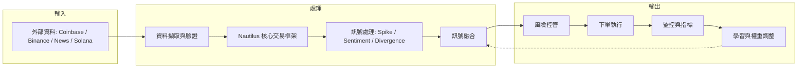

# 🤖 Polymarket BTC 15 分鐘交易機器人（繁體中文說明）

[](https://www.python.org/downloads/)
[](https://nautilustrader.io/)
[](https://opensource.org/licenses/MIT)
[](https://polymarket.com)
[](https://redis.io/)
[](https://grafana.com/)

此專案是一個面向 **Polymarket BTC 15 分鐘價格預測市場** 的演算法交易機器人，採用 7 階段架構，整合多訊號來源、風險控管與學習模組。

---

## 📋 目錄
- [功能特色](#功能特色)
- [系統架構](#系統架構)
- [先決條件](#先決條件)
- [快速開始](#快速開始)
- [環境變數設定](#環境變數設定)
- [執行方式](#執行方式)
- [交易模式](#交易模式)
- [安全更新重點](#安全更新重點)
- [專案結構](#專案結構)
- [測試](#測試)
- [常見問題](#常見問題)
- [免責聲明](#免責聲明)

---

## ✨ 功能特色

| 功能 | 說明 |
|---|---|
| 7 階段架構 | 模組化、可測試、可擴充 |
| 多訊號決策 | Spike Detection、Sentiment、Price Divergence |
| 風險優先 | 單筆上限、停損/停利、曝險控制 |
| 雙模式運行 | 模擬 / 實盤可切換 |
| 監控能力 | Prometheus 指標 + Grafana 看板 |
| 學習能力 | 依績效調整訊號權重 |
| 紙上交易紀錄 | 模擬模式可追蹤 P&L |

---

## 🏗️ 系統架構



---

## ✅ 先決條件
- Python 3.14+
- Redis
- Polymarket API 憑證
- Git

---

## 🚀 快速開始

### 1. 下載專案
```bash
git clone https://github.com/yourusername/polymarket-btc-15m-bot.git
cd polymarket-btc-15m-bot
```

### 2. 建立虛擬環境
```bash
# Windows
python -m venv venv
venv\Scripts\activate

# macOS / Linux
python -m venv venv
source venv/bin/activate
```

### 3. 安裝依賴
```bash
pip install -r requirements.txt
```

### 4. 建立 `.env`
```bash
cp .env.example .env
```

請編輯 `.env`，內容可參考下一節。

### 5. 啟動 Redis
```bash
# macOS
brew install redis
redis-server

# Linux
sudo apt install redis-server
redis-server

# Windows
# 請先安裝 Redis，然後啟動 redis-server
```

---

## ⚙️ 環境變數設定

```env
# =========================
# Polymarket API credentials
# =========================
POLYMARKET_PK=
# 可留空：若未提供，程式會用 POLYMARKET_PK 自動 create/derive L2 API creds
POLYMARKET_API_KEY=
POLYMARKET_API_SECRET=
POLYMARKET_PASSPHRASE=
POLYMARKET_FUNDER=
POLYMARKET_WALLET_ADDRESS=
POLYMARKET_SIGNATURE_TYPE=0
POLYMARKET_CHAIN_ID=137

# 市場探索（安全替代方案）
POLYMARKET_GAMMA_API=https://gamma-api.polymarket.com
GAMMA_DISCOVERY_TIMEOUT_SEC=8
BTC_MARKET_LOOKBACK_INTERVALS=1
BTC_MARKET_LOOKAHEAD_INTERVALS=4
BTC_MARKET_END_WINDOW_BACK_MINUTES=5
BTC_MARKET_END_WINDOW_FORWARD_MINUTES=120

# =========================
# Redis
# =========================
REDIS_HOST=localhost
REDIS_PORT=6379
REDIS_DB=2
REDIS_USERNAME=
REDIS_PASSWORD=

# =========================
# Grafana 匯入腳本帳密
# =========================
GRAFANA_USER=
GRAFANA_PASS=

# =========================
# Metrics exporter（預設僅本機）
# =========================
GRAFANA_EXPORTER_HOST=127.0.0.1
GRAFANA_EXPORTER_PORT=8000

# =========================
# 策略參數
# =========================
MAX_POSITION_SIZE=1.0
STOP_LOSS_PCT=0.30
TAKE_PROFIT_PCT=0.20
SPIKE_THRESHOLD=0.15
DIVERGENCE_THRESHOLD=0.05

# =========================
# Maker 策略參數
# =========================
MAKER_MODE=1
MAKER_QUOTE_REFRESH_SEC=5
MAKER_HALF_SPREAD=0.01
MAKER_QUOTE_SIZE_USDC=1.0
MAKER_MIN_SHARES=5
MAKER_MAX_ORDER_USDC=1.0
MAKER_QUOTE_SIDES=both
MAKER_POST_ONLY=0
MAKER_MIN_EXPECTED_NET_USDC=0.0001
MAKER_ADVERSE_SELECTION_BUFFER=0.0005
MAKER_POST_ONLY_STRICT=1
MAKER_MAX_INVENTORY_SHARES=25
MAKER_INVENTORY_SKEW_MAX=0.03
MAKER_VOL_PAUSE_THRESHOLD=0.03
MAKER_VOL_PAUSE_SEC=30
MAKER_VOL_WARMUP_QUOTES=30
MAKER_VOL_RETURN_CLIP=0.20
MAKER_VOL_ROLLING_WINDOW=30
MAKER_VOL_EWMA_ALPHA=0.35
MAKER_VOL_REAL_HISTORY_MAX=300
MAKER_MAX_CONSECUTIVE_DENIED=5
MAKER_ORDER_TTL_SEC=20
MAKER_REQUOTE_THRESHOLD=0.002
MAKER_CANCEL_COOLDOWN_SEC=2
MAKER_CANCEL_ACK_TIMEOUT_SEC=8
MAKER_CANCEL_MAX_RETRIES=3
MAKER_BALANCE_PAUSE_SEC=60
MAKER_AUTO_TUNE=1
MAKER_AUTO_TUNE_INTERVAL_SEC=300
EXTERNAL_SPOT_TIMEOUT_SEC=2.5
POLYMARKET_CLOB_BASE_URL=https://clob.polymarket.com
FEE_RATE_CACHE_TTL_SEC=300
REBATE_REPORT_DIR=./logs/rebate
```

---

## ▶️ 執行方式

```bash
# 只做啟動前安全檢查（不啟動交易）
python run_bot.py --preflight-only

# 測試模式（每分鐘）
python run_bot.py --test-mode

# 一般模式（每 15 分鐘）
python run_bot.py

# 實盤模式（真金白銀）
python run_bot.py --live
```

### 檢查/重做 Allowance（Polygon）
若遇到 `not enough balance / allowance`：
```bash
venv/bin/python scripts/check_allowance.py --check-only
venv/bin/python scripts/check_allowance.py --apply
# 若 allowance 仍為 0，強制做鏈上授權：
venv/bin/pip install web3==7.12.1
venv/bin/python scripts/check_allowance.py --apply --onchain
```

### 查找持倉地址 + 兌現已結算部位（Redeem）
若「有成交紀錄，但前端 Positions 看不到」：通常是連線地址與實際持倉地址不同，或市場已結算只剩可兌現狀態。

```bash
# 1) 先查目前地址是否有倉位/可兌現部位（可加 slug 過濾）
venv/bin/python scripts/check_positions_and_redeem.py --slug btc-updown-15m

# 2) 找到 redeemable=true 後，直接鏈上 redeemPositions
venv/bin/python scripts/check_positions_and_redeem.py --slug btc-updown-15m --apply
```

補充：
- 此腳本會同時檢查 `POLYMARKET_FUNDER`、`POLYMARKET_WALLET_ADDRESS`、`WALLET_ADDRESS`、以及 `POLYMARKET_PK` 對應地址，快速定位資產到底在哪個地址。
- `--apply` 目前針對 `POLYMARKET_SIGNATURE_TYPE=0`（EOA）直接送鏈上交易；若你使用 proxy/safe wallet，需要改走對應 relayer 流程。
- 參考官方文件：
  - [CTF Redeem](https://docs.polymarket.com/trading/ctf/redeem)
  - [Data API Positions](https://docs.polymarket.com/api-reference/core/get-current-positions-for-a-user)

### 交易資料庫分析（SQLite）
Bot 會把關鍵交易事件寫入 `logs/trade_journal.db`，可用以下腳本快速查看：

```bash
# 顯示整體摘要與最近事件
venv/bin/python /Users/cheng-kaihuang/Polymarket-BTC-15-Minute-Trading-Bot-main/scripts/trade_db_report.py

# 指定某次 run_id 查看更完整的事件序列
venv/bin/python /Users/cheng-kaihuang/Polymarket-BTC-15-Minute-Trading-Bot-main/scripts/trade_db_report.py --run-id <RUN_ID> --limit 100
```

可搭配環境變數：
- `TRADE_DB_ENABLED=1`
- `TRADE_DB_PATH=./logs/trade_journal.db`

### 參數
- `--preflight-only`: 只執行啟動前檢查，不啟動交易節點
- `--test-mode`: 每分鐘觸發一次，便於快速驗證流程（程式內含 simulation guard，不送出真單）
- `--live`: 啟用實盤下單（有資金風險）
- `--no-grafana`: 關閉 Grafana/Prometheus 指標輸出

### 查看模擬交易
```bash
python view_paper_trades.py
```

---

## 🔁 交易模式
可透過 Redis 控制腳本切換：

```bash
# 切回模擬模式
python redis_control.py sim

# 切換到實盤模式（會要求確認）
python redis_control.py live

# 查看目前狀態
python redis_control.py status
```

---

## 🔐 安全更新重點

本專案已納入以下安全調整：

1. **移除動態補丁入口**
- 不再於啟動時自動執行 `patch_gamma_markets.py`。
- 已改為由本專案程式主動探索 15m BTC slug，再交由 `InstrumentProviderConfig` 載入。

2. **安全替代方案：slug-based 市場探索**
- 啟動前先向 Gamma API 檢查候選 slug 是否存在。
- 找不到可用市場時，直接拒絕啟動，避免在錯誤市場上交易。
- 實盤與一般啟動流程都會先跑 preflight 檢查（憑證/市場/Redis）。

3. **Maker + Rebate 經濟閘門**
- 策略在每次掛單前會先估算預期淨值：`expected_net = spread_capture + expected_rebate - adverse_selection_buffer`。
- 若預期淨值低於 `MAKER_MIN_EXPECTED_NET_USDC`，則跳過該輪掛單。
- 會透過 `GET /fee-rate?token_id=...` 動態抓取 `fee_rate_bps`（快取）後套入估算。
- 每日輸出 `rebate_report_YYYY-MM-DD.json` 到 `REBATE_REPORT_DIR`。

4. **第三版風控（Maker 品質）**
- `MAKER_POST_ONLY=1` 才會送 post-only；若交易所不支援，程式會自動降級為一般 limit。
- `MAKER_POST_ONLY_STRICT=1` 只在「本地建單階段」要求 post-only 參數必須可用。
- `MAKER_QUOTE_SIDES` 可設 `both`/`buy`/`sell`，建議資金小時先用 `buy` 單邊驗證。
- 若遇到 `not enough balance / allowance`，會自動暫停掛單 `MAKER_BALANCE_PAUSE_SEC` 秒。
- Inventory 上限與 skew（`MAKER_MAX_INVENTORY_SHARES`、`MAKER_INVENTORY_SKEW_MAX`）。
- 波動暫停掛單（`MAKER_VOL_PAUSE_THRESHOLD`、`MAKER_VOL_PAUSE_SEC`）。
- 連續拒單觸發 kill switch（`MAKER_MAX_CONSECUTIVE_DENIED`）。
- 掛單 TTL 自動撤單與重掛（`MAKER_ORDER_TTL_SEC`）。
- 價格偏移超過門檻才重掛（`MAKER_REQUOTE_THRESHOLD`）。
- Maker 單筆名義金額上限（`MAKER_MAX_ORDER_USDC`），若 `MAKER_MIN_SHARES` 導致最小可掛單名義超出上限，該次會跳過。
- 撤單防抖與逾時清理（`MAKER_CANCEL_COOLDOWN_SEC`、`MAKER_CANCEL_ACK_TIMEOUT_SEC`）可降低 WebSocket 延遲造成的 ghost cancel loop。
- 撤單逾時後會先做 cache 對帳，若仍 open（或無法判斷）會重試撤單；超過 `MAKER_CANCEL_MAX_RETRIES` 會觸發 maker kill switch。

5. **第四版分析與自動化**
- 日報輸出 JSON + CSV（`rebate_report_YYYY-MM-DD.{json,csv}`）。
- 報表含報價、成交、拒單、取消原因、估算 rebate/net、`/fee-rate` API 健康指標。
- 參數自動調整框架（`MAKER_AUTO_TUNE`、`MAKER_AUTO_TUNE_INTERVAL_SEC`）。

6. **Metrics 預設僅本機綁定**
- `GRAFANA_EXPORTER_HOST` 預設 `127.0.0.1`，降低外部存取風險。

7. **Redis 支援帳密**
- 支援 `REDIS_USERNAME` / `REDIS_PASSWORD`。
- 當 Redis 非 localhost 且未設密碼時會給出警告。

8. **Grafana 匯入腳本不再使用硬編碼帳密**
- `grafana/import_dashboard.py` 改為強制讀取 `GRAFANA_USER` / `GRAFANA_PASS`。

---

## 📁 專案結構

```text
Polymarket-BTC-15-Minute-Trading-Bot-main/
├── core/
├── data_sources/
├── execution/
├── feedback/
├── grafana/
├── monitoring/
├── paper_trades.json
├── redis_control.py
├── run_bot.py
├── test.py
├── view_paper_trades.py
├── .env.example
├── README.md
└── readme_ZH.md
```

---

## 🧪 測試

可先做基礎語法檢查：

```bash
python3 -m py_compile run_bot.py
```

可再依模組執行測試腳本（若有對應環境依賴）：

```bash
python test.py
python data_sources/test.py
python core/ingestion/test_ingestion.py
python core/strategy_brain/test_strategy.py
python core/nautilus_core/test_nautilus.py
python execution/test_execution.py
```

---

## ❓ 常見問題

**Q: 最小需要多少資金？**  
A: 依目前策略設定單筆限制可很小，但實盤前建議先長時間模擬測試。

**Q: 可以 24/7 跑嗎？**  
A: 可以，但建議加上程序監控、日誌輪替、及主機安全策略。

**Q: 測試模式和一般模式差異？**  
A: 測試模式每分鐘觸發；一般模式每 15 分鐘觸發。

---

## ⚠️ 免責聲明
- 加密資產交易有高風險。
- 本專案以研究/教育用途為主。
- 歷史績效不保證未來結果。
- 開發者不對任何財務損失負責。
- 請務必先模擬、再小額、再逐步放大。

---

## 聯絡與社群
- GitHub Issues：回報問題與功能建議
- Discord: https://discord.gg/NdqbEGyU
- Telegram: https://t.me/Bigg_O7
