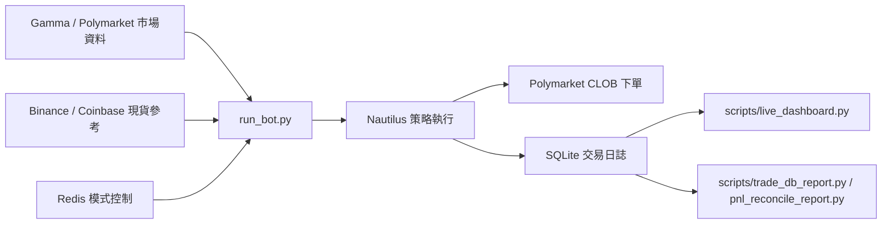

# Polymarket BTC 15 分鐘交易機器人（繁體中文）

[](https://www.python.org/downloads/)
[](https://nautilustrader.io/)
[](https://opensource.org/licenses/MIT)
[](https://polymarket.com)
[](https://redis.io/)
[](https://github.com/Textualize/rich)

此專案是一個面向 **Polymarket BTC 15 分鐘 up/down 市場** 的實盤 / 模擬交易機器人。  
目前主路徑以 **maker-first** 掛單、**雙邊 side 決策（bi-side）**、**SQLite 交易日誌**、以及 **Rich terminal dashboard** 為核心。

這份文件以目前程式實作為準，已移除過時的 Grafana/Prometheus 操作說明。

---

## 目錄
- [功能特色](#功能特色)
- [系統概觀](#系統概觀)
- [先決條件](#先決條件)
- [快速開始](#快速開始)
- [重要環境變數](#重要環境變數)
- [執行方式](#執行方式)
- [Terminal Dashboard](#terminal-dashboard)
- [交易資料庫與分析工具](#交易資料庫與分析工具)
- [實盤注意事項](#實盤注意事項)
- [專案結構](#專案結構)
- [測試與檢查](#測試與檢查)
- [常見問題](#常見問題)
- [免責聲明](#免責聲明)

---

## 功能特色

| 類別 | 說明 |
|---|---|
| 市場切換 | 自動探索並切換最新 BTC 15m 市場 |
| 雙邊決策 | `UP / DOWN / NONE`，含 observation window 與單次 flip 限制 |
| Maker 主導 | 以 maker buy / maker sell 為主，盡量避免高費用 taker 出場 |
| 執行經濟模型 | 掛單前會先估算 `expected_net / robust_net / exec_penalty` |
| 交易日誌 | 所有關鍵事件寫入 `logs/trade_journal.db` |
| 監控 | 提供獨立 Rich terminal dashboard，可在新 terminal 觀察執行狀態 |
| 對帳工具 | 內建 DB 摘要、PnL 對帳、edge attribution 等腳本 |
| 安全保護 | preflight、Redis mode guard、allowance/balance 檢查、reduce-only、settlement 記錄 |

---

## 系統概觀



重點：

- 真正的交易邏輯在 [run_bot.py](/Users/cheng-kaihuang/Polymarket-BTC-15-Minute-Trading-Bot-main/run_bot.py)
- 所有關鍵事件會寫進 [logs/trade_journal.db](/Users/cheng-kaihuang/Polymarket-BTC-15-Minute-Trading-Bot-main/logs/trade_journal.db)
- 監控建議用獨立 viewer：
  - [scripts/live_dashboard.py](/Users/cheng-kaihuang/Polymarket-BTC-15-Minute-Trading-Bot-main/scripts/live_dashboard.py)

---

## 先決條件

- Python 3.14+
- Redis
- Polymarket API 憑證或 `POLYMARKET_PK`
- 可用的 Polygon / Polymarket 帳戶與 USDC.e

---

## 快速開始

### 1. 下載專案

```bash
git clone <your-repo-url>
cd Polymarket-BTC-15-Minute-Trading-Bot-main
```

### 2. 建立虛擬環境

```bash
python -m venv venv
source venv/bin/activate
```

### 3. 安裝依賴

```bash
pip install -r requirements.txt
```

### 4. 建立 `.env`

```bash
cp .env.example .env
```

### 5. 啟動 Redis

```bash
# macOS
brew install redis
redis-server

# Linux
sudo apt install redis-server
redis-server
```

### 6. 先跑 preflight

```bash
python run_bot.py --preflight-only
```

---

## 重要環境變數

以下是目前最重要、最常需要調的群組。完整可參考 [`.env.example`](/Users/cheng-kaihuang/Polymarket-BTC-15-Minute-Trading-Bot-main/.env.example)。

### 1. Polymarket 憑證

```env
POLYMARKET_PK=
POLYMARKET_API_KEY=
POLYMARKET_API_SECRET=
POLYMARKET_PASSPHRASE=
POLYMARKET_FUNDER=
POLYMARKET_WALLET_ADDRESS=
POLYMARKET_SIGNATURE_TYPE=0
POLYMARKET_CHAIN_ID=137
```

說明：

- 若未提供 API creds，程式可嘗試用 `POLYMARKET_PK` 自動 derive
- `POLYMARKET_PK` 對應的錢包就是實盤資金來源

### 2. Redis

```env
REDIS_HOST=localhost
REDIS_PORT=6379
REDIS_DB=2
REDIS_USERNAME=
REDIS_PASSWORD=
```

### 3. DB / 監控

```env
TRADE_DB_ENABLED=1
TRADE_DB_PATH=./logs/trade_journal.db
TERMINAL_DASHBOARD=0
TERMINAL_DASHBOARD_REFRESH_SEC=1
```

說明：

- `TRADE_DB_ENABLED=1` 建議保持開啟
- 獨立 viewer [scripts/live_dashboard.py](/Users/cheng-kaihuang/Polymarket-BTC-15-Minute-Trading-Bot-main/scripts/live_dashboard.py) 會讀這個 DB
- `TERMINAL_DASHBOARD` 是嵌入 `run_bot.py` 的內嵌版 terminal dashboard，平常不必開

### 4. Bi-side 決策

```env
BI_SIDE_ENABLED=1
BI_SIDE_DECISION_GRACE_SEC=45
BI_SIDE_ALLOW_INTRAMARKET_FLIP=1
BI_SIDE_FLIP_CONFIRMATIONS=2
BI_SIDE_FLIP_MAX_PER_MARKET=1
BI_SIDE_FLIP_MIN_SCORE_UP=2
BI_SIDE_FLIP_MAX_SCORE_DOWN=-2
BI_SIDE_FLIP_MIN_FAIR=0.60
```

說明：

- observation window 期間只觀察，不立即鎖邊
- flip 已收緊，不會再因弱訊號隨便翻向

### 5. Maker / 風控

```env
MAKER_MODE=1
MAKER_FIXED_SHARES=6
MAKER_MIN_SHARES=6
MAKER_MAX_ORDER_USDC=6.0
MAKER_QUOTE_SIZE_USDC=6.0
MAKER_MIN_EXPECTED_NET_USDC=0.0005
MAKER_ADVERSE_SELECTION_BUFFER=0.001
MAKER_EXECUTION_SLIPPAGE_SPREAD_MULT=0.15
MAKER_EXECUTION_NON_ATOMIC_VOL_MULT=0.08
MAKER_EXECUTION_VWAP_MULT=0.2
MAKER_MIN_MINUTES_TO_CLOSE=1.0
```

### 6. Taker 出場

```env
TAKER_EXIT_MIN_NET_USDC=0.03
TAKER_EXIT_STOP_LOSS_USDC=0.25
```

注意：

- `TAKER_EXIT_MIN_NET_USDC` 是 fee-adjusted take-profit 門檻
- `TAKER_EXIT_STOP_LOSS_USDC` 是 fee-adjusted stop-loss 門檻
- 程式已修正為：**只有價格真的朝不利方向走時，才允許走 stop-loss**

---

## 執行方式

### 啟動前安全檢查

```bash
python run_bot.py --preflight-only
```

### 一般模式

```bash
python run_bot.py
```

### 測試模式

```bash
python run_bot.py --test-mode
```

### 實盤模式

```bash
python run_bot.py --live
```

### 實盤 + 內嵌 terminal dashboard

```bash
python run_bot.py --live --terminal-dashboard
```

說明：

- `--terminal-dashboard` 是**內嵌版**，跟 bot 同 process
- 若你只是想在另一個 terminal 監看，建議不要用這個，而是開獨立 viewer

### 舊版監控輸出

```bash
python run_bot.py --no-grafana
```

說明：

- 程式仍保留 `--no-grafana` 參數，主要是為了相容現有執行方式
- 目前不再建議依賴 Grafana 作為主要監控介面

---

## Terminal Dashboard

目前建議的監控方式是**獨立 Rich viewer**，不需要重啟已經在跑的 bot。

### 啟動方式

在另一個 terminal 執行：

```bash
python scripts/live_dashboard.py
```

可選參數：

```bash
python scripts/live_dashboard.py --refresh-sec 2
python scripts/live_dashboard.py --db-path logs/trade_journal.db
```

### 顯示內容

- 最近一次 `STRATEGY_START` 之後的統計
- 當前 `phase / slug / active side`
- wallet `USDC.e`
- `fills / maker / taker / taker exit`
- 累計手續費
- cycle 數量、cycle 勝率、cycle PnL
- 最近一筆 fill
- 最近一個結束 market 的 cycle PnL

### 什麼情況該用獨立 viewer

如果你已經有一個 `run_bot.py` 在跑，不想重啟，只想在新 terminal 監看：

- 用 [scripts/live_dashboard.py](/Users/cheng-kaihuang/Polymarket-BTC-15-Minute-Trading-Bot-main/scripts/live_dashboard.py)
- **不要再開第二個 `run_bot.py`**

---

## 交易資料庫與分析工具

Bot 會把關鍵事件寫入：

- [logs/trade_journal.db](/Users/cheng-kaihuang/Polymarket-BTC-15-Minute-Trading-Bot-main/logs/trade_journal.db)

重要表：

- `strategy_runs`
- `strategy_events`
- `order_events`

### 查看 DB 摘要

```bash
venv/bin/python scripts/trade_db_report.py
```

### 查看 PnL 對帳

```bash
# 最近 6 小時
venv/bin/python scripts/pnl_reconcile_report.py --hours 6

# 指定 run_id
venv/bin/python scripts/pnl_reconcile_report.py --run-id <RUN_ID> --hours 24

# 全期間
venv/bin/python scripts/pnl_reconcile_report.py --hours 0
```

### 其他分析腳本

```bash
venv/bin/python scripts/realized_edge_report.py
venv/bin/python scripts/hourly_attribution_report.py
venv/bin/python scripts/mirrored_down_report.py
```

### Pure Signal Probe（只觀測、不下單）

若你想驗證「`spot / priceToBeat / time_left / orderbook` 是否真的存在可交易錯價」，可以使用：

- [scripts/pure_signal_probe.py](/Users/cheng-kaihuang/Polymarket-BTC-15-Minute-Trading-Bot-main/scripts/pure_signal_probe.py)

這支腳本不會下單，只會：

- 找目前 BTC 15 分鐘市場
- 取得 strike（優先讀 `priceToBeat`，失敗時會 fallback 到 question parsing / 開盤 spot history / Binance REST 開盤價回填）
- 抓 BTC spot
- 透過 Nautilus Polymarket data client 訂閱 quote ticks，使用和 `run_bot.py` 同源的 bid/ask
- 估算短期波動率
- 計算 `fair_up / fair_down`
- 讀取 `UP / DOWN` orderbook 最佳價
- 計算理論 edge
- 寫入 SQLite DB，供之後和真實成交資料比對

常用指令：

```bash
./venv/bin/python scripts/pure_signal_probe.py --duration-sec 1800 --interval-sec 2
```

意思：

- `--duration-sec 1800`：執行 1800 秒，也就是 30 分鐘
- `--interval-sec 2`：每 2 秒記錄一次 market snapshot

若你只想先跑 5 分鐘：

```bash
./venv/bin/python scripts/pure_signal_probe.py --duration-sec 300 --interval-sec 2
```

若你不想和主 bot 共用同一個 DB，建議改寫到獨立資料庫：

```bash
./venv/bin/python scripts/pure_signal_probe.py --db ./logs/pure_probe.db --duration-sec 1800 --interval-sec 2
```

若你想在 terminal 看到低頻摘要，可加上 `--verbose`：

```bash
./venv/bin/python scripts/pure_signal_probe.py --db ./logs/pure_probe.db --duration-sec 1800 --interval-sec 2 --verbose --verbose-every-sec 30
```

意思：

- `--verbose`：開啟輕量摘要輸出
- `--verbose-every-sec 30`：每 30 秒最多印一行，不會每 2 秒洗版

若你想確認 probe 是否真的有持續寫入 DB，可開另一個 terminal 執行：

```bash
sqlite3 logs/pure_probe.db "select count(*) from strategy_events;"
sqlite3 logs/pure_probe.db "select id, ts, event_type, substr(payload_json,1,220) from strategy_events order by id desc limit 8;"
```

若你想把 probe 資料庫整個重置，直接刪除：

```bash
rm -f logs/pure_probe.db logs/pure_probe.db-wal logs/pure_probe.db-shm
```

說明：

- 這支 probe 可以和 `python run_bot.py` 同時在不同 terminal 執行
- 它不會下單，但會額外打市場資料 API
- 若擔心和主 bot 的 journal 混在一起，優先使用 `--db ./logs/pure_probe.db`
- 所有時間參數都以「秒」為單位

### Pure Probe Report（候選訊號驗證報表）

當 `pure_signal_probe.py` 跑了一段時間後，可以用下面指令把 `pure_probe.db` 的候選訊號，和主 bot `trade_journal.db` 裡的 `MARKET_SETTLEMENT` 結果對起來：

```bash
./venv/bin/python scripts/pure_probe_report.py --probe-db ./logs/pure_probe.db --trade-db ./logs/trade_journal.db --hours 12
```

這份報表會輸出：

- `candidate_rows`：候選訊號總筆數
- `candidate_markets`：有候選訊號的市場數
- `settled_candidate_markets`：已經能對到結算結果的市場數
- `all_candidates`：若每一筆 candidate 都在 `ask` 成交並抱到結算，理論損益如何
- `first_per_market`：每個市場只取第一筆 candidate 的理論結果
- `best_edge_per_market`：每個市場只取 edge 最大那筆 candidate 的理論結果
- `last_per_market`：每個市場只取最後一筆 candidate 的理論結果

如果 `settled_candidate_markets` 很少，代表樣本還不夠，先讓 probe 繼續跑久一點再看報表。

若你想更接近實際策略，可以加上：

```bash
./venv/bin/python scripts/pure_probe_report.py \
  --probe-db ./logs/pure_probe.db \
  --trade-db ./logs/trade_journal.db \
  --run-id pure_probe_1774565788_47f89221 \
  --selection last \
  --persistence-sec 10 \
  --hours 24
```

重點參數：

- `--run-id`：只分析某一次 probe run，避免不同輪資料混在一起
- `--selection {all,first,best,last}`：每市場只保留哪一筆訊號
- `--persistence-sec 10`：candidate 需要在 snapshot 中連續成立至少 10 秒才算有效
- `--segment-gap-sec`：兩筆 snapshot 間隔多大以內，仍視為同一段 candidate streak

---

## 實盤注意事項

### 1. Live mode 風險

`python run_bot.py --live` 會使用 `.env` 中的實際帳戶資產。  
請務必確認：

- `POLYMARKET_PK`
- `MAKER_FIXED_SHARES`
- `MAKER_MAX_ORDER_USDC`
- `MAKER_MAX_INVENTORY_SHARES`

### 2. Redis 模式鎖

可用 [redis_control.py](/Users/cheng-kaihuang/Polymarket-BTC-15-Minute-Trading-Bot-main/redis_control.py) 查看或切換狀態：

```bash
python redis_control.py status
python redis_control.py sim
python redis_control.py live
```

### 3. Allowance / Balance 問題

若遇到 `not enough balance / allowance`：

```bash
venv/bin/python scripts/check_allowance.py --check-only
venv/bin/python scripts/check_allowance.py --apply
venv/bin/python scripts/check_allowance.py --apply --onchain
```

### 4. 已結算倉位兌現

```bash
venv/bin/python scripts/check_positions_and_redeem.py --slug btc-updown-15m
venv/bin/python scripts/check_positions_and_redeem.py --slug btc-updown-15m --apply
```

---

## 專案結構

```text
Polymarket-BTC-15-Minute-Trading-Bot-main/
├── bot/                        # 報價、風控、後處理、wallet helper
├── execution/                  # maker engine / exit policy / fee client
├── monitoring/                 # DB writer、legacy exporter、terminal dashboard
├── scripts/                    # 分析工具與獨立 viewer
├── logs/                       # trade_journal.db、nautilus logs、報表輸出
├── grafana/                    # 舊版 Grafana 資料（保留但非主路徑）
├── run_bot.py                  # 主策略與啟動入口
├── redis_control.py            # Redis 模式切換工具
├── .env.example
├── README.md
└── readme_ZH.md
```

補充：

- `grafana/` 目錄目前仍存在，但不再是建議的主要監控方式

---

## 測試與檢查

### 語法檢查

```bash
python3 -m py_compile run_bot.py
python3 -m py_compile scripts/live_dashboard.py
```

### 模組測試腳本

```bash
python data_sources/test.py
python core/ingestion/test_ingestion.py
python core/strategy_brain/test_strategy.py
python core/nautilus_core/test_nautilus.py
python execution/test_execution.py
```

---

## 常見問題

### Q1. `BI_SIDE_ENABLED=1 python run_bot.py` 每次都要加嗎？

不一定。  
如果 [`.env`](/Users/cheng-kaihuang/Polymarket-BTC-15-Minute-Trading-Bot-main/.env) 已經設：

```env
BI_SIDE_ENABLED=1
```

那直接：

```bash
python run_bot.py
```

就夠了。

### Q2. `--live` 跟 `--terminal-dashboard` 會衝突嗎？

不衝突，但那是**同一個 process 內嵌顯示**。  
如果你想在另一個 terminal 看監控，不要用第二個 `run_bot.py`，請改用：

```bash
python scripts/live_dashboard.py
```

### Q3. 為什麼我看到成交了，但 PnL 還可能為負？

常見原因：

- taker fee 很高
- 出場走 taker exit
- 或持倉帶到 settlement 才結束，結果方向錯

所以不能只看買賣價差，必須看：

- `ORDER_FILLED.payload.realized_net_usdc`
- `MARKET_SETTLEMENT.payload.settlement_pnl_usdc`
- `MARKET_CYCLE_PNL.payload.cycle_combined_pnl_usdc`

### Q4. 最近修過哪些重要邏輯？

近期重要變更包含：

- observation window 寫入 DB
- flip 條件收緊
- `SETTLING / WAITING` 不再顯示 `tradable=YES`
- 修正 stop-loss，不再把「只有 fee 造成的負淨值」誤判成價格止損
- 新增獨立 Rich terminal dashboard viewer

---

## 免責聲明

- 加密資產與預測市場交易有高風險
- 本專案以研究 / 工程實驗用途為主
- 歷史績效不保證未來結果
- 使用者需自行承擔實盤資金風險
- 強烈建議先模擬、再小額、再逐步放大
